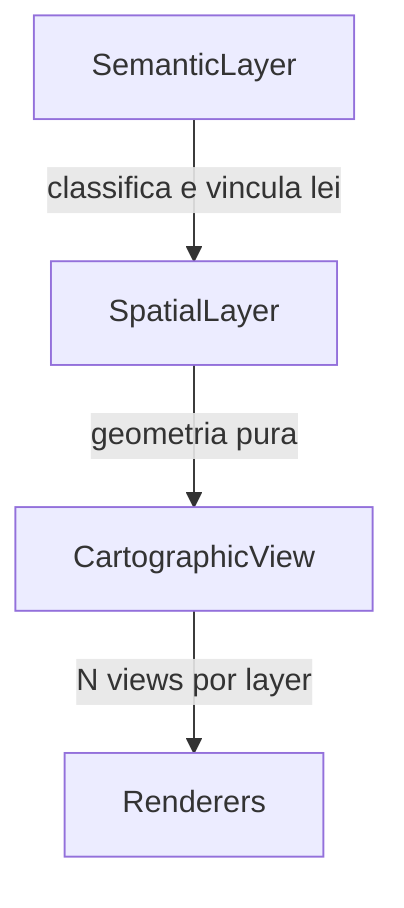
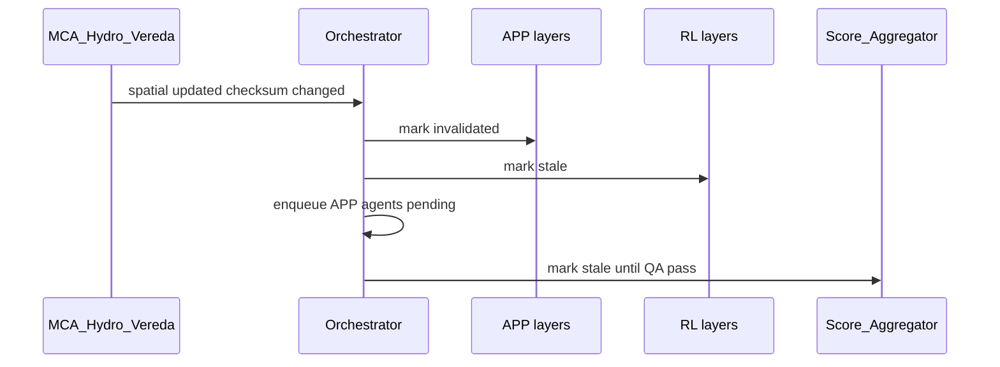
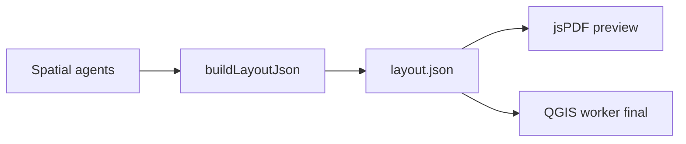
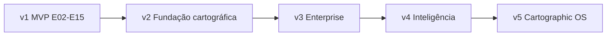
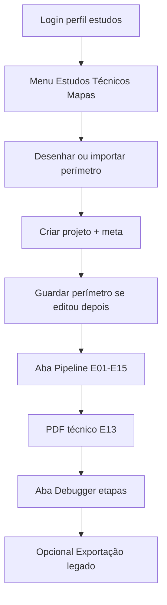

# MCA — Plano cirúrgico: Cartographic OS (refinamento enterprise)

## Posicionamento

O MCA deixa de ser descrito como **pipeline** e passa a ser **sistema operacional cartográfico** com:

| Subsistema | Função | Módulo alvo (pós-v1) |
|------------|--------|----------------------|
| Kernel espacial | geometria, topologia, tiles | `topology/`, `tiles/`, PostGIS |
| Camada semântica | significado legal/ambiental | `semantic/`, `knowledge/` |
| Engine cartográfica | símbolos, escala, layout | `symbols/`, `scale/`, `layout/` |
| Scheduler | DAG + invalidação encadeada | `orchestrator/` stateful |
| Memória espacial | reutilização matrícula/CAR | `memory/` + `mca_spatial_index` |
| Rendering | preview + export premium | jsPDF + QGIS (Layout JSON) |
| Aprendizado | DWG ingest, gold benchmark | `learn/`, `gold/` |

**Decisão mantida:** concluir **v1 (E02–E15)** antes de infra enterprise; v1 só **prepara contratos** que não quebram o código actual.

---

## Estado actual do repositório (âncora)

- Orquestração linear: [`src/lib/mca/orchestrator.ts`](src/lib/mca/orchestrator.ts) — `resolveAgentOrder` → `runMcaAgent` → `layers.set(layerKey, geojson)`.
- Persistência: Firestore `mca_projects/{id}/layers/{layerId}` com `geojson` inteiro ([`IMPLEMENTATION-SPEC.md`](docs/mca/IMPLEMENTATION-SPEC.md)).
- Registry: 5 campos parseados em [`src/lib/mca/registry.ts`](src/lib/mca/registry.ts); YAML completo em [`infra/mca-engine/mca_agent_registry.yaml`](infra/mca-engine/mca_agent_registry.yaml).
- PDF: [`src/lib/mca/layout-pdf.ts`](src/lib/mca/layout-pdf.ts) — jsPDF tabular, sem mapa vetorial.
- Mapas ouro nomeados em [`docs/mca/REFERENCIA-PIMENTA.md`](docs/mca/REFERENCIA-PIMENTA.md) e [`docs/mca/ETAPAS.md`](docs/mca/ETAPAS.md) — ainda **não** como datasets versionados.

---

## Os 10 pilares de longevidade (prioridade absoluta pós-v1)

1. **Semantic layer** (não só Spatial + View)
2. **Separação Semantic → Spatial → Cartographic**
3. **MCA Behavior Registry** (multi-perfil por agente)
4. **Topology engine** (além de Turf validate)
5. **Scale-aware / multi-scale rendering**
6. **Migração spatial heavy → PostGIS** (Firestore = metadata)
7. **Knowledge graph** (multi-graph orchestration)
8. **Human review architecture** (oficial, não fallback)
9. **Layout JSON intermediate** (jsPDF + QGIS mesmo contrato)
10. **Gold maps benchmark** (Catingueiro, Mangabeiras, Palmeiras)

---

## 1. Modelo de dados: três camadas (refinamento crítico)

Substituir o binómio `SpatialLayer + CartographicView` por **três níveis desacoplados**.



### 1.1 SemanticLayer — o que significa

Ficheiro alvo: [`src/lib/mca/types.ts`](src/lib/mca/types.ts) (v2) + coleção `semantic` ou campo embutido com `spatialId`.

```typescript
type McaSemanticLayer = {
  semanticId: string;           // ex. sem_APP_HIDRICA_001
  spatialRef: string;           // FK → spatial layer
  class: string;                // APP_HIDRICA | RL_GLEBA | USO_LAVOURA
  taxonomy: "ambiental" | "fund" | "uso" | "hydro" | "infra";
  legalBasis?: string;          // Lei 12.651, Resolução CONAMA, etc.
  origin: string;               // buffer_hydro | dwg_import | ia_sam | manual
  derivedFrom?: string[];       // semanticIds pai
  confidence?: number;          // 0–1 (IA)
  validAt?: string;             // vigência normativa
  reviewedBy?: string;          // uid humano
  reviewStatus: "draft" | "reviewed" | "promoted";
};
```

**Regra:** agentes **spatial** (`MCA_APP_*`, `MCA_RL_*`) escrevem geometria; agentes **cognitive** (`MCA_Interpret_*`) escrevem/atualizam semântica. Um `spatialRef` pode ter **várias** semânticas (ex.: mesma polígono, interpretação CAR vs inventário).

### 1.2 SpatialLayer — geometria pura

```typescript
type McaSpatialLayer = {
  spatialId: string;            // = layerKey actual: HYD_RIBEIRAO, APP_POLYGON
  projectId: string;
  version: number;
  crs: string;                  // EPSG:31983
  geometryRef: string;          // v3: postgis://… | v1: inline GeoJSON
  topologyStatus: "valid" | "repaired" | "invalid";
  bbox: [number, number, number, number];
  areaHa?: number;
  sourceAgentId: string;
  checksum: string;             // hash geometria → cache
};
```

**v1 (sem PostGIS):** manter `geojson` em Firestore mas **proibir** propriedades de estilo (`fill`, `stroke`, `color` em properties).

**v3:** Firestore guarda só:

```json
{ "geometryRef": "postgis:mca_layers/abc", "checksum": "sha256:…", "version": 2 }
```

### 1.3 CartographicView — como desenhar

```typescript
type McaCartographicView = {
  viewId: string;
  spatialRef: string;
  scaleDenominator: number;     // 5000 | 12000 | 48000
  templateId: string;           // pimenta_uso_ocupacao_v1
  styleProfile: string;         // token em symbols/profiles/
  labels?: LabelPlacement[];
  visibility: boolean;
  zIndex: number;
  generalizationLevel?: number;
};
```

**Ganho:** mesma geometria → layout SEMA, layout cliente, inset 1:48.000, export DWG camada `_plot` — **zero duplicação geométrica**.

### 1.4 Firestore vs PostGIS (decisão v3)

| Dado | v1 | v3 alvo |
|------|-----|---------|
| Projeto, meta, etapas, scores | Firestore `mca_projects` | Firestore |
| Semantic docs | — | Firestore subcoleção `semantic/` |
| Geometria heavy | Firestore `layers.geojson` | **PostGIS** `mca.spatial_layers` |
| Raster / COG | GCS path no projeto | GCS + COG |
| Vector tiles | — | PMTiles no GCS ou tile server |
| Cache keys | — | Firestore `mca_cache/` ou Redis |
| Agent runs, conflitos, revisão | Firestore | Firestore |

**Migração:** script `scripts/mca/migrate-layers-to-postgis.mjs`; dual-read durante transição.

---

## 2. Stateful Spatial Orchestrator (substituir pipeline linear)

### 2.1 Problema do orchestrator actual

```text
for (agentId of order) { runAgent(); layers.set(); }
```

Não propaga **invalidação** quando `HYD_RIBEIRAO` muda → `APP_*` e `RL_*` ficam stale.

### 2.2 Máquina de estados por layer (e por agent run)

| Estado | Significado | Transições típicas |
|--------|-------------|-------------------|
| `pending` | Aguarda dependências do multi-grafo | → `running` |
| `running` | Agente em execução | → `pass` / `fail` / `blocked` |
| `blocked` | Conflito não resolvido | → `pending` após merge humano |
| `invalidated` | Upstream mudou; output inválido | → `pending` (re-run) |
| `stale` | Output existe mas desatualizado | → `invalidated` ou re-run automático |
| `reviewed` | Humano validou semântica/view | → `promoted` |
| `promoted` | Aprovado para export final | terminal até nova invalidação |

Persistir em: `mca_projects/{id}/layer_states/{spatialId}` (Firestore, leve).

### 2.3 Propagação de invalidação (exemplo real)



**API alvo** (`src/lib/mca/orchestrator/`):

- `orchestrator.ts` — façade
- `state-machine.ts` — transições
- `invalidation.ts` — percorre knowledge graph + execution graph
- `scheduler.ts` — fila priorizada (não só ordem topológica única)

**v1:** não implementar; documentar em IMPLEMENTATION-SPEC e guardar `updatedAt` + `sourceAgentId` por layer para diff futuro.

---

## 3. Multi-graph orchestration (DAG + Knowledge Graph)

### 3.1 Tipos de dependência

| Grafo | Campo registry | Exemplo |
|-------|----------------|---------|
| `execution` | `depends_on` | `MCA_APP_Buffer` após `MCA_Hydro_Drainage` |
| `semantic` | `semantic_deps` | RL depende de classe vegetação |
| `legal` | `legal_deps` | APP depende de `legal_basis` hidro |
| `visual` | `visual_deps` | Legenda agrupa layers de uso |
| `scale` | `scale_deps` | Labels após `scale_profile` definido |

Ficheiros:

```text
src/lib/mca/graph/
  execution-graph.ts    # DAG actual (dag.ts evolui)
  knowledge-graph.ts    # relations.ts consumidor
  legal-graph.ts
  visual-graph.ts
  multi-graph-resolver.ts  # ordem + invalidação
```

### 3.2 Resolução de ordem

```text
1. Resolver execution DAG (topological sort)
2. Filtrar nós com semantic/legal prereq não satisfeitos → pending
3. Após spatial agent pass: avaliar knowledge edges → invalidate downstream
4. Cartographic tier só após spatial promoted OU reviewed
```

**v1:** manter só `depends_on`; adicionar ficheiro `knowledge/relations.ts` com **dados estáticos** (sem wiring no orchestrator).

---

## 4. Spatial Cache Layer (custo / GPU / filas)

```text
src/lib/mca/cache/
  cache-keys.ts
  spatial-cache.ts
  raster-cache.ts
  inference-cache.ts
```

| Tipo | Chave | TTL | Storage |
|------|-------|-----|---------|
| Tile satélite | `hash(AOI)+source+date` | 30d | GCS |
| Inferência IA | `hash(tile)+model+version` | 7d | GCS |
| Buffer APP | `hash(parentGeom)+distance+rule` | permanente no projeto | PostGIS ou GCS |
| Layout render | `hash(layoutJson)+scale+template` | 1d | GCS |

Integração: antes de `runMcaAgent`, `cache.get(key)` → skip se hit e layer não `invalidated`.

**v1:** calcular `checksum` simples (SHA256 do GeoJSON string) no handler; guardar em layer doc — prepara cache v3.

---

## 5. Spatial Tile Engine (escala / memória)

```text
src/lib/mca/tiles/
  quadkey.ts
  tile-index.ts
  vector-tile-export.ts   # tippecanoe / pg_tileserv
  cog-reference.ts
```

| Problema actual | Solução |
|-----------------|---------|
| `FeatureCollection` inteira no browser | Vector tiles por AOI + zoom |
| Firestore 1MB doc limit | Geometria em PostGIS; tiles em PMTiles |
| Turf em polígono gigante | Processar por tile no worker |

**Limiar:** projetos &gt; 500 ha ou &gt; 10k vértices → modo `tiled: true` no projeto.

**v1:** flag `meta.processingMode: "monolith" | "tiled"` default `monolith`; sem implementação.

---

## 6. Topology Engine (além de Turf validate)

```text
src/lib/mca/topology/
  validate.ts          # wrap actual isValidPerimeter
  snap.ts
  dissolve.ts
  polygonize.ts
  repair.ts
  overlap.ts
  sliver-removal.ts
  simplify-preserve.ts   # topológico, não só Douglas-Peucker
```

| Operação | Agente / momento |
|----------|------------------|
| snap hidro → APP | pós `MCA_Hydro_*`, pré `MCA_APP_*` |
| sliver removal | pós IA segmentação (E14) |
| overlap APP×RL | `MCA_QA_Topology` + Conflict Resolver |

**Worker:** operações pesadas em `infra/mca-qgis-worker` (GEOS); API TS chama worker quando &gt; threshold.

**v2:** módulo TS com Turf para perímetros pequenos; **v3:** delegação QGIS/PostGIS.

---

## 7. Symbol Intelligence Engine (evolução do Style Engine)

Renomear conceptualmente `styles/` → **`symbols/`** (manter alias `styles` se necessário).

```text
src/lib/mca/symbols/
  colors.ts
  lineweights.ts
  hatches.ts
  profiles/           # pimenta_default, car_layout, …
  harmony.ts          # color harmony rules
  label-priority.ts
  line-hierarchy.ts
  hatch-density.ts
  collision.ts        # label×label, symbol×symbol
  visual-weight.ts
  legends.ts
```

**Entrada:** `CartographicView[]` + `scaleDenominator` + `templateId`.  
**Saída:** `ResolvedSymbolTree` consumido por Layout JSON e export CAD.

Mapas Pimenta ([`REFERENCIA-PIMENTA.md`](docs/mca/REFERENCIA-PIMENTA.md)) alimentam `profiles/pimenta_uso_ocupacao.yaml`.

---

## 8. Scale Manager — multi-scale rendering automático

```text
src/lib/mca/scale/
  scale-manager.ts
  visibility-rules.ts
  generalization.ts
  label-density.ts
```

| Escala | Comportamento automático (ex. Pimenta) |
|--------|----------------------------------------|
| 1:5.000 | cercas, postes, labels completos |
| 1:12.000 | uso principal, hidro nomeada, APP/RL |
| 1:50.000 | sem cercas, simplificação agressiva, labels mínimos |
| inset 1:48.000 | só limite + sede + rodovias |

`ScaleManager.resolve(views, scale)` → filtra + aplica `generalizationLevel` + dispara regeneração de views.

---

## 9. Layout JSON Intermediate (PDF híbrido)

### 9.1 Contrato

Ficheiro: `src/lib/mca/layout/layout-spec.ts` + exemplos em `src/lib/mca/templates/layouts/`.

```json
{
  "version": "1.0",
  "templateId": "pimenta_uso_ocupacao_v1",
  "paper": { "format": "A4", "orientation": "landscape" },
  "crs": "EPSG:31983",
  "scaleDenominator": 12000,
  "frames": [
    { "id": "main", "bbox": […], "layers": ["FUND_LIMITE", "USO_*"], "scale": 12000 },
    { "id": "inset", "bbox": […], "layers": ["FUND_LIMITE"], "scale": 48000 }
  ],
  "legend": { "groups": […], "resolvedSymbols": "…" },
  "tables": [{ "source": "uso" }, { "source": "rl" }],
  "northArrow": { "position": "top-right" },
  "scaleBar": { "unit": "m", "segments": 4 },
  "grid": { "utm": true, "spacing_m": 1000 },
  "carimbo": { "crea": "…", "responsavel": "…" }
}
```

### 9.2 Renderers (mesmo contrato)

| Renderer | Uso | Qualidade |
|----------|-----|-----------|
| `renderers/jspdf-renderer.ts` | Preview UI &lt; 3s | Média |
| `renderers/qgis-renderer.ts` | PDF/DWG final | Alta |
| `renderers/cad-renderer.ts` | DXF/DWG layers | CAD |

Fluxo:



**v1:** `layoutMeta` actual evolui para **subset** do Layout JSON (campos cartucho); E13 jsPDF lê esse subset. **v2:** builder completo; **v3:** QGIS consome o mesmo ficheiro no GCS.

---

## 10. MCA Behavior Registry (coração do sistema)

Evoluir [`mca_agent_registry.yaml`](infra/mca-engine/mca_agent_registry.yaml) → **Behavior Registry** com parser `yaml` (substituir regex em [`registry.ts`](src/lib/mca/registry.ts)).

```yaml
MCA_APP_Buffer:
  tier: spatial
  semantic_role: derive_app_from_hydro
  legal_role: app_hidrica_lei_12651
  visual_role: fill_layer_ambiental
  depends_on: [MCA_Hydro_Drainage]
  semantic_deps: [HYD_RIBEIRAO, HYD_VEREDA]
  legal_deps: [SEM_APP_HIDRICA_RULE]
  visual_deps: [USO_TABELA_RESUMO]
  scale_deps: [LAYOUT_ESCALA]
  topology_rules: [snap_to_water, no_overlap_rl]
  style_profile: app_hidrica_v1
  scale_profile: ambiental_main_12000
  qa_profile: app_min_092
  conflict_profile: legal_overlap_strict
  learning_profile: dwg_feedback_enabled
  produces: APP_BUFFER
  invalidates: [APP_POLYGON, RL_GLEBA_POLYGON]
  cacheable: true
  cache_key_fields: [parent_checksum, buffer_m]
```

**Perfis reutilizáveis** em `infra/mca-engine/profiles/` (`qa_profiles.yaml`, `style_profiles.yaml`).

**v1:** comentários `# behavior_v2:` nos 12 agentes críticos; **v2:** parser + validação `npm run mca:verify-registry`.

---

## 11. Gold Maps — datasets ouro

```text
docs/mca/gold/
  README.md
  palmeiras/
    manifest.json      # área esperada, matrículas, escala
    perimeter.geojson  # ou referência GCS
    expected/          # layers esperados (hash por classe)
    screenshots/
  mangabeiras/
  catingueiro/
```

| Uso | Implementação |
|-----|----------------|
| Regressão CI | `npm run mca:benchmark -- catingueiro` compara áreas/score |
| Score calibrado | pesos ajustados vs ground truth |
| Treino DWG/IA | `MCA_Learn_DWG_Ingest` referencia gold |
| QA visual | diff PDF preview vs screenshot ouro |

**v1:** criar `docs/mca/gold/README.md` + manifests vazios; gate E15 exige benchmark **manual** documentado em `E15-pass.md`.

---

## 12. Score multidimensional (substituir “99%” simplista)

```typescript
type McaScoreBundle = {
  geometric: number;    // 25% — área, perímetro, CRS
  topological: number;  // 20% — overlaps, slivers, snap
  environmental: number;// 20% — APP/RL vs regras semânticas
  visual: number;       // 20% — layout, legenda, colisões
  semantic: number;     // 15% — classes, legal_basis, reviewStatus
  final: number;
  breakdown: Record<string, number>;
};
```

Agentes: `MCA_QA_Topology` → topological; novo `MCA_QA_Semantic`, `MCA_QA_Visual`; `MCA_Score_Aggregator` aplica pesos fixos (config em `infra/mca-engine/score-weights.yaml`).

**Gold maps** calibram limiares (ex.: área APP ±2% vs ouro = 10/10 geométrico).

**v1:** manter scores actuais em [`types.ts`](src/lib/mca/types.ts); adicionar `environmental` e `semantic` como `0` stub; documentar pesos alvo.

---

## 13. Human Review Layer (arquitetura oficial)

```text
src/lib/mca/review/
  review-queue.ts
  review-actions.ts
  promotion.ts
```

| Coleção | Conteúdo |
|---------|----------|
| `mca_reviews/{reviewId}` | layerRef, tipo conflito, assignee, status |
| `mca_projects/.../semantic/` | `reviewStatus`, `reviewedBy` |

**Fluxos obrigatórios:**

- Conflito `legal` → **blocked** até `reviewed`
- Export final (`promoted`) → exige `reviewStatus: promoted` em camadas APP/RL OU flag admin
- E14 `mca_corrections` integra-se como entrada da review queue (não silo separado)

UI: aba **Revisão** no [`mca-workbench.tsx`](src/app/(app)/studies/mapas/mca-workbench.tsx) — fila por projeto.

---

## 14. Interoperabilidade CAD/GIS (export pipeline)

```text
src/lib/mca/export/
  pipeline.ts
  geopackage.ts
  dxf.ts
  qgz.ts
  pdf-final.ts
```

| Export | Agente registry | Fonte geometria | Fonte símbolo |
|--------|-----------------|-----------------|---------------|
| GeoPackage | `MCA_Vector_Exporter` | PostGIS | — |
| DXF/DWG | `MCA_CAD_Exporter` | PostGIS | symbols → layer names AIA/CTB |
| QGZ | `MCA_QGIS_Exporter` | PostGIS + styles | QGIS project template |
| PDF | `MCA_Layout_Exporter` | Layout JSON | QGIS print |

**Regra CAD:** geometria em model space; simbologia via **layers nomeados** (`MCA_APP_Buffer` → layer `APP_HIDRICA`), nunca hatch embutido no GeoJSON.

---

## 15. Aprendizado contínuo (learning_profile)

| Fonte | Mecanismo |
|-------|-----------|
| DWG ingest | `MCA_Learn_DWG_Ingest` → catálogo camadas → atualiza `symbols/profiles` |
| Correções humanas | `mca_corrections` → feedback para `learning_profile` do agente |
| Gold benchmark | drift detection se score &lt; limiar vs ouro |

**v4+:** não bloquear v2; apenas `learning_profile: disabled` por omissão no registry.

---

## v1 — MVP operacional (o que fazer AGORA)

**Objetivo:** E02–E15 com agentes reais mínimos, **sem** PostGIS/tiles/orchestrator stateful.

| Regra v1 | Detalhe |
|----------|---------|
| Geometria pura | Zero `properties.fill/stroke/color` nos handlers |
| `produces` / `layerKey` | Congelados (`HYD_*`, `APP_*`, `FUND_*`) |
| Semântica mínima | Opcional: `properties.class` apenas (string), sem motor |
| `checksum` | Campo opcional em layer doc |
| `layoutMeta` | Subset Layout JSON (cartucho) |
| PDF | jsPDF preview apenas |
| Export E15 | ZIP GeoJSON + metadados; CAD stub aponta worker |
| Gold | `docs/mca/gold/` manifests + checklist manual |
| Firestore | Continua `geojson` inline (aceitar limite v1) |

**Entregável documental v1:** secção em [`IMPLEMENTATION-SPEC.md`](docs/mca/IMPLEMENTATION-SPEC.md) — “Contrato Cartographic OS v2/v3” (link para este plano).

**Não fazer em v1:** PostGIS, tile engine, state machine, cache distribuído, multi-graph resolver, Symbol Intelligence completo.

---

## Roadmap v1 → v5 (ondas)



### v1 — MVP operacional (actual)

- E02–E15, stubs→real, export básico, jsPDF preview, gold docs
- **Gate:** E15-pass com mapa ouro Catingueiro **processado** (não só stub PASS)

### v2 — Fundação cartográfica (2–3 sprints)

| Entregável | Módulos |
|------------|---------|
| Tipos Semantic/Spatial/Cartographic | `types.ts`, subcoleções Firestore |
| Knowledge + topology (TS) | `knowledge/`, `topology/` |
| Symbol profiles Pimenta | `symbols/profiles/` |
| Scale manager básico | `scale/` |
| Behavior Registry v2 parser | `registry.ts` + `yaml` |
| Stateful orchestrator v1 | invalidação `execution` + `invalidates` no YAML |
| Conflict resolver real | `conflict/` |
| Layout JSON builder | `layout/` |
| Score 5 eixos | `score-weights.yaml` |
| Human review queue | `review/` + UI fila |

**Aceite v2:** Catingueiro 1:12.000 + inset; APP invalida ao mudar hidro; preview PDF via Layout JSON.

### v3 — Produção enterprise (2–3 sprints)

| Entregável | Módulos |
|------------|---------|
| PostGIS + `geometryRef` | migração layers |
| Spatial cache | `cache/` |
| Tile engine + PMTiles | `tiles/` |
| QGIS worker print/CAD | `infra/mca-qgis-worker` |
| Export pipeline completo | `export/` |
| Versionamento espacial | `layer_versions/` |
| PDF final = QGIS | Layout JSON → GCS → job |

**Aceite v3:** projeto &gt;500 ha em modo tiled; re-run custo &lt;30% graças a cache.

### v4 — Inteligência cartográfica

| Entregável | Módulos |
|------------|---------|
| Symbol intelligence (collision, weight) | `symbols/collision.ts` |
| Label/legenda inteligente | agentes `MCA_Carto_*` |
| QA visual automatizado | `MCA_QA_Visual` vs gold screenshot |
| Gold benchmark CI | `scripts/mca/benchmark.mjs` |
| Spatial memory index | `memory/` + `mca_spatial_index` |
| Learning feedback loop | corrections → profiles |

**Aceite v4:** `npm run mca:benchmark -- catingueiro` ≥ limiar; score calibrado vs ouro.

### v5 — Cartographic OS

| Entregável | Módulos |
|------------|---------|
| Agentes cognitivos interpretação | `MCA_Interpret_*` |
| Multi-tenant + quotas | Firebase + Cloud Run |
| CAR / passivo / auditoria | domínio ambiental |
| Scheduler distribuído (Pub/Sub) | substitui loop síncrono |
| Spatial Event Bus | `events/` |

---

## Árvore de módulos alvo (`src/lib/mca/`)

```text
src/lib/mca/
  types.ts
  registry.ts
  dag.ts
  orchestrator/
    orchestrator.ts
    state-machine.ts
    invalidation.ts
    scheduler.ts
  graph/
    execution-graph.ts
    knowledge-graph.ts
    multi-graph-resolver.ts
  semantic/
  spatial/              # helpers leitura geometryRef
  symbols/              # Symbol Intelligence Engine
  scale/
  topology/
  knowledge/
  layout/
    layout-spec.ts
    layout-builder.ts
    renderers/jspdf-renderer.ts
    renderers/qgis-renderer.ts
  cache/
  tiles/
  conflict/
  review/
  export/
  memory/
  agents/
  tables.ts
  layout-pdf.ts         # v1; delega para renderers/ em v2
  gold/                 # loaders benchmark
  templates/
```

---

## Riscos enterprise e mitigação

| Risco | Mitigação |
|-------|-----------|
| Firestore explode com geometria | v1 limite tamanho; v3 PostGIS obrigatório &gt; threshold |
| Custo IA/satélite | cache desde v1 (`checksum`); v3 cache distribuído |
| Orchestrator linear esconde bugs | v2 invalidação antes de mais agentes reais |
| jsPDF vira gargalo visual | Layout JSON cedo (v2); QGIS final (v3) |
| Registry regex não escala | migrar parser `yaml` em v2 |
| Falsos PASS em stubs | gold benchmark CI em v4; v1 review manual |

---

## Guia de testes v1 (manual + CLI)

Documento operacional alvo: [`docs/mca/TESTING.md`](docs/mca/TESTING.md) (criar na v1; este plano é a especificação).

### Pré-requisitos (antes de abrir o browser)

| Item | Comando / verificação | Se falhar |
|------|----------------------|-----------|
| Dependências | `npm install` | — |
| Dev server | `npm run dev` → **http://localhost:9002** | Porta ocupada → `scripts\LIBERAR-PORTA-9002.cmd` |
| Firebase Auth | Utilizador válido com role em `canStudyMapsRole()` | Ver abaixo |
| Firestore rules | `npm run deploy:rules` (obrigatório em **produção**; recomendado em local se regras antigas) | `permission-denied` ao criar projeto |
| Admin SDK (API MCA) | `.env.local`: `GOOGLE_APPLICATION_CREDENTIALS` ou `FIREBASE_SERVICE_ACCOUNT_KEY` | Pipeline/PDF 500: credencial em falta |
| Health MCA | `curl http://localhost:9002/api/mca/health` → `agents` ≥ 40 | Engine/registry não carregado |

**Roles com acesso a Mapas** ([`firestore.rules`](src/firebase/rules/firestore.rules) `canStudyMapsRole`): `admin`, `technical`, `gestor`, `supervisor`, `diretor_fauna`, `advogado`.  
**Firestore `users/{uid}`** deve ter `role` correspondente.

**Produção / App Hosting:** publicar regras **antes** do primeiro `Criar projeto`; sem isso, create em `mca_projects` falha mesmo com login OK.

---

### Roteiro UI — fluxo feliz (checklist)

URL: **http://localhost:9002/studies/mapas**  
UI: [`mca-workbench.tsx`](src/app/(app)/studies/mapas/mca-workbench.tsx) — cabeçalho deve mostrar `MCA OK · N agentes`.



#### Passo 1 — Login e navegação

1. `npm run dev`
2. Login com perfil **Estudos Técnicos** (ex.: `technical`, `gestor`, `admin`).
3. Menu lateral → **Estudos Técnicos** → **Mapas** ([`/studies/mapas`](src/app/(app)/studies/mapas)).

**Aceite:** página carrega mapa + painel com 3 abas (Projeto | Pipeline | Debugger); descrição com `MCA OK`.

#### Passo 2 — Perímetro

No mapa (painel esquerdo):

- **Desenhar** polígono fechado no mapa, **ou**
- Aba **Projeto** → **Importar KML / GeoJSON** (`.geojson`, `.json`, `.kml`).

**Aceite:** toast «Perímetro importado» ou polígono visível; sem polígono válido, E05 falha no debugger.

#### Passo 3 — Criar projeto

Aba **Projeto** → card **Novo projeto**:

- Título, propriedade, proprietário (opcional).
- **Matrículas** (vírgula ou linha) e **CAR** — recomendado para testar E07/E10.
- **Criar** (envia `perimeterGeoJson` se já desenhado).

**Aceite:** toast «Projeto MCA criado»; projeto aparece na lista; linha seleccionada com borda primária.

**Ordem recomendada:** desenhar/importar **antes** de Criar, **ou** Criar → editar mapa → **Guardar perímetro**.

#### Passo 4 — Pipeline completo (E05–E15 via agentes)

1. Seleccionar projeto na lista.
2. Aba **Pipeline** → **Pipeline completo (E01–E15)**.

Nota: o botão diz E01–E15; **E01 é documentação** — o run executa agentes com `etapa_min ≤ 15` ([`orchestrator.ts`](src/lib/mca/orchestrator.ts)).

**Aceite:**

- Toast «Pipeline MCA concluído» com `jobId` e **nota final** (`scores.final`).
- Lista de agentes com badges `pass` (scroll no card).
- Projeto actualizado: `currentEtapa` 15, tabelas **Uso** visíveis no card Pipeline.
- Firestore: `mca_projects/{id}` + subcoleção `layers/*` + `mca_agent_runs/*` (ver consola Firebase).

**Tempo:** pode levar dezenas de segundos (até `maxDuration` 300s na API run).

#### Passo 5 — PDF técnico (E13)

Aba **Pipeline** → **PDF técnico (E13)**.

**Aceite:** download `mca-{projectId}.pdf` com:

- Título «Uso e Ocupação do Solo», CRS SIRGAS 2000;
- Tabela informações gerais (propriedade, matrículas, CAR, escala);
- Tabelas uso e RL **se** o pipeline as gerou.

**Não é aceite v1:** réplica pixel-a-pixel dos PDFs Pimenta (ver limitações).

#### Passo 6 — Debugger por etapa

Aba **Debugger** → ícone **Bug** na linha da etapa (ex. **E05**).

- Com **projeto activo**, E05 valida perímetro, área ha, CRS ([`debug.ts`](src/lib/mca/debug.ts)).
- E03 valida registry/DAG **sem** projeto.
- Outras etapas: muitas devolvem `manual: pass` até checks específicos existirem — consultar [`ETAPAS.md`](docs/mca/ETAPAS.md).

**Aceite E05 (projeto com perímetro válido):** toast «Debugger E05» + **PASS**.

**Aceite E03:** toast **PASS** com registry ≥ 40 agentes.

#### Passo 7 — Exportação rápida (legado)

Aba **Projeto** → expandir card **Exportação rápida (legado)** ([`mapas-legacy-export.tsx`](src/app/(app)/studies/mapas/mapas-legacy-export.tsx)).

**Quando usar:** comparar com fluxo antigo `study-maps` / export jobs; **não** substitui o pipeline MCA.

**Aceite:** fluxo legado abre e executa sem erro (independente do MCA).

---

### Testes CLI (complementares à UI)

| Comando | Quando | Aceite |
|---------|--------|--------|
| `npm run mca:verify-etapa -- 03` | Após alterar registry/DAG | Exit 0; sem ciclos |
| `npm run mca:verify-etapa -- 05` | Com variável de projeto se script suportar | Perímetro válido |
| `curl -s http://localhost:9002/api/mca/health` | E02 | JSON com `agents` |
| `GET /api/mca/debug/etapa/5?projectId=...` | Repetir debugger sem UI | `pass: true` + checks |

Com Bearer token (opcional, debug API):

```bash
# Substituir TOKEN e PROJECT_ID
curl -s -H "Authorization: Bearer TOKEN" \
  "http://localhost:9002/api/mca/debug/etapa/5?projectId=PROJECT_ID"
```

**Gold maps (pós-v1 / v4):** `npm run mca:benchmark -- catingueiro` — não bloqueia v1; em v1 usar perímetros de teste manuais alinhados a Palmeiras / Mangabeiras / Catingueiro ([`ETAPAS.md`](docs/mca/ETAPAS.md)).

---

### Matriz etapa × como testar × critério v1

| Etapa | Nome | Como testar v1 | Gate mínimo |
|-------|------|----------------|-------------|
| E01 | Spec Pimenta | Doc + aprovação | `E01-pass.md` |
| E02 | Health | `curl /api/mca/health` + UI «MCA OK» | 200 + agentes |
| E03 | Registry/DAG | Debugger E03 ou `mca:verify-etapa 03` | PASS |
| E04 | Projetos | Criar + listar na UI | CRUD OK |
| E05 | Perímetro | Debugger E05 + polígono no mapa | `perimeter_valid` |
| E06 | DWG | Upload path no projeto (stub OK v1) | `dwgGcsPath` opcional |
| E07 | Fundiário | Pipeline + matrículas no meta | layers `FUND_*` |
| E08 | Hidro | Pipeline | layers `HYD_*` (stub geom) |
| E09 | Uso | Pipeline + tabela uso no card | `tables.uso` |
| E10 | APP/RL | Pipeline | `tables.app` / `tables.rl` |
| E11 | Infra | Pipeline | agentes infra pass |
| E12 | Layout meta | `layoutMeta` no doc projeto | checklist manual |
| E13 | PDF | Botão PDF técnico | PDF descarrega |
| E14 | IA stub | Pipeline inclui agentes IA | pass stub |
| E15 | Release | Pipeline 15 + nota + export ZIP se implementado | `E15-pass.md` |

Registo humano: `docs/mca/debug-reports/E0X-pass.md` após validação consciente (não só toast automático).

---

### Limitações conhecidas v1 (não são bugs de teste)

Documentar em [`TESTING.md`](docs/mca/TESTING.md) e comunicar a quem valida:

| Área | Limitação v1 | Próximo passo (roadmap) |
|------|----------------|-------------------------|
| Geometria uso/APP/RL/hidro | **Stubs** (buffers simplificados, FC vazio ou derivado do perímetro) | DWG real + QGIS headless + SAM (E14) |
| PDF | **Cartucho + tabelas** via jsPDF; sem mapa vetorial principal nem inset renderizado | Layout JSON + QGIS print (v3) |
| Worker QGIS / DWG 2010 | Agentes `MCA_CAD_*` no registry; execução real no worker | `infra/mca-qgis-worker` (v3) |
| Debugger etapas | Checks automáticos só **E03** e **E05**; resto `manual: pass` | Expandir `verifyEtapaForProject` por etapa |
| Score final | Agregação sobre stubs → nota **indicativa**, não auditoria legal | Score 5 eixos + gold benchmark (v2/v4) |
| Firestore geom | GeoJSON inline (limite ~1MB/doc) | PostGIS `geometryRef` (v3) |
| Semântica | Sem camada Semantic formal | v2 `semantic/` |

**Critério de sucesso v1:** fluxo UI completo sem erro 401/403/500; pipeline lista agentes `pass`; PDF e tabelas coerentes com **dados do projeto**; não exigir equivalência visual com PDFs Pimenta.

---

### Template de reporte quando algo falhar

Pedir sempre ao testador (ou registar em issue):

```text
1. Passo: (ex. «Criar projeto», «Pipeline E15», «PDF E13», «Debugger E05»)
2. Ambiente: local :9002 | App Hosting | outro
3. Utilizador: role no Firestore users/{uid}
4. Regras: deploy:rules corrido? (sim/não + data)
5. Admin SDK: credencial configurada? (sim/não)
6. projectId: (se aplicável)
7. Mensagem exacta: toast / Network tab (status + body JSON) / consola
8. Esperado vs obtido: (1 frase)
```

**Erros frequentes × causa provável:**

| Sintoma | Causa provável | Acção |
|---------|----------------|-------|
| `permission-denied` ao criar projeto | Regras `mca_projects` não publicadas | `npm run deploy:rules` |
| `Sessão inválida` / 401 | Token expirado ou sem login | Re-login |
| Pipeline 500 | Firebase Admin em falta no dev | `.env.local` service account |
| PDF «PDF falhou» | Projeto inexistente ou erro `layout-pdf` | Ver resposta `/api/mca/projects/{id}/pdf` |
| Debugger E05 FAIL `Sem projeto` | Nenhum projeto seleccionado | Seleccionar na lista antes do Bug |
| Debugger E05 FAIL `Inválido` | Polígono aberto ou &lt; 3 vértices | Redesenhar/importar |
| `MCA indisponível` no header | `/api/mca/health` down | Verificar dev server e build |

---

### Critérios de aceite v1 (release testável)

Checklist único para declarar **v1 testável**:

- [ ] Login `technical` (ou equivalente) acede a `/studies/mapas`
- [ ] Health UI + curl OK
- [ ] Criar projeto com perímetro + matrículas
- [ ] Pipeline completo termina com toast de sucesso e ≥ 40 agentes listados
- [ ] `scores.final` numérico no toast e na lista de projetos
- [ ] PDF descarrega e abre sem corrupção
- [ ] Debugger E03 e E05 **PASS** (E05 com projeto activo e perímetro)
- [ ] Exportação legado expande e não quebra
- [ ] Em produção: `deploy:rules` documentado no runbook
- [ ] Limitações v1 comunicadas ao testador (secção acima)

**Opcional rigoroso:** perímetro inspirado em mapa ouro (Palmeiras simples) + registo em `docs/mca/debug-reports/E15-pass.md`.

---

### Evolução dos testes por versão

| Versão | Novos testes automatizados |
|--------|---------------------------|
| v2 | Layout JSON snapshot; invalidação hidro→APP; Behavior Registry `mca:verify-registry` |
| v3 | PostGIS integration test; cache hit rate; QGIS PDF diff vs gold |
| v4 | `mca:benchmark -- catingueiro`; score 5 eixos vs limiares |
| v5 | Load test scheduler; multi-tenant isolation |

---

## Mensagem para implementação imediata (Agent mode)

1. **Não parar E02–E15** — v1 é operacional.
2. **Disciplina geométrica** — prepara Semantic/Cartographic sem refactor.
3. **Documentar contrato** em IMPLEMENTATION-SPEC (1–2 páginas).
4. **Criar [`docs/mca/TESTING.md`](docs/mca/TESTING.md)** — copiar secção «Guia de testes v1» deste plano (roteiro UI, CLI, limitações, template de erro).
5. **Iniciar `docs/mca/gold/`** com manifests dos três mapas.
6. Após E15 real: executar **v2** começando por `types` triplos + Behavior Registry parser + Layout JSON builder — **nesta ordem** (dependência do utilizador: semantic layer primeiro entre os 10 pilares).

**Validação imediata:** qualquer pessoa com role `technical` deve conseguir o roteiro UI (login → Mapas → perímetro → criar → pipeline → PDF → debugger E05) seguindo [`TESTING.md`](docs/mca/TESTING.md); falhas reportadas com o template de 8 campos acima.

O diferencial sustentável não é export ZIP nem IA isolada — é **Behavior Registry + Knowledge Graph + Gold Maps** codificando prática cartográfica rural brasileira (Pimenta) como dados executáveis.
