# AmbientaR — Arquitetura Geral e Pipelines de Automação

**Projeto:** AmbientaR / EcoGestão MG  
**Tipo:** SaaS/PWA para gestão ambiental, consultorias, clientes, documentos, IA e automações  
**Stack principal recomendada:** Next.js + Firebase + OneDrive RAG + Gemini/DeepSeek + GitHub Actions  
**Objetivo deste documento:** organizar a arquitetura, definir os fluxos principais e detalhar pipelines para automatizar ao máximo o AmbientaR.

---

## 1. Visão geral do AmbientaR

O AmbientaR deve ser tratado como uma plataforma SaaS centralizada para gestão ambiental. A aplicação principal deve ser o app **Next.js/PWA**, conectado ao **Firebase** para autenticação, banco de dados e armazenamento, com automações de IA para documentos, relatórios, propostas, contratos, fiscalizações, licenças, outorgas e gestão operacional.

A arquitetura deve evitar misturar responsabilidades. Scripts Python podem existir como ferramentas auxiliares de diagnóstico, instalação, análise de logs ou manutenção, mas o produto principal deve permanecer organizado ao redor do frontend/backend Next.js e dos serviços Firebase.

---

## 2. Arquitetura geral recomendada

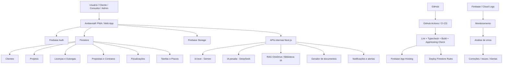

---

## 3. Camadas da arquitetura

### 3.1 Camada de apresentação

Responsável por tudo que o usuário vê e usa.

**Componentes principais:**

- PWA web responsivo.
- Layout para desktop e celular.
- Área do cliente.
- Área da consultoria.
- Área administrativa.
- Dashboards.
- Telas de licenças, projetos, propostas, contratos e documentos.
- AI Lab / Biblioteca IA.

**Objetivo:** permitir que o usuário faça o máximo possível com poucos cliques, usando fluxos guiados.

---

### 3.2 Camada de aplicação

Responsável pelas regras de negócio dentro do Next.js.

**Responsabilidades:**

- Validar dados antes de salvar.
- Controlar permissões por perfil.
- Conectar telas com Firestore e Storage.
- Expor APIs internas.
- Chamar serviços de IA.
- Processar documentos.
- Gerar relatórios.
- Disparar alertas.

---

### 3.3 Camada de dados

Responsável por armazenar dados estruturados e arquivos.

**Serviços principais:**

- Firebase Auth: login e identidade.
- Firestore: dados do sistema.
- Firebase Storage: arquivos, anexos, PDFs, imagens, contratos.
- OneDrive: biblioteca externa para RAG e documentos de referência.

---

### 3.4 Camada de IA

Responsável por automações inteligentes.

**Divisão recomendada:**

- Gemini: consultas rápidas, classificações simples, sugestões curtas.
- DeepSeek: relatórios longos, pareceres, documentos complexos, análises técnicas.
- RAG OneDrive: buscar informação em documentos reais da empresa.

---

### 3.5 Camada DevOps

Responsável por qualidade, deploy e estabilidade.

**Componentes:**

- GitHub.
- GitHub Actions.
- Firebase App Hosting.
- Firestore Rules.
- Scripts de diagnóstico.
- Monitoramento de logs.
- Relatórios automáticos de erro.

---

## 4. Estrutura geral sugerida de módulos

```text
AmbientaR
├── Autenticação e Perfis
├── Dashboard Geral
├── Clientes
├── Empresas / Unidades
├── Projetos Ambientais
├── Licenças Ambientais
├── Outorgas
├── Condicionantes
├── Fiscalizações
├── Propostas Comerciais
├── Contratos
├── Documentos
├── Relatórios
├── Biblioteca IA / RAG OneDrive
├── AI Lab
├── Tarefas e Prazos
├── Notificações
├── Configurações
├── Auditoria
└── Monitoramento / DevOps
```

---

# 5. Pipeline 1 — Desenvolvimento local

## Objetivo

Permitir que o projeto rode localmente com segurança antes de qualquer alteração ir para produção.

## Fluxo

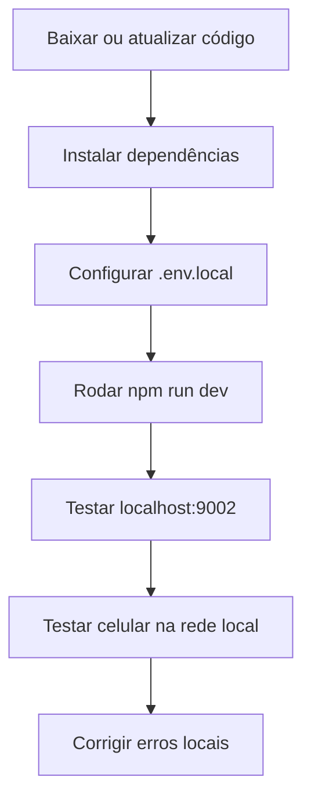

## Passo a passo

1. Abrir o terminal na pasta do projeto.
2. Atualizar o código com Git.
3. Instalar dependências com `npm install`.
4. Conferir variáveis de ambiente.
5. Rodar `npm run dev`.
6. Abrir `http://localhost:9002`.
7. Testar login, dashboard e rotas principais.
8. Testar no celular usando `http://IP-DO-PC:9002`.
9. Corrigir erros antes de fazer commit.

## Automação recomendada

Criar script:

```bash
npm run setup:local
```

Esse script pode executar:

```bash
npm install
npm run typecheck
npm run lint
npm run dev
```

---

# 6. Pipeline 2 — Qualidade de código

## Objetivo

Evitar que código quebrado vá para o GitHub ou produção.

## Fluxo

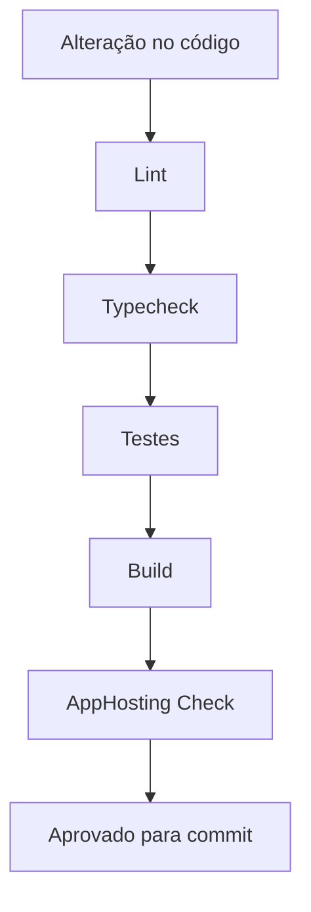

## Passo a passo

1. Desenvolvedor altera arquivos.
2. Roda `npm run lint`.
3. Roda `npm run typecheck`.
4. Roda testes automatizados, quando existirem.
5. Roda `npm run build`.
6. Roda `npm run apphosting:check`.
7. Se tudo passar, faz commit.
8. Se falhar, corrige antes do push.

## Regra de ouro

Nenhuma feature nova deve ir para produção se quebrar:

- TypeScript.
- ESLint.
- Build.
- Firebase App Hosting check.
- Firestore Rules.

---

# 7. Pipeline 3 — Deploy automático

## Objetivo

Publicar o AmbientaR com segurança a partir do GitHub.

## Fluxo

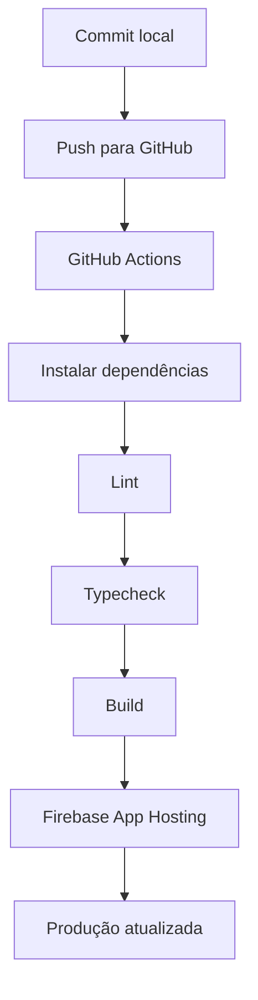

## Passo a passo

1. Fazer commit com mensagem clara.
2. Enviar para branch principal.
3. GitHub Actions inicia automaticamente.
4. Pipeline instala dependências.
5. Executa validações.
6. Executa build.
7. Publica no Firebase App Hosting.
8. Conferir aplicação publicada.
9. Monitorar logs após deploy.

## Melhorias recomendadas

- Criar ambiente `staging` antes de produção.
- Exigir aprovação manual para produção.
- Criar rollback automático se houver erro crítico.
- Gerar changelog automático.

---

# 8. Pipeline 4 — Firestore Rules

## Objetivo

Garantir segurança dos dados e evitar divergência entre regra local e regra publicada.

## Fluxo

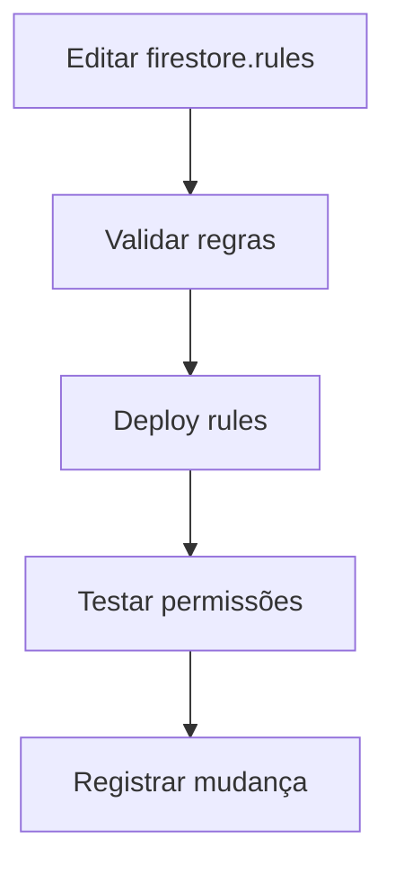

## Passo a passo

1. Editar apenas o arquivo oficial de regras.
2. Evitar arquivos espelho duplicados.
3. Rodar validação local.
4. Publicar com `npm run deploy:rules`.
5. Testar leitura e escrita por perfil.
6. Validar admin, consultor, cliente e representante.
7. Registrar no changelog.

## Perfis mínimos

- Admin: acesso total.
- Consultor: acesso aos clientes/projetos vinculados.
- Cliente titular: acesso à própria empresa.
- Representante: acesso mediante aprovação.
- Usuário bloqueado: nenhum acesso sensível.

---

# 9. Pipeline 5 — Autenticação e aprovação de usuários

## Objetivo

Controlar acesso de clientes, representantes e equipe interna.

## Fluxo

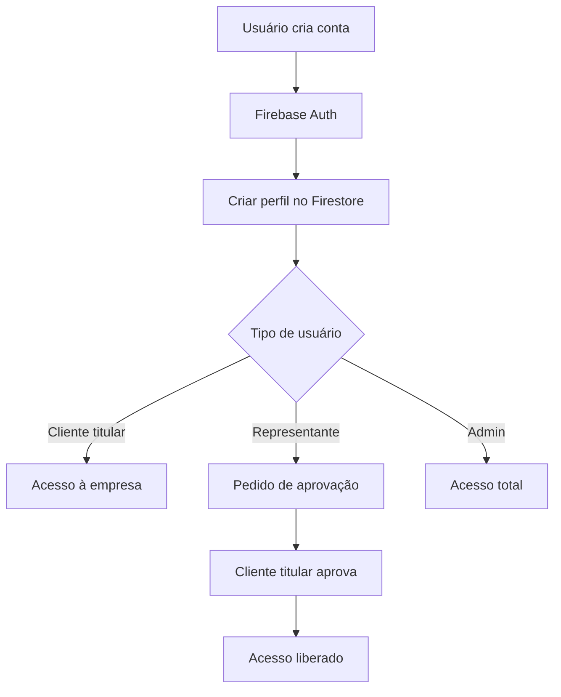

## Passo a passo

1. Usuário cria conta.
2. Sistema cria documento de perfil.
3. Usuário informa empresa ou vínculo.
4. Se for representante, cria pedido de acesso.
5. Cliente titular aprova ou rejeita.
6. Firestore Rules respeitam o vínculo aprovado.
7. Auditoria registra quem aprovou e quando.

## Automação recomendada

- Enviar alerta ao cliente titular quando houver novo pedido.
- Expirar pedidos antigos.
- Bloquear domínios suspeitos.
- Registrar histórico de acessos.

---

# 10. Pipeline 6 — Cadastro de cliente

## Objetivo

Criar uma base única de clientes com dados prontos para propostas, contratos, licenças e relatórios.

## Fluxo

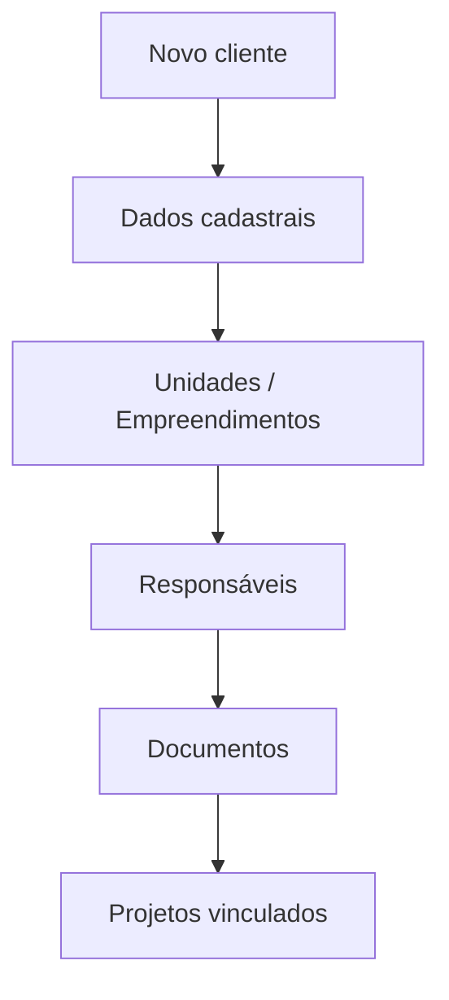

## Passo a passo

1. Cadastrar razão social, CNPJ, endereço e contatos.
2. Cadastrar unidades ou empreendimentos.
3. Cadastrar responsáveis legais e técnicos.
4. Anexar documentos básicos.
5. Definir permissões de acesso.
6. Criar pasta automática no Storage/OneDrive.
7. Gerar checklist inicial ambiental.

## Automações

- Consulta automática de CNPJ, se integrada.
- Criação de pasta padrão.
- Checklist por atividade econômica.
- Sugestão de licenças necessárias.
- Criação de tarefas iniciais.

---

# 11. Pipeline 7 — Projetos ambientais

## Objetivo

Organizar todos os serviços prestados pela consultoria.

## Fluxo

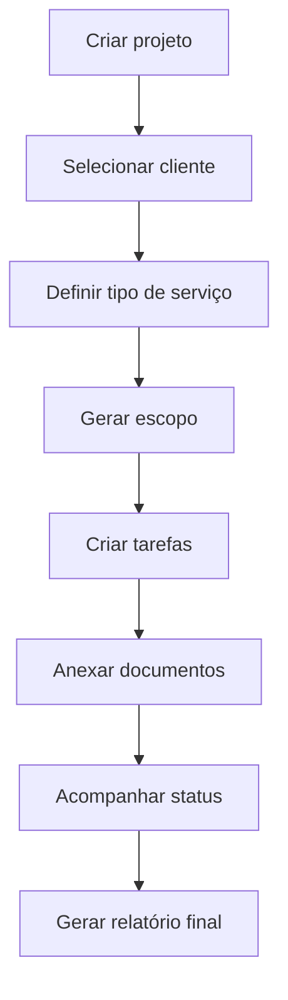

## Tipos de projeto

- Licenciamento ambiental.
- Renovação de licença.
- Outorga.
- Cadastro ambiental.
- Relatório técnico.
- Plano de controle ambiental.
- Defesa de auto de infração.
- Monitoramento ambiental.

## Status recomendados

- Rascunho.
- Em análise.
- Aguardando cliente.
- Em execução.
- Protocolado.
- Aguardando órgão ambiental.
- Concluído.
- Arquivado.

---

# 12. Pipeline 8 — Licenças ambientais

## Objetivo

Controlar licenças, vencimentos, condicionantes e renovações.

## Fluxo

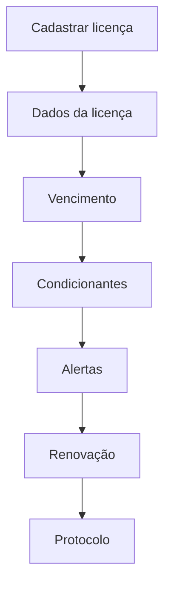

## Passo a passo

1. Cadastrar tipo da licença.
2. Informar órgão ambiental.
3. Informar número do processo.
4. Informar data de emissão e vencimento.
5. Anexar PDF da licença.
6. Cadastrar condicionantes.
7. Criar alertas automáticos.
8. Criar projeto de renovação antes do vencimento.

## Alertas recomendados

- 180 dias antes.
- 120 dias antes.
- 90 dias antes.
- 60 dias antes.
- 30 dias antes.
- Vencida.

---

# 13. Pipeline 9 — Condicionantes ambientais

## Objetivo

Garantir que nenhuma obrigação ambiental seja esquecida.

## Fluxo

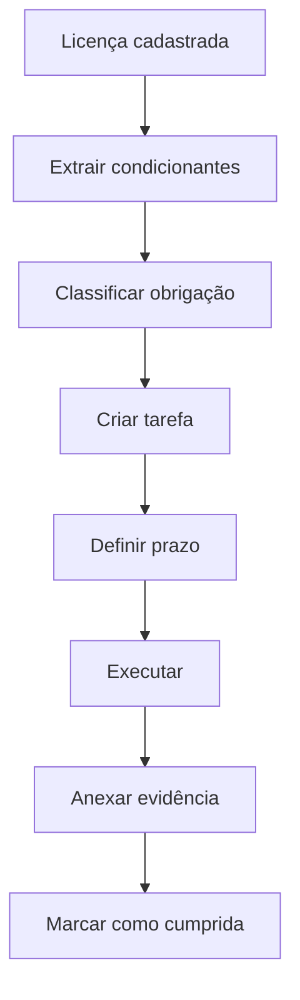

## Passo a passo

1. Inserir condicionantes manualmente ou por IA.
2. Classificar por tipo.
3. Definir responsável.
4. Definir prazo.
5. Gerar tarefa automática.
6. Solicitar evidência.
7. Validar cumprimento.
8. Guardar histórico.

## Tipos de condicionante

- Relatório periódico.
- Monitoramento.
- Pagamento.
- Protocolo.
- Implantação de medida.
- Comunicação ao órgão.
- Renovação documental.

---

# 14. Pipeline 10 — Outorgas

## Objetivo

Controlar captação, lançamento, poços, barramentos e uso de recursos hídricos.

## Fluxo

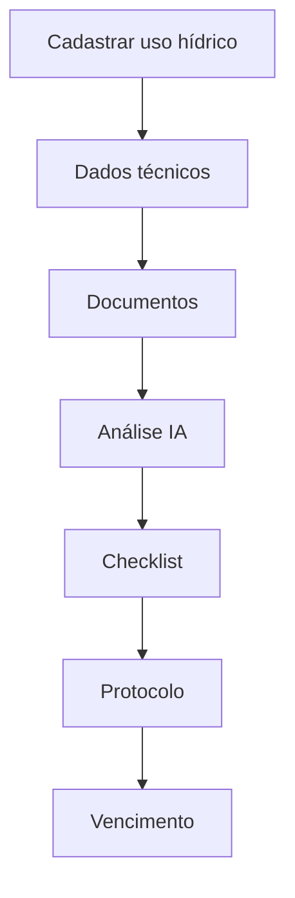

## Passo a passo

1. Cadastrar ponto de uso.
2. Informar coordenadas.
3. Informar vazão.
4. Informar finalidade.
5. Anexar documentos.
6. Gerar checklist por tipo de intervenção.
7. Controlar protocolo.
8. Criar alertas de vencimento.

---

# 15. Pipeline 11 — Fiscalizações e autos de infração

## Objetivo

Transformar documentos de fiscalização em plano de ação.

## Fluxo

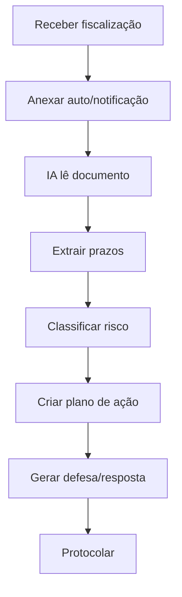

## Passo a passo

1. Cadastrar fiscalização.
2. Anexar auto, notificação ou relatório.
3. IA extrai órgão, data, infrações, artigos e prazos.
4. Sistema cria tarefas urgentes.
5. Consultor valida a interpretação.
6. IA sugere estratégia de resposta.
7. Gerar minuta de defesa ou resposta.
8. Anexar protocolo final.

## Classificação de risco

- Baixo: correção simples.
- Médio: envolve prazo e documentação.
- Alto: multa, embargo ou risco jurídico.
- Crítico: paralisação, dano ambiental ou vencimento imediato.

---

# 16. Pipeline 12 — Propostas comerciais

## Objetivo

Criar propostas rápidas, padronizadas e rastreáveis.

## Fluxo

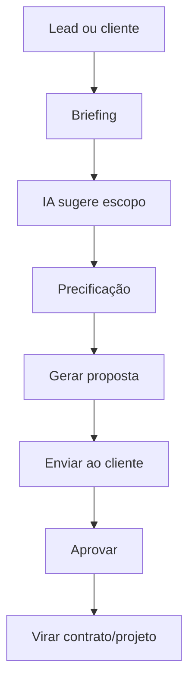

## Passo a passo

1. Selecionar cliente.
2. Escolher tipo de serviço.
3. Preencher briefing.
4. IA sugere escopo técnico.
5. Consultor ajusta entregáveis.
6. Sistema calcula valores.
7. Gerar proposta PDF/DOCX.
8. Enviar ao cliente.
9. Registrar aceite.
10. Converter proposta em contrato e projeto.

## Automações

- Templates por tipo de serviço.
- Valores padrão por complexidade.
- Cláusulas automáticas.
- Follow-up automático.
- Dashboard de taxa de conversão.

---

# 17. Pipeline 13 — Contratos

## Objetivo

Padronizar contratos e reduzir retrabalho jurídico/administrativo.

## Fluxo

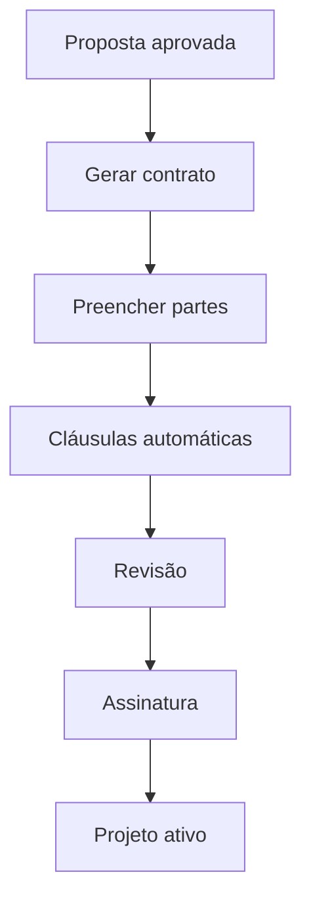

## Passo a passo

1. Receber proposta aprovada.
2. Puxar dados do cliente.
3. Puxar escopo aprovado.
4. Selecionar template contratual.
5. Gerar minuta.
6. Revisar cláusulas.
7. Enviar para assinatura.
8. Registrar contrato assinado.
9. Criar projeto automaticamente.

---

# 18. Pipeline 14 — Documentos e arquivos

## Objetivo

Organizar documentos sem perda de informação.

## Fluxo

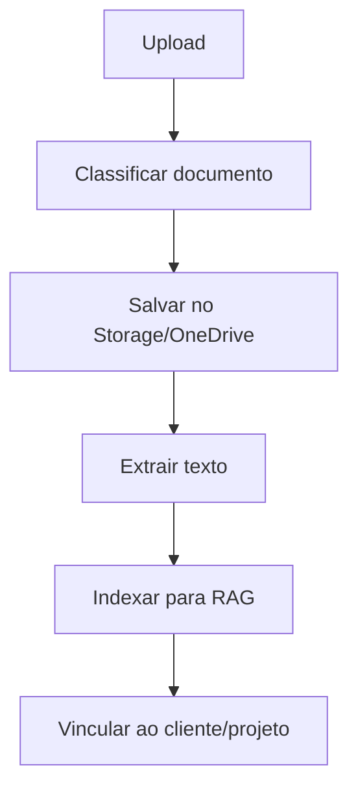

## Passo a passo

1. Usuário faz upload.
2. Sistema identifica tipo do documento.
3. Salva em pasta padrão.
4. Extrai texto quando possível.
5. IA resume conteúdo.
6. Documento é vinculado ao cliente, projeto ou licença.
7. Documento entra na biblioteca IA, se permitido.

## Tipos de documentos

- Licença.
- Outorga.
- Contrato.
- Proposta.
- Relatório.
- Auto de infração.
- Notificação.
- Procuração.
- Cartão CNPJ.
- Matrícula.
- Planta ou mapa.

---

# 19. Pipeline 15 — Biblioteca IA / RAG OneDrive

## Objetivo

Permitir que a IA responda com base em documentos reais da consultoria.

## Fluxo

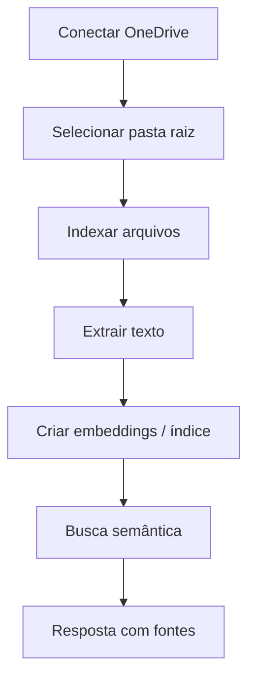

## Passo a passo

1. Conectar conta Microsoft.
2. Selecionar biblioteca ou pasta raiz.
3. Listar arquivos permitidos.
4. Extrair conteúdo dos arquivos.
5. Indexar por cliente, tema e tipo.
6. Usuário faz pergunta.
7. Sistema busca trechos relevantes.
8. IA responde com base nos trechos.
9. Resposta mostra referência do documento.

## Regras importantes

- Nunca responder como certeza se não encontrou fonte.
- Separar documentos públicos, internos e confidenciais.
- Respeitar permissões do usuário.
- Registrar consultas sensíveis.

---

# 20. Pipeline 16 — Relatórios ambientais

## Objetivo

Gerar relatórios técnicos com menos esforço manual.

## Fluxo

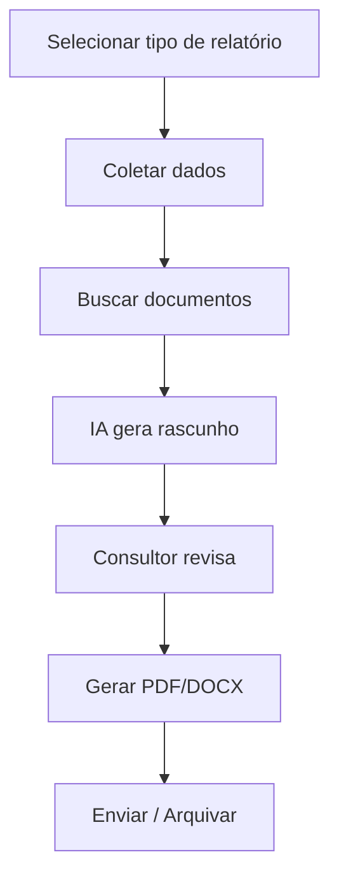

## Passo a passo

1. Escolher tipo de relatório.
2. Selecionar cliente e projeto.
3. Puxar dados cadastrais.
4. Puxar documentos relacionados.
5. IA gera estrutura inicial.
6. Consultor revisa tecnicamente.
7. Sistema gera versão final.
8. Arquivar no projeto.
9. Criar tarefa de envio/protocolo.

## Tipos de relatório

- Relatório de cumprimento de condicionantes.
- Relatório fotográfico.
- Relatório de vistoria.
- Parecer técnico.
- Plano de ação.
- Relatório de monitoramento.
- Diagnóstico ambiental.

---

# 21. Pipeline 17 — Tarefas e prazos

## Objetivo

Centralizar todos os prazos críticos do SaaS.

## Fluxo

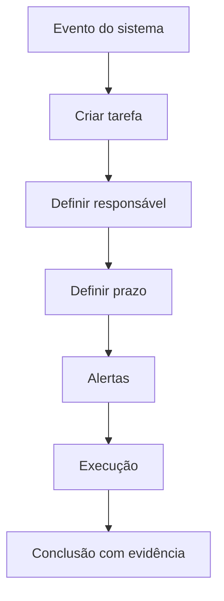

## Eventos que criam tarefas

- Nova licença.
- Nova condicionante.
- Novo projeto.
- Proposta aprovada.
- Contrato assinado.
- Documento fiscal recebido.
- Vencimento próximo.
- Pedido de cliente.

## Alertas

- Dentro do app.
- E-mail.
- WhatsApp, se integrado.
- Dashboard de atrasos.

---

# 22. Pipeline 18 — Notificações

## Objetivo

Avisar usuários antes de problemas acontecerem.

## Fluxo

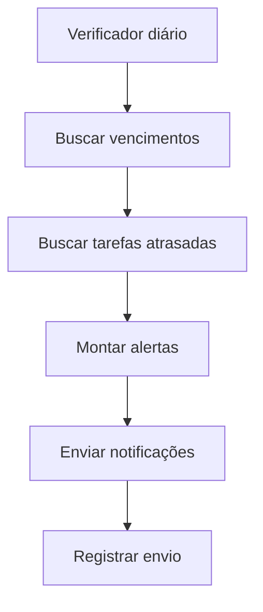

## Notificações recomendadas

- Licença vencendo.
- Outorga vencendo.
- Condicionante próxima.
- Proposta sem resposta.
- Contrato pendente.
- Pedido de representante.
- Documento faltante.
- Erro no sistema.

---

# 23. Pipeline 19 — Monitoramento e análise de erros

## Objetivo

Detectar falhas automaticamente e reduzir tempo de correção.

## Fluxo

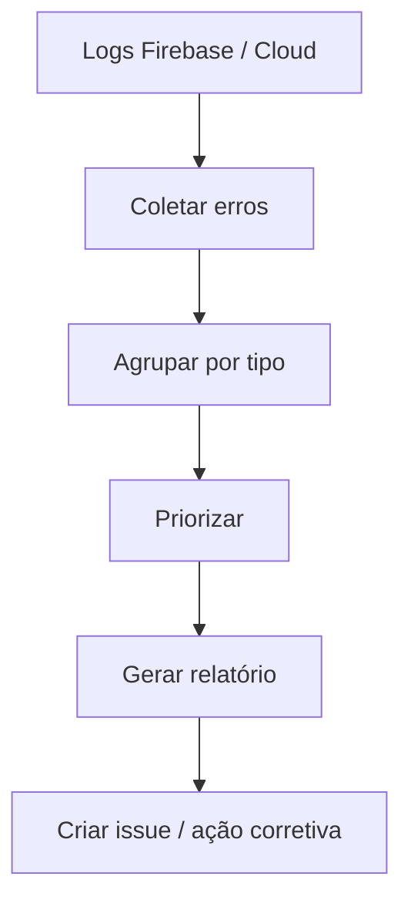

## Passo a passo

1. Coletar logs dos últimos dias.
2. Filtrar erros 4xx e 5xx.
3. Agrupar por rota, status e mensagem.
4. Identificar erros mais frequentes.
5. Gerar relatório JSON/Markdown.
6. Criar tarefa de correção.
7. Validar queda na quantidade de erros após deploy.

## Métricas importantes

- Total de erros por dia.
- Rotas com mais erro.
- Erros por usuário.
- Tempo médio de resposta.
- Falhas de autenticação.
- Falhas de permissão Firestore.
- Falhas de IA.

---

# 24. Pipeline 20 — Backup e recuperação

## Objetivo

Evitar perda de dados e permitir recuperação rápida.

## Fluxo

```mermaid
flowchart TD
  A[Agendamento] --> B[Exportar Firestore]
  B --> C[Backup Storage]
  C --> D[Backup configs]
  D --> E[Salvar em local seguro]
  E --> F[Testar restauração]
```

## Passo a passo

1. Definir rotina de backup.
2. Exportar Firestore.
3. Copiar arquivos críticos do Storage.
4. Versionar regras e configurações no GitHub.
5. Salvar backups em local separado.
6. Testar restauração periodicamente.

---

# 25. Pipeline 21 — Auditoria

## Objetivo

Saber quem fez o quê, quando e por quê.

## Fluxo

```mermaid
flowchart TD
  A[Ação do usuário] --> B[Registrar evento]
  B --> C[Salvar auditoria]
  C --> D[Exibir histórico]
  D --> E[Investigar se necessário]
```

## Eventos auditáveis

- Login.
- Criação de cliente.
- Alteração de licença.
- Exclusão de documento.
- Aprovação de representante.
- Geração de proposta.
- Geração de contrato.
- Uso de IA em documento sensível.
- Alteração de permissão.

---

# 26. Pipeline 22 — Segurança

## Objetivo

Proteger dados ambientais, documentos e informações de clientes.

## Fluxo

```mermaid
flowchart TD
  A[Usuário autenticado] --> B[Verificar perfil]
  B --> C[Validar permissão]
  C --> D[Permitir ou negar]
  D --> E[Registrar auditoria]
```

## Regras mínimas

1. Todo dado sensível exige login.
2. Todo acesso deve validar vínculo com cliente/projeto.
3. Admin deve ter acesso total controlado.
4. Cliente só vê seus próprios dados.
5. Representante só vê dados aprovados.
6. Storage deve seguir as mesmas permissões do Firestore.
7. APIs internas devem validar usuário no servidor.

---

# 27. Pipeline 23 — Suporte e diagnóstico local

## Objetivo

Resolver rapidamente erros de ambiente, instalação e acesso local.

## Fluxo

```mermaid
flowchart TD
  A[Erro local] --> B[Verificar Node]
  B --> C[Verificar npm]
  C --> D[Verificar porta 9002]
  D --> E[Limpar cache]
  E --> F[Rodar novamente]
```

## Checklist

1. Verificar `node --version`.
2. Verificar `npm --version`.
3. Rodar `npm install`.
4. Verificar porta 9002.
5. Limpar `.next`, se necessário.
6. Rodar `npm run dev`.
7. Abrir navegador externo, não preview do editor.
8. Testar no celular com IP da máquina.

---

# 28. Modelo de dados inicial sugerido

```text
users
  uid
  name
  email
  role
  clientIds
  status
  createdAt

clients
  id
  name
  cnpj
  address
  contacts
  status
  createdAt

projects
  id
  clientId
  title
  type
  status
  responsibleUid
  startDate
  dueDate

licenses
  id
  clientId
  projectId
  type
  agency
  number
  issueDate
  expirationDate
  status

conditions
  id
  licenseId
  description
  dueDate
  status
  responsibleUid

proposals
  id
  clientId
  scope
  value
  status
  createdAt

contracts
  id
  proposalId
  clientId
  status
  signedAt

documents
  id
  clientId
  projectId
  type
  storagePath
  ragEnabled
  createdAt

tasks
  id
  clientId
  projectId
  title
  dueDate
  status
  priority

auditLogs
  id
  actorUid
  action
  entityType
  entityId
  createdAt
```

---

# 29. Roadmap de implantação

## Fase 1 — Organização da base

- Confirmar stack oficial Next.js + Firebase.
- Separar scripts legados Python.
- Padronizar `.env.example`.
- Padronizar documentação.
- Validar `npm run dev`, `lint`, `typecheck` e `build`.

## Fase 2 — Segurança e usuários

- Revisar perfis.
- Revisar Firestore Rules.
- Criar auditoria.
- Criar aprovação de representantes.

## Fase 3 — Módulos operacionais

- Clientes.
- Projetos.
- Licenças.
- Condicionantes.
- Outorgas.
- Fiscalizações.

## Fase 4 — Comercial

- Propostas.
- Contratos.
- Conversão proposta → contrato → projeto.

## Fase 5 — IA e automações

- RAG OneDrive.
- Relatórios automáticos.
- Leitura de documentos.
- Extração de prazos.
- Geração de minutas.

## Fase 6 — DevOps avançado

- CI/CD completo.
- Staging.
- Rollback.
- Monitoramento.
- Relatórios automáticos de erro.

---

# 30. Checklist final de automação máxima

- [ ] Rodar local com um comando.
- [ ] Testar celular automaticamente/documentado.
- [ ] Validar lint/typecheck/build antes de commit.
- [ ] Deploy automático via GitHub.
- [ ] Deploy separado de Firestore Rules.
- [ ] Cadastro guiado de cliente.
- [ ] Projeto criado a partir de proposta aprovada.
- [ ] Contrato criado a partir da proposta.
- [ ] Licenças com alertas automáticos.
- [ ] Condicionantes virando tarefas.
- [ ] Fiscalizações lidas por IA.
- [ ] Relatórios gerados por IA.
- [ ] Biblioteca OneDrive indexada.
- [ ] Documentos classificados automaticamente.
- [ ] Logs analisados automaticamente.
- [ ] Auditoria de ações críticas.
- [ ] Backup e recuperação documentados.

---

# 31. Conclusão

A melhor evolução do AmbientaR é transformar cada processo da consultoria ambiental em um pipeline digital rastreável. O sistema deve operar como uma linha de produção:

1. Entrada de dados.
2. Validação.
3. Automação.
4. Revisão humana.
5. Geração de documento ou ação.
6. Registro.
7. Monitoramento.
8. Melhoria contínua.

Com essa estrutura, o AmbientaR deixa de ser apenas um sistema de cadastro e passa a funcionar como uma plataforma operacional completa para consultorias ambientais.
