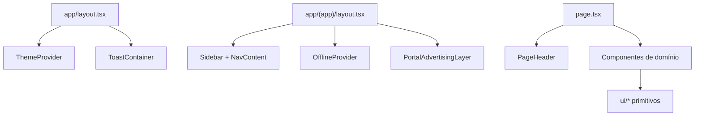

# AmbientaR — Mapa de Rotas, Telas e Componentes

> Gerado em: 11/06/2026, 08:41:19
>
> Regenerar: `npm run docs:routes-map`

Documento mestre com inventário de rotas, componentes e APIs do sistema EcoGestão MG (AmbientaR).

---

## Sumário

- [Arquitetura de navegação](#arquitetura-de-navegação)
- [Autenticação e acesso](#autenticação-e-acesso)
- [Índice por módulo](#índice-por-módulo)
- [Rotas públicas](#rotas-publicas)
- [Minha Carteira](#minha-carteira)
- [Painel](#painel)
- [Financeiro](#financeiro)
- [Cadastro](#cadastro)
- [Documentos Ambientais](#documentos-ambientais)
- [Multas e Defesas](#multas-e-defesas)
- [Vistoria Técnica](#vistoria-tecnica)
- [Licenciamento](#licenciamento)
- [IA](#ia)
- [Estudos Técnicos](#estudos-tecnicos)
- [Georreferenciamento](#georreferenciamento)
- [Vendas & CRM](#vendas-crm)
- [Webmail](#webmail)
- [Ofícios e Comunicações](#oficios-e-comunicacoes)
- [Configurações](#configuracoes)
- [Agenda](#agenda)
- [Outras rotas](#outras-rotas)
- [Catálogo de componentes (src/components)](#catálogo-de-componentes-srccomponents)
- [Componentes co-localizados (app)](#componentes-co-localizados-app)
- [API Routes](#api-routes)
- [Apêndice](#apêndice)

---

## Estatísticas

| Métrica | Total |
|---------|-------|
| Rotas URL únicas (deduplicadas) | 237 |
| Ficheiros page.tsx no total | 259 |
| Componentes em src/components | 157 |
| Componentes co-localizados em app | 205 |
| API routes | 97 |
| Rotas com modal intercepting | 24 |

---

## Arquitetura de navegação

| Camada | Ficheiro | Função |
|--------|----------|--------|
| Layout raiz | `src/app/layout.tsx` | Providers globais, tema, PWA dev |
| Layout autenticado | `src/app/(app)/layout.tsx` | Sidebar, nav mobile, chat, offline |
| Menu | `src/lib/navigation-config.ts` | Itens de navegação e roles |
| Acesso | `src/lib/route-access.ts` | Guards client-side por perfil |
| Cabeçalho | `src/components/page-header.tsx` | Título e descrição das páginas |

---

## Autenticação e acesso

- **Rotas públicas:** `/login`, `/register`, `/forgot-password`, `/politica-privacidade`, `/offline`
- **Guard:** `src/app/(app)/layout.tsx` redireciona para `/login` se não autenticado
- **Roles:** definidos em `users/{uid}.role` no Firestore; menu filtrado por `allNavItems.roles`
- **Admin:** bypass total em `route-access.ts`
- **`cliente_autonomo`:** bloqueado em `/ai-lab`, `/studies`, `/georeferenciamento`, `/analise-ambiental`, `/requests`
- **Middleware:** `src/middleware.ts` — apenas `/api/*` (503 se APIs desativadas)

---

## Índice por módulo

### Rotas públicas

Páginas acessíveis sem autenticação.

5 rota(s). Ver [catálogo detalhado](#rotas-publicas).

### Minha Carteira

Visão do consultor representante ou cliente titular sobre empreendimentos e documentos vinculados.

2 rota(s). Ver [catálogo detalhado](#minha-carteira).

### Painel

Dashboard inicial com widgets por perfil (admin, financeiro, ambiental, cliente, CRM, fauna).

1 rota(s). Ver [catálogo detalhado](#painel).

### Financeiro

Gestão financeira: clientes, contratos, faturas, fornecedores, fluxo de caixa, análises ABC, DRE, orçamento e ROI.

40 rota(s). Ver [catálogo detalhado](#financeiro).

### Cadastro

Cadastro de empreendedores, empreendimentos (projetos), empresas responsáveis e responsáveis técnicos.

13 rota(s). Ver [catálogo detalhado](#cadastro).

### Documentos Ambientais

Licenças, CAR, outorgas, condicionantes, DAIA, fauna, monitoramento e pasta do cliente.

16 rota(s). Ver [catálogo detalhado](#documentos-ambientais).

### Multas e Defesas

Autos de infração, multas ambientais e petições de defesa administrativa.

4 rota(s). Ver [catálogo detalhado](#multas-e-defesas).

### Vistoria Técnica

Vistorias em campo, relatórios e inspeções técnicas.

3 rota(s). Ver [catálogo detalhado](#vistoria-tecnica).

### Licenciamento

Pedidos de licenciamento ambiental e fluxo AIA.

4 rota(s). Ver [catálogo detalhado](#licenciamento).

### IA

Assistentes IA, análise geoespacial, relatórios, MCP, RAG e automações.

12 rota(s). Ver [catálogo detalhado](#ia).

### Estudos Técnicos

EIA/RIMA, PEA, PIA, PRADA, inventário florestal, fauna, mapas, outorgas e demais estudos ambientais.

89 rota(s). Ver [catálogo detalhado](#estudos-tecnicos).

### Georreferenciamento

Processos de georreferenciamento rural, urbano, ambiental e validações.

11 rota(s). Ver [catálogo detalhado](#georreferenciamento).

### Vendas & CRM

CRM, oportunidades, propostas, equipa e canais de comunicação.

12 rota(s). Ver [catálogo detalhado](#vendas-crm).

### Webmail

Acesso a webmail e portais externos embutidos.

2 rota(s). Ver [catálogo detalhado](#webmail).

### Ofícios e Comunicações

Gestão de ofícios e comunicações oficiais.

3 rota(s). Ver [catálogo detalhado](#oficios-e-comunicacoes).

### Configurações

Configurações da empresa, templates, ficheiros, consultas técnicas, laudos e integrações.

18 rota(s). Ver [catálogo detalhado](#configuracoes).

### Agenda

Calendário e agenda de compromissos.

1 rota(s). Ver [catálogo detalhado](#agenda).

### Outras rotas

Rotas auxiliares, redirects legados ou sub-rotas dinâmicas.

1 rota(s). Ver [catálogo detalhado](#outras-rotas).

---

## Catálogo de rotas

### Rotas públicas

Páginas acessíveis sem autenticação.

| Rota | Função | Tipo | Roles | Componentes | Ficheiro |
| --- | --- | --- | --- | --- | --- |
| `/forgot-password` | Recuperação de palavra-passe | página | herdado do menu pai / admin | ui/button, ui/card, ui/form, ui/input | `src/app/forgot-password/page.tsx` |
| `/login` | Autenticação Firebase — entrada na aplicação | página | herdado do menu pai / admin | — | `src/app/login/page.tsx` |
| `/offline` | Página PWA exibida quando não há ligação à rede | página | herdado do menu pai / admin | ui/button | `src/app/offline/page.tsx` |
| `/politica-privacidade` | Política de privacidade (página pública) | página | herdado do menu pai / admin | ui/button | `src/app/politica-privacidade/page.tsx` |
| `/register` | Registo de novos utilizadores | página | herdado do menu pai / admin | ui/button, ui/card, ui/checkbox, ui/form, ui/input, ui/label, ui/masked-input, ui/radio-group | `src/app/register/page.tsx` |

### Minha Carteira

Visão do consultor representante ou cliente titular sobre empreendimentos e documentos vinculados.

| Rota | Função | Tipo | Roles | Componentes | Ficheiro |
| --- | --- | --- | --- | --- | --- |
| `/carteira` | Minha carteira — visão do consultor ou cliente sobre empreendimentos vinculados | página | consultor_representante, client, cliente_autonomo, admin | page-header, ui/badge, ui/button, ui/card, ui/skeleton | `src/app/(app)/carteira/page.tsx` |
| `/carteira/[clientId]` | Detalhe de cliente/empreendimento na carteira do consultor | detalhe | consultor_representante, client, cliente_autonomo, admin | page-header, ui/button, ui/card, ui/skeleton | `src/app/(app)/carteira/[clientId]/page.tsx` |

### Painel

Dashboard inicial com widgets por perfil (admin, financeiro, ambiental, cliente, CRM, fauna).

| Rota | Função | Tipo | Roles | Componentes | Ficheiro |
| --- | --- | --- | --- | --- | --- |
| `/` | Painel principal — dashboard adaptado ao perfil do utilizador (admin, financeiro, cliente, CRM, fauna, etc.) | página | admin, client, cliente_autonomo, representative, technical, sales, financial, gestor, supervisor, diretor_fauna, advogado | documentos-ambientais-hub-card, page-header, crm-dashboard, admin-dashboard, agenda-widget, birthday-widget, client-dashboard, environmental-dashboard… | `src/app/(app)/page.tsx` |

### Financeiro

Gestão financeira: clientes, contratos, faturas, fornecedores, fluxo de caixa, análises ABC, DRE, orçamento e ROI.

| Rota | Função | Tipo | Roles | Componentes | Ficheiro |
| --- | --- | --- | --- | --- | --- |
| `/bank-access` | Credenciais e acesso a contas bancárias | página | admin, financial | page-header, ui/alert, ui/button, ui/card, ui/input, ui/label, ui/select | `src/app/(app)/bank-access/page.tsx` |
| `/cash-flow` | Lançamentos de caixa — receitas e despesas | listagem | admin, financial | — | `src/app/(app)/cash-flow/page.tsx` |
| `/cash-flow/[id]/edit` | Lançamentos de fluxo de caixa | formulário (edição) | admin, financial | page-header, ui/card, ui/skeleton | `src/app/(app)/cash-flow/[id]/edit/page.tsx` |
| `/cash-flow/new` | Lançamentos de fluxo de caixa | formulário (criação) | admin, financial | page-header, ui/card | `src/app/(app)/cash-flow/new/page.tsx` |
| `/clients` | Listagem e gestão de clientes (cadastro financeiro) | listagem | admin, sales, financial | card-search-input, clients/client-duplicates-dialog, clients/create-portal-access-dialog, page-header, ui/alert-dialog, ui/button, ui/card, ui/dialog… | `src/app/(app)/clients/page.tsx` |
| `/clients/[id]/edit` | Editar cadastro de cliente | formulário (edição) | admin, sales, financial | page-header, ui/card, ui/skeleton | `src/app/(app)/clients/[id]/edit/page.tsx` |
| `/clients/new` | Cadastrar novo cliente | formulário (criação) | admin, sales, financial | page-header, ui/button, ui/card, ui/masked-input | `src/app/(app)/clients/new/page.tsx` |
| `/commercial-proposals` | Orçamentos e propostas comerciais | listagem | admin, financial, sales, client, cliente_autonomo, representative | form/br-date-input, page-header, shared/attachment-preview-section, ui/alert-dialog, ui/badge, ui/button, ui/card, ui/collapsible… | `src/app/(app)/commercial-proposals/page.tsx` |
| `/commercial-proposals/[id]/edit` | Orçamentos e propostas comerciais | formulário (edição) | admin, financial, sales, client, cliente_autonomo, representative | page-header, ui/card, ui/skeleton | `src/app/(app)/commercial-proposals/[id]/edit/page.tsx` |
| `/commercial-proposals/new` | Orçamentos e propostas comerciais | formulário (criação) | admin, financial, sales, client, cliente_autonomo, representative | page-header, ui/card | `src/app/(app)/commercial-proposals/new/page.tsx` |
| `/contracts` | Contratos com clientes | listagem | admin, financial, sales, client, representative | form/br-date-input, page-header, shared/attachment-preview-section, shared/upload-preparation-dialog, ui/alert-dialog, ui/badge, ui/button, ui/card… | `src/app/(app)/contracts/page.tsx` |
| `/contracts/[id]/edit` | Contratos | formulário (edição) | admin, financial, sales, client, representative | page-header, ui/card, ui/skeleton | `src/app/(app)/contracts/[id]/edit/page.tsx` |
| `/contracts/new` | Contratos | formulário (criação) | admin, financial, sales, client, representative | page-header, ui/card | `src/app/(app)/contracts/new/page.tsx` |
| `/financial/abc-curve` | Curva ABC de clientes/receitas | listagem | admin, financial | page-header, ui/badge, ui/button, ui/card, ui/label, ui/select, ui/skeleton, ui/table | `src/app/(app)/financial/abc-curve/page.tsx` |
| `/financial/abc-fornecedores` | Curva ABC Fornecedores | listagem | admin, financial | financial/abc-analysis-view, page-header, ui/select | `src/app/(app)/financial/abc-fornecedores/page.tsx` |
| `/financial/abc-servicos` | Curva ABC Serviços | listagem | admin, financial | financial/abc-analysis-view, page-header, ui/select | `src/app/(app)/financial/abc-servicos/page.tsx` |
| `/financial/bens-patrimonio` | Bens e património da empresa | listagem | admin, financial | page-header, ui/alert-dialog, ui/badge, ui/button, ui/card, ui/input, ui/select, ui/skeleton | `src/app/(app)/financial/bens-patrimonio/page.tsx` |
| `/financial/bens-patrimonio/[id]/edit` | Bens e património | formulário (edição) | admin, financial | page-header, ui/card, ui/skeleton | `src/app/(app)/financial/bens-patrimonio/[id]/edit/page.tsx` |
| `/financial/bens-patrimonio/new` | Bens e património | formulário (criação) | admin, financial | page-header, ui/card | `src/app/(app)/financial/bens-patrimonio/new/page.tsx` |
| `/financial/conciliacao` | Conciliação bancária | listagem | admin, financial | page-header, ui/badge, ui/button, ui/card, ui/input, ui/table | `src/app/(app)/financial/conciliacao/page.tsx` |
| `/financial/dre-contabil` | Demonstração de resultado (DRE) contábil | listagem | admin, financial | page-header, ui/button, ui/card, ui/label, ui/select, ui/skeleton, ui/table | `src/app/(app)/financial/dre-contabil/page.tsx` |
| `/financial/export-contabil` | Exportação de dados para contabilidade | listagem | admin, financial | page-header, ui/button, ui/card, ui/select | `src/app/(app)/financial/export-contabil/page.tsx` |
| `/financial/fluxo-projetado` | Fluxo de caixa projetado | listagem | admin, financial | page-header, ui/card, ui/skeleton | `src/app/(app)/financial/fluxo-projetado/page.tsx` |
| `/financial/orcamento` | Orçamento anual | página | admin, financial | page-header, ui/button, ui/card, ui/input, ui/label | `src/app/(app)/financial/orcamento/page.tsx` |
| `/financial/painel` | Painel financeiro consolidado | listagem | admin, financial | financial/project-roi-alerts-card, page-header, ui/button, ui/card, ui/skeleton | `src/app/(app)/financial/painel/page.tsx` |
| `/financial/platform-subscription-contracts` | Contratos de subscrição da plataforma | listagem | admin, financial | page-header, platform-subscription-contract/acceptance-viewer, ui/badge, ui/skeleton, ui/table | `src/app/(app)/financial/platform-subscription-contracts/page.tsx` |
| `/financial/projetos-roi` | Análise de retorno (ROI) de projetos | listagem | admin, financial, sales | financial/project-roi-semaforo-badge, page-header, ui/alert-dialog, ui/button, ui/card, ui/dialog, ui/input, ui/label… | `src/app/(app)/financial/projetos-roi/page.tsx` |
| `/financial/projetos-roi/[caseId]` | Caso de análise ROI de projeto | detalhe | admin, financial, sales | financial/project-roi-semaforo-badge, page-header, ui/alert-dialog, ui/button, ui/card, ui/input, ui/label, ui/select… | `src/app/(app)/financial/projetos-roi/[caseId]/page.tsx` |
| `/invoices` | Faturas emitidas e recebidas | listagem | admin, financial, client, representative | form/br-date-input, page-header, shared/attachment-preview-section, ui/alert, ui/alert-dialog, ui/badge, ui/button, ui/card… | `src/app/(app)/invoices/page.tsx` |
| `/invoices/[id]/edit` | Faturas (tem modal intercepting) | formulário (edição) | admin, financial, client, representative | page-header, ui/card, ui/skeleton | `src/app/(app)/invoices/[id]/edit/page.tsx` |
| `/invoices/new` | Faturas (tem modal intercepting) | formulário (criação) | admin, financial, client, representative | page-header, ui/card | `src/app/(app)/invoices/new/page.tsx` |
| `/proposals` | Tela /proposals | página | herdado do menu pai / admin | — | `src/app/(app)/proposals/page.tsx` |
| `/proposals/[id]/edit` | Editar registo | formulário (edição) | herdado do menu pai / admin | — | `src/app/(app)/proposals/[id]/edit/page.tsx` |
| `/proposals/new` | Criar novo registo | formulário (criação) | herdado do menu pai / admin | — | `src/app/(app)/proposals/new/page.tsx` |
| `/services` | Tabela de serviços e preços | listagem | admin, financial | page-header, ui/alert-dialog, ui/button, ui/card, ui/input, ui/separator, ui/skeleton, ui/tooltip | `src/app/(app)/services/page.tsx` |
| `/services/[id]/edit` | Tabela de Serviços | formulário (edição) | admin, financial | page-header, ui/card, ui/skeleton | `src/app/(app)/services/[id]/edit/page.tsx` |
| `/services/new` | Tabela de Serviços | formulário (criação) | admin, financial | page-header, ui/card | `src/app/(app)/services/new/page.tsx` |
| `/suppliers` | Cadastro de fornecedores | listagem | admin, financial | page-header, ui/alert-dialog, ui/button, ui/card, ui/input, ui/separator, ui/skeleton, ui/tooltip | `src/app/(app)/suppliers/page.tsx` |
| `/suppliers/[id]/edit` | Fornecedores | formulário (edição) | admin, financial | page-header, ui/card, ui/skeleton | `src/app/(app)/suppliers/[id]/edit/page.tsx` |
| `/suppliers/new` | Fornecedores | formulário (criação) | admin, financial | page-header, ui/card | `src/app/(app)/suppliers/new/page.tsx` |

### Cadastro

Cadastro de empreendedores, empreendimentos (projetos), empresas responsáveis e responsáveis técnicos.

| Rota | Função | Tipo | Roles | Componentes | Ficheiro |
| --- | --- | --- | --- | --- | --- |
| `/empreendedores` | Cadastro de empreendedores (pessoas físicas/jurídicas) | listagem | admin, technical, gestor, diretor_fauna, supervisor, financial, sales, client, cliente_autonomo, representative, advogado | card-search-input, empreendedores/empreendedor-duplicates-dialog, page-header, ui/alert-dialog, ui/button, ui/card, ui/dialog, ui/label… | `src/app/(app)/empreendedores/page.tsx` |
| `/empreendedores/[id]/edit` | Gestão de empreendedores | formulário (edição) | admin, technical, gestor, diretor_fauna, supervisor, financial, sales, client, cliente_autonomo, representative, advogado | page-header, ui/card, ui/skeleton | `src/app/(app)/empreendedores/[id]/edit/page.tsx` |
| `/empreendedores/new` | Gestão de empreendedores | formulário (criação) | admin, technical, gestor, diretor_fauna, supervisor, financial, sales, client, cliente_autonomo, representative, advogado | page-header, ui/card, ui/skeleton | `src/app/(app)/empreendedores/new/page.tsx` |
| `/environmental-company` | Rota legada: mesma coleção que Empresa Responsável (`/responsible-company`). | redirect | herdado do menu pai / admin | — | `src/app/(app)/environmental-company/page.tsx` |
| `/projects` | Empreendimentos e projetos ambientais | listagem | admin, technical, gestor, diretor_fauna, supervisor, financial, sales, client, cliente_autonomo, representative, advogado | card-search-input, package-usage-banner, page-header, ui/alert-dialog, ui/button, ui/card, ui/dialog, ui/label… | `src/app/(app)/projects/page.tsx` |
| `/projects/[id]/edit` | Editar empreendimento/projeto | formulário (edição) | admin, technical, gestor, diretor_fauna, supervisor, financial, sales, client, cliente_autonomo, representative, advogado | page-header, ui/card, ui/skeleton | `src/app/(app)/projects/[id]/edit/page.tsx` |
| `/projects/new` | Cadastrar novo empreendimento | formulário (criação) | admin, technical, gestor, diretor_fauna, supervisor, financial, sales, client, cliente_autonomo, representative, advogado | page-header, ui/card, ui/skeleton | `src/app/(app)/projects/new/page.tsx` |
| `/responsible-company` | Empresas responsáveis pelo empreendimento | listagem | admin, technical, gestor, diretor_fauna, supervisor, financial, sales, client, cliente_autonomo, representative, advogado | page-header, ui/alert-dialog, ui/badge, ui/button, ui/card, ui/dialog, ui/label, ui/separator… | `src/app/(app)/responsible-company/page.tsx` |
| `/responsible-company/[id]/edit` | Empresas (tem modal intercepting) | formulário (edição) | admin, technical, gestor, diretor_fauna, supervisor, financial, sales, client, cliente_autonomo, representative, advogado | page-header, ui/card, ui/skeleton | `src/app/(app)/responsible-company/[id]/edit/page.tsx` |
| `/responsible-company/new` | Empresas (tem modal intercepting) | formulário (criação) | admin, technical, gestor, diretor_fauna, supervisor, financial, sales, client, cliente_autonomo, representative, advogado | page-header, ui/card, ui/skeleton | `src/app/(app)/responsible-company/new/page.tsx` |
| `/technical-responsible` | Responsáveis técnicos (RT) | listagem | admin, supervisor, gestor | page-header, ui/alert-dialog, ui/button, ui/card, ui/dialog, ui/label, ui/separator, ui/skeleton… | `src/app/(app)/technical-responsible/page.tsx` |
| `/technical-responsible/[id]/edit` | Responsáveis Técnicos (tem modal intercepting) | formulário (edição) | admin, supervisor, gestor | page-header, ui/card, ui/skeleton | `src/app/(app)/technical-responsible/[id]/edit/page.tsx` |
| `/technical-responsible/new` | Responsáveis Técnicos (tem modal intercepting) | formulário (criação) | admin, supervisor, gestor | page-header, ui/card | `src/app/(app)/technical-responsible/new/page.tsx` |

### Documentos Ambientais

Licenças, CAR, outorgas, condicionantes, DAIA, fauna, monitoramento e pasta do cliente.

| Rota | Função | Tipo | Roles | Componentes | Ficheiro |
| --- | --- | --- | --- | --- | --- |
| `/car` | Cadastro e consulta de CAR (Cadastro Ambiental Rural) | listagem | admin, client, cliente_autonomo, representative, gestor, supervisor, technical, advogado | page-header, shared/upload-preparation-dialog, ui/button, ui/card, ui/input, ui/label, ui/select, ui/separator… | `src/app/(app)/car/page.tsx` |
| `/compliance` | Condicionantes de licenças — acompanhamento de cumprimento | listagem | admin, client, cliente_autonomo, representative, gestor, supervisor, technical, advogado | card-search-input, page-header, shared/record-view-dialog, ui/accordion, ui/alert-dialog, ui/badge, ui/button, ui/card… | `src/app/(app)/compliance/page.tsx` |
| `/documentos-ambientais/pasta-cliente` | Pasta de documentos do cliente (integração OneDrive) | página | admin, technical, gestor, supervisor, financial | onedrive/onedrive-download-button, page-header, ui/badge, ui/button, ui/card, ui/input, ui/label | `src/app/(app)/documentos-ambientais/pasta-cliente/page.tsx` |
| `/fauna` | Documentos de fauna (módulo documentos ambientais) | listagem | admin, client, cliente_autonomo, representative, technical, gestor, supervisor, diretor_fauna, advogado | page-header, shared/record-view-dialog, ui/badge, ui/button, ui/card, ui/dialog, ui/skeleton, ui/table… | `src/app/(app)/fauna/page.tsx` |
| `/inspections/reports` | Relatórios de campo das vistorias | listagem | admin, client, cliente_autonomo, representative, gestor, supervisor, technical, advogado | card-search-input, page-header, ui/alert-dialog, ui/button, ui/card, ui/separator, ui/skeleton, ui/tooltip | `src/app/(app)/inspections/reports/page.tsx` |
| `/intervencoes` | DAIA's — documentos de intervenção e diagnóstico ambiental | listagem | admin, client, cliente_autonomo, representative, gestor, supervisor, technical, advogado | card-search-input, page-header, shared/attachment-preview-section, ui/alert-dialog, ui/badge, ui/button, ui/card, ui/dialog… | `src/app/(app)/intervencoes/page.tsx` |
| `/licenses` | Listagem e gestão de licenças ambientais | listagem | admin, client, cliente_autonomo, representative, gestor, supervisor, technical, advogado | card-search-input, page-header, shared/attachment-preview-section, ui/alert-dialog, ui/badge, ui/button, ui/card, ui/dialog… | `src/app/(app)/licenses/page.tsx` |
| `/licenses/[id]/edit` | Editar licença ambiental (tem modal intercepting) | formulário (edição) | admin, client, cliente_autonomo, representative, gestor, supervisor, technical, advogado | page-header, ui/card, ui/skeleton | `src/app/(app)/licenses/[id]/edit/page.tsx` |
| `/licenses/new` | Cadastrar nova licença ambiental (tem modal intercepting) | formulário (criação) | admin, client, cliente_autonomo, representative, gestor, supervisor, technical, advogado | page-header, ui/card | `src/app/(app)/licenses/new/page.tsx` |
| `/monitoring` | Raiz do monitoramento: o menu aponta para manual/telemetric; evita página placeholder órfã. | redirect | herdado do menu pai / admin | — | `src/app/(app)/monitoring/page.tsx` |
| `/monitoring/manual` | Monitoramento manual de outorgas — lançamentos periódicos | listagem | admin, client, cliente_autonomo, representative, gestor, supervisor, technical, advogado | page-header, ui/alert-dialog, ui/button, ui/card, ui/dialog, ui/select, ui/separator, ui/skeleton… | `src/app/(app)/monitoring/manual/page.tsx` |
| `/monitoring/telemetric` | Monitoramento telemétrico em tempo real | listagem | admin, client, cliente_autonomo, representative, gestor, supervisor, technical, advogado | form/br-date-input, page-header, ui/alert, ui/badge, ui/button, ui/card, ui/select, ui/skeleton… | `src/app/(app)/monitoring/telemetric/page.tsx` |
| `/outorgas` | Outorgas de recursos hídricos — documentos e processos | listagem | admin, client, cliente_autonomo, representative, gestor, supervisor, technical, advogado | card-search-input, page-header, shared/attachment-preview-section, ui/alert-dialog, ui/badge, ui/button, ui/card, ui/dialog… | `src/app/(app)/outorgas/page.tsx` |
| `/outorgas/[id]/edit` | Outorgas | formulário (edição) | admin, client, cliente_autonomo, representative, gestor, supervisor, technical, advogado | ui/dialog, ui/skeleton | `src/app/(app)/outorgas/(.)[id]/edit/page.tsx` |
| `/outorgas/new` | Outorgas | formulário (criação) | admin, client, cliente_autonomo, representative, gestor, supervisor, technical, advogado | ui/dialog, ui/skeleton | `src/app/(app)/outorgas/(.)new/page.tsx` |
| `/usos-insignificantes` | Usos insignificantes de recursos hídricos | listagem | admin, client, cliente_autonomo, representative, gestor, supervisor, technical, advogado | card-search-input, page-header, shared/attachment-preview-section, ui/alert-dialog, ui/badge, ui/button, ui/card, ui/dialog… | `src/app/(app)/usos-insignificantes/page.tsx` |

### Multas e Defesas

Autos de infração, multas ambientais e petições de defesa administrativa.

| Rota | Função | Tipo | Roles | Componentes | Ficheiro |
| --- | --- | --- | --- | --- | --- |
| `/autos-infracao-defesa` | URL legada → módulo canónico Multas e Defesas. | redirect | herdado do menu pai / admin | — | `src/app/(app)/autos-infracao-defesa/page.tsx` |
| `/multas-defesas` | Multas ambientais e processos de defesa administrativa | listagem | herdado do menu pai / admin | card-search-input, page-header, ui/alert-dialog, ui/badge, ui/button, ui/card, ui/separator, ui/skeleton | `src/app/(app)/multas-defesas/page.tsx` |
| `/multas-defesas/[id]` | Trâmite de multa ou defesa administrativa | detalhe | herdado do menu pai / admin | multas-defesas/multa-defesa-abertura-acoes, multas-defesas/multa-defesa-docs-panel, multas-defesas/multa-defesa-petition-panel, page-header, shared/upload-preparation-dialog, ui/accordion, ui/badge, ui/button… | `src/app/(app)/multas-defesas/[id]/page.tsx` |
| `/multas-defesas/nova` | Trâmite de multa ou defesa administrativa | formulário (criação) | herdado do menu pai / admin | form/br-date-input, form/brl-currency-input, page-header, shared/upload-preparation-dialog, ui/button, ui/card, ui/input, ui/label… | `src/app/(app)/multas-defesas/nova/page.tsx` |

### Vistoria Técnica

Vistorias em campo, relatórios e inspeções técnicas.

| Rota | Função | Tipo | Roles | Componentes | Ficheiro |
| --- | --- | --- | --- | --- | --- |
| `/inspections` | Vistorias técnicas em campo | listagem | admin, technical, gestor, supervisor, advogado | page-header, ui/alert-dialog, ui/badge, ui/button, ui/card, ui/dialog, ui/label, ui/separator… | `src/app/(app)/inspections/page.tsx` |
| `/inspections/[id]/edit` | Editar vistoria técnica | formulário (edição) | admin, technical, gestor, supervisor, advogado | page-header, ui/card, ui/skeleton | `src/app/(app)/inspections/[id]/edit/page.tsx` |
| `/inspections/new` | Registrar nova vistoria técnica | formulário (criação) | admin, technical, gestor, supervisor, advogado | page-header, ui/card | `src/app/(app)/inspections/new/page.tsx` |

### Licenciamento

Pedidos de licenciamento ambiental e fluxo AIA.

| Rota | Função | Tipo | Roles | Componentes | Ficheiro |
| --- | --- | --- | --- | --- | --- |
| `/requests` | Pedidos de licenciamento ambiental | listagem | admin, technical, gestor, supervisor, advogado, client, representative | card-search-input, page-header, ui/alert-dialog, ui/badge, ui/button, ui/card, ui/dialog, ui/label… | `src/app/(app)/requests/page.tsx` |
| `/requests/[id]/aia` | Fluxo AIA (Avaliação de Impacto Ambiental) do pedido de licenciamento | detalhe | admin, technical, gestor, supervisor, advogado, client, representative | page-header, processos/aia-workflow-panel, ui/button, ui/skeleton | `src/app/(app)/requests/[id]/aia/page.tsx` |
| `/requests/[id]/edit` | Pedidos de licenciamento ambiental | formulário (edição) | admin, technical, gestor, supervisor, advogado, client, representative | licensing/licensing-locational-block, page-header, processos/aia-workflow-panel, shared/upload-preparation-dialog, ui/accordion, ui/badge, ui/button, ui/card… | `src/app/(app)/requests/[id]/edit/page.tsx` |
| `/requests/new` | Pedidos de licenciamento ambiental | formulário (criação) | admin, technical, gestor, supervisor, advogado | licensing/licensing-locational-block, page-header, processos/aia-workflow-panel, shared/upload-preparation-dialog, ui/accordion, ui/badge, ui/button, ui/card… | `src/app/(app)/requests/new/page.tsx` |

### IA

Assistentes IA, análise geoespacial, relatórios, MCP, RAG e automações.

| Rota | Função | Tipo | Roles | Componentes | Ficheiro |
| --- | --- | --- | --- | --- | --- |
| `/ai-lab` | Hub legado — redireciona para o menu unificado em Configurações. | redirect | herdado do menu pai / admin | — | `src/app/(app)/ai-lab/page.tsx` |
| `/ai-lab/automations` | Automações de IA para fluxos repetitivos | página | admin | ai/ai-provider-badge, geospatial/geo-analysis-complement-panel, page-header, ui/button, ui/card, ui/checkbox, ui/input, ui/label… | `src/app/(app)/ai-lab/automations/page.tsx` |
| `/ai-lab/cloud-library` | Biblioteca IA na nuvem (OneDrive) | hub/redirect | herdado do menu pai / admin | mcp-rag/panels/cloud-library-panel, page-header | `src/app/(app)/ai-lab/cloud-library/page.tsx` |
| `/ai-lab/mcp` | Ferramentas MCP (Model Context Protocol) | página | herdado do menu pai / admin | mcp-rag/panels/mcp-tools-panel, page-header, ui/card | `src/app/(app)/ai-lab/mcp/page.tsx` |
| `/ai-lab/rag` | Laboratório RAG — testes de recuperação de contexto | hub/redirect | herdado do menu pai / admin | mcp-rag/panels/rag-lab-panel, page-header | `src/app/(app)/ai-lab/rag/page.tsx` |
| `/analise-ambiental` | Análise geoespacial automatizada com IA (camadas, CAR, áreas de influência) | página | admin, technical, gestor, supervisor, diretor_fauna, advogado | ai/ai-provider-badge, geospatial/geo-analysis-complement-panel, geospatial/geo-analysis-export-panel, geospatial/geo-cavidades-bridge, geospatial/geo-influence-areas-panel, geospatial/geo-wave-a-layer-cards, package-usage-banner, studies/study-geospatial-stacked-shell… | `src/app/(app)/analise-ambiental/page.tsx` |
| `/configuracoes/mcp-rag` | Hub MCP + RAG — orquestração de IA, ingestão, fontes oficiais e biblioteca | página | admin | mcp-rag/mcp-rag-hub | `src/app/(app)/configuracoes/mcp-rag/page.tsx` |
| `/knowledge-sources` | Base jurídica e fontes de conhecimento para RAG | página | herdado do menu pai / admin | mcp-rag/panels/knowledge-sources-panel, page-header, ui/button | `src/app/(app)/knowledge-sources/page.tsx` |
| `/knowledge-sources/[id]` | Fontes de conhecimento para RAG | detalhe | herdado do menu pai / admin | page-header, ui/button, ui/card, ui/dialog, ui/label, ui/skeleton, ui/textarea | `src/app/(app)/knowledge-sources/[id]/page.tsx` |
| `/knowledge-sources/new` | Fontes de conhecimento para RAG | formulário (criação) | herdado do menu pai / admin | form/br-date-input, page-header, ui/button, ui/card, ui/input, ui/label, ui/select | `src/app/(app)/knowledge-sources/new/page.tsx` |
| `/reporting` | Relatórios gerados por IA | página | admin, financial | page-header | `src/app/(app)/reporting/page.tsx` |
| `/studies/assistant` | Assistente IA (MIRA, MCP, financeiro, geral, RAG) | página | admin, financial | ai/ai-provider-badge, page-header, ui/button, ui/card, ui/form, ui/label, ui/radio-group, ui/select… | `src/app/(app)/studies/assistant/page.tsx` |

### Estudos Técnicos

EIA/RIMA, PEA, PIA, PRADA, inventário florestal, fauna, mapas, outorgas e demais estudos ambientais.

| Rota | Função | Tipo | Roles | Componentes | Ficheiro |
| --- | --- | --- | --- | --- | --- |
| `/app-campo` | Legado: Configurações → App de campo (5B). | redirect | herdado do menu pai / admin | — | `src/app/(app)/app-campo/page.tsx` |
| `/coleta-campo` | Campanhas de coleta de campo (inventário florestal offline-first) | listagem | admin, technical, gestor, supervisor, diretor_fauna | card-search-input, coleta-campo/coleta-offline-banner, page-header, ui/alert-dialog, ui/badge, ui/button, ui/card, ui/separator… | `src/app/(app)/coleta-campo/page.tsx` |
| `/coleta-campo/[id]` | Detalhe de campanha de coleta de campo | detalhe | admin, technical, gestor, supervisor, diretor_fauna | coleta-campo/coleta-offline-banner, page-header, ui/alert, ui/button, ui/card, ui/dialog, ui/input, ui/label… | `src/app/(app)/coleta-campo/[id]/page.tsx` |
| `/coleta-campo/[id]/parcelas/[parcelaId]` | Parcela de inventário em campanha de campo | detalhe | admin, technical, gestor, supervisor, diretor_fauna | coleta-campo/coleta-offline-banner, page-header, ui/button, ui/card, ui/dialog, ui/input, ui/label, ui/separator… | `src/app/(app)/coleta-campo/[id]/parcelas/[parcelaId]/page.tsx` |
| `/coleta-campo/nova` | Criar nova campanha de coleta de campo | formulário (criação) | admin, technical, gestor, supervisor, diretor_fauna | coleta-campo/coleta-offline-banner, form/br-date-input, page-header, ui/button, ui/card, ui/input, ui/label, ui/radio-group… | `src/app/(app)/coleta-campo/nova/page.tsx` |
| `/inventarios` | Legado: Inventários de Campo em Configurações (5B). | redirect | herdado do menu pai / admin | — | `src/app/(app)/inventarios/page.tsx` |
| `/inventarios/[id]` | Detalhe / visualização de registo | redirect | herdado do menu pai / admin | — | `src/app/(app)/inventarios/[id]/page.tsx` |
| `/inventarios/[id]/parcelas/[parcelaId]` | Detalhe / visualização de registo | redirect | herdado do menu pai / admin | — | `src/app/(app)/inventarios/[id]/parcelas/[parcelaId]/page.tsx` |
| `/inventarios/new` | Criar novo registo | redirect | herdado do menu pai / admin | — | `src/app/(app)/inventarios/new/page.tsx` |
| `/studies` | Raiz de estudos: o menu lista submódulos em Estudos Técnicos / IA. | redirect | herdado do menu pai / admin | — | `src/app/(app)/studies/page.tsx` |
| `/studies/acao-emergencial` | Programa de Ação Emergencial (PAE) | listagem | admin, technical, gestor, supervisor, diretor_fauna, advogado | page-header, ui/button, ui/card, ui/table | `src/app/(app)/studies/acao-emergencial/page.tsx` |
| `/studies/analise-socioambiental` | Análise socioambiental | listagem | admin, technical, gestor, supervisor, diretor_fauna, advogado | page-header, ui/alert-dialog, ui/badge, ui/button, ui/card, ui/dialog, ui/dropdown-menu, ui/skeleton… | `src/app/(app)/studies/analise-socioambiental/page.tsx` |
| `/studies/barragem` | Estudos e documentação de barragens | listagem | admin, technical, gestor, supervisor, advogado | barragem/barragem-export-icon-buttons, barragem/barragem-row-actions, page-header, ui/alert-dialog, ui/badge, ui/button, ui/card, ui/dialog… | `src/app/(app)/studies/barragem/page.tsx` |
| `/studies/barragem/[id]/edit` | Editar documento de estudo técnico | formulário (edição) | admin, technical, gestor, supervisor, advogado | barragem/barragem-export-icon-buttons, page-header, ui/card, ui/skeleton | `src/app/(app)/studies/barragem/[id]/edit/page.tsx` |
| `/studies/barragem/new` | Criar novo documento de estudo técnico | formulário (criação) | admin, technical, gestor, supervisor, advogado | page-header, ui/card | `src/app/(app)/studies/barragem/new/page.tsx` |
| `/studies/cavidades` | Estudos de cavidades naturais e artificiais | listagem | admin, technical, gestor, supervisor, diretor_fauna, advogado | cavidades/cavidades-row-actions, page-header, ui/alert-dialog, ui/badge, ui/button, ui/card, ui/dialog, ui/label… | `src/app/(app)/studies/cavidades/page.tsx` |
| `/studies/cavidades/[id]/edit` | Editar documento de estudo técnico | formulário (edição) | admin, technical, gestor, supervisor, diretor_fauna, advogado | cavidades/cavidades-export-icon-buttons, page-header, ui/card, ui/skeleton | `src/app/(app)/studies/cavidades/[id]/edit/page.tsx` |
| `/studies/cavidades/new` | Criar novo documento de estudo técnico | formulário (criação) | admin, technical, gestor, supervisor, diretor_fauna, advogado | page-header, ui/card | `src/app/(app)/studies/cavidades/new/page.tsx` |
| `/studies/compensacao-ambiental` | Compensação ambiental — espécies, SNUC, APP, etc. | página | admin, technical, gestor, supervisor, advogado | page-header, ui/badge, ui/button, ui/card | `src/app/(app)/studies/compensacao-ambiental/page.tsx` |
| `/studies/compensacao-ambiental/[tipo]` | Checklist de compensação ambiental por tipo | detalhe | admin, technical, gestor, supervisor, advogado | compensacao-ambiental/compensacao-checklist-panel, compensacao-ambiental/compensacao-processo-card, page-header, ui/alert, ui/badge, ui/button | `src/app/(app)/studies/compensacao-ambiental/[tipo]/page.tsx` |
| `/studies/educacao-ambiental` | Programas de Educação Ambiental (PEA) | listagem | admin, technical, gestor, supervisor, diretor_fauna, advogado | page-header, pea/dispensa-export-button, pea/pea-export-buttons, termos-referencia-card, ui/alert-dialog, ui/badge, ui/button, ui/card… | `src/app/(app)/studies/educacao-ambiental/page.tsx` |
| `/studies/educacao-ambiental/[id]/edit` | Editar documento de estudo técnico | formulário (edição) | admin, technical, gestor, supervisor, diretor_fauna, advogado | page-header, pea/pea-export-buttons, ui/skeleton | `src/app/(app)/studies/educacao-ambiental/[id]/edit/page.tsx` |
| `/studies/educacao-ambiental/dispensas/[id]` | Programa de Educação Ambiental | detalhe | admin, technical, gestor, supervisor, diretor_fauna, advogado | page-header, pea/dispensa-export-button, ui/card, ui/skeleton | `src/app/(app)/studies/educacao-ambiental/dispensas/[id]/page.tsx` |
| `/studies/educacao-ambiental/novo` | Programa de Educação Ambiental | formulário (criação) | admin, technical, gestor, supervisor, diretor_fauna, advogado | page-header | `src/app/(app)/studies/educacao-ambiental/novo/page.tsx` |
| `/studies/educacao-ambiental/solicitar-dispensa` | Programa de Educação Ambiental | página | admin, technical, gestor, supervisor, diretor_fauna, advogado | page-header, pea/pea-reference-panel, ui/card | `src/app/(app)/studies/educacao-ambiental/solicitar-dispensa/page.tsx` |
| `/studies/eia-rima` | Estudos de Impacto Ambiental (EIA) e RIMA | listagem | admin, technical, gestor, supervisor, advogado | page-header, studies/study-branded-export-buttons, studies/study-document-row-actions, ui/alert-dialog, ui/badge, ui/button, ui/card, ui/dialog… | `src/app/(app)/studies/eia-rima/page.tsx` |
| `/studies/eia-rima/[id]/edit` | Editar documento de estudo técnico (tem modal intercepting) | formulário (edição) | admin, technical, gestor, supervisor, advogado | page-header, ui/card, ui/skeleton | `src/app/(app)/studies/eia-rima/[id]/edit/page.tsx` |
| `/studies/eia-rima/new` | Criar novo documento de estudo técnico (tem modal intercepting) | formulário (criação) | admin, technical, gestor, supervisor, advogado | page-header, studies/study-dynamic-creation-page, ui/card | `src/app/(app)/studies/eia-rima/new/page.tsx` |
| `/studies/fauna` | Hub de estudos de fauna (inventário, monitoramento, resgate) | listagem | admin, technical, gestor, supervisor, diretor_fauna, advogado | fauna/fauna-export-icon-buttons, page-header, ui/alert-dialog, ui/badge, ui/button, ui/card, ui/dropdown-menu, ui/skeleton… | `src/app/(app)/studies/fauna/page.tsx` |
| `/studies/fauna/inventario` | Estudos de fauna — inventário, monitoramento ou resgate | página | admin, technical, gestor, supervisor, diretor_fauna, advogado | page-header, ui/card | `src/app/(app)/studies/fauna/inventario/page.tsx` |
| `/studies/fauna/inventario-relatorio` | Estudos de fauna — inventário, monitoramento ou resgate | página | admin, technical, gestor, supervisor, diretor_fauna, advogado | page-header, ui/card, ui/skeleton | `src/app/(app)/studies/fauna/inventario-relatorio/page.tsx` |
| `/studies/fauna/inventario-relatorio/[id]` | Estudos de fauna — inventário, monitoramento ou resgate | detalhe | admin, technical, gestor, supervisor, diretor_fauna, advogado | page-header, ui/card | `src/app/(app)/studies/fauna/inventario-relatorio/[id]/page.tsx` |
| `/studies/fauna/inventario/[id]` | Estudos de fauna — inventário, monitoramento ou resgate | detalhe | admin, technical, gestor, supervisor, diretor_fauna, advogado | page-header, ui/card, ui/skeleton | `src/app/(app)/studies/fauna/inventario/[id]/page.tsx` |
| `/studies/fauna/monitoramento` | Estudos de fauna — inventário, monitoramento ou resgate | página | admin, technical, gestor, supervisor, diretor_fauna, advogado | page-header, ui/card | `src/app/(app)/studies/fauna/monitoramento/page.tsx` |
| `/studies/fauna/monitoramento-relatorio` | Estudos de fauna — inventário, monitoramento ou resgate | página | admin, technical, gestor, supervisor, diretor_fauna, advogado | page-header, ui/card, ui/skeleton | `src/app/(app)/studies/fauna/monitoramento-relatorio/page.tsx` |
| `/studies/fauna/monitoramento-relatorio/[id]` | Estudos de fauna — inventário, monitoramento ou resgate | detalhe | admin, technical, gestor, supervisor, diretor_fauna, advogado | page-header, ui/card | `src/app/(app)/studies/fauna/monitoramento-relatorio/[id]/page.tsx` |
| `/studies/fauna/monitoramento/[id]` | Estudos de fauna — inventário, monitoramento ou resgate | detalhe | admin, technical, gestor, supervisor, diretor_fauna, advogado | page-header, ui/card, ui/skeleton | `src/app/(app)/studies/fauna/monitoramento/[id]/page.tsx` |
| `/studies/fauna/resgate` | Estudos de fauna — inventário, monitoramento ou resgate | página | admin, technical, gestor, supervisor, diretor_fauna, advogado | page-header, ui/card | `src/app/(app)/studies/fauna/resgate/page.tsx` |
| `/studies/fauna/resgate-relatorio` | Estudos de fauna — inventário, monitoramento ou resgate | página | admin, technical, gestor, supervisor, diretor_fauna, advogado | page-header, ui/card, ui/skeleton | `src/app/(app)/studies/fauna/resgate-relatorio/page.tsx` |
| `/studies/fauna/resgate-relatorio/[id]` | Estudos de fauna — inventário, monitoramento ou resgate | detalhe | admin, technical, gestor, supervisor, diretor_fauna, advogado | page-header, ui/card | `src/app/(app)/studies/fauna/resgate-relatorio/[id]/page.tsx` |
| `/studies/fauna/resgate/[id]` | Estudos de fauna — inventário, monitoramento ou resgate | detalhe | admin, technical, gestor, supervisor, diretor_fauna, advogado | page-header, ui/card, ui/skeleton | `src/app/(app)/studies/fauna/resgate/[id]/page.tsx` |
| `/studies/ide-sisemanet` | Integração IDE-SisemaNet MG | página | admin, technical, gestor, supervisor, advogado | page-header, ui/button, ui/card | `src/app/(app)/studies/ide-sisemanet/page.tsx` |
| `/studies/intervencao-ambiental` | Formulários PIA usam esta rota; listagem oficial está em Estudos → PIA. | redirect | herdado do menu pai / admin | — | `src/app/(app)/studies/intervencao-ambiental/page.tsx` |
| `/studies/intervencao-ambiental/[id]/edit` | Editar documento de estudo técnico (tem modal intercepting) | formulário (edição) | herdado do menu pai / admin | page-header, ui/card, ui/skeleton | `src/app/(app)/studies/intervencao-ambiental/[id]/edit/page.tsx` |
| `/studies/intervencao-ambiental/new` | Criar novo documento de estudo técnico (tem modal intercepting) | formulário (criação) | herdado do menu pai / admin | page-header, ui/card | `src/app/(app)/studies/intervencao-ambiental/new/page.tsx` |
| `/studies/inventario` | Projetos de inventário florestal SIG | listagem | admin, technical, gestor, supervisor, advogado | page-header, ui/alert-dialog, ui/button, ui/card, ui/dialog, ui/dropdown-menu, ui/skeleton, ui/tooltip | `src/app/(app)/studies/inventario/page.tsx` |
| `/studies/inventario/[id]` | Projeto de inventário florestal — dados gerais, importação e fotos | detalhe | admin, technical, gestor, supervisor, advogado | form/br-date-input, shared/upload-preparation-dialog, studies/inventory/IpeAmareloDefaultCover, ui/alert-dialog, ui/button, ui/card, ui/form, ui/input… | `src/app/(app)/studies/inventario/[id]/page.tsx` |
| `/studies/inventario/[id]/arvores` | Cadastro de árvores do inventário florestal | detalhe | admin, technical, gestor, supervisor, advogado | ui/button, ui/checkbox, ui/dropdown-menu, ui/input, ui/table | `src/app/(app)/studies/inventario/[id]/arvores/page.tsx` |
| `/studies/inventario/[id]/calculadora` | Calculadora de volumes do inventário florestal | detalhe | admin, technical, gestor, supervisor, advogado | ui/button, ui/skeleton | `src/app/(app)/studies/inventario/[id]/calculadora/page.tsx` |
| `/studies/inventario/[id]/especies` | Espécies arbóreas do inventário | detalhe | admin, technical, gestor, supervisor, advogado | ui/alert, ui/alert-dialog, ui/button, ui/dialog, ui/dropdown-menu, ui/input, ui/label, ui/select… | `src/app/(app)/studies/inventario/[id]/especies/page.tsx` |
| `/studies/inventario/[id]/formulas` | Fórmulas volumétricas do inventário | detalhe | admin, technical, gestor, supervisor, advogado | ui/alert-dialog, ui/button, ui/dialog, ui/input, ui/label, ui/table | `src/app/(app)/studies/inventario/[id]/formulas/page.tsx` |
| `/studies/inventario/[id]/parcelas` | Parcelas amostrais do inventário florestal | detalhe | admin, technical, gestor, supervisor, advogado | ui/button, ui/checkbox, ui/input, ui/table | `src/app/(app)/studies/inventario/[id]/parcelas/page.tsx` |
| `/studies/inventario/[id]/resultado/[runId]` | Resultado de execução de cálculo do inventário | detalhe | admin, technical, gestor, supervisor, advogado | ui/button, ui/dialog, ui/input, ui/label, ui/skeleton, ui/table | `src/app/(app)/studies/inventario/[id]/resultado/[runId]/page.tsx` |
| `/studies/las-ras` | Laudos Ambientais Simplificados (LAS) e Relatórios Ambientais Simplificados (RAS) | página | admin, technical, gestor, supervisor, advogado | studies/study-documents-list-page | `src/app/(app)/studies/las-ras/page.tsx` |
| `/studies/las-ras/[id]/edit` | Editar documento de estudo técnico | formulário (edição) | admin, technical, gestor, supervisor, advogado | page-header, studies/study-dynamic-edit-page, ui/card, ui/skeleton | `src/app/(app)/studies/las-ras/[id]/edit/page.tsx` |
| `/studies/las-ras/new` | Criar novo documento de estudo técnico | formulário (criação) | admin, technical, gestor, supervisor, advogado | page-header, studies/study-dynamic-creation-page, ui/card | `src/app/(app)/studies/las-ras/new/page.tsx` |
| `/studies/mapas` | Workbench de mapas e análise cartográfica | página | admin, technical, gestor, supervisor, advogado | — | `src/app/(app)/studies/mapas/page.tsx` |
| `/studies/outorgas` | Processos de outorga no módulo de estudos | listagem | admin, technical, gestor, supervisor, advogado | page-header, ui/alert-dialog, ui/badge, ui/button, ui/card, ui/skeleton | `src/app/(app)/studies/outorgas/page.tsx` |
| `/studies/outorgas/[id]/edit` | Editar documento de estudo técnico | formulário (edição) | admin, technical, gestor, supervisor, advogado | page-header, ui/card, ui/skeleton | `src/app/(app)/studies/outorgas/[id]/edit/page.tsx` |
| `/studies/outorgas/new` | Criar novo documento de estudo técnico | formulário (criação) | admin, technical, gestor, supervisor, advogado | outorgas/outorga-modo-uso-picker, page-header, ui/button, ui/card | `src/app/(app)/studies/outorgas/new/page.tsx` |
| `/studies/outorgas/processo/[id]` | Processo de outorga hídrica (wizard completo) | detalhe | admin, technical, gestor, supervisor, advogado | outorgas/outorga-processo-wizard, page-header, ui/button, ui/skeleton | `src/app/(app)/studies/outorgas/processo/[id]/page.tsx` |
| `/studies/pca` | Plano de Controle Ambiental (PCA) | listagem | admin, technical, gestor, supervisor, advogado | page-header, studies/study-branded-export-buttons, studies/study-document-row-actions, ui/alert-dialog, ui/badge, ui/button, ui/card, ui/dialog… | `src/app/(app)/studies/pca/page.tsx` |
| `/studies/pca/[id]/edit` | Editar documento de estudo técnico (tem modal intercepting) | formulário (edição) | admin, technical, gestor, supervisor, advogado | page-header, ui/card, ui/skeleton | `src/app/(app)/studies/pca/[id]/edit/page.tsx` |
| `/studies/pca/new` | Criar novo documento de estudo técnico (tem modal intercepting) | formulário (criação) | admin, technical, gestor, supervisor, advogado | page-header, studies/study-dynamic-creation-page, ui/card | `src/app/(app)/studies/pca/new/page.tsx` |
| `/studies/pia` | Plano de Intervenção Ambiental (PIA) | listagem | admin, technical, gestor, supervisor, advogado | page-header, pia/pia-export-buttons, ui/alert-dialog, ui/badge, ui/button, ui/card, ui/dialog, ui/dropdown-menu… | `src/app/(app)/studies/pia/page.tsx` |
| `/studies/pia/[id]/edit` | Editar documento de estudo técnico (tem modal intercepting) | formulário (edição) | admin, technical, gestor, supervisor, advogado | page-header, pia/pia-export-buttons, ui/card, ui/skeleton | `src/app/(app)/studies/pia/[id]/edit/page.tsx` |
| `/studies/pia/new` | Criar novo documento de estudo técnico (tem modal intercepting) | formulário (criação) | admin, technical, gestor, supervisor, advogado | page-header, ui/card | `src/app/(app)/studies/pia/new/page.tsx` |
| `/studies/piscinao-off-stream` | Cadastro de Piscinão (off-stream) | listagem | admin, technical, gestor, supervisor, advogado | page-header, ui/button, ui/card, ui/table | `src/app/(app)/studies/piscinao-off-stream/page.tsx` |
| `/studies/prada` | Plano de Recuperação de Áreas Degradadas (PRADA) | listagem | admin, technical, gestor, supervisor, advogado | page-header, prada/prada-export-icon-buttons, prada/prada-row-actions, ui/alert-dialog, ui/badge, ui/button, ui/card, ui/dialog… | `src/app/(app)/studies/prada/page.tsx` |
| `/studies/prada/[id]/edit` | Editar documento de estudo técnico (tem modal intercepting) | formulário (edição) | admin, technical, gestor, supervisor, advogado | page-header, ui/card, ui/skeleton | `src/app/(app)/studies/prada/[id]/edit/page.tsx` |
| `/studies/prada/new` | Criar novo documento de estudo técnico (tem modal intercepting) | formulário (criação) | admin, technical, gestor, supervisor, advogado | page-header, ui/card | `src/app/(app)/studies/prada/new/page.tsx` |
| `/studies/procuracao` | Procurações para representação em processos | listagem | admin, technical, gestor, supervisor, advogado | page-header, shared/attachment-preview-section, shared/upload-preparation-dialog, ui/alert-dialog, ui/badge, ui/button, ui/card, ui/dialog… | `src/app/(app)/studies/procuracao/page.tsx` |
| `/studies/procuracao/[id]/edit` | Editar documento de estudo técnico | formulário (edição) | admin, technical, gestor, supervisor, advogado | page-header, ui/card, ui/skeleton | `src/app/(app)/studies/procuracao/[id]/edit/page.tsx` |
| `/studies/procuracao/new` | Criar novo documento de estudo técnico | formulário (criação) | admin, technical, gestor, supervisor, advogado | page-header, ui/card | `src/app/(app)/studies/procuracao/new/page.tsx` |
| `/studies/ptrf` | Plano de Trabalho de Recuperação Florestal (PTRF) | listagem | admin, technical, gestor, supervisor, advogado | page-header, studies/study-branded-export-buttons, studies/study-document-row-actions, ui/alert-dialog, ui/badge, ui/button, ui/card, ui/dialog… | `src/app/(app)/studies/ptrf/page.tsx` |
| `/studies/ptrf/[id]/edit` | Editar documento de estudo técnico (tem modal intercepting) | formulário (edição) | admin, technical, gestor, supervisor, advogado | page-header, ui/card, ui/skeleton | `src/app/(app)/studies/ptrf/[id]/edit/page.tsx` |
| `/studies/ptrf/new` | Criar novo documento de estudo técnico (tem modal intercepting) | formulário (criação) | admin, technical, gestor, supervisor, advogado | page-header, ui/card | `src/app/(app)/studies/ptrf/new/page.tsx` |
| `/studies/rca` | Relatório de Controle Ambiental (RCA) | listagem | admin, technical, gestor, supervisor, advogado | page-header, studies/study-branded-export-buttons, studies/study-document-row-actions, ui/alert-dialog, ui/badge, ui/button, ui/card, ui/dialog… | `src/app/(app)/studies/rca/page.tsx` |
| `/studies/rca/[id]/edit` | Editar documento de estudo técnico (tem modal intercepting) | formulário (edição) | admin, technical, gestor, supervisor, advogado | page-header, ui/card, ui/skeleton | `src/app/(app)/studies/rca/[id]/edit/page.tsx` |
| `/studies/rca/new` | Criar novo documento de estudo técnico (tem modal intercepting) | formulário (criação) | admin, technical, gestor, supervisor, advogado | page-header, studies/study-dynamic-creation-page, ui/card | `src/app/(app)/studies/rca/new/page.tsx` |
| `/studies/reanalise` | Reanálise de estudos ambientais | página | admin, technical, gestor, supervisor, advogado | studies/study-documents-list-page | `src/app/(app)/studies/reanalise/page.tsx` |
| `/studies/reanalise/[id]/edit` | Editar documento de estudo técnico | formulário (edição) | admin, technical, gestor, supervisor, advogado | studies/study-dynamic-edit-page | `src/app/(app)/studies/reanalise/[id]/edit/page.tsx` |
| `/studies/reanalise/new` | Criar novo documento de estudo técnico | formulário (criação) | admin, technical, gestor, supervisor, advogado | studies/study-dynamic-creation-page | `src/app/(app)/studies/reanalise/new/page.tsx` |
| `/studies/relatorios-diversos` | Relatórios técnicos diversos (carvão vegetal, PTRF-PRAD, transporte de resíduos) | página | admin, technical, gestor, supervisor, diretor_fauna, advogado | page-header, ui/button, ui/card | `src/app/(app)/studies/relatorios-diversos/page.tsx` |
| `/studies/relatorios-diversos/carvao-vegetal` | Relatórios Diversos | página | admin, technical, gestor, supervisor, diretor_fauna, advogado | page-header, ui/card | `src/app/(app)/studies/relatorios-diversos/carvao-vegetal/page.tsx` |
| `/studies/relatorios-diversos/ptrf-prad` | Relatórios Diversos | página | admin, technical, gestor, supervisor, diretor_fauna, advogado | page-header, ui/card | `src/app/(app)/studies/relatorios-diversos/ptrf-prad/page.tsx` |
| `/studies/relatorios-diversos/transporte-residuos` | Relatórios Diversos | página | admin, technical, gestor, supervisor, diretor_fauna, advogado | page-header, ui/card | `src/app/(app)/studies/relatorios-diversos/transporte-residuos/page.tsx` |
| `/studies/reserva-legal` | Estudos de reserva legal | listagem | admin, technical, gestor, supervisor, advogado | page-header, ui/button, ui/card, ui/skeleton, ui/table | `src/app/(app)/studies/reserva-legal/page.tsx` |
| `/studies/seguranca-barragens` | Segurança de barragens | listagem | admin, technical, gestor, supervisor, advogado | page-header, ui/button, ui/card, ui/skeleton, ui/table | `src/app/(app)/studies/seguranca-barragens/page.tsx` |

### Georreferenciamento

Processos de georreferenciamento rural, urbano, ambiental e validações.

| Rota | Função | Tipo | Roles | Componentes | Ficheiro |
| --- | --- | --- | --- | --- | --- |
| `/georeferenciamento` | Hub de georreferenciamento — processos, rural, urbano, ambiental | página | admin, gestor, supervisor, diretor_fauna, advogado | page-header, ui/button, ui/card | `src/app/(app)/georeferenciamento/page.tsx` |
| `/georeferenciamento/ambiental` | Georreferenciamento ambiental | página | admin, gestor, supervisor, diretor_fauna, advogado | georeferenciamento/georef-section-page | `src/app/(app)/georeferenciamento/ambiental/page.tsx` |
| `/georeferenciamento/campo` | Coleta de vértices em campo | página | admin, gestor, supervisor, diretor_fauna, advogado | georeferenciamento/georef-section-page | `src/app/(app)/georeferenciamento/campo/page.tsx` |
| `/georeferenciamento/documentos` | Documentos de georreferenciamento | página | admin, gestor, supervisor, diretor_fauna, advogado | georeferenciamento/georef-section-page | `src/app/(app)/georeferenciamento/documentos/page.tsx` |
| `/georeferenciamento/processos` | Listagem de processos de georreferenciamento | página | admin, gestor, supervisor, diretor_fauna, advogado | georeferenciamento/georef-projects-panel | `src/app/(app)/georeferenciamento/processos/page.tsx` |
| `/georeferenciamento/processos/[id]` | Detalhe de processo de georreferenciamento — checklist, vértices e mapa | detalhe | admin, gestor, supervisor, diretor_fauna, advogado | georeferenciamento/georef-checklist, georeferenciamento/georef-client-project-fields, georeferenciamento/georef-vertices-import-panel, maps/study-area-map, page-header, ui/badge, ui/button, ui/input… | `src/app/(app)/georeferenciamento/processos/[id]/page.tsx` |
| `/georeferenciamento/referencias` | Referências e normas de georef | página | admin, gestor, supervisor, diretor_fauna, advogado | page-header, ui/badge, ui/button, ui/card | `src/app/(app)/georeferenciamento/referencias/page.tsx` |
| `/georeferenciamento/registro` | Registro de georreferenciamento | página | admin, gestor, supervisor, diretor_fauna, advogado | georeferenciamento/georef-section-page | `src/app/(app)/georeferenciamento/registro/page.tsx` |
| `/georeferenciamento/rural` | Georreferenciamento de imóveis rurais | página | admin, gestor, supervisor, diretor_fauna, advogado | georeferenciamento/georef-section-page | `src/app/(app)/georeferenciamento/rural/page.tsx` |
| `/georeferenciamento/urbano` | Georreferenciamento urbano | página | admin, gestor, supervisor, diretor_fauna, advogado | georeferenciamento/georef-section-page | `src/app/(app)/georeferenciamento/urbano/page.tsx` |
| `/georeferenciamento/validacoes` | Validações de geometrias e processos | página | admin, gestor, supervisor, diretor_fauna, advogado | georeferenciamento/georef-section-page | `src/app/(app)/georeferenciamento/validacoes/page.tsx` |

### Vendas & CRM

CRM, oportunidades, propostas, equipa e canais de comunicação.

| Rota | Função | Tipo | Roles | Componentes | Ficheiro |
| --- | --- | --- | --- | --- | --- |
| `/canais` | Canais WhatsApp e Instagram | página | admin | page-header, ui/card | `src/app/(app)/canais/page.tsx` |
| `/crm` | Dashboard CRM — vendas, oportunidades e pipeline | listagem | admin, sales, supervisor, financial | page-header, ui/alert-dialog, ui/button, ui/tabs | `src/app/(app)/crm/page.tsx` |
| `/crm/[id]/edit` | Módulo CRM | formulário (edição) | admin, sales, supervisor, financial | page-header, ui/card, ui/skeleton | `src/app/(app)/crm/[id]/edit/page.tsx` |
| `/crm/alerts` | Alertas e notificações CRM | listagem | admin, sales, supervisor, financial | page-header, ui/badge, ui/button, ui/card, ui/skeleton | `src/app/(app)/crm/alerts/page.tsx` |
| `/crm/clients` | Clientes no módulo CRM | listagem | admin, sales, supervisor, financial | page-header, ui/button, ui/card, ui/dialog, ui/input, ui/label, ui/separator, ui/skeleton… | `src/app/(app)/crm/clients/page.tsx` |
| `/crm/new` | Módulo CRM | formulário (criação) | admin, sales, supervisor, financial | page-header, ui/card | `src/app/(app)/crm/new/page.tsx` |
| `/crm/opportunities` | Oportunidades de venda | listagem | admin, sales, supervisor, financial | page-header, ui/alert-dialog, ui/badge, ui/button, ui/card, ui/dropdown-menu, ui/skeleton, ui/table… | `src/app/(app)/crm/opportunities/page.tsx` |
| `/crm/proposals` | Propostas comerciais (atalho CRM) | listagem | admin, sales, supervisor, financial | page-header, ui/badge, ui/button, ui/card, ui/input, ui/label, ui/skeleton, ui/table… | `src/app/(app)/crm/proposals/page.tsx` |
| `/crm/reports` | Relatórios do CRM | listagem | admin, sales, supervisor, financial | form/br-date-input, page-header, ui/badge, ui/button, ui/card, ui/input, ui/label, ui/skeleton | `src/app/(app)/crm/reports/page.tsx` |
| `/crm/settings` | Configurações do CRM | página | admin, sales, supervisor, financial | page-header, ui/badge, ui/button, ui/card, ui/input, ui/label | `src/app/(app)/crm/settings/page.tsx` |
| `/crm/team` | Equipa comercial | listagem | admin, sales, supervisor, financial | page-header, ui/badge, ui/button, ui/card, ui/skeleton, ui/table | `src/app/(app)/crm/team/page.tsx` |
| `/social-media` | Gestão de redes sociais | página | admin, sales, supervisor, financial | page-header, ui/button, ui/card, ui/input, ui/label | `src/app/(app)/social-media/page.tsx` |

### Webmail

Acesso a webmail e portais externos embutidos.

| Rota | Função | Tipo | Roles | Componentes | Ficheiro |
| --- | --- | --- | --- | --- | --- |
| `/external` | Embed de URLs externas (gov.br, NFSe, webmail) | página | admin, financial | page-header, ui/button, ui/skeleton | `src/app/(app)/external/page.tsx` |
| `/webmail` | Redireciona rota legada para o embed do menu (menu 12 — Webmail). | redirect | herdado do menu pai / admin | — | `src/app/(app)/webmail/page.tsx` |

### Ofícios e Comunicações

Gestão de ofícios e comunicações oficiais.

| Rota | Função | Tipo | Roles | Componentes | Ficheiro |
| --- | --- | --- | --- | --- | --- |
| `/oficios` | Ofícios e comunicações oficiais | listagem | admin, client, cliente_autonomo, technical, sales, financial, gestor, supervisor, diretor_fauna, advogado | card-search-input, oficios/oficio-export-buttons, page-header, ui/alert-dialog, ui/badge, ui/button, ui/card, ui/dialog… | `src/app/(app)/oficios/page.tsx` |
| `/oficios/[id]/edit` | Editar ofício | formulário (edição) | admin, client, cliente_autonomo, technical, sales, financial, gestor, supervisor, diretor_fauna, advogado | page-header, ui/card, ui/skeleton | `src/app/(app)/oficios/[id]/edit/page.tsx` |
| `/oficios/new` | Criar novo ofício | formulário (criação) | admin, client, cliente_autonomo, technical, sales, financial, gestor, supervisor, diretor_fauna, advogado | page-header, ui/card | `src/app/(app)/oficios/new/page.tsx` |

### Configurações

Configurações da empresa, templates, ficheiros, consultas técnicas, laudos e integrações.

| Rota | Função | Tipo | Roles | Componentes | Ficheiro |
| --- | --- | --- | --- | --- | --- |
| `/audit-log` | Log de auditoria de ações na plataforma | listagem | admin, supervisor | form/br-date-input, page-header, ui/alert, ui/button, ui/card, ui/label, ui/skeleton, ui/table | `src/app/(app)/audit-log/page.tsx` |
| `/consultas` | Consultas técnicas solicitadas | listagem | admin, technical, gestor, supervisor, financial | page-header, ui/badge, ui/button, ui/card, ui/label, ui/select, ui/skeleton, ui/table… | `src/app/(app)/consultas/page.tsx` |
| `/consultas/[id]` | Consultas técnicas | detalhe | admin, technical, gestor, supervisor, financial | page-header, ui/badge, ui/button, ui/card, ui/label, ui/skeleton | `src/app/(app)/consultas/[id]/page.tsx` |
| `/consultas/[id]/edit` | Consultas técnicas | formulário (edição) | admin, technical, gestor, supervisor, financial | page-header, ui/button, ui/card, ui/input, ui/label, ui/select, ui/skeleton, ui/textarea | `src/app/(app)/consultas/[id]/edit/page.tsx` |
| `/consultas/new` | Consultas técnicas | formulário (criação) | admin, technical, gestor, supervisor, financial | page-header, ui/button, ui/card, ui/input, ui/label, ui/select, ui/textarea | `src/app/(app)/consultas/new/page.tsx` |
| `/laudos` | Laudos técnicos ambientais | listagem | admin, technical, gestor, supervisor | page-header, ui/badge, ui/button, ui/card, ui/label, ui/select, ui/skeleton, ui/table… | `src/app/(app)/laudos/page.tsx` |
| `/laudos/[id]` | Laudos técnicos | detalhe | admin, technical, gestor, supervisor | geospatial/geo-analysis-rca-import, page-header, ui/button, ui/card, ui/input, ui/label, ui/select, ui/skeleton | `src/app/(app)/laudos/[id]/page.tsx` |
| `/laudos/new` | Laudos técnicos | formulário (criação) | admin, technical, gestor, supervisor | page-header, ui/button, ui/card, ui/label, ui/select | `src/app/(app)/laudos/new/page.tsx` |
| `/settings` | Configurações administrativas da plataforma | página | admin | branding-export-status, page-header, ui/alert-dialog, ui/badge, ui/button, ui/card, ui/dialog, ui/label… | `src/app/(app)/settings/page.tsx` |
| `/settings/ai-local-source` | Fonte local de referências para IA | página | admin | mcp-rag/panels/ai-local-source-panel, page-header, ui/card | `src/app/(app)/settings/ai-local-source/page.tsx` |
| `/settings/appearance` | Aparência e tema da interface | página | admin, client, cliente_autonomo, representative, technical, sales, financial, gestor, supervisor, diretor_fauna, advogado | page-header, ui/card | `src/app/(app)/settings/appearance/page.tsx` |
| `/settings/company` | Informações da empresa consultora | página | admin | page-header, ui/button, ui/card, ui/dialog, ui/skeleton | `src/app/(app)/settings/company/page.tsx` |
| `/settings/deleted-backups` | Backups de registos apagados | listagem | admin, supervisor | page-header, ui/alert-dialog, ui/badge, ui/button, ui/card, ui/dialog, ui/separator, ui/skeleton… | `src/app/(app)/settings/deleted-backups/page.tsx` |
| `/settings/files` | Explorador de ficheiros da plataforma | página | admin | page-header, ui/button, ui/card, ui/checkbox, ui/label, ui/scroll-area, ui/tooltip | `src/app/(app)/settings/files/page.tsx` |
| `/settings/onedrive-integration` | Integração Microsoft OneDrive | hub/redirect | admin | mcp-rag/panels/onedrive-integration-panel, page-header | `src/app/(app)/settings/onedrive-integration/page.tsx` |
| `/settings/templates` | Templates de documentos | página | admin | page-header, ui/card, ui/skeleton | `src/app/(app)/settings/templates/page.tsx` |
| `/settings/templates/rca` | Configurações da plataforma | página | admin | — | `src/app/(app)/settings/templates/rca/page.tsx` |
| `/users` | Gestão de utilizadores, perfis e pedidos de acesso de representantes | listagem | admin, client, cliente_autonomo, representative, sales, supervisor, technical, gestor, diretor_fauna, financial, advogado | admin/firebase-admin-setup-help, delegate-access-portfolio-card, delegate-invite-panel, page-header, platform-subscription-contract/acceptance-viewer, ui/alert-dialog, ui/badge, ui/button… | `src/app/(app)/users/page.tsx` |

### Agenda

Calendário e agenda de compromissos.

| Rota | Função | Tipo | Roles | Componentes | Ficheiro |
| --- | --- | --- | --- | --- | --- |
| `/calendar` | Agenda e compromissos | listagem | admin, technical, financial, gestor, client, cliente_autonomo, representative, supervisor, sales, diretor_fauna, advogado | page-header, ui/alert-dialog, ui/badge, ui/button, ui/calendar, ui/card, ui/dialog, ui/skeleton | `src/app/(app)/calendar/page.tsx` |

### Outras rotas

Rotas auxiliares, redirects legados ou sub-rotas dinâmicas.

| Rota | Função | Tipo | Roles | Componentes | Ficheiro |
| --- | --- | --- | --- | --- | --- |
| `/contracts-suppliers` | Contratos com fornecedores | listagem | admin, financial, sales | card-search-input, page-header, shared/attachment-preview-section, shared/upload-preparation-dialog, ui/alert-dialog, ui/badge, ui/button, ui/card… | `src/app/(app)/contracts-suppliers/page.tsx` |

---

## Catálogo de componentes (src/components)

### (raiz)

| Componente | Função | Usado em rotas | Caminho |
| --- | --- | --- | --- |
| `adsense-slot` | Componente — adsense slot | — | `src/components/adsense-slot.tsx` |
| `auth-theme-enforcer` | Componente — auth theme enforcer | — | `src/components/auth-theme-enforcer.tsx` |
| `branding-export-status` | Botões de exportação — branding export status | — | `src/components/branding-export-status.tsx` |
| `card-search-input` | Campo de pesquisa reutilizável em listagens em cards | — | `src/components/card-search-input.tsx` |
| `chat-widget` | Widget de chat integrado no layout | — | `src/components/chat-widget.tsx` |
| `cookie-consent-banner` | Componente — cookie consent banner | — | `src/components/cookie-consent-banner.tsx` |
| `delegate-access-portfolio-card` | Card de acesso delegado na carteira | — | `src/components/delegate-access-portfolio-card.tsx` |
| `delegate-invite-panel` | Painel de interface — delegate invite panel | — | `src/components/delegate-invite-panel.tsx` |
| `documentos-ambientais-hub-card` | Card atalho para o hub de documentos ambientais | — | `src/components/documentos-ambientais-hub-card.tsx` |
| `dynamic-study-form` | Motor de formulário dinâmico baseado em schema Firestore | — | `src/components/dynamic-study-form.tsx` |
| `FirebaseErrorListener` | Listener de erros Firebase no cliente | — | `src/components/FirebaseErrorListener.tsx` |
| `iframe-redirect-banner` | Componente — iframe redirect banner | — | `src/components/iframe-redirect-banner.tsx` |
| `nav-content` | Menu lateral com filtro por role e grupos colapsáveis | — | `src/components/nav-content.tsx` |
| `notification-push-provider` | Componente — notification push provider | — | `src/components/notification-push-provider.tsx` |
| `offline-queue-badge` | Badge de fila de sincronização offline | — | `src/components/offline-queue-badge.tsx` |
| `package-usage-banner` | Componente — package usage banner | — | `src/components/package-usage-banner.tsx` |
| `page-header` | Cabeçalho padrão de páginas — título, descrição e botão voltar | — | `src/components/page-header.tsx` |
| `platform-access-blocked` | Formulário — platform access blocked | — | `src/components/platform-access-blocked.tsx` |
| `portal-advertising-layer` | Camada de publicidade e acesso portal | — | `src/components/portal-advertising-layer.tsx` |
| `profile-navigation-hub-card` | Hub de navegação do perfil cliente | — | `src/components/profile-navigation-hub-card.tsx` |
| `sidebar-debugger` | Componente — sidebar debugger | — | `src/components/sidebar-debugger.tsx` |
| `subscription-expired-banner` | Componente — subscription expired banner | — | `src/components/subscription-expired-banner.tsx` |
| `suppress-extension-errors` | Componente — suppress extension errors | — | `src/components/suppress-extension-errors.tsx` |
| `termos-referencia-card` | Componente — termos referencia card | — | `src/components/termos-referencia-card.tsx` |
| `theme-provider` | Provider de tema claro/escuro | — | `src/components/theme-provider.tsx` |
| `theme-toggle` | Botão de alternância de tema | — | `src/components/theme-toggle.tsx` |
| `titular-onboarding-card` | Onboarding do perfil titular (cliente) | — | `src/components/titular-onboarding-card.tsx` |
| `ToastContainer` | Componente — ToastContainer | — | `src/components/ToastContainer.tsx` |
| `unregister-service-worker-dev` | Componente — unregister service worker dev | — | `src/components/unregister-service-worker-dev.tsx` |
| `upgrade-dialog` | Diálogo de upgrade de plano | — | `src/components/upgrade-dialog.tsx` |

### admin

| Componente | Função | Usado em rotas | Caminho |
| --- | --- | --- | --- |
| `firebase-admin-setup-help` | Componente — firebase admin setup help | — | `src/components/admin/firebase-admin-setup-help.tsx` |

### ai

| Componente | Função | Usado em rotas | Caminho |
| --- | --- | --- | --- |
| `ai-provider-badge` | Componente — ai provider badge | — | `src/components/ai/ai-provider-badge.tsx` |

### barragem

| Componente | Função | Usado em rotas | Caminho |
| --- | --- | --- | --- |
| `barragem-export-icon-buttons` | Botões de exportação — barragem export icon buttons | — | `src/components/barragem/barragem-export-icon-buttons.tsx` |
| `barragem-row-actions` | Ações por linha na tabela — barragem row actions | — | `src/components/barragem/barragem-row-actions.tsx` |

### cavidades

| Componente | Função | Usado em rotas | Caminho |
| --- | --- | --- | --- |
| `cavidades-export-icon-buttons` | Botões de exportação — cavidades export icon buttons | — | `src/components/cavidades/cavidades-export-icon-buttons.tsx` |
| `cavidades-row-actions` | Ações por linha na tabela — cavidades row actions | — | `src/components/cavidades/cavidades-row-actions.tsx` |

### clients

| Componente | Função | Usado em rotas | Caminho |
| --- | --- | --- | --- |
| `client-duplicates-dialog` | Diálogo modal — client duplicates dialog | — | `src/components/clients/client-duplicates-dialog.tsx` |
| `create-portal-access-dialog` | Diálogo modal — create portal access dialog | — | `src/components/clients/create-portal-access-dialog.tsx` |

### coleta-campo

| Componente | Função | Usado em rotas | Caminho |
| --- | --- | --- | --- |
| `coleta-offline-banner` | Banner de estado offline na coleta de campo | — | `src/components/coleta-campo/coleta-offline-banner.tsx` |

### compensacao-ambiental

| Componente | Função | Usado em rotas | Caminho |
| --- | --- | --- | --- |
| `compensacao-checklist-panel` | Checklist de compensação ambiental | — | `src/components/compensacao-ambiental/compensacao-checklist-panel.tsx` |
| `compensacao-processo-card` | Componente — compensacao processo card | — | `src/components/compensacao-ambiental/compensacao-processo-card.tsx` |

### empreendedores

| Componente | Função | Usado em rotas | Caminho |
| --- | --- | --- | --- |
| `empreendedor-duplicates-dialog` | Diálogo modal — empreendedor duplicates dialog | — | `src/components/empreendedores/empreendedor-duplicates-dialog.tsx` |

### fauna

| Componente | Função | Usado em rotas | Caminho |
| --- | --- | --- | --- |
| `fauna-export-icon-buttons` | Botões de exportação — fauna export icon buttons | — | `src/components/fauna/fauna-export-icon-buttons.tsx` |

### financial

| Componente | Função | Usado em rotas | Caminho |
| --- | --- | --- | --- |
| `abc-analysis-view` | Visualização de análise ABC financeira | — | `src/components/financial/abc-analysis-view.tsx` |
| `project-roi-alerts-card` | Componente — project roi alerts card | — | `src/components/financial/project-roi-alerts-card.tsx` |
| `project-roi-case-select-field` | Componente — project roi case select field | — | `src/components/financial/project-roi-case-select-field.tsx` |
| `project-roi-semaforo-badge` | Componente — project roi semaforo badge | — | `src/components/financial/project-roi-semaforo-badge.tsx` |
| `transaction-extra-fields` | Componente — transaction extra fields | — | `src/components/financial/transaction-extra-fields.tsx` |

### form

| Componente | Função | Usado em rotas | Caminho |
| --- | --- | --- | --- |
| `br-date-input` | Input de data no formato brasileiro | — | `src/components/form/br-date-input.tsx` |
| `brl-currency-input` | Input de moeda BRL | — | `src/components/form/brl-currency-input.tsx` |

### georeferenciamento

| Componente | Função | Usado em rotas | Caminho |
| --- | --- | --- | --- |
| `georef-checklist` | Checklist de etapas do processo de georef | — | `src/components/georeferenciamento/georef-checklist.tsx` |
| `georef-client-project-fields` | Campos de cliente e projeto no processo de georef | — | `src/components/georeferenciamento/georef-client-project-fields.tsx` |
| `georef-processo-etapas` | Componente — georef processo etapas | — | `src/components/georeferenciamento/georef-processo-etapas.tsx` |
| `georef-projects-panel` | Painel de listagem de processos de georef | — | `src/components/georeferenciamento/georef-projects-panel.tsx` |
| `georef-section-page` | Página secção reutilizável de georef | — | `src/components/georeferenciamento/georef-section-page.tsx` |
| `georef-subnav` | Sub-navegação do módulo de georreferenciamento | — | `src/components/georeferenciamento/georef-subnav.tsx` |
| `georef-vertices-import-panel` | Importação de vértices para georreferenciamento | — | `src/components/georeferenciamento/georef-vertices-import-panel.tsx` |

### geospatial

| Componente | Função | Usado em rotas | Caminho |
| --- | --- | --- | --- |
| `geo-analysis-complement-panel` | Painel de interface — geo analysis complement panel | — | `src/components/geospatial/geo-analysis-complement-panel.tsx` |
| `geo-analysis-export-panel` | Botões de exportação — geo analysis export panel | — | `src/components/geospatial/geo-analysis-export-panel.tsx` |
| `geo-analysis-rca-import` | Componente — geo analysis rca import | — | `src/components/geospatial/geo-analysis-rca-import.tsx` |
| `geo-cavidades-bridge` | Componente — geo cavidades bridge | — | `src/components/geospatial/geo-cavidades-bridge.tsx` |
| `geo-influence-areas-panel` | Painel de áreas de influência na análise ambiental | — | `src/components/geospatial/geo-influence-areas-panel.tsx` |
| `geo-wave-a-layer-cards` | Componente — geo wave a layer cards | — | `src/components/geospatial/geo-wave-a-layer-cards.tsx` |

### inspections

| Componente | Função | Usado em rotas | Caminho |
| --- | --- | --- | --- |
| `atos-vinculados-picker` | Componente — atos vinculados picker | — | `src/components/inspections/atos-vinculados-picker.tsx` |
| `criticality-select` | Componente — criticality select | — | `src/components/inspections/criticality-select.tsx` |

### licensing

| Componente | Função | Usado em rotas | Caminho |
| --- | --- | --- | --- |
| `licensing-locational-block` | Bloco de dados locacionais em licenciamento | — | `src/components/licensing/licensing-locational-block.tsx` |

### maps

| Componente | Função | Usado em rotas | Caminho |
| --- | --- | --- | --- |
| `mca-perimeter-draw-map` | Componente — mca perimeter draw map | — | `src/components/maps/mca-perimeter-draw-map.tsx` |
| `mca-project-map` | Componente — mca project map | — | `src/components/maps/mca-project-map.tsx` |
| `mca-unified-map` | Componente — mca unified map | — | `src/components/maps/mca-unified-map.tsx` |
| `study-area-map` | Mapa Leaflet para área de estudo e polígonos | — | `src/components/maps/study-area-map.tsx` |

### mcp-rag

| Componente | Função | Usado em rotas | Caminho |
| --- | --- | --- | --- |
| `mcp-rag-hub` | Orquestrador do hub MCP+RAG com tabs | — | `src/components/mcp-rag/mcp-rag-hub.tsx` |
| `mcp-rag-search-tester` | Testador de busca RAG | — | `src/components/mcp-rag/mcp-rag-search-tester.tsx` |
| `mcp-rag-status-overview` | Visão geral do estado do hub MCP+RAG | — | `src/components/mcp-rag/mcp-rag-status-overview.tsx` |

### mcp-rag/panels

| Componente | Função | Usado em rotas | Caminho |
| --- | --- | --- | --- |
| `ai-local-source-panel` | Painel de interface — ai local source panel | — | `src/components/mcp-rag/panels/ai-local-source-panel.tsx` |
| `cloud-library-panel` | Painel de interface — cloud library panel | — | `src/components/mcp-rag/panels/cloud-library-panel.tsx` |
| `costs-panel` | Painel de interface — costs panel | — | `src/components/mcp-rag/panels/costs-panel.tsx` |
| `ingestion-panel` | Painel de interface — ingestion panel | — | `src/components/mcp-rag/panels/ingestion-panel.tsx` |
| `knowledge-sources-panel` | Painel de interface — knowledge sources panel | — | `src/components/mcp-rag/panels/knowledge-sources-panel.tsx` |
| `logs-panel` | Painel de interface — logs panel | — | `src/components/mcp-rag/panels/logs-panel.tsx` |
| `mcp-tools-panel` | Painel de interface — mcp tools panel | — | `src/components/mcp-rag/panels/mcp-tools-panel.tsx` |
| `official-sources-panel` | Painel de interface — official sources panel | — | `src/components/mcp-rag/panels/official-sources-panel.tsx` |
| `onedrive-integration-panel` | Painel de interface — onedrive integration panel | — | `src/components/mcp-rag/panels/onedrive-integration-panel.tsx` |
| `rag-lab-panel` | Painel de interface — rag lab panel | — | `src/components/mcp-rag/panels/rag-lab-panel.tsx` |

### multas-defesas

| Componente | Função | Usado em rotas | Caminho |
| --- | --- | --- | --- |
| `multa-defesa-abertura-acoes` | Ações de abertura de processo de multa/defesa | — | `src/components/multas-defesas/multa-defesa-abertura-acoes.tsx` |
| `multa-defesa-docs-panel` | Painel de documentos do processo de defesa | — | `src/components/multas-defesas/multa-defesa-docs-panel.tsx` |
| `multa-defesa-petition-panel` | Painel de interface — multa defesa petition panel | — | `src/components/multas-defesas/multa-defesa-petition-panel.tsx` |

### oficios

| Componente | Função | Usado em rotas | Caminho |
| --- | --- | --- | --- |
| `oficio-export-buttons` | Botões de exportação — oficio export buttons | — | `src/components/oficios/oficio-export-buttons.tsx` |

### onedrive

| Componente | Função | Usado em rotas | Caminho |
| --- | --- | --- | --- |
| `onedrive-download-button` | Componente — onedrive download button | — | `src/components/onedrive/onedrive-download-button.tsx` |

### outorgas

| Componente | Função | Usado em rotas | Caminho |
| --- | --- | --- | --- |
| `outorga-checklist-documentos` | Componente — outorga checklist documentos | — | `src/components/outorgas/outorga-checklist-documentos.tsx` |
| `outorga-estudo-tr-form` | Formulário — outorga estudo tr form | — | `src/components/outorgas/outorga-estudo-tr-form.tsx` |
| `outorga-finalidade-select` | Componente — outorga finalidade select | — | `src/components/outorgas/outorga-finalidade-select.tsx` |
| `outorga-modo-uso-picker` | Componente — outorga modo uso picker | — | `src/components/outorgas/outorga-modo-uso-picker.tsx` |
| `outorga-processo-wizard` | Wizard completo de processo de outorga | — | `src/components/outorgas/outorga-processo-wizard.tsx` |

### pea

| Componente | Função | Usado em rotas | Caminho |
| --- | --- | --- | --- |
| `dispensa-export-button` | Botões de exportação — dispensa export button | — | `src/components/pea/dispensa-export-button.tsx` |
| `pea-export-buttons` | Botões de exportação — pea export buttons | — | `src/components/pea/pea-export-buttons.tsx` |
| `pea-geo-link-panel` | Painel de interface — pea geo link panel | — | `src/components/pea/pea-geo-link-panel.tsx` |
| `pea-reference-panel` | Painel de interface — pea reference panel | — | `src/components/pea/pea-reference-panel.tsx` |

### pia

| Componente | Função | Usado em rotas | Caminho |
| --- | --- | --- | --- |
| `pia-export-buttons` | Botões de exportação — pia export buttons | — | `src/components/pia/pia-export-buttons.tsx` |
| `pia-vinculos-fields` | Componente — pia vinculos fields | — | `src/components/pia/pia-vinculos-fields.tsx` |

### platform-subscription-contract

| Componente | Função | Usado em rotas | Caminho |
| --- | --- | --- | --- |
| `acceptance-viewer` | Componente — acceptance viewer | — | `src/components/platform-subscription-contract/acceptance-viewer.tsx` |

### prada

| Componente | Função | Usado em rotas | Caminho |
| --- | --- | --- | --- |
| `prada-export-icon-buttons` | Botões de exportação — prada export icon buttons | — | `src/components/prada/prada-export-icon-buttons.tsx` |
| `prada-row-actions` | Ações por linha na tabela — prada row actions | — | `src/components/prada/prada-row-actions.tsx` |

### processos

| Componente | Função | Usado em rotas | Caminho |
| --- | --- | --- | --- |
| `aia-workflow-panel` | Painel do fluxo AIA em pedidos de licenciamento | — | `src/components/processos/aia-workflow-panel.tsx` |

### projects

| Componente | Função | Usado em rotas | Caminho |
| --- | --- | --- | --- |
| `project-perimetro-referencia-section` | Componente — project perimetro referencia section | — | `src/components/projects/project-perimetro-referencia-section.tsx` |

### shared

| Componente | Função | Usado em rotas | Caminho |
| --- | --- | --- | --- |
| `attachment-preview-section` | Componente — attachment preview section | — | `src/components/shared/attachment-preview-section.tsx` |
| `duplicate-merge-preview` | Componente — duplicate merge preview | — | `src/components/shared/duplicate-merge-preview.tsx` |
| `record-view-dialog` | Diálogo modal — record view dialog | — | `src/components/shared/record-view-dialog.tsx` |
| `upload-preparation-dialog` | Diálogo de preparação e upload de ficheiros | — | `src/components/shared/upload-preparation-dialog.tsx` |

### studies

| Componente | Função | Usado em rotas | Caminho |
| --- | --- | --- | --- |
| `listagem-activity-picker` | Componente — listagem activity picker | — | `src/components/studies/listagem-activity-picker.tsx` |
| `study-branded-export-buttons` | Botões de exportação — study branded export buttons | — | `src/components/studies/study-branded-export-buttons.tsx` |
| `study-document-row-actions` | Ações por linha na tabela — study document row actions | — | `src/components/studies/study-document-row-actions.tsx` |
| `study-documents-list-page` | Listagem genérica de documentos de estudo | — | `src/components/studies/study-documents-list-page.tsx` |
| `study-dynamic-creation-page` | Página de criação de estudo com schema dinâmico | — | `src/components/studies/study-dynamic-creation-page.tsx` |
| `study-dynamic-edit-page` | Página de edição de estudo com schema dinâmico | — | `src/components/studies/study-dynamic-edit-page.tsx` |
| `study-geospatial-split-shell` | Componente — study geospatial split shell | — | `src/components/studies/study-geospatial-split-shell.tsx` |
| `study-geospatial-stacked-shell` | Componente — study geospatial stacked shell | — | `src/components/studies/study-geospatial-stacked-shell.tsx` |

### studies/inventory

| Componente | Função | Usado em rotas | Caminho |
| --- | --- | --- | --- |
| `IpeAmareloDefaultCover` | Componente — IpeAmareloDefaultCover | — | `src/components/studies/inventory/IpeAmareloDefaultCover.tsx` |

### ui

| Componente | Função | Usado em rotas | Caminho |
| --- | --- | --- | --- |
| `accordion` | Primitivo UI (design system) — accordion.tsx | — | `src/components/ui/accordion.tsx` |
| `alert-dialog` | Diálogo modal — alert dialog | — | `src/components/ui/alert-dialog.tsx` |
| `alert` | Primitivo UI (design system) — alert.tsx | — | `src/components/ui/alert.tsx` |
| `avatar` | Primitivo UI (design system) — avatar.tsx | — | `src/components/ui/avatar.tsx` |
| `badge` | Primitivo UI (design system) — badge.tsx | — | `src/components/ui/badge.tsx` |
| `button` | Primitivo UI (design system) — button.tsx | — | `src/components/ui/button.tsx` |
| `calendar` | Primitivo UI (design system) — calendar.tsx | — | `src/components/ui/calendar.tsx` |
| `card` | Primitivo UI (design system) — card.tsx | — | `src/components/ui/card.tsx` |
| `carousel` | Primitivo UI (design system) — carousel.tsx | — | `src/components/ui/carousel.tsx` |
| `chart` | Primitivo UI (design system) — chart.tsx | — | `src/components/ui/chart.tsx` |
| `checkbox` | Primitivo UI (design system) — checkbox.tsx | — | `src/components/ui/checkbox.tsx` |
| `collapsible` | Primitivo UI (design system) — collapsible.tsx | — | `src/components/ui/collapsible.tsx` |
| `command` | Primitivo UI (design system) — command.tsx | — | `src/components/ui/command.tsx` |
| `dialog` | Diálogo modal — dialog | — | `src/components/ui/dialog.tsx` |
| `dropdown-menu` | Primitivo UI (design system) — dropdown-menu.tsx | — | `src/components/ui/dropdown-menu.tsx` |
| `form` | Formulário — form | — | `src/components/ui/form.tsx` |
| `input` | Primitivo UI (design system) — input.tsx | — | `src/components/ui/input.tsx` |
| `label` | Primitivo UI (design system) — label.tsx | — | `src/components/ui/label.tsx` |
| `masked-input` | Primitivo UI (design system) — masked-input.tsx | — | `src/components/ui/masked-input.tsx` |
| `menubar` | Primitivo UI (design system) — menubar.tsx | — | `src/components/ui/menubar.tsx` |
| `popover` | Primitivo UI (design system) — popover.tsx | — | `src/components/ui/popover.tsx` |
| `progress` | Primitivo UI (design system) — progress.tsx | — | `src/components/ui/progress.tsx` |
| `radio-group` | Primitivo UI (design system) — radio-group.tsx | — | `src/components/ui/radio-group.tsx` |
| `resizable` | Primitivo UI (design system) — resizable.tsx | — | `src/components/ui/resizable.tsx` |
| `scroll-area` | Primitivo UI (design system) — scroll-area.tsx | — | `src/components/ui/scroll-area.tsx` |
| `select` | Primitivo UI (design system) — select.tsx | — | `src/components/ui/select.tsx` |
| `separator` | Primitivo UI (design system) — separator.tsx | — | `src/components/ui/separator.tsx` |
| `sheet` | Primitivo UI (design system) — sheet.tsx | — | `src/components/ui/sheet.tsx` |
| `sidebar` | Primitivo UI (design system) — sidebar.tsx | — | `src/components/ui/sidebar.tsx` |
| `signature-pad` | Primitivo UI (design system) — signature-pad.tsx | — | `src/components/ui/signature-pad.tsx` |
| `skeleton` | Primitivo UI (design system) — skeleton.tsx | — | `src/components/ui/skeleton.tsx` |
| `slider` | Primitivo UI (design system) — slider.tsx | — | `src/components/ui/slider.tsx` |
| `stepper` | Primitivo UI (design system) — stepper.tsx | — | `src/components/ui/stepper.tsx` |
| `switch` | Primitivo UI (design system) — switch.tsx | — | `src/components/ui/switch.tsx` |
| `table` | Primitivo UI (design system) — table.tsx | — | `src/components/ui/table.tsx` |
| `tabs` | Primitivo UI (design system) — tabs.tsx | — | `src/components/ui/tabs.tsx` |
| `textarea` | Primitivo UI (design system) — textarea.tsx | — | `src/components/ui/textarea.tsx` |
| `toast` | Primitivo UI (design system) — toast.tsx | — | `src/components/ui/toast.tsx` |
| `toaster` | Primitivo UI (design system) — toaster.tsx | — | `src/components/ui/toaster.tsx` |
| `tooltip` | Primitivo UI (design system) — tooltip.tsx | — | `src/components/ui/tooltip.tsx` |

---

## Componentes co-localizados (app)

Formulários, workbenches e componentes específicos de rota em `src/app/(app)/`.

### (raiz)

| Componente | Função | Caminho |
| --- | --- | --- |
| `environmental-dashboard` | Componente — environmental dashboard | `src/app/(app)/environmental-dashboard.tsx` |

### analise-ambiental

| Componente | Função | Caminho |
| --- | --- | --- |
| `leaflet-map` | Componente — leaflet map | `src/app/(app)/analise-ambiental/leaflet-map.tsx` |

### calendar

| Componente | Função | Caminho |
| --- | --- | --- |
| `appointment-form` | Formulário — appointment form | `src/app/(app)/calendar/appointment-form.tsx` |

### cash-flow

| Componente | Função | Caminho |
| --- | --- | --- |
| `cash-flow-chart` | Componente — cash flow chart | `src/app/(app)/cash-flow/cash-flow-chart.tsx` |
| `cash-flow-summary` | Componente — cash flow summary | `src/app/(app)/cash-flow/cash-flow-summary.tsx` |
| `cash-flow-view` | Componente — cash flow view | `src/app/(app)/cash-flow/cash-flow-view.tsx` |
| `expense-table` | Componente — expense table | `src/app/(app)/cash-flow/expense-table.tsx` |
| `revenue-table` | Componente — revenue table | `src/app/(app)/cash-flow/revenue-table.tsx` |
| `transaction-form` | Formulário — transaction form | `src/app/(app)/cash-flow/transaction-form.tsx` |
| `transaction-view-dialog` | Diálogo modal — transaction view dialog | `src/app/(app)/cash-flow/transaction-view-dialog.tsx` |

### clients

| Componente | Função | Caminho |
| --- | --- | --- |
| `client-form` | Formulário — client form | `src/app/(app)/clients/client-form.tsx` |

### commercial-proposals

| Componente | Função | Caminho |
| --- | --- | --- |
| `proposal-form` | Formulário — proposal form | `src/app/(app)/commercial-proposals/proposal-form.tsx` |

### compliance

| Componente | Função | Caminho |
| --- | --- | --- |
| `compliance-form-SERVIDOR` | Formulário — compliance form SERVIDOR | `src/app/(app)/compliance/compliance-form-SERVIDOR.tsx` |
| `compliance-form` | Formulário — compliance form | `src/app/(app)/compliance/compliance-form.tsx` |
| `page-SERVIDOR` | Componente — page SERVIDOR | `src/app/(app)/compliance/page-SERVIDOR.tsx` |

### contracts

| Componente | Função | Caminho |
| --- | --- | --- |
| `contract-form` | Formulário — contract form | `src/app/(app)/contracts/contract-form.tsx` |

### contracts-suppliers

| Componente | Função | Caminho |
| --- | --- | --- |
| `supplier-contract-form` | Formulário — supplier contract form | `src/app/(app)/contracts-suppliers/supplier-contract-form.tsx` |

### crm

| Componente | Função | Caminho |
| --- | --- | --- |
| `crm-dashboard` | Componente — crm dashboard | `src/app/(app)/crm/crm-dashboard.tsx` |
| `crm-pipeline-kanban` | Componente — crm pipeline kanban | `src/app/(app)/crm/crm-pipeline-kanban.tsx` |
| `opportunity-form` | Formulário — opportunity form | `src/app/(app)/crm/opportunity-form.tsx` |

### dashboards

| Componente | Função | Caminho |
| --- | --- | --- |
| `admin-dashboard` | Componente — admin dashboard | `src/app/(app)/dashboards/admin-dashboard.tsx` |
| `agenda-widget` | Componente — agenda widget | `src/app/(app)/dashboards/agenda-widget.tsx` |
| `birthday-widget` | Componente — birthday widget | `src/app/(app)/dashboards/birthday-widget.tsx` |
| `client-dashboard` | Componente — client dashboard | `src/app/(app)/dashboards/client-dashboard.tsx` |
| `environmental-dashboard-SERVIDOR` | Componente — environmental dashboard SERVIDOR | `src/app/(app)/dashboards/environmental-dashboard-SERVIDOR.tsx` |
| `environmental-dashboard` | Componente — environmental dashboard | `src/app/(app)/dashboards/environmental-dashboard.tsx` |
| `fauna-dashboard` | Componente — fauna dashboard | `src/app/(app)/dashboards/fauna-dashboard.tsx` |
| `financial-dashboard` | Componente — financial dashboard | `src/app/(app)/dashboards/financial-dashboard.tsx` |

### empreendedores

| Componente | Função | Caminho |
| --- | --- | --- |
| `client-import-dialog` | Diálogo modal — client import dialog | `src/app/(app)/empreendedores/client-import-dialog.tsx` |
| `empreendedor-form` | Formulário — empreendedor form | `src/app/(app)/empreendedores/empreendedor-form.tsx` |

### fauna

| Componente | Função | Caminho |
| --- | --- | --- |
| `fauna-upload-form` | Formulário — fauna upload form | `src/app/(app)/fauna/fauna-upload-form.tsx` |

### financial

| Componente | Função | Caminho |
| --- | --- | --- |
| `patrimonio-form` | Formulário — patrimonio form | `src/app/(app)/financial/bens-patrimonio/patrimonio-form.tsx` |

### inspections

| Componente | Função | Caminho |
| --- | --- | --- |
| `inspection-attachment-list` | Componente — inspection attachment list | `src/app/(app)/inspections/inspection-attachment-list.tsx` |
| `inspection-checklist-item` | Componente — inspection checklist item | `src/app/(app)/inspections/inspection-checklist-item.tsx` |
| `inspection-form` | Formulário — inspection form | `src/app/(app)/inspections/inspection-form.tsx` |

### intervencoes

| Componente | Função | Caminho |
| --- | --- | --- |
| `intervencao-form` | Formulário — intervencao form | `src/app/(app)/intervencoes/intervencao-form.tsx` |

### invoices

| Componente | Função | Caminho |
| --- | --- | --- |
| `invoice-form` | Formulário — invoice form | `src/app/(app)/invoices/invoice-form.tsx` |

### las-ras

| Componente | Função | Caminho |
| --- | --- | --- |
| `las-ras-form` | Formulário — las ras form | `src/app/(app)/las-ras/las-ras-form.tsx` |

### licenses

| Componente | Função | Caminho |
| --- | --- | --- |
| `license-form-SERVIDOR` | Formulário — license form SERVIDOR | `src/app/(app)/licenses/license-form-SERVIDOR.tsx` |
| `license-form` | Formulário — license form | `src/app/(app)/licenses/license-form.tsx` |
| `page-SERVIDOR` | Componente — page SERVIDOR | `src/app/(app)/licenses/page-SERVIDOR.tsx` |

### monitoring

| Componente | Função | Caminho |
| --- | --- | --- |
| `monitoring-form` | Formulário — monitoring form | `src/app/(app)/monitoring/manual/monitoring-form.tsx` |

### oficios

| Componente | Função | Caminho |
| --- | --- | --- |
| `oficio-counter-settings` | Componente — oficio counter settings | `src/app/(app)/oficios/oficio-counter-settings.tsx` |
| `oficio-form` | Formulário — oficio form | `src/app/(app)/oficios/oficio-form.tsx` |

### outorgas

| Componente | Função | Caminho |
| --- | --- | --- |
| `outorga-form` | Formulário — outorga form | `src/app/(app)/outorgas/outorga-form.tsx` |

### projects

| Componente | Função | Caminho |
| --- | --- | --- |
| `form-default` | Formulário — form default | `src/app/(app)/projects/form-default.tsx` |
| `form-listagem-a-geral` | Formulário — form listagem a geral | `src/app/(app)/projects/form-listagem-a-geral.tsx` |
| `form-listagem-a-helpers` | Formulário — form listagem a helpers | `src/app/(app)/projects/form-listagem-a-helpers.tsx` |
| `form-listagem-a-principal` | Formulário — form listagem a principal | `src/app/(app)/projects/form-listagem-a-principal.tsx` |
| `form-listagem-a-tecnico` | Formulário — form listagem a tecnico | `src/app/(app)/projects/form-listagem-a-tecnico.tsx` |
| `form-listagem-a` | Formulário — form listagem a | `src/app/(app)/projects/form-listagem-a.tsx` |
| `form-listagem-b-ambiental` | Formulário — form listagem b ambiental | `src/app/(app)/projects/form-listagem-b-ambiental.tsx` |
| `form-listagem-b-comum` | Formulário — form listagem b comum | `src/app/(app)/projects/form-listagem-b-comum.tsx` |
| `form-listagem-b-especifico` | Formulário — form listagem b especifico | `src/app/(app)/projects/form-listagem-b-especifico.tsx` |
| `form-listagem-b-geral` | Formulário — form listagem b geral | `src/app/(app)/projects/form-listagem-b-geral.tsx` |
| `form-listagem-b-principal` | Formulário — form listagem b principal | `src/app/(app)/projects/form-listagem-b-principal.tsx` |
| `form-listagem-b-processos` | Formulário — form listagem b processos | `src/app/(app)/projects/form-listagem-b-processos.tsx` |
| `form-listagem-b` | Formulário — form listagem b | `src/app/(app)/projects/form-listagem-b.tsx` |
| `form-listagem-c-comum` | Formulário — form listagem c comum | `src/app/(app)/projects/form-listagem-c-comum.tsx` |
| `form-listagem-c-especifico` | Formulário — form listagem c especifico | `src/app/(app)/projects/form-listagem-c-especifico.tsx` |
| `form-listagem-c-geral` | Formulário — form listagem c geral | `src/app/(app)/projects/form-listagem-c-geral.tsx` |
| `form-listagem-c-principal` | Formulário — form listagem c principal | `src/app/(app)/projects/form-listagem-c-principal.tsx` |
| `form-listagem-c-secao6` | Formulário — form listagem c secao6 | `src/app/(app)/projects/form-listagem-c-secao6.tsx` |
| `form-listagem-c-tecnico` | Formulário — form listagem c tecnico | `src/app/(app)/projects/form-listagem-c-tecnico.tsx` |
| `form-listagem-c` | Formulário — form listagem c | `src/app/(app)/projects/form-listagem-c.tsx` |
| `form-listagem-d-agendas` | Formulário — form listagem d agendas | `src/app/(app)/projects/form-listagem-d-agendas.tsx` |
| `form-listagem-d-aguardente` | Formulário — form listagem d aguardente | `src/app/(app)/projects/form-listagem-d-aguardente.tsx` |
| `form-listagem-d-comum` | Formulário — form listagem d comum | `src/app/(app)/projects/form-listagem-d-comum.tsx` |
| `form-listagem-d-empreendedor` | Formulário — form listagem d empreendedor | `src/app/(app)/projects/form-listagem-d-empreendedor.tsx` |
| `form-listagem-d-especifico` | Formulário — form listagem d especifico | `src/app/(app)/projects/form-listagem-d-especifico.tsx` |
| `form-listagem-d-geral` | Formulário — form listagem d geral | `src/app/(app)/projects/form-listagem-d-geral.tsx` |
| `form-listagem-d-modulo4` | Formulário — form listagem d modulo4 | `src/app/(app)/projects/form-listagem-d-modulo4.tsx` |
| `form-listagem-d-modulo5` | Formulário — form listagem d modulo5 | `src/app/(app)/projects/form-listagem-d-modulo5.tsx` |
| `form-listagem-d-secao6` | Formulário — form listagem d secao6 | `src/app/(app)/projects/form-listagem-d-secao6.tsx` |
| `form-listagem-d` | Formulário — form listagem d | `src/app/(app)/projects/form-listagem-d.tsx` |
| `form-listagem-e-comum` | Formulário — form listagem e comum | `src/app/(app)/projects/form-listagem-e-comum.tsx` |
| `form-listagem-e-coordenadas` | Formulário — form listagem e coordenadas | `src/app/(app)/projects/form-listagem-e-coordenadas.tsx` |
| `form-listagem-e-empreendedor` | Formulário — form listagem e empreendedor | `src/app/(app)/projects/form-listagem-e-empreendedor.tsx` |
| `form-listagem-e-especifico` | Formulário — form listagem e especifico | `src/app/(app)/projects/form-listagem-e-especifico.tsx` |
| `form-listagem-e-geo-trecho` | Formulário — form listagem e geo trecho | `src/app/(app)/projects/form-listagem-e-geo-trecho.tsx` |
| `form-listagem-e-geral` | Formulário — form listagem e geral | `src/app/(app)/projects/form-listagem-e-geral.tsx` |
| `form-listagem-e-modulo3` | Formulário — form listagem e modulo3 | `src/app/(app)/projects/form-listagem-e-modulo3.tsx` |
| `form-listagem-e-modulo4` | Formulário — form listagem e modulo4 | `src/app/(app)/projects/form-listagem-e-modulo4.tsx` |
| `form-listagem-e-secao6` | Formulário — form listagem e secao6 | `src/app/(app)/projects/form-listagem-e-secao6.tsx` |
| `form-listagem-e` | Formulário — form listagem e | `src/app/(app)/projects/form-listagem-e.tsx` |
| `form-listagem-f-agendas` | Formulário — form listagem f agendas | `src/app/(app)/projects/form-listagem-f-agendas.tsx` |
| `form-listagem-f-comum` | Formulário — form listagem f comum | `src/app/(app)/projects/form-listagem-f-comum.tsx` |
| `form-listagem-f-empreendedor` | Formulário — form listagem f empreendedor | `src/app/(app)/projects/form-listagem-f-empreendedor.tsx` |
| `form-listagem-f-especifico` | Formulário — form listagem f especifico | `src/app/(app)/projects/form-listagem-f-especifico.tsx` |
| `form-listagem-f-geral` | Formulário — form listagem f geral | `src/app/(app)/projects/form-listagem-f-geral.tsx` |
| `form-listagem-f-modulo3` | Formulário — form listagem f modulo3 | `src/app/(app)/projects/form-listagem-f-modulo3.tsx` |
| `form-listagem-f-modulo4` | Formulário — form listagem f modulo4 | `src/app/(app)/projects/form-listagem-f-modulo4.tsx` |
| `form-listagem-f-modulo5` | Formulário — form listagem f modulo5 | `src/app/(app)/projects/form-listagem-f-modulo5.tsx` |
| `form-listagem-f-modulo6` | Formulário — form listagem f modulo6 | `src/app/(app)/projects/form-listagem-f-modulo6.tsx` |
| `form-listagem-f-secao6` | Formulário — form listagem f secao6 | `src/app/(app)/projects/form-listagem-f-secao6.tsx` |
| `form-listagem-f` | Formulário — form listagem f | `src/app/(app)/projects/form-listagem-f.tsx` |
| `form-listagem-g-geral` | Formulário — form listagem g geral | `src/app/(app)/projects/form-listagem-g-geral.tsx` |
| `form-listagem-g-principal` | Formulário — form listagem g principal | `src/app/(app)/projects/form-listagem-g-principal.tsx` |
| `form-listagem-g` | Formulário — form listagem g | `src/app/(app)/projects/form-listagem-g.tsx` |
| `form-listagem-geral-base` | Formulário — form listagem geral base | `src/app/(app)/projects/form-listagem-geral-base.tsx` |
| `form-listagem-h-geral` | Formulário — form listagem h geral | `src/app/(app)/projects/form-listagem-h-geral.tsx` |
| `form-listagem-h-principal` | Formulário — form listagem h principal | `src/app/(app)/projects/form-listagem-h-principal.tsx` |
| `form-listagem-h` | Formulário — form listagem h | `src/app/(app)/projects/form-listagem-h.tsx` |
| `listagem-formulario-tipo-card` | Formulário — listagem formulario tipo card | `src/app/(app)/projects/listagem-formulario-tipo-card.tsx` |
| `project-form` | Formulário — project form | `src/app/(app)/projects/project-form.tsx` |

### proposals

| Componente | Função | Caminho |
| --- | --- | --- |
| `proposal-form` | Formulário — proposal form | `src/app/(app)/proposals/proposal-form.tsx` |

### reporting

| Componente | Função | Caminho |
| --- | --- | --- |
| `financial-reporting-client` | Componente — financial reporting client | `src/app/(app)/reporting/financial-reporting-client.tsx` |
| `reporting-client` | Componente — reporting client | `src/app/(app)/reporting/reporting-client.tsx` |

### responsible-company

| Componente | Função | Caminho |
| --- | --- | --- |
| `company-form` | Formulário — company form | `src/app/(app)/responsible-company/company-form.tsx` |

### services

| Componente | Função | Caminho |
| --- | --- | --- |
| `service-form` | Formulário — service form | `src/app/(app)/services/service-form.tsx` |

### settings

| Componente | Função | Caminho |
| --- | --- | --- |
| `appearance-form` | Formulário — appearance form | `src/app/(app)/settings/appearance-form.tsx` |
| `branding-uploader` | Componente — branding uploader | `src/app/(app)/settings/branding-uploader.tsx` |
| `company-form` | Formulário — company form | `src/app/(app)/settings/company-form.tsx` |
| `rca-template-uploader` | Componente — rca template uploader | `src/app/(app)/settings/rca-template-uploader.tsx` |
| `template-uploader` | Componente — template uploader | `src/app/(app)/settings/template-uploader.tsx` |

### studies

| Componente | Função | Caminho |
| --- | --- | --- |
| `analise-socioambiental-form` | Formulário — analise socioambiental form | `src/app/(app)/studies/analise-socioambiental/analise-socioambiental-form.tsx` |
| `preencher-cliente-dialog` | Diálogo modal — preencher cliente dialog | `src/app/(app)/studies/analise-socioambiental/preencher-cliente-dialog.tsx` |
| `barragem-form` | Formulário — barragem form | `src/app/(app)/studies/barragem/barragem-form.tsx` |
| `barragem-memorial-section` | Componente — barragem memorial section | `src/app/(app)/studies/barragem/barragem-memorial-section.tsx` |
| `cavidades-form` | Formulário — cavidades form | `src/app/(app)/studies/cavidades/cavidades-form.tsx` |
| `dispensa-form` | Formulário — dispensa form | `src/app/(app)/studies/educacao-ambiental/dispensa-form.tsx` |
| `pea-form` | Formulário — pea form | `src/app/(app)/studies/educacao-ambiental/pea-form.tsx` |
| `eia-rima-form` | Formulário — eia rima form | `src/app/(app)/studies/eia-rima/eia-rima-form.tsx` |
| `inventario-form` | Formulário — inventario form | `src/app/(app)/studies/fauna/inventario/inventario-form.tsx` |
| `relatorio-form` | Formulário — relatorio form | `src/app/(app)/studies/fauna/inventario-relatorio/relatorio-form.tsx` |
| `monitoramento-form` | Formulário — monitoramento form | `src/app/(app)/studies/fauna/monitoramento/monitoramento-form.tsx` |
| `relatorio-form` | Formulário — relatorio form | `src/app/(app)/studies/fauna/monitoramento-relatorio/relatorio-form.tsx` |
| `resgate-form` | Formulário — resgate form | `src/app/(app)/studies/fauna/resgate/resgate-form.tsx` |
| `relatorio-form` | Formulário — relatorio form | `src/app/(app)/studies/fauna/resgate-relatorio/relatorio-form.tsx` |
| `projeto-vinculado-banner` | Componente — projeto vinculado banner | `src/app/(app)/studies/fauna/_shared/projeto-vinculado-banner.tsx` |
| `pia-form-inventario` | Formulário — pia form inventario | `src/app/(app)/studies/intervencao-ambiental/pia-form-inventario.tsx` |
| `pia-form` | Formulário — pia form | `src/app/(app)/studies/intervencao-ambiental/pia-form.tsx` |
| `inventario-form` | Formulário — inventario form | `src/app/(app)/studies/inventario/inventario-form.tsx` |
| `calculation-panels` | Painel de interface — calculation panels | `src/app/(app)/studies/inventario/[id]/calculadora/calculation-panels.tsx` |
| `coleta-campanha-import-dialog` | Diálogo modal — coleta campanha import dialog | `src/app/(app)/studies/inventario/[id]/coleta-campanha-import-dialog.tsx` |
| `atributos-dialog` | Diálogo modal — atributos dialog | `src/app/(app)/studies/inventario/[id]/especies/atributos-dialog.tsx` |
| `import-formulas-dialog` | Diálogo modal — import formulas dialog | `src/app/(app)/studies/inventario/[id]/formulas/import-formulas-dialog.tsx` |
| `import-dialog` | Diálogo modal — import dialog | `src/app/(app)/studies/inventario/[id]/import-dialog.tsx` |
| `inventory-module-chrome` | Componente — inventory module chrome | `src/app/(app)/studies/inventario/[id]/inventory-module-chrome.tsx` |
| `plot-groups-dialog` | Diálogo modal — plot groups dialog | `src/app/(app)/studies/inventario/[id]/parcelas/plot-groups-dialog.tsx` |
| `project-photos-dialog` | Diálogo modal — project photos dialog | `src/app/(app)/studies/inventario/[id]/project-photos-dialog.tsx` |
| `las-ras-form` | Formulário — las ras form | `src/app/(app)/studies/las-ras/las-ras-form.tsx` |
| `mapas-legacy-export` | Botões de exportação — mapas legacy export | `src/app/(app)/studies/mapas/mapas-legacy-export.tsx` |
| `mapas-workbench` | Componente — mapas workbench | `src/app/(app)/studies/mapas/mapas-workbench.tsx` |
| `mca-workbench` | Componente — mca workbench | `src/app/(app)/studies/mapas/mca-workbench.tsx` |
| `outorga-form` | Formulário — outorga form | `src/app/(app)/studies/outorgas/outorga-form.tsx` |
| `pca-form` | Formulário — pca form | `src/app/(app)/studies/pca/pca-form.tsx` |
| `pia-form-inventario` | Formulário — pia form inventario | `src/app/(app)/studies/pia/pia-form-inventario.tsx` |
| `pia-form` | Formulário — pia form | `src/app/(app)/studies/pia/pia-form.tsx` |
| `prada-form` | Formulário — prada form | `src/app/(app)/studies/prada/prada-form.tsx` |
| `procuracao-form` | Formulário — procuracao form | `src/app/(app)/studies/procuracao/procuracao-form.tsx` |
| `ptrf-form` | Formulário — ptrf form | `src/app/(app)/studies/ptrf/ptrf-form.tsx` |
| `rca-form-abastecimento-agua` | Formulário — rca form abastecimento agua | `src/app/(app)/studies/rca/rca-form-abastecimento-agua.tsx` |
| `rca-form-abatedouros` | Formulário — rca form abatedouros | `src/app/(app)/studies/rca/rca-form-abatedouros.tsx` |
| `rca-form-aguardente` | Formulário — rca form aguardente | `src/app/(app)/studies/rca/rca-form-aguardente.tsx` |
| `rca-form-areia-cascalho-argila` | Formulário — rca form areia cascalho argila | `src/app/(app)/studies/rca/rca-form-areia-cascalho-argila.tsx` |
| `rca-form-avicultura` | Formulário — rca form avicultura | `src/app/(app)/studies/rca/rca-form-avicultura.tsx` |
| `rca-form-barragem-rejeitos` | Formulário — rca form barragem rejeitos | `src/app/(app)/studies/rca/rca-form-barragem-rejeitos.tsx` |
| `rca-form-barragem-saneamento` | Formulário — rca form barragem saneamento | `src/app/(app)/studies/rca/rca-form-barragem-saneamento.tsx` |
| `rca-form-biogas-aterro` | Formulário — rca form biogas aterro | `src/app/(app)/studies/rca/rca-form-biogas-aterro.tsx` |
| `rca-form-biometanizacao-rsu` | Formulário — rca form biometanizacao rsu | `src/app/(app)/studies/rca/rca-form-biometanizacao-rsu.tsx` |
| `rca-form-borracha` | Formulário — rca form borracha | `src/app/(app)/studies/rca/rca-form-borracha.tsx` |
| `rca-form-bovinocultura` | Formulário — rca form bovinocultura | `src/app/(app)/studies/rca/rca-form-bovinocultura.tsx` |
| `rca-form-couros-peles` | Formulário — rca form couros peles | `src/app/(app)/studies/rca/rca-form-couros-peles.tsx` |
| `rca-form-culturas` | Formulário — rca form culturas | `src/app/(app)/studies/rca/rca-form-culturas.tsx` |
| `rca-form-dragagem` | Formulário — rca form dragagem | `src/app/(app)/studies/rca/rca-form-dragagem.tsx` |
| `rca-form-esgotamento-sanitario` | Formulário — rca form esgotamento sanitario | `src/app/(app)/studies/rca/rca-form-esgotamento-sanitario.tsx` |
| `rca-form-explosivos` | Formulário — rca form explosivos | `src/app/(app)/studies/rca/rca-form-explosivos.tsx` |
| `rca-form-farmaceutico` | Formulário — rca form farmaceutico | `src/app/(app)/studies/rca/rca-form-farmaceutico.tsx` |
| `rca-form-fundidos-ferro-aco` | Formulário — rca form fundidos ferro aco | `src/app/(app)/studies/rca/rca-form-fundidos-ferro-aco.tsx` |
| `rca-form-fundidos-nao-ferrosos` | Formulário — rca form fundidos nao ferrosos | `src/app/(app)/studies/rca/rca-form-fundidos-nao-ferrosos.tsx` |
| `rca-form-gasoduto` | Formulário — rca form gasoduto | `src/app/(app)/studies/rca/rca-form-gasoduto.tsx` |
| `rca-form-graos` | Formulário — rca form graos | `src/app/(app)/studies/rca/rca-form-graos.tsx` |
| `rca-form-irrigados` | Formulário — rca form irrigados | `src/app/(app)/studies/rca/rca-form-irrigados.tsx` |
| `rca-form-laticinios` | Formulário — rca form laticinios | `src/app/(app)/studies/rca/rca-form-laticinios.tsx` |
| `rca-form-lavra-subterranea` | Formulário — rca form lavra subterranea | `src/app/(app)/studies/rca/rca-form-lavra-subterranea.tsx` |
| `rca-form-ligas-ferrosas` | Formulário — rca form ligas ferrosas | `src/app/(app)/studies/rca/rca-form-ligas-ferrosas.tsx` |
| `rca-form-materiais-ceramicos` | Formulário — rca form materiais ceramicos | `src/app/(app)/studies/rca/rca-form-materiais-ceramicos.tsx` |
| `rca-form-metalurgia-nao-ferrosos` | Formulário — rca form metalurgia nao ferrosos | `src/app/(app)/studies/rca/rca-form-metalurgia-nao-ferrosos.tsx` |
| `rca-form-moveis` | Formulário — rca form moveis | `src/app/(app)/studies/rca/rca-form-moveis.tsx` |
| `rca-form-oleos-gorduras` | Formulário — rca form oleos gorduras | `src/app/(app)/studies/rca/rca-form-oleos-gorduras.tsx` |
| `rca-form-papel-papelao` | Formulário — rca form papel papelao | `src/app/(app)/studies/rca/rca-form-papel-papelao.tsx` |
| `rca-form-plasticos` | Formulário — rca form plasticos | `src/app/(app)/studies/rca/rca-form-plasticos.tsx` |
| `rca-form-posto-combustivel` | Formulário — rca form posto combustivel | `src/app/(app)/studies/rca/rca-form-posto-combustivel.tsx` |
| `rca-form-produtos-limpeza` | Formulário — rca form produtos limpeza | `src/app/(app)/studies/rca/rca-form-produtos-limpeza.tsx` |
| `rca-form-racao-animal` | Formulário — rca form racao animal | `src/app/(app)/studies/rca/rca-form-racao-animal.tsx` |
| `rca-form-recapacitacao-cgh-pch` | Formulário — rca form recapacitacao cgh pch | `src/app/(app)/studies/rca/rca-form-recapacitacao-cgh-pch.tsx` |
| `rca-form-rochas-ornamentais` | Formulário — rca form rochas ornamentais | `src/app/(app)/studies/rca/rca-form-rochas-ornamentais.tsx` |
| `rca-form-rodovias` | Formulário — rca form rodovias | `src/app/(app)/studies/rca/rca-form-rodovias.tsx` |
| `rca-form-siderurgia` | Formulário — rca form siderurgia | `src/app/(app)/studies/rca/rca-form-siderurgia.tsx` |
| `rca-form-silvicultura` | Formulário — rca form silvicultura | `src/app/(app)/studies/rca/rca-form-silvicultura.tsx` |
| `rca-form-solo-urbano` | Formulário — rca form solo urbano | `src/app/(app)/studies/rca/rca-form-solo-urbano.tsx` |
| `rca-form-subprodutos-animal` | Formulário — rca form subprodutos animal | `src/app/(app)/studies/rca/rca-form-subprodutos-animal.tsx` |
| `rca-form-suinocultura` | Formulário — rca form suinocultura | `src/app/(app)/studies/rca/rca-form-suinocultura.tsx` |
| `rca-form-telhas-tijolos` | Formulário — rca form telhas tijolos | `src/app/(app)/studies/rca/rca-form-telhas-tijolos.tsx` |
| `rca-form-tratamento-rsu` | Formulário — rca form tratamento rsu | `src/app/(app)/studies/rca/rca-form-tratamento-rsu.tsx` |
| `rca-form-tratamento-termico-rsu` | Formulário — rca form tratamento termico rsu | `src/app/(app)/studies/rca/rca-form-tratamento-termico-rsu.tsx` |
| `rca-form` | Formulário — rca form | `src/app/(app)/studies/rca/rca-form.tsx` |
| `charcoal-form` | Formulário — charcoal form | `src/app/(app)/studies/relatorios-diversos/carvao-vegetal/charcoal-form.tsx` |
| `form` | Formulário — form | `src/app/(app)/studies/relatorios-diversos/ptrf-prad/form.tsx` |
| `form` | Formulário — form | `src/app/(app)/studies/relatorios-diversos/transporte-residuos/form.tsx` |

### suppliers

| Componente | Função | Caminho |
| --- | --- | --- |
| `supplier-form` | Formulário — supplier form | `src/app/(app)/suppliers/supplier-form.tsx` |

### technical-responsible

| Componente | Função | Caminho |
| --- | --- | --- |
| `responsible-form` | Formulário — responsible form | `src/app/(app)/technical-responsible/responsible-form.tsx` |

### users

| Componente | Função | Caminho |
| --- | --- | --- |
| `user-form` | Formulário — user form | `src/app/(app)/users/user-form.tsx` |

### usos-insignificantes

| Componente | Função | Caminho |
| --- | --- | --- |
| `uso-insignificante-form` | Formulário — uso insignificante form | `src/app/(app)/usos-insignificantes/uso-insignificante-form.tsx` |

---

## API Routes

Total: **97** endpoints em `src/app/api/`.

### /api/admin/create-portal-access

Grupo /api/admin/create-portal-access

| Endpoint | Métodos | Propósito |
| --- | --- | --- |
| `/api/admin/create-portal-access` | POST | Operações administrativas (utilizadores, migrações, credenciais) |

### /api/admin/credentials-status

Grupo /api/admin/credentials-status

| Endpoint | Métodos | Propósito |
| --- | --- | --- |
| `/api/admin/credentials-status` | GET | Operações administrativas (utilizadores, migrações, credenciais) |

### /api/admin/delete-user

Grupo /api/admin/delete-user

| Endpoint | Métodos | Propósito |
| --- | --- | --- |
| `/api/admin/delete-user` | POST | Operações administrativas (utilizadores, migrações, credenciais) |

### /api/admin/delete-user-by-email

Grupo /api/admin/delete-user-by-email

| Endpoint | Métodos | Propósito |
| --- | --- | --- |
| `/api/admin/delete-user-by-email` | POST | Operações administrativas (utilizadores, migrações, credenciais) |

### /api/admin/migrate-proposals

Grupo /api/admin/migrate-proposals

| Endpoint | Métodos | Propósito |
| --- | --- | --- |
| `/api/admin/migrate-proposals` | POST | Operações administrativas (utilizadores, migrações, credenciais) |

### /api/ai-lab/autofill-empreendedor

Grupo /api/ai-lab/autofill-empreendedor

| Endpoint | Métodos | Propósito |
| --- | --- | --- |
| `/api/ai-lab/autofill-empreendedor` | POST | Chamadas IA (DeepSeek, enriquecimento de processos) |

### /api/ai-lab/generate-report

Grupo /api/ai-lab/generate-report

| Endpoint | Métodos | Propósito |
| --- | --- | --- |
| `/api/ai-lab/generate-report` | POST | Chamadas IA (DeepSeek, enriquecimento de processos) |

### /api/ai-lab/import-reference-files

Grupo /api/ai-lab/import-reference-files

| Endpoint | Métodos | Propósito |
| --- | --- | --- |
| `/api/ai-lab/import-reference-files` | POST | Chamadas IA (DeepSeek, enriquecimento de processos) |

### /api/ai/deepseek

Grupo /api/ai/deepseek

| Endpoint | Métodos | Propósito |
| --- | --- | --- |
| `/api/ai/deepseek/chat` | POST | Chamadas IA (DeepSeek, enriquecimento de processos) |

### /api/ai/enriquecer-processo

Grupo /api/ai/enriquecer-processo

| Endpoint | Métodos | Propósito |
| --- | --- | --- |
| `/api/ai/enriquecer-processo` | POST | Chamadas IA (DeepSeek, enriquecimento de processos) |

### /api/ai/preencher-relatorio

Grupo /api/ai/preencher-relatorio

| Endpoint | Métodos | Propósito |
| --- | --- | --- |
| `/api/ai/preencher-relatorio` | POST | Chamadas IA (DeepSeek, enriquecimento de processos) |

### /api/barragens/export-docx

Grupo /api/barragens/export-docx

| Endpoint | Métodos | Propósito |
| --- | --- | --- |
| `/api/barragens/export-docx` | POST | Export DOCX barragens |

### /api/branding

Grupo /api/branding

| Endpoint | Métodos | Propósito |
| --- | --- | --- |
| `/api/branding` | — | Endpoint API — branding |

### /api/branding/image

Grupo /api/branding/image

| Endpoint | Métodos | Propósito |
| --- | --- | --- |
| `/api/branding/image` | GET | Endpoint API — image |

### /api/canais/notificar-laudo-pronto

Grupo /api/canais/notificar-laudo-pronto

| Endpoint | Métodos | Propósito |
| --- | --- | --- |
| `/api/canais/notificar-laudo-pronto` | POST | Endpoint API — notificar-laudo-pronto |

### /api/cloud-rag/index

Grupo /api/cloud-rag/index

| Endpoint | Métodos | Propósito |
| --- | --- | --- |
| `/api/cloud-rag/index` | POST | RAG na nuvem (OneDrive) — indexação, busca, sync |

### /api/cloud-rag/jobs

Grupo /api/cloud-rag/jobs

| Endpoint | Métodos | Propósito |
| --- | --- | --- |
| `/api/cloud-rag/jobs/[jobId]` | GET | RAG na nuvem (OneDrive) — indexação, busca, sync |

### /api/cloud-rag/search

Grupo /api/cloud-rag/search

| Endpoint | Métodos | Propósito |
| --- | --- | --- |
| `/api/cloud-rag/search` | POST | RAG na nuvem (OneDrive) — indexação, busca, sync |

### /api/cloud-rag/status

Grupo /api/cloud-rag/status

| Endpoint | Métodos | Propósito |
| --- | --- | --- |
| `/api/cloud-rag/status` | GET | RAG na nuvem (OneDrive) — indexação, busca, sync |

### /api/cloud-rag/sync

Grupo /api/cloud-rag/sync

| Endpoint | Métodos | Propósito |
| --- | --- | --- |
| `/api/cloud-rag/sync` | POST | RAG na nuvem (OneDrive) — indexação, busca, sync |

### /api/cnpj-lookup

Grupo /api/cnpj-lookup

| Endpoint | Métodos | Propósito |
| --- | --- | --- |
| `/api/cnpj-lookup` | GET | Endpoint API — cnpj-lookup |

### /api/external-embed-check

Grupo /api/external-embed-check

| Endpoint | Métodos | Propósito |
| --- | --- | --- |
| `/api/external-embed-check` | GET | Endpoint API — external-embed-check |

### /api/geo-analyses

Análises geo persistidas e complementos

| Endpoint | Métodos | Propósito |
| --- | --- | --- |
| `/api/geo-analyses` | GET | Análises geo persistidas e complementos |

### /api/geo-analyses/complement

Grupo /api/geo-analyses/complement

| Endpoint | Métodos | Propósito |
| --- | --- | --- |
| `/api/geo-analyses/complement` | POST | Análises geo persistidas e complementos |

### /api/geo-analyses/gemini-quota

Grupo /api/geo-analyses/gemini-quota

| Endpoint | Métodos | Propósito |
| --- | --- | --- |
| `/api/geo-analyses/gemini-quota` | GET | Análises geo persistidas e complementos |

### /api/geospatial/analyze

Grupo /api/geospatial/analyze

| Endpoint | Métodos | Propósito |
| --- | --- | --- |
| `/api/geospatial/analyze` | POST | Análise geoespacial (CAR, onda A, streaming) |

### /api/geospatial/car

Grupo /api/geospatial/car

| Endpoint | Métodos | Propósito |
| --- | --- | --- |
| `/api/geospatial/car` | POST | Análise geoespacial (CAR, onda A, streaming) |

### /api/geospatial/wave-a

Grupo /api/geospatial/wave-a

| Endpoint | Métodos | Propósito |
| --- | --- | --- |
| `/api/geospatial/wave-a` | POST | Análise geoespacial (CAR, onda A, streaming) |
| `/api/geospatial/wave-a/stream` | POST | Análise geoespacial (CAR, onda A, streaming) |

### /api/inventory-project-photos

Grupo /api/inventory-project-photos

| Endpoint | Métodos | Propósito |
| --- | --- | --- |
| `/api/inventory-project-photos` | — | Endpoint API — inventory-project-photos |

### /api/laudos/gerar-docx

Grupo /api/laudos/gerar-docx

| Endpoint | Métodos | Propósito |
| --- | --- | --- |
| `/api/laudos/gerar-docx` | POST | Geração de laudos DOCX |

### /api/mca/agents

Grupo /api/mca/agents

| Endpoint | Métodos | Propósito |
| --- | --- | --- |
| `/api/mca/agents` | GET | Motor cartográfico MCA (projetos, agentes, debug) |

### /api/mca/debug

Grupo /api/mca/debug

| Endpoint | Métodos | Propósito |
| --- | --- | --- |
| `/api/mca/debug/agent` | POST | Motor cartográfico MCA (projetos, agentes, debug) |
| `/api/mca/debug/etapa/[n]` | GET | Motor cartográfico MCA (projetos, agentes, debug) |

### /api/mca/gold

Grupo /api/mca/gold

| Endpoint | Métodos | Propósito |
| --- | --- | --- |
| `/api/mca/gold/presets` | GET | Motor cartográfico MCA (projetos, agentes, debug) |
| `/api/mca/gold/visual-verify` | POST | Motor cartográfico MCA (projetos, agentes, debug) |

### /api/mca/health

Grupo /api/mca/health

| Endpoint | Métodos | Propósito |
| --- | --- | --- |
| `/api/mca/health` | GET | Motor cartográfico MCA (projetos, agentes, debug) |

### /api/mca/projects

Grupo /api/mca/projects

| Endpoint | Métodos | Propósito |
| --- | --- | --- |
| `/api/mca/projects` | GET, POST | Motor cartográfico MCA (projetos, agentes, debug) |
| `/api/mca/projects/[id]` | GET, PATCH | Motor cartográfico MCA (projetos, agentes, debug) |
| `/api/mca/projects/[id]/advance-to-e15` | POST | Motor cartográfico MCA (projetos, agentes, debug) |
| `/api/mca/projects/[id]/convert-dwg` | POST | Motor cartográfico MCA (projetos, agentes, debug) |
| `/api/mca/projects/[id]/export` | GET | Motor cartográfico MCA (projetos, agentes, debug) |
| `/api/mca/projects/[id]/export-final` | GET, POST | Motor cartográfico MCA (projetos, agentes, debug) |
| `/api/mca/projects/[id]/import-layers` | POST | Motor cartográfico MCA (projetos, agentes, debug) |
| `/api/mca/projects/[id]/ingest-dwg` | POST | Motor cartográfico MCA (projetos, agentes, debug) |
| `/api/mca/projects/[id]/layers/[layerKey]` | GET | Motor cartográfico MCA (projetos, agentes, debug) |
| `/api/mca/projects/[id]/layout-json` | GET | Motor cartográfico MCA (projetos, agentes, debug) |
| `/api/mca/projects/[id]/pdf` | GET, POST | Motor cartográfico MCA (projetos, agentes, debug) |
| `/api/mca/projects/[id]/reviews` | GET, PATCH | Motor cartográfico MCA (projetos, agentes, debug) |
| `/api/mca/projects/[id]/run` | POST | Motor cartográfico MCA (projetos, agentes, debug) |
| `/api/mca/projects/[id]/upload-dwg` | POST | Motor cartográfico MCA (projetos, agentes, debug) |

### /api/mcp-rag/hub-overview

Grupo /api/mcp-rag/hub-overview

| Endpoint | Métodos | Propósito |
| --- | --- | --- |
| `/api/mcp-rag/hub-overview` | GET | Hub MCP+RAG — overview, fontes oficiais, ingestão |

### /api/mcp-rag/ingestion

Grupo /api/mcp-rag/ingestion

| Endpoint | Métodos | Propósito |
| --- | --- | --- |
| `/api/mcp-rag/ingestion/almg-discover` | POST | Hub MCP+RAG — overview, fontes oficiais, ingestão |
| `/api/mcp-rag/ingestion/pipeline` | POST | Hub MCP+RAG — overview, fontes oficiais, ingestão |
| `/api/mcp-rag/ingestion/runs` | GET | Hub MCP+RAG — overview, fontes oficiais, ingestão |

### /api/mcp-rag/official-sources

Grupo /api/mcp-rag/official-sources

| Endpoint | Métodos | Propósito |
| --- | --- | --- |
| `/api/mcp-rag/official-sources/[id]` | PATCH | Hub MCP+RAG — overview, fontes oficiais, ingestão |
| `/api/mcp-rag/official-sources/seed` | POST | Hub MCP+RAG — overview, fontes oficiais, ingestão |

### /api/multas-defesas/suggest-section

Grupo /api/multas-defesas/suggest-section

| Endpoint | Métodos | Propósito |
| --- | --- | --- |
| `/api/multas-defesas/suggest-section` | POST | Sugestões IA para defesas |

### /api/notifications/register-fcm

Grupo /api/notifications/register-fcm

| Endpoint | Métodos | Propósito |
| --- | --- | --- |
| `/api/notifications/register-fcm` | POST | Push notifications (FCM) |

### /api/notifications/send-push

Grupo /api/notifications/send-push

| Endpoint | Métodos | Propósito |
| --- | --- | --- |
| `/api/notifications/send-push` | POST | Push notifications (FCM) |

### /api/onedrive-consumer/auth

Grupo /api/onedrive-consumer/auth

| Endpoint | Métodos | Propósito |
| --- | --- | --- |
| `/api/onedrive-consumer/auth/callback` | GET | Integração OneDrive (catálogo, sync, autofill) |
| `/api/onedrive-consumer/auth/disconnect` | POST | Integração OneDrive (catálogo, sync, autofill) |
| `/api/onedrive-consumer/auth/start` | GET | Integração OneDrive (catálogo, sync, autofill) |
| `/api/onedrive-consumer/auth/status` | GET | Integração OneDrive (catálogo, sync, autofill) |

### /api/onedrive/autofill-by-cpf

Grupo /api/onedrive/autofill-by-cpf

| Endpoint | Métodos | Propósito |
| --- | --- | --- |
| `/api/onedrive/autofill-by-cpf` | POST | Integração OneDrive (catálogo, sync, autofill) |

### /api/onedrive/catalog

Grupo /api/onedrive/catalog

| Endpoint | Métodos | Propósito |
| --- | --- | --- |
| `/api/onedrive/catalog` | GET | Integração OneDrive (catálogo, sync, autofill) |

### /api/onedrive/items

Grupo /api/onedrive/items

| Endpoint | Métodos | Propósito |
| --- | --- | --- |
| `/api/onedrive/items/[itemId]/content` | GET | Integração OneDrive (catálogo, sync, autofill) |

### /api/onedrive/link

Grupo /api/onedrive/link

| Endpoint | Métodos | Propósito |
| --- | --- | --- |
| `/api/onedrive/link` | POST | Integração OneDrive (catálogo, sync, autofill) |

### /api/onedrive/status

Grupo /api/onedrive/status

| Endpoint | Métodos | Propósito |
| --- | --- | --- |
| `/api/onedrive/status` | GET, POST | Integração OneDrive (catálogo, sync, autofill) |

### /api/onedrive/sync

Grupo /api/onedrive/sync

| Endpoint | Métodos | Propósito |
| --- | --- | --- |
| `/api/onedrive/sync` | POST | Integração OneDrive (catálogo, sync, autofill) |

### /api/package/change-plan

Grupo /api/package/change-plan

| Endpoint | Métodos | Propósito |
| --- | --- | --- |
| `/api/package/change-plan` | POST | Planos e pacotes da plataforma |

### /api/package/check

Grupo /api/package/check

| Endpoint | Métodos | Propósito |
| --- | --- | --- |
| `/api/package/check` | POST | Planos e pacotes da plataforma |

### /api/package/usage

Grupo /api/package/usage

| Endpoint | Métodos | Propósito |
| --- | --- | --- |
| `/api/package/usage` | GET | Planos e pacotes da plataforma |

### /api/pea/import-feam-tr

Grupo /api/pea/import-feam-tr

| Endpoint | Métodos | Propósito |
| --- | --- | --- |
| `/api/pea/import-feam-tr` | GET, POST | Endpoint API — import-feam-tr |

### /api/platform-subscription-contract/[id]

Grupo /api/platform-subscription-contract/[id]

| Endpoint | Métodos | Propósito |
| --- | --- | --- |
| `/api/platform-subscription-contract/[id]` | GET, DELETE | Endpoint API — [id] |

### /api/platform-subscription-contract/record

Grupo /api/platform-subscription-contract/record

| Endpoint | Métodos | Propósito |
| --- | --- | --- |
| `/api/platform-subscription-contract/record` | POST | Endpoint API — record |

### /api/pradas/export-docx

Grupo /api/pradas/export-docx

| Endpoint | Métodos | Propósito |
| --- | --- | --- |
| `/api/pradas/export-docx` | POST | Export DOCX PRADA |

### /api/studies/[slug]

Grupo /api/studies/[slug]

| Endpoint | Métodos | Propósito |
| --- | --- | --- |
| `/api/studies/[slug]/form-schema` | GET | Schemas de formulários dinâmicos de estudos |

### /api/studies/sync-form-schemas

Grupo /api/studies/sync-form-schemas

| Endpoint | Métodos | Propósito |
| --- | --- | --- |
| `/api/studies/sync-form-schemas` | POST | Schemas de formulários dinâmicos de estudos |

### /api/study-maps/export

Grupo /api/study-maps/export

| Endpoint | Métodos | Propósito |
| --- | --- | --- |
| `/api/study-maps/export` | POST | Mapas de estudo (export, jobs, perímetro) |

### /api/study-maps/jobs

Grupo /api/study-maps/jobs

| Endpoint | Métodos | Propósito |
| --- | --- | --- |
| `/api/study-maps/jobs` | GET | Mapas de estudo (export, jobs, perímetro) |

### /api/study-maps/parse-perimeter

Grupo /api/study-maps/parse-perimeter

| Endpoint | Métodos | Propósito |
| --- | --- | --- |
| `/api/study-maps/parse-perimeter` | POST | Mapas de estudo (export, jobs, perímetro) |

### /api/study-maps/stac-preview

Grupo /api/study-maps/stac-preview

| Endpoint | Métodos | Propósito |
| --- | --- | --- |
| `/api/study-maps/stac-preview` | POST | Mapas de estudo (export, jobs, perímetro) |

### /api/templates/[type]

Grupo /api/templates/[type]

| Endpoint | Métodos | Propósito |
| --- | --- | --- |
| `/api/templates/[type]` | — | Endpoint API — [type] |

### /api/termos-referencia/list

Grupo /api/termos-referencia/list

| Endpoint | Métodos | Propósito |
| --- | --- | --- |
| `/api/termos-referencia/list` | GET | Endpoint API — list |

### /api/uploads/car-geometry

Grupo /api/uploads/car-geometry

| Endpoint | Métodos | Propósito |
| --- | --- | --- |
| `/api/uploads/car-geometry` | — | Upload de ficheiros para Storage (licenças, CAR, etc.) |

### /api/uploads/car-pdf

Grupo /api/uploads/car-pdf

| Endpoint | Métodos | Propósito |
| --- | --- | --- |
| `/api/uploads/car-pdf` | — | Upload de ficheiros para Storage (licenças, CAR, etc.) |

### /api/uploads/compliance

Grupo /api/uploads/compliance

| Endpoint | Métodos | Propósito |
| --- | --- | --- |
| `/api/uploads/compliance` | — | Upload de ficheiros para Storage (licenças, CAR, etc.) |

### /api/uploads/fauna

Grupo /api/uploads/fauna

| Endpoint | Métodos | Propósito |
| --- | --- | --- |
| `/api/uploads/fauna` | — | Upload de ficheiros para Storage (licenças, CAR, etc.) |

### /api/uploads/intervencoes

Grupo /api/uploads/intervencoes

| Endpoint | Métodos | Propósito |
| --- | --- | --- |
| `/api/uploads/intervencoes` | — | Upload de ficheiros para Storage (licenças, CAR, etc.) |

### /api/uploads/invoices

Grupo /api/uploads/invoices

| Endpoint | Métodos | Propósito |
| --- | --- | --- |
| `/api/uploads/invoices` | — | Upload de ficheiros para Storage (licenças, CAR, etc.) |

### /api/uploads/licenses

Grupo /api/uploads/licenses

| Endpoint | Métodos | Propósito |
| --- | --- | --- |
| `/api/uploads/licenses` | — | Upload de ficheiros para Storage (licenças, CAR, etc.) |

### /api/uploads/outorgas

Grupo /api/uploads/outorgas

| Endpoint | Métodos | Propósito |
| --- | --- | --- |
| `/api/uploads/outorgas` | — | Upload de ficheiros para Storage (licenças, CAR, etc.) |

### /api/uploads/proposals

Grupo /api/uploads/proposals

| Endpoint | Métodos | Propósito |
| --- | --- | --- |
| `/api/uploads/proposals` | — | Upload de ficheiros para Storage (licenças, CAR, etc.) |

### /api/uploads/signed-contracts

Grupo /api/uploads/signed-contracts

| Endpoint | Métodos | Propósito |
| --- | --- | --- |
| `/api/uploads/signed-contracts` | — | Upload de ficheiros para Storage (licenças, CAR, etc.) |

### /api/uploads/transactions

Grupo /api/uploads/transactions

| Endpoint | Métodos | Propósito |
| --- | --- | --- |
| `/api/uploads/transactions` | — | Upload de ficheiros para Storage (licenças, CAR, etc.) |

### /api/uploads/usos-insignificantes

Grupo /api/uploads/usos-insignificantes

| Endpoint | Métodos | Propósito |
| --- | --- | --- |
| `/api/uploads/usos-insignificantes` | — | Upload de ficheiros para Storage (licenças, CAR, etc.) |

---

## Apêndice

### Rotas intercepting (modais)

Navegação client-side abre modal sem mudar URL. Pares página + `(.)`:

| Rota | Página | Modal intercepting |
| --- | --- | --- |
| `/invoices/[id]/edit` | `src/app/(app)/invoices/[id]/edit/page.tsx` | `src/app/(app)/invoices/(.)[id]/edit/page.tsx` |
| `/invoices/new` | `src/app/(app)/invoices/new/page.tsx` | `src/app/(app)/invoices/(.)new/page.tsx` |
| `/licenses/[id]/edit` | `src/app/(app)/licenses/[id]/edit/page.tsx` | `src/app/(app)/licenses/(.)[id]/edit/page.tsx` |
| `/licenses/new` | `src/app/(app)/licenses/new/page.tsx` | `src/app/(app)/licenses/(.)new/page.tsx` |
| `/outorgas/[id]/edit` | `src/app/(app)/outorgas/(.)[id]/edit/page.tsx` | — |
| `/outorgas/new` | `src/app/(app)/outorgas/(.)new/page.tsx` | — |
| `/responsible-company/[id]/edit` | `src/app/(app)/responsible-company/[id]/edit/page.tsx` | `src/app/(app)/responsible-company/(.)[id]/edit/page.tsx` |
| `/responsible-company/new` | `src/app/(app)/responsible-company/new/page.tsx` | `src/app/(app)/responsible-company/(.)new/page.tsx` |
| `/studies/eia-rima/[id]/edit` | `src/app/(app)/studies/eia-rima/[id]/edit/page.tsx` | `src/app/(app)/studies/eia-rima/(.)[id]/edit/page.tsx` |
| `/studies/eia-rima/new` | `src/app/(app)/studies/eia-rima/new/page.tsx` | `src/app/(app)/studies/eia-rima/(.)new/page.tsx` |
| `/studies/intervencao-ambiental/[id]/edit` | `src/app/(app)/studies/intervencao-ambiental/[id]/edit/page.tsx` | `src/app/(app)/studies/intervencao-ambiental/(.)[id]/edit/page.tsx` |
| `/studies/intervencao-ambiental/new` | `src/app/(app)/studies/intervencao-ambiental/new/page.tsx` | `src/app/(app)/studies/intervencao-ambiental/(.)new/page.tsx` |
| `/studies/pca/[id]/edit` | `src/app/(app)/studies/pca/[id]/edit/page.tsx` | `src/app/(app)/studies/pca/(.)[id]/edit/page.tsx` |
| `/studies/pca/new` | `src/app/(app)/studies/pca/new/page.tsx` | `src/app/(app)/studies/pca/(.)new/page.tsx` |
| `/studies/pia/[id]/edit` | `src/app/(app)/studies/pia/[id]/edit/page.tsx` | `src/app/(app)/studies/pia/(.)[id]/edit/page.tsx` |
| `/studies/pia/new` | `src/app/(app)/studies/pia/new/page.tsx` | `src/app/(app)/studies/pia/(.)new/page.tsx` |
| `/studies/prada/[id]/edit` | `src/app/(app)/studies/prada/[id]/edit/page.tsx` | `src/app/(app)/studies/prada/(.)[id]/edit/page.tsx` |
| `/studies/prada/new` | `src/app/(app)/studies/prada/new/page.tsx` | `src/app/(app)/studies/prada/(.)new/page.tsx` |
| `/studies/ptrf/[id]/edit` | `src/app/(app)/studies/ptrf/[id]/edit/page.tsx` | `src/app/(app)/studies/ptrf/(.)[id]/edit/page.tsx` |
| `/studies/ptrf/new` | `src/app/(app)/studies/ptrf/new/page.tsx` | `src/app/(app)/studies/ptrf/(.)new/page.tsx` |
| `/studies/rca/[id]/edit` | `src/app/(app)/studies/rca/[id]/edit/page.tsx` | `src/app/(app)/studies/rca/(.)[id]/edit/page.tsx` |
| `/studies/rca/new` | `src/app/(app)/studies/rca/new/page.tsx` | `src/app/(app)/studies/rca/(.)new/page.tsx` |
| `/technical-responsible/[id]/edit` | `src/app/(app)/technical-responsible/[id]/edit/page.tsx` | `src/app/(app)/technical-responsible/(.)[id]/edit/page.tsx` |
| `/technical-responsible/new` | `src/app/(app)/technical-responsible/new/page.tsx` | `src/app/(app)/technical-responsible/(.)new/page.tsx` |

### Redirects legados

| Rota | Destino |
|------|---------|
| `/monitoring` | `/monitoring/manual` |
| `/studies` | `/studies/educacao-ambiental` |
| `/environmental-company` | `/responsible-company` |
| `/studies/intervencao-ambiental` | `/studies/pia` |
| `/proposals` | `/commercial-proposals` |
| `/autos-infracao-defesa` | `/multas-defesas` |
| `/inventarios`, `/app-campo` | `/coleta-campo` |
| `/ai-lab` | `/configuracoes/mcp-rag` |
| `/webmail` | `/external?url=...webmail` |

### Pages Router (legado)

| Ficheiro | Função |
|----------|--------|
| `src/pages/_app.tsx` | Wrapper fallback |
| `src/pages/_document.tsx` | Document HTML fallback |
| `src/pages/_error.tsx` | Erro global fallback |
| `src/pages/404.tsx` | 404 fallback |

### Documentação relacionada

- [`docs/ARQUITETURA_ATUAL.md`](docs/ARQUITETURA_ATUAL.md) — arquitetura e roles
- [`docs/menu-route-audit.md`](docs/menu-route-audit.md) — auditoria automática de rotas
- [`docs/auditoria-menus-indice.md`](docs/auditoria-menus-indice.md) — índice de auditorias por menu
- [`AGENTS.md`](AGENTS.md) — guia de desenvolvimento
