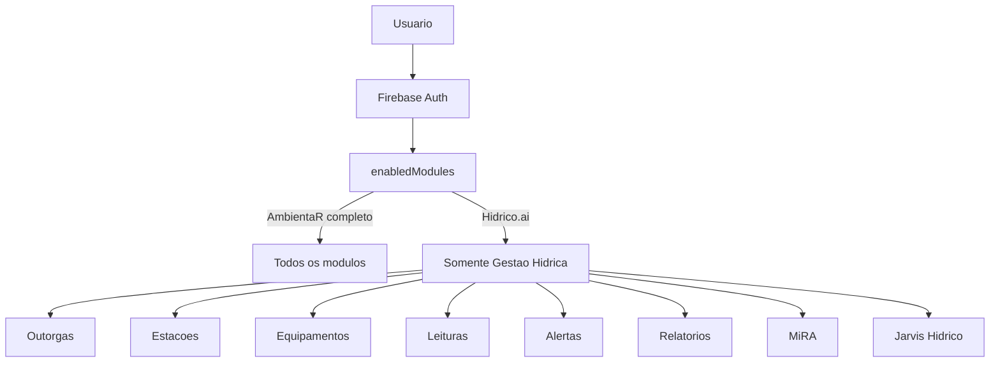

# ARQUITETURA SUGERIDA — AMBIENTAR MODULAR / MONOREPO / `@ambientar/web`

> Projeto: AmbientaR / EcoGestão MG  
> Objetivo: modularizar o AmbientaR com segurança, reduzir peso por tela, preparar módulos comerciais isoláveis e permitir evolução do Hídrico.ai dentro da mesma plataforma.

---

## 1. Diagnóstico executivo

O AmbientaR deixou de ser apenas uma aplicação Next.js de gestão ambiental. Ele já se comporta como uma **plataforma modular**.

O mapa atual demonstra uma aplicação com:

```text
237 rotas URL únicas
259 page.tsx
157 componentes em src/components
205 componentes co-localizados em app
97 API routes
24 rotas com modal intercepting
```

Isso exige uma arquitetura que permita:

```text
crescer sem duplicar código
reduzir bundle por tela
carregar módulos pesados sob demanda
vender módulos separados
evitar quebra em produção
manter compatibilidade com Firebase/Firestore atual
```

---

## 2. Princípio central

A recomendação é:

```text
Não reescrever.
Não criar outro sistema.
Não mover tudo de uma vez.
Modularizar progressivamente.
```

O AmbientaR deve virar um **monorepo modular**, mas com migração incremental.

---

## 3. Arquitetura-alvo

```mermaid
flowchart TB
  subgraph Apps[Apps]
    A[apps/ambientar - AmbientaR completo]
    H[apps/hidrico-ai - futuro app standalone opcional]
    P[apps/portal-cliente - futuro app opcional]
  end

  subgraph Core[Core leve]
    W[@ambientar/web - UI + utils + hooks + tipos leves]
  end

  subgraph Domain[Pacotes de dominio]
    F[@ambientar/web-financial - Financeiro]
    S[@ambientar/web-studies - Estudos Tecnicos]
    D[@ambientar/web-documents - Documentos Ambientais]
    C[@ambientar/web-crm - CRM]
    T[@ambientar/web-telemetry - AmbientaR Hidrico / Hidrico.ai]
  end

  subgraph Heavy[Pacotes pesados sob demanda]
    M[@ambientar/web-maps - Mapas / georreferenciamento]
    PDF[@ambientar/web-pdf - PDF / DOCX / XLSX]
    AI[@ambientar/web-ai - Jarvis / RAG / IA]
  end

  A --> W
  H --> W
  P --> W

  A --> F
  A --> S
  A --> D
  A --> C
  A --> T
  A --> M
  A --> PDF
  A --> AI

  H --> T
  H --> AI
  H --> M

  P --> D
```

---

## 4. Estrutura de pastas recomendada

### 4.1 Fase inicial conservadora

Na primeira etapa, **não mover o app para `apps/ambientar` ainda**.

Criar apenas:

```text
packages/
  web/
```

Mantendo:

```text
src/
  app/
  components/
  lib/
  hooks/
  firebase/
```

### 4.2 Fase madura

Depois da Fase 0 e da tela piloto:

```text
apps/
  ambientar/
    src/
      app/
      firebase/
      ai/
    next.config.mjs
    apphosting.yaml

packages/
  web/
  web-financial/
  web-studies/
  web-documents/
  web-crm/
  web-maps/
  web-pdf/
  web-ai/
  web-telemetry/
```

---

## 5. O que cada pacote deve conter

## 5.1 `@ambientar/web` — core leve

### Função

Biblioteca base compartilhada.

### Pode conter

```text
ui/*
page-header
card-search-input
form/br-date-input
form/brl-currency-input
utils
masks
types leves
hooks básicos
toasts
menu helpers
role helpers
feature flags
```

### Não pode conter

```text
leaflet
react-leaflet
@turf/turf
shpjs
pdfjs-dist
pdf-parse
docx
jspdf
mammoth
genkit
firebase-admin
componentes de RCA
componentes de mapas
componentes de IA
componentes de telemetria
```

### Motivo

Esse pacote será importado por quase tudo. Se ele ficar pesado, toda a plataforma ficará pesada.

---

## 5.2 `@ambientar/web-financial`

### Base atual

O módulo financeiro possui aproximadamente 40 rotas.

Inclui:

```text
clients
contracts
invoices
cash-flow
suppliers
services
financial/painel
financial/abc-curve
financial/dre-contabil
financial/projetos-roi
```

### Deve conter

```text
tabelas financeiras
forms financeiros
dashboards financeiros
cards de ROI
DRE
ABC
fluxo de caixa
```

### Não migrar na Fase 0

É um módulo grande e muito conectado. Deve ser migrado depois da validação do core.

---

## 5.3 `@ambientar/web-studies`

### Base atual

O módulo Estudos Técnicos possui aproximadamente 89 rotas, sendo o maior conjunto do sistema.

Inclui:

```text
RCA
PCA
PTRF
PRADA
PIA
EIA/RIMA
fauna
inventário
barragens
cavidades
educação ambiental
outorgas em estudos
relatórios diversos
```

### Diagnóstico

Esse módulo precisa de pacote próprio. Não deve entrar no core.

### Futuro

```text
@ambientar/web-studies
```

deve conter:

```text
study-documents-list-page
study-dynamic-creation-page
study-dynamic-edit-page
study-branded-export-buttons
study-document-row-actions
dynamic-study-form
schemas de estudos
componentes de RCA
componentes de PIA/PRADA/PTRF/PCA
```

---

## 5.4 `@ambientar/web-documents`

### Base atual

Documentos Ambientais possui:

```text
licenses
outorgas
monitoring/manual
monitoring/telemetric
compliance
car
fauna
intervencoes
usos-insignificantes
pasta-cliente
```

### Deve conter

```text
listas de documentos ambientais
forms de licenças
forms de outorgas
condicionantes
monitoramento manual
monitoramento telemétrico básico
upload/preview de anexos
```

### Relação com telemetria

O pacote `web-documents` pode exibir uma outorga e chamar o pacote `web-telemetry` quando o módulo hídrico estiver habilitado.

---

## 5.5 `@ambientar/web-telemetry`

### Função

Pacote do **AmbientaR Hídrico / Hídrico.ai**.

### Deve conter

```text
telemetry_stations
telemetry_devices
telemetry_readings
telemetry_alerts
telemetry_exports
telemetry_reports
dashboard hídrico
estações
equipamentos
leituras
alertas
MiRA
Jarvis Hídrico
```

### Deve ser carregado apenas quando

```text
enabledModules inclui waterTelemetry
```

ou rota hídrica for acessada.

### Estrutura sugerida

```text
packages/web-telemetry/src/
  components/
    HydricDashboard.tsx
    TelemetryStationList.tsx
    TelemetryDeviceList.tsx
    TelemetryReadingsTable.tsx
    TelemetryAlertsPanel.tsx
    MiraExportsPanel.tsx
  models/
    telemetry-station.ts
    telemetry-device.ts
    telemetry-reading.ts
    telemetry-alert.ts
  services/
    telemetry-service.ts
    mira-export-service.ts
  hooks/
    useTelemetryStations.ts
    useTelemetryReadings.ts
```

---

## 5.6 `@ambientar/web-maps`

### Base atual

Há rotas e componentes de georreferenciamento, análise ambiental, mapas de estudos e MCA.

### Deve conter

```text
Leaflet
Google Maps
Turf
GeoJSON
SHP
mapas ambientais
mapas de estudo
mca
georreferenciamento
```

### Regra obrigatória

Sempre usar import dinâmico:

```ts
const MapView = dynamic(() => import("@ambientar/web-maps/map-view"), {
  ssr: false,
});
```

---

## 5.7 `@ambientar/web-pdf`

### Deve conter

```text
PDF generation
DOCX generation
XLSX export
templates
attachment preview avançado
relatórios
```

### Regra

Usar somente sob demanda:

```ts
const { generateReport } = await import("@ambientar/web-pdf");
```

---

## 5.8 `@ambientar/web-ai`

### Deve conter

```text
ai-router
prompts
tipos de tarefa IA
cliente API IA
Jarvis Ambiental
Jarvis Hídrico
RAG UI leve
```

### Não deve conter no client

```text
firebase-admin
chaves
Genkit server
modelos diretamente importados
```

A IA pesada deve ficar em API routes/server.

---

## 6. Matriz de prioridade de migração

| Prioridade | Área | Ação |
|---|---|---|
| 1 | Core UI | Extrair UI leve |
| 2 | Utils/Types | Extrair utilitários e tipos |
| 3 | Tela piloto pequena | Validar arquitetura |
| 4 | Menus/Feature flags | Preparar módulos comerciais |
| 5 | Documentos Ambientais | Refatorar outorgas/monitoramento |
| 6 | Telemetria | Criar AmbientaR Hídrico |
| 7 | Mapas | Isolar pacote pesado |
| 8 | PDF/DOCX/XLSX | Isolar exportações |
| 9 | IA | Isolar Jarvis/RAG |
| 10 | Estudos Técnicos | Migrar por submódulos |
| 11 | Financeiro | Migrar depois do core estável |

---

## 7. Melhor tela piloto

O diagnóstico mostrou que `/users` não é tão simples quanto parecia, pois envolve:

```text
admin/firebase-admin-setup-help
delegate-access-portfolio-card
delegate-invite-panel
platform-subscription-contract/acceptance-viewer
alert-dialog
badges
botões
tabelas
```

Portanto, **não começar por `/users`**.

### Telas melhores para piloto

1. `/settings/appearance`
2. `/forgot-password`
3. `/offline`
4. `/politica-privacidade`
5. `/clients/new`, somente se o formulário estiver controlado

### Recomendação final

Começar por:

```text
/settings/appearance
```

Motivos:

```text
rota autenticada
baixo risco
poucos componentes
não mexe em dados críticos
valida layout autenticado
```

---

## 8. Ordem de implantação

## Fase M0 — Baseline

Executar:

```bash
npm run typecheck
npm run lint
npm run build
npm run apphosting:check
```

Gerar:

```text
docs/auditorias/monorepo/baseline.md
```

---

## Fase M1 — Criar `packages/web`

Criar:

```text
packages/web
```

com:

```text
package.json
tsconfig.json
src/index.ts
src/components/ui
src/lib
src/hooks
```

---

## Fase M2 — Copiar, não mover

Copiar inicialmente:

```text
src/components/ui/button.tsx
src/components/ui/input.tsx
src/components/ui/card.tsx
src/components/ui/badge.tsx
src/components/page-header.tsx
src/components/card-search-input.tsx
src/lib/utils.ts
src/lib/masks.ts
```

Não apagar originais.

---

## Fase M3 — Exportação seletiva

Evitar exportar tudo de uma vez.

Preferir:

```ts
export * from "./components/ui/button";
export * from "./components/ui/input";
export * from "./components/ui/card";
export * from "./components/page-header";
export * from "./lib/utils";
export * from "./lib/masks";
```

---

## Fase M4 — Migrar tela piloto

Migrar `/settings/appearance`.

Antes:

```text
src/app/(app)/settings/appearance/page.tsx
```

Depois:

```tsx
import { AppearanceSettingsPage } from "@ambientar/web/settings";

export default function Page() {
  return <AppearanceSettingsPage />;
}
```

---

## Fase M5 — Medir resultado

Rodar:

```bash
npm run typecheck
npm run lint
npm run build
npm run apphosting:check
```

Registrar:

```text
docs/auditorias/monorepo/fase-m5-resultado.md
```

---

## Fase M6 — Menu e feature flags

Extrair parcialmente:

```text
navigation-config
route-access
module permissions
enabledModules
```

Sem alterar regras de segurança ainda.

---

## Fase M7 — Criar `@ambientar/web-telemetry`

Antes de mover outras áreas grandes, criar o pacote novo do AmbientaR Hídrico, porque ele nasce modular desde o começo.

---

## Fase M8 — Isolar mapas

Criar:

```text
@ambientar/web-maps
```

Mover somente componentes de mapa e usar dynamic import.

---

## Fase M9 — Isolar PDF

Criar:

```text
@ambientar/web-pdf
```

Mover geração/exportação pesada.

---

## Fase M10 — Estudos Técnicos

Migrar por submódulo:

```text
RCA
PCA
PRADA
PIA
Fauna
Inventário
Barragens
Cavidades
```

Não migrar tudo junto.

---

## 9. Regras de segurança arquitetural

## 9.1 Nunca importar pacotes pesados no core

Proibido em `@ambientar/web`:

```text
leaflet
react-leaflet
@turf/turf
shpjs
pdfjs-dist
pdf-parse
docx
jspdf
mammoth
genkit
firebase-admin
```

## 9.2 Nunca mudar Firestore junto com monorepo

Alterações de banco devem ser PRs separados.

## 9.3 Nunca migrar tela crítica sem teste

Telas críticas:

```text
outorgas
clients
invoices
contracts
projects
studies
users
```

## 9.4 Feature flag não é segurança

Feature flag oculta UI, mas a segurança real precisa continuar em:

```text
Firestore Rules
API server checks
roles
approvedUserIds
ownerUserId
portalUserIds
```

---

## 10. Arquitetura modular para vender Hídrico.ai

O AmbientaR Hídrico deve nascer como módulo interno, não como sistema separado.



### Exemplo de usuário Hídrico.ai

```ts
enabledModules: [
  "dashboard",
  "waterResources",
  "waterTelemetry",
  "mira",
  "ai"
]
```

### Menu exibido

```text
Painel Hídrico
Outorgas
Estações
Equipamentos
Leituras
Alertas
Relatórios
Exportações MiRA
Jarvis Hídrico
```

### Menu oculto

```text
CRM
Financeiro completo
Estudos técnicos completos
Georreferenciamento avançado
Configurações administrativas
```

---

## 11. Rotas atuais relevantes para Hídrico.ai

A base atual já possui:

```text
/outorgas
/monitoring
/monitoring/manual
/monitoring/telemetric
/studies/outorgas
```

A arquitetura sugere criar futuramente:

```text
/water
/water/dashboard
/water/outorgas
/water/stations
/water/devices
/water/readings
/water/alerts
/water/reports
/water/mira
/water/jarvis
```

Ou, se quiser preservar menu atual:

```text
/documentos-ambientais/outorgas/hidrico
```

### Recomendação

Criar rotas novas sob:

```text
/water
```

e manter links no menu Documentos Ambientais.

---

## 12. Roadmap do AmbientaR Hídrico no monorepo

## H1 — Modelos

```text
telemetry_stations
telemetry_devices
telemetry_readings
telemetry_alerts
telemetry_exports
telemetry_reports
```

## H2 — UI básica

```text
Dashboard Hídrico
Estações
Equipamentos
Leituras
Alertas
```

## H3 — API

```text
/api/telemetry/ingest
/api/telemetry/devices
/api/telemetry/stations
```

## H4 — Relatórios

```text
PDF
XLSX
Resumo diário
Resumo mensal
Condicionantes
```

## H5 — MiRA

```text
miraStationId
miraPointCode
telemetry_exports
retry
accepted/rejected
```

## H6 — Jarvis Hídrico

```text
risco de excesso
risco de escassez
falha de equipamento
recomendação
resumo mensal
parecer técnico
```

---

## 13. Checklist para Cursor AI

Antes de qualquer alteração:

```text
[ ] Criar branch
[ ] Rodar baseline
[ ] Criar documentação da fase
[ ] Não mover src/app
[ ] Não alterar Firestore
[ ] Não alterar rules
[ ] Não remover componente antigo antes do build
```

Depois de cada fase:

```text
[ ] npm run typecheck
[ ] npm run lint
[ ] npm run build
[ ] npm run apphosting:check
[ ] testar tela desktop
[ ] testar tela mobile
[ ] conferir menu
[ ] conferir login
```

---

## 14. Conclusão

A arquitetura sugerida é:

```text
AmbientaR como plataforma principal
+
@ambientar/web como core leve
+
pacotes de domínio por módulo
+
subpacotes pesados sob demanda
+
Hídrico.ai como módulo interno inicialmente
+
possível app standalone futuro
```

Essa abordagem preserva o que já existe, reduz o risco de quebra, melhora performance e cria base comercial para vender módulos separados.
