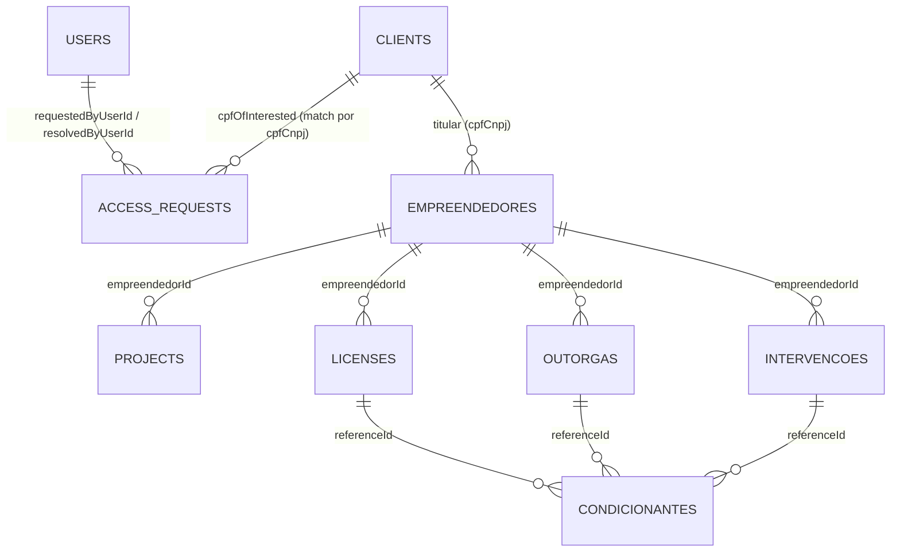
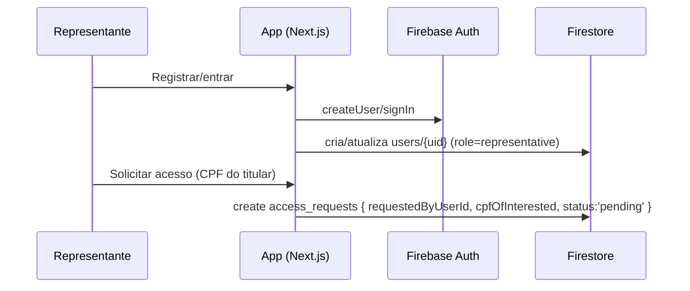
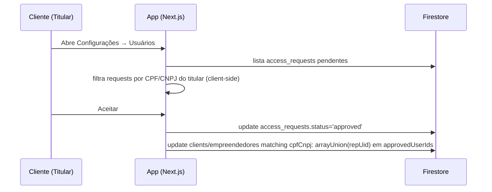
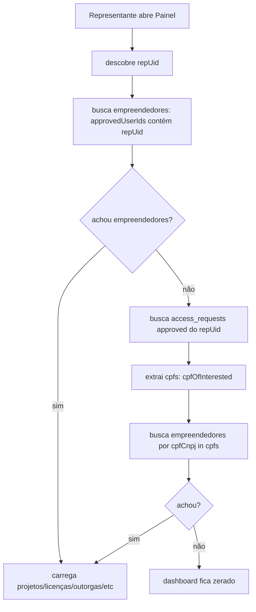

# AmbientaR (EcoGestão MG) — Arquitetura Atual (como está hoje)

Data: 2026-03-30  
Stack: Next.js 14 (App Router) + Firebase (Auth, Firestore, Storage) + PWA

---

## Atualizações recentes (até 30/03/2026)

- **Novo role**: `advogado` incluído no sistema.
- **Novo menu principal**: `Autos de Infração - Defesa` (acesso `admin`).
- **Novo submenu financeiro**: `Contratos-Fornecedores` (`/contracts-suppliers`), com:
  - contratante preenchido por `Configurações > Informações da Empresa`,
  - prestador selecionado de `Financeiro > Fornecedores`,
  - numeração sequencial `CFS-0001/ANO`,
  - exportação em PDF,
  - separação por status (em gerenciamento/finalizados),
  - upload de contrato assinado (`fileUrl`).
- **Admin total**:
  - bypass de rota no front para `admin` em `src/lib/route-access.ts`,
  - catch-all admin no Firestore rules (`match /{document=**}`).
- **Busca padronizada em cards/listagens**:
  - componente reutilizável `src/components/card-search-input.tsx`,
  - aplicado em módulos de gestão (ex.: processos, usos insignificantes, licenças, outorgas, DAIA, clientes, empreendedores, projetos, relatórios de campo, condicionantes, contratos).
- **Sidebar desktop adaptativa**:
  - largura lateral passa a se reajustar para acomodar textos de submenu sem truncar.

---

## Visão geral (alto nível)

- **Frontend**: Next.js (rotas em `src/app/`), UI em PT-BR.
- **Autenticação**: Firebase Auth (client-side).
- **Usuário do app (perfil/role)**: documento `users/{uid}` no Firestore (carregado no provider).
- **Dados**: Firestore (coleções: `clients`, `empreendedores`, `projects`, `licenses`, `outorgas`, `intervencoes`, `condicionantes`, `access_requests`, etc.).
- **Acesso por perfil**: hoje é uma combinação de:
  - **UI (menu)** filtra itens por `roles`.
  - **Guards client-side** (layout e algumas páginas).
  - **Queries do Firestore no front** (ex.: `where('approvedUserIds','array-contains', repUid)`).
  - **Regras do Firestore (deploy)**: para muitas coleções, leitura está liberada para qualquer autenticado; a segmentação “real” acontece no front.

---

## Papéis (roles)

Definidos em `src/lib/types.ts`:

- `admin`
- `supervisor`
- `financial`
- `sales`
- `technical`
- `gestor`
- `diretor_fauna`
- `client` (titular)
- `representative` (representante)

Fonte da verdade do role: campo `role` em `users/{uid}`.

Fallback: se não existir `users/{uid}`, o provider cria e define:
- `admin` apenas para e-mail `adm@adm.com`
- senão `client`

---

## Autenticação e sessão (FirebaseProvider)

Arquivo principal: `src/firebase/provider.tsx`

- Faz `onAuthStateChanged(auth, ...)`.
- Carrega `users/{uid}` e popula `ctx.user`.
- Faz redirects:
  - Sem usuário autenticado: empurra para `/login` (exceto rotas públicas).
  - Autenticado tentando `/login`/`/register`/`/forgot-password`: redireciona para `/`.

Fluxo (simplificado):

```mermaid
flowchart TD
  A[App inicia] --> B[FirebaseProvider monta]
  B --> C{onAuthStateChanged: tem firebaseUser?}
  C -- não --> D[ctx.user = null; isInitialized=true]
  D --> E{rota é pública?}
  E -- não --> F[redirect /login]
  E -- sim --> G[render]
  C -- sim --> H[ler Firestore users/uid]
  H --> I{doc existe?}
  I -- sim --> J[ctx.user = AppUser do Firestore]
  I -- não --> K[cria users/uid com role default]
  J --> L[isInitialized=true]
  K --> L
  L --> M{rota é /login|/register|/forgot?}
  M -- sim --> N[redirect /]
  M -- não --> O[render]
```

---

## Navegação (menus e submenus)

Arquivos principais:
- **Config**: `src/lib/navigation-config.ts` (`allNavItems`)
- **Render/filtragem**: `src/components/nav-content.tsx`

Regra: um item aparece se:
- não tem `roles`, ou
- `roles.includes(user.role)`

Filtragem é recursiva (submenus).

### Mobile bottom-nav

Arquivo: `src/app/(app)/layout.tsx`

Foi ajustado para **filtrar por role usando o mesmo critério do menu**, evitando mostrar atalhos que o perfil não deve acessar.

---

## Guard de acesso por rota (evita “furar” via URL)

Arquivo: `src/lib/route-access.ts`
- Faz “match” do pathname com o `href` mais específico do menu.
- Se a rota existir no menu e tiver `roles`, valida o role.
- Se a rota **não estiver no menu**, não bloqueia (evita quebrar rotas internas/dinâmicas).

Aplicação: `src/app/(app)/layout.tsx`
- Se `user.role` não puder acessar o `pathname`, faz `router.replace('/')`.

Fluxo:

```mermaid
flowchart TD
  A[Usuário autenticado] --> B[entra em rota dentro de (app)]
  B --> C[layout.tsx verifica role x pathname]
  C --> D{rota mapeada no menu e roles restringem?}
  D -- não --> E[permitir render]
  D -- sim --> F{role permitido?}
  F -- sim --> E
  F -- não --> G[redirect /]
```

---

## Modelo de dados (conceitual)

Principais entidades (visão simplificada):



Campos de autorização importantes:
- `clients.approvedUserIds[]`
- `empreendedores.approvedUserIds[]`
- `access_requests.status` (`pending|approved|rejected`)
- `access_requests.requestedByUserId` (representante)
- `access_requests.cpfOfInterested` (titular)

---

## Como cada perfil “enxerga” os dados

### Perfil `client` (titular)

Padrão: encontrar `empreendedores` do titular e derivar o resto:
- `empreendedores` por `cpfCnpj in [cpf, ...cnpjs]` (ou variações)
- `projects/licenses/outorgas/intervencoes` por `empreendedorId in [ids]`
- `condicionantes` por `referenceId in [...]` em lotes de 10

Arquivos típicos:
- `src/app/(app)/dashboards/client-dashboard.tsx`
- `src/app/(app)/empreendedores/page.tsx`
- `src/app/(app)/projects/page.tsx`
- `src/app/(app)/licenses/page.tsx`, `outorgas/page.tsx`, `intervencoes/page.tsx`, `compliance/page.tsx`

### Perfil `representative` (representante)

Padrão: acessar apenas titulares que aprovaram o acesso.

1) Caminho principal:
- `approvedUserIds array-contains repUid` em `clients` e `empreendedores`

2) Fallback (quando `approvedUserIds` não foi gravado corretamente):
- buscar `access_requests` do representante com `status == 'approved'`
- extrair `cpfOfInterested`
- localizar `empreendedores`/`clients` por `cpfCnpj in [cpfOfInterested...]`

Arquivo: `src/app/(app)/dashboards/client-dashboard.tsx`

---

## Fluxos principais (ações do sistema)

### 1) Cadastro de representante + solicitação de acesso

Arquivos:
- `src/app/register/page.tsx` (cria `access_requests`)
- `src/app/(app)/users/user-form.tsx` (pode criar pedidos também)



### 2) Titular (cliente) aceita/recusa solicitação

Arquivo: `src/app/(app)/users/page.tsx`



### 3) Painel do representante “espelha” o do cliente

Arquivo: `src/app/(app)/dashboards/client-dashboard.tsx`



---

## Regras do Firestore (deploy) — observação importante

Arquivo usado no deploy: `src/firebase/rules/firestore.rules` (via `firebase.json`).

Para várias coleções “core” (ex.: `clients`, `empreendedores`, `projects`, `licenses`, `outorgas`, `intervencoes`, `access_requests`) a leitura está, em geral, como **“qualquer autenticado pode ler”**.  
Isso significa que:

- **O “escopo” por perfil (cliente x representante)** está sendo imposto principalmente por **queries do front** e não por regras de segurança.
- Se vocês quiserem “fechar” segurança de fato, o próximo passo é endurecer regras (ex.: exigir `userId`, ou CPF/CNPJ pertencente ao usuário, ou `approvedUserIds`).

---

## Como exportar este documento para PDF (opções práticas)

- **Opção 1 (mais simples)**: abrir `docs/ARQUITETURA_ATUAL.md` no Cursor/VS Code e usar **Print** do preview (ou export do editor) para PDF.
- **Opção 2 (CLI)**: instalar uma ferramenta de conversão e gerar PDF:

```bash
npx --yes markdown-pdf "docs/ARQUITETURA_ATUAL.md"
```

Se você quiser, eu também posso criar um script `scripts/exportar-arquitetura-pdf.ps1` para automatizar no Windows, e/ou gerar uma versão HTML “bonita” para imprimir.

