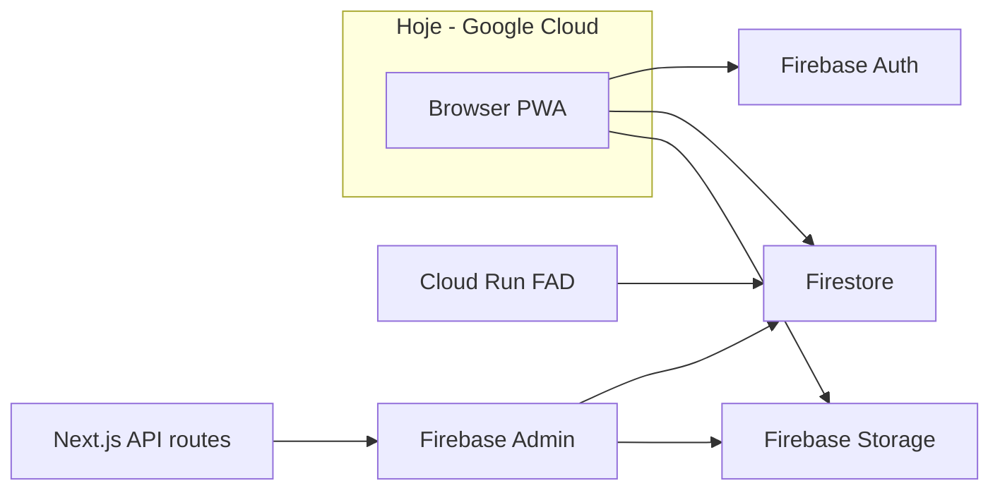
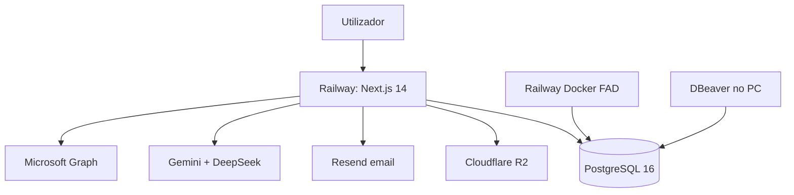
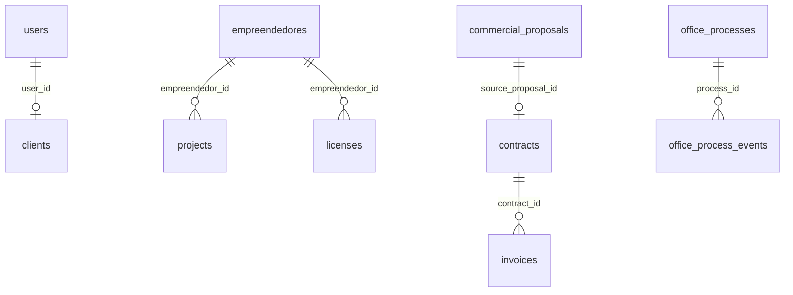

# Migração AmbientaR: Google Cloud → PostgreSQL + Railway

**Projeto:** EcoGestão MG (AmbientaR)  
**Versão do documento:** 1.0  
**Data:** junho de 2026  
**Estado:** Planeamento — migração faseada (produção continua no Firebase até cutover)

---

## Índice

1. [Resumo executivo](#1-resumo-executivo)
2. [Situação atual](#2-situação-atual)
3. [Por que mudar](#3-por-que-mudar)
4. [Ganhos no banco de dados (geral)](#4-ganhos-no-banco-de-dados-geral)
5. [Ganhos por módulo da app (14 áreas)](#5-ganhos-por-módulo-da-app-14-áreas)
6. [Stack recomendada](#6-stack-recomendada)
7. [Hospedagem e custos](#7-hospedagem-e-custos)
8. [Princípios da migração](#8-princípios-da-migração)
9. [Modelo de dados PostgreSQL](#9-modelo-de-dados-postgresql)
10. [O que substituir além do banco](#10-o-que-substituir-além-do-banco)
11. [Roadmap — 7 fases](#11-roadmap--7-fases)
12. [Decisões técnicas](#12-decisões-técnicas)
13. [Riscos e mitigações](#13-riscos-e-mitigações)
14. [Primeiros passos](#14-primeiros-passos)
15. [O que não fazer no início](#15-o-que-não-fazer-no-início)
16. [Referências no repositório](#16-referências-no-repositório)

---

## 1. Resumo executivo

A AmbientaR é uma aplicação **Next.js 14** com ~286 páginas e ~143 rotas API, hoje acoplada ao **Google Cloud / Firebase** (Auth, Firestore, Storage, App Hosting, Cloud Run).

**Objectivo:** sair do Google Cloud, consolidar os dados em **PostgreSQL** (modelo relacional — linhas e colunas, como planilha) e hospedar em **Railway** + **Cloudflare R2**, com migração **faseada** (a app continua a funcionar durante a transição).

| Aspecto | Hoje | Alvo |
|---------|------|------|
| Banco | Firestore (~80 coleções, documentos JSON) | PostgreSQL 16 (+ PostGIS, pgvector) |
| Auth | Firebase Auth | Auth.js + tabela `users` |
| Ficheiros | Firebase Storage | Cloudflare R2 |
| Hosting | Firebase App Hosting / Cloud Run | Railway (Next.js standalone) |
| ORM | Firebase SDK no browser | Drizzle ORM no servidor |
| Custo | Variável (Blaze — por leitura/egress) | Previsível (~US$ 40–130/mês) |

**Estimativa:** 8–12 meses (1 dev parcial) ou 4–6 meses (dedicação forte).

**Recomendação de hospedagem inicial:** Railway + R2 + Drizzle + Auth.js (Cenário A).

---

## 2. Situação atual



- **Firestore** é o banco principal: ~80 coleções de topo + subcoleções.
- A UI lê/escreve **directamente no browser** via `useCollection`, `useDoc`, listeners em tempo real.
- O servidor usa **Firebase Admin** para auth, storage e operações privilegiadas.
- Regras de segurança: `src/firebase/rules/firestore.rules` (~1400 linhas).
- **Precedente PostgreSQL** já no repo: `infra/legislation-pipeline/` com `schema.sql` e **pgvector** para RAG legislativo.

---

## 3. Por que mudar

### 3.1 Custo e previsibilidade

| Componente GCP/Firebase | Como cobra | Impacto na AmbientaR |
|-------------------------|------------|----------------------|
| Firestore | Por leitura, escrita, armazenamento | Cada página dispara dezenas de leituras; PWA multiplica |
| Firebase Storage | Armazenamento + download (egress) | PDFs, fotos, mapas, contratos |
| App Hosting | Cloud Run + tráfego | 143 APIs precisam instância disponível |
| Cloud Run (FAD) | CPU/memória por segundo | GDAL e satélite são pesados |
| Cloud Functions | Invocações + tempo | Telemetria |

| Modelo | Custo típico/mês | Previsibilidade |
|--------|------------------|-----------------|
| Firebase Blaze | US$ 50–300+ (variável) | Baixa |
| Railway (app + Postgres) | US$ 20–80 | Alta |
| Cloudflare R2 | US$ 1–10 | Muito alta |
| APIs IA (Gemini/DeepSeek) | US$ 5–30 | Igual em qualquer cloud |

**Conclusão:** no médio/longo prazo paga-se capacidade fixa em vez de pagar cada leitura Firestore ou cada download de PDF.

### 3.2 Firestore ≠ planilha; PostgreSQL = linhas e colunas

| | Firestore (Google) | PostgreSQL (SQL) |
|---|-------------------|------------------|
| Modelo mental | Pastas de documentos JSON | Tabelas = planilhas; linhas = registos; colunas = campos |
| Estrutura | Coleções → documentos → subcoleções | Tabelas com chaves (`empreendedor_id`, `project_id`) |
| Consultas | Sem JOIN nativo | SQL completo |
| Integridade | Não impede órfãos nem duplicados | Foreign keys, UNIQUE, transações ACID |
| Ver dados | Console Firebase (JSON) | DBeaver, Beekeeper, pgAdmin — grelha Excel |
| Relatórios | Várias queries + código JS | Uma query SQL ou view |

**Exemplo:**

```sql
-- Faturas de um contrato (filtrar como planilha)
SELECT i.numero, i.valor, i.vencimento
FROM invoices i
JOIN contracts c ON i.contract_id = c.id
WHERE c.empreendedor_id = '...';
```

Formulários ambientais (PRADA, RCA) usam coluna `data jsonb` para flexibilidade; metadados (cliente, status, datas) ficam em **colunas fixas**.

---

## 4. Ganhos no banco de dados (geral)

### 4.1 Operação do dia a dia

| Ganho | Firestore | PostgreSQL |
|-------|-----------|------------|
| Ver dados | JSON aninhado no console | Grelha linha × coluna no DBeaver |
| Exportar | Script por coleção | CSV/Excel de qualquer tabela |
| Procurar | Limitado | `WHERE nome ILIKE '%...%'` |
| Backup | Gerido Google | `pg_dump` — ficheiro seu, portável |

### 4.2 Integridade

- **Foreign keys** — fatura só liga a contrato existente
- **UNIQUE(email)** — sem contas duplicadas
- **Transações ACID** — contrato + fatura gravam juntos ou nenhum grava

### 4.3 Relatórios SQL

```sql
-- Licenças a vencer em 90 dias com valor em aberto
SELECT e.razao_social, l.numero, l.validade, SUM(i.valor) AS em_aberto
FROM licenses l
JOIN empreendedores e ON l.empreendedor_id = e.id
LEFT JOIN contracts c ON c.empreendedor_id = e.id
LEFT JOIN invoices i ON i.contract_id = c.id AND i.status = 'pendente'
WHERE l.validade BETWEEN CURRENT_DATE AND CURRENT_DATE + INTERVAL '90 days'
GROUP BY e.razao_social, l.numero, l.validade
ORDER BY l.validade;
```

### 4.4 Custo de leitura

| Situação | Firestore | PostgreSQL |
|----------|-----------|------------|
| Lista de 50 licenças | Até 50 leituras facturadas | 1 query, sem cobrança por linha |
| Dashboard 5 coleções | 5+ round-trips | 1–2 queries com JOIN |
| Recarregar página | Repete leituras | Mesma query, custo fixo servidor |

### 4.5 Extensões exclusivas do Postgres

| Extensão | Uso na AmbientaR |
|----------|------------------|
| **PostGIS** | Mapas, CAR, MCA, coordenadas SIRGAS |
| **pgvector** | Biblioteca IA / RAG unificada |
| **pg_trgm** | Busca por nome de cliente, processo |
| **jsonb + GIN** | Formulários flexíveis e filtráveis |

### 4.6 Portabilidade

- `pg_dump` → restaurar em Railway, Neon, Azure, VPS
- Power BI, Metabase, Excel ligam por JDBC
- Dados **não presos** ao ecossistema Firebase

### 4.7 O que NÃO melhora de imediato

- Tempo real (chat) — precisa WebSockets/SSE na Fase 7
- Offline PWA — reescrever fila Dexie na Fase 7
- Esforço inicial alto — ganhos aparecem módulo a módulo
- Formulários 100% em colunas — jsonb continua onde a norma muda

### 4.8 Prioridades de ganho

| Prioridade | Ganho |
|------------|--------|
| **Alta** | Grelha + export Excel/CSV |
| **Alta** | Relatórios SQL (financeiro, compliance) |
| **Alta** | Custo previsível |
| **Média** | Integridade CRM ↔ contratos ↔ licenças |
| **Média** | PostGIS + pgvector unificados |
| **Média** | Independência do Google (`pg_dump`) |
| **Longo prazo** | Migrations versionadas |

---

## 5. Ganhos por módulo da app (14 áreas)

### Módulo 1 — Utilizadores e portal (Fase 0–1)

| | |
|---|---|
| **Rotas** | `/login`, `/register`, `/settings`, portal cliente |
| **Firestore** | `users`, `access_requests`, `delegate_invites`, `consultor_assignments` |
| **Postgres** | Mesmas entidades em snake_case |

**Ganhos:** grelha de roles; `UNIQUE(email)`; FK consultor ↔ titular; auditoria de pedidos de acesso.

```sql
SELECT u.email, u.role, e.razao_social
FROM consultor_assignments ca
JOIN users u ON ca.consultor_user_id = u.id
JOIN empreendedores e ON ca.empreendedor_id = e.id
WHERE ca.status = 'ativo';
```

---

### Módulo 2 — Cadastro técnico (Fase 1)

| | |
|---|---|
| **Rotas** | `/empreendedores`, `/projects`, `/clients`, `/technical-responsible` |
| **Firestore** | `empreendedores`, `projects`, `clients`, `technicalResponsibles`, `environmentalCompanies`, `companySettings` |

**Ganhos:** hub `empreendedor_id` em dezenas de tabelas; export CSV da carteira; `UNIQUE(cnpj/cpf)`.

---

### Módulo 3 — CRM e comercial (Fase 2)

| | |
|---|---|
| **Firestore** | `opportunities`, `commercialProposals`, `proposals` (legado) |

**Ganhos:** funil comercial `GROUP BY status`; proposta → contrato com FK; taxa de conversão em SQL.

---

### Módulo 4 — Financeiro (Fase 2) — **maior ganho**

| | |
|---|---|
| **Rotas** | `/financial`, contratos, faturas, conciliação, export contábil, ROI |
| **Firestore** | `contracts`, `invoices`, `revenues`, `expenses`, `fornecedores`, `project_roi_cases`, … |

**Ganhos:** transações ACID; fluxo de caixa; export contábil CSV; ROI com `project_roi_time_entries`; PDFs no R2.

```sql
SELECT DATE_TRUNC('month', vencimento) AS mes,
       SUM(valor) FILTER (WHERE status = 'paga') AS recebido,
       SUM(valor) FILTER (WHERE status = 'pendente') AS em_aberto
FROM invoices
WHERE vencimento >= DATE_TRUNC('year', CURRENT_DATE)
GROUP BY 1 ORDER BY 1;
```

---

### Módulo 5 — Licenciamento (Fase 3)

| | |
|---|---|
| **Firestore** | `licenses`, `requests`, `condicionantes`, `intervencoes`, `inspections`, `autoInfracaoDefesas` |

**Ganhos:** view `v_licencas_vencendo`; condicionantes integradas; portal cliente com `WHERE empreendedor_id IN (...)`.

---

### Módulo 6 — Recursos hídricos (Fase 3)

| | |
|---|---|
| **Firestore** | `outorgas`, `outorga_processos`, `telemetryReadings`, … |

**Ganhos:** séries temporais indexadas; API `/api/telemetry/ingest` substitui Cloud Function.

---

### Módulo 7 — Estudos ambientais (Fase 4)

| | |
|---|---|
| **Firestore** | `pradas`, `ptrfs`, `rcas`, `pcas`, `pias`, `eiaRimas`, … |

**Ganhos:** colunas fixas + `data jsonb`; listar estudos por status/cliente sem baixar JSON completo.

---

### Módulo 8 — Inventário e coleta de campo (Fase 4)

| | |
|---|---|
| **Firestore** | `inventories`, `inventarios`, `inventario_parcelas`, `inventario_individuos` |

**Ganhos:** hierarquia parcela → indivíduo com FK; offline → API Postgres; corrige gap de regras Firestore em `inventarios`.

---

### Módulo 9 — Geo, MCA, mapas (Fase 5)

| | |
|---|---|
| **Firestore** | `geo_analyses`, `mca_projects`, `car_snapshots`, … |

**Ganhos:** **PostGIS** — `ST_Intersects`, `ST_Area`; impossível no Firestore.

---

### Módulo 10 — Fiscal Ambiental Digital / FAD (Fase 5)

| | |
|---|---|
| **Firestore** | `fad_workspaces` + 9 subcoleções |

**Ganhos:** subcoleções → tabelas com `workspace_id` FK; worker no Railway em vez de Cloud Run.

---

### Módulo 11 — Gestão de processos (Fase 2–3)

| | |
|---|---|
| **Firestore** | `officeProcesses`, `officeTasks`, `oficios`, `appointments` |

**Ganhos:** timeline SEI; numeração de ofícios atómica; agenda com detecção de conflitos.

---

### Módulo 12 — IA, RAG, OneDrive (Fase 6)

| | |
|---|---|
| **Firestore** | `cloud_rag_*`, `mcp_rag_*`, `ai_lab_*` |

**Ganhos:** pgvector unificado com `infra/legislation-pipeline/`; OneDrive mantém-se (só metadados migram).

---

### Módulo 13 — Chat e auditoria (Fase 3–7)

| | |
|---|---|
| **Firestore** | `chats`, `auditLogs`, `users/{uid}/notifications` |

**Ganhos:** `audit_logs` investigável; chat pode precisar SSE/WebSockets.

---

### Módulo 14 — Integrações (Fase 2–6)

| | |
|---|---|
| **Firestore** | `mtrDeclaracoes`, `fornecedores`, `services`, `onedrive_*` |

**Ganhos:** MTR → PDF no R2 + linha SQL; catálogo exportável para propostas.

---

### Mapa módulo → fase

| Módulo | Fase | Ganho principal |
|--------|------|-----------------|
| Utilizadores / cadastro | 1 | Grelha + hub `empreendedor_id` |
| CRM / financeiro | 2 | SQL + transações ACID |
| Licenciamento / água | 3 | Views vencimento + telemetria |
| Estudos / inventário | 4 | jsonb + hierarquia coleta |
| Geo / FAD | 5 | PostGIS + worker Railway |
| IA / RAG | 6 | pgvector unificado |
| Chat / offline | 7 | Cutover + sync API |

---

## 6. Stack recomendada



### Pacotes npm

| Pacote | Função |
|--------|--------|
| `drizzle-orm` + `drizzle-kit` | ORM + migrations |
| `postgres` | Driver Node → Postgres |
| `next-auth` (Auth.js v5) | Login e sessão |
| `@aws-sdk/client-s3` | Upload R2 |
| `bcrypt` / `argon2` | Hash de passwords |
| `zod` | Validação (já no projeto) |
| `swr` / `@tanstack/react-query` | Cache no browser (substitui `useCollection`) |
| `dexie` | Fila offline (mantém) |

### Extensões PostgreSQL

- **pgvector** — RAG / embeddings
- **postgis** — geometrias e mapas
- **pg_trgm** — busca textual

### Ferramentas para ver o banco como planilha

| Ferramenta | Custo |
|------------|-------|
| **DBeaver** | Grátis — recomendado |
| **Beekeeper Studio** | Grátis / Pro |
| **pgAdmin** | Grátis |

---

## 7. Hospedagem e custos

### Comparação de cenários

| Cenário | App | Banco | Ficheiros | Workers | Adequação |
|---------|-----|-------|-----------|---------|-----------|
| **A — Railway + R2** | Railway | Railway Postgres | R2 | Railway Docker | **Começar aqui** |
| B — Vercel + Neon | Vercel | Neon | R2 | Fly.io | Deploy Next simples |
| C — VPS Hetzner | Docker | Mesmo VPS | R2 | Mesmo VPS | Barato em escala; mais manutenção |
| D — Azure BR | App Service | Azure Postgres | Blob | Container Apps | Latência Brasil |

### Explicação das opções

| Opção | Para quem |
|-------|-----------|
| **Railway** | Iniciantes; app + Postgres + workers num painel; deploy por Git |
| **Vercel** | Prioridade máxima em deploy Next.js |
| **Azure** | Ecossistema Microsoft + OneDrive + região São Paulo |
| **VPS + Docker** | Controlo total; aceita manutenção |

### Custo mensal estimado

| | Firebase (crescimento) | Stack nova |
|---|------------------------|------------|
| Banco + app | US$ 40–150+ | US$ 25–60 |
| Ficheiros | US$ 10–50+ | US$ 1–10 |
| Workers FAD | US$ 20–80 | US$ 10–30 |
| IA | US$ 5–30 | US$ 5–30 |
| **Total** | **US$ 75–310+** | **US$ 40–130** |

### Dia a dia no Railway

1. `git push` → deploy automático do Next.js
2. App liga ao Postgres via `DATABASE_URL`
3. Login → Auth.js verifica tabela `users`
4. Ecrã “Licenças” → `GET /api/licenses` → `SELECT` no Postgres
5. PDF → upload R2 → URL na coluna `pdf_storage_key`
6. DBeaver → inspecionar e exportar qualquer tabela

---

## 8. Princípios da migração

1. **Não parar produção** — Firebase é fonte de verdade até cada módulo validado.
2. **API-first** — browser deixa de escrever Firestore directo; substitui `firestore.rules`.
3. **Um ORM, um schema** — Drizzle em `src/db/`.
4. **Tipos existentes como guia** — `src/lib/types.ts` (~100 tipos).
5. **Dual-write temporário** — APIs críticas gravam Firestore + Postgres durante transição.
6. **Offline na Fase 7** — reescrever `src/lib/offline/sync-engine.ts` para API REST.

---

## 9. Modelo de dados PostgreSQL

### Núcleo (Fase 1)

| Domínio | Tabelas | Origem Firestore |
|---------|---------|------------------|
| Identidade | `users`, `access_requests`, `delegate_invites`, `consultor_assignments` | `users`, etc. |
| Cadastro | `empreendedores`, `projects`, `clients`, `technical_responsibles` | coleções homónimas |
| Config | `company_settings` (jsonb) | `companySettings` |

Convenções: `id` UUID; `firebase_uid` nullable na migração; `created_at`/`updated_at`; jsonb para formulários variáveis.

### Operacional (Fases 2–3)

Licenciamento, água, comercial, gestão escritório — ver tabelas na secção 5 e ficheiro de plano interno.

### Estudos e geo (Fases 4–5)

Formulários com jsonb; geometrias PostGIS; FAD/MCA como tabelas relacionais.

### Relacionamentos centrais



---

## 10. O que substituir além do banco

| Serviço GCP/Firebase | Substituto | Impacto |
|---------------------|------------|---------|
| Firestore | PostgreSQL (+ PostGIS, pgvector) | **Maior** |
| Firebase Auth | Auth.js + tabela `users` | Médio |
| Firebase Storage | Cloudflare R2 + presigned URLs | Médio |
| FCM push | Web Push ou desactivar temporariamente | Baixo/médio |
| Cloud Function telemetria | `POST /api/telemetry/ingest` | Baixo |
| Cloud Run FAD | Docker no Railway | Médio |
| App Hosting | Railway (Next standalone) | Baixo |
| Gemini / DeepSeek | Manter (APIs, não infra GCP) | Nenhum |

---

## 11. Roadmap — 7 fases

| Fase | Duração | Módulos | Entregáveis chave |
|------|---------|---------|-------------------|
| **0 — Fundação** | 2–3 sem | — | Railway, R2, Drizzle, DBeaver, export/import scripts |
| **1 — Cadastro** | 3–4 sem | 1, 2 | `users`, `empreendedores`, `/api/me`, dual-write |
| **2 — Financeiro** | 4–5 sem | 3, 4, 11 | CRM, contratos, faturas, views SQL, R2 |
| **3 — Licenciamento** | 5–6 sem | 5, 6, 13 | Licenças, outorgas, telemetria, `audit_logs` |
| **4 — Estudos** | 6–8 sem | 7, 8 | Formulários jsonb, coleta campo, inventário |
| **5 — Geo/FAD** | 6–8 sem | 9, 10 | PostGIS, workers Railway |
| **6 — IA/RAG** | 3–4 sem | 12, 14 | pgvector unificado |
| **7 — Cutover** | 2 sem | 13 | 100% Postgres, remover Firebase, offline API |

### Validação por fase (checklist)

- **Fase 1:** export CSV `empreendedores`; `UNIQUE` email
- **Fase 2:** fluxo de caixa SQL; transação contrato+fatura
- **Fase 3:** alertas vencimento; telemetria indexada
- **Fase 4:** listagens estudos por status
- **Fase 5:** consulta espacial PostGIS
- **Fase 6:** busca semântica pgvector
- **Fase 7:** `pg_dump` completo; fatura GCP zero

---

## 12. Decisões técnicas

| Tema | Decisão |
|------|---------|
| Modelo | Relacional; jsonb só para formulários variáveis |
| ORM | Drizzle + drizzle-kit |
| Auth | Auth.js v5, bcrypt, JWT httpOnly |
| Ficheiros | Cloudflare R2 |
| E-mail | Resend |
| Inspeção BD | DBeaver ou Beekeeper |
| Tempo real | SWR/polling; SSE só para chat |
| Geometrias | PostGIS |
| RAG | pgvector |
| Migrations | `src/db/migrations/` |

---

## 13. Riscos e mitigações

| Risco | Mitigação |
|-------|-----------|
| App quebra na migração | Dual-write + feature flags (`USE_POSTGRES_USERS=true`) |
| Offline deixa de funcionar | Firestore SDK até Fase 7 |
| Perda de dados | Backups Postgres diários; export Firestore antes de cada fase |
| Latência Brasil (Railway EUA) | CDN; Azure BR na Fase 7 se necessário |
| Scope creep (80 coleções) | Migrar por domínio, nunca big bang |
| URLs Storage antigas | Proxy temporário ou script reescrita URLs |

---

## 14. Primeiros passos

Quando aprovar a execução:

1. Conta Railway + Postgres + `DATABASE_URL` em `.env.local`
2. `npm install drizzle-orm drizzle-kit postgres`
3. Schema inicial: `users`, `empreendedores`, `projects`
4. `scripts/firestore-export.mjs` → JSON por coleção
5. `scripts/postgres-import-users.mjs` → primeira importação
6. `GET /api/health/db` → validar ligação
7. Branch `feat/postgres-foundation` — sem alterar produção

### Variáveis de ambiente (previstas)

```env
# PostgreSQL
DATABASE_URL=postgresql://...

# Object storage (R2)
S3_ENDPOINT=https://....r2.cloudflarestorage.com
S3_ACCESS_KEY_ID=...
S3_SECRET_ACCESS_KEY=...
S3_BUCKET=ambientar-files

# Auth.js
AUTH_SECRET=...
AUTH_URL=https://...

# E-mail
RESEND_API_KEY=...

# Feature flags (migração)
USE_POSTGRES_USERS=false
USE_POSTGRES_FINANCIAL=false
```

---

## 15. O que não fazer no início

- Não reescrever as 286 páginas de uma vez
- Não remover Firebase Auth antes de Auth.js estável
- Não hospedar ficheiros grandes só no Railway (usar R2)
- Não adoptar microserviços — manter monólito Next + workers pontuais
- Não fazer cutover big bang

---

## 16. Referências no repositório

| Ficheiro / pasta | Conteúdo |
|------------------|----------|
| `src/lib/types.ts` | Tipos canónicos (~100 entidades) |
| `src/firebase/rules/firestore.rules` | Regras actuais (a substituir por API) |
| `src/firebase/provider.tsx` | Auth client (a migrar) |
| `src/lib/firebase-admin.ts` | Admin SDK (a remover na Fase 7) |
| `src/lib/offline/sync-engine.ts` | Sync offline (a reescrever) |
| `infra/legislation-pipeline/` | Precedente Postgres + pgvector |
| `infra/fiscal-satellite-worker/` | Worker FAD (Docker para Railway) |
| `apphosting.yaml` | Config actual App Hosting |
| `docs/FIREBASE-PLANO-CUSTOS.md` | Custos Firebase actuais |
| `AGENTS.md` | Guia de desenvolvimento |

---

*Documento gerado a partir do plano de migração AmbientaR. Para alterações ao roadmap, actualizar este ficheiro e o plano em `.cursor/plans/`.*
