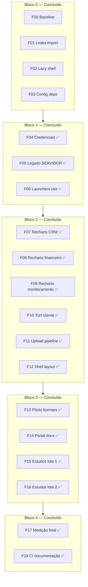

# Roadmap detalhado — peso, velocidade e reorganização

Plano conservador: **mesmas URLs, mesmas telas, mesmos fluxos**. Cada fase é **uma unidade de trabalho** com verificação antes de avançar.

**Status do plano (2026-06-25):** F00–F18 **concluídas** — conferência em [`PERF-AUDIT.md`](PERF-AUDIT.md). Manutenção: `npm run perf:check`.

**Baseline atual (2026-06-23):**

| Métrica | Valor |
|---------|-------|
| Shared First Load JS (App Router) | **91,3 kB** |
| `/login` First Load | 288 kB |
| `/analise-ambiental` First Load | 464 kB |
| Páginas `page.tsx` | ~286 |
| Rotas intercepting `(.)` | **24** ficheiros |
| Imports `recharts` estáticos | **9** ficheiros + `chart.tsx` |
| Imports `@turf/turf` barrel | **2** (só servidor FAD) |

**Legenda de risco:** 🟢 baixo · 🟡 médio · 🔴 alto (exige smoke extra)

**Protocolo em TODA fase:**

1. Anotar métrica alvo em [`PERF-AUDIT.md`](PERF-AUDIT.md) (secção “Antes”)
2. Aplicar **só** o escopo da fase
3. `npm run typecheck`
4. Smoke manual indicado
5. `npm run build` → copiar linha `First Load JS` das rotas-alvo
6. Marcar fase ✅ ou reverter

---

## Visão geral (16 fases)



| Bloco | Fases | Duração sugerida | Foco |
|-------|-------|------------------|------|
| 0 | F00–F03 | — | ✅ Feito |
| 1 | F04–F06 | 3–4 dias | ✅ Segurança e raiz |
| 2 | F07–F12 | 5–7 dias | ✅ Peso no browser |
| 3 | F13–F16 | 2–3 semanas | ✅ Rotas modais / FormShell |
| 4 | F17–F18 | 2 dias | ✅ Medição e `perf:check` |

**Ritmo:** 1 fase por dia útil (ou 2 fases leves 🟢 no mesmo dia). **Nunca** misturar Bloco 2 e Bloco 3 na mesma PR.

---

## Bloco 0 — Concluído

### F00 — Baseline e ferramentas ✅

| Item | Detalhe |
|------|---------|
| Entregável | `npm run analyze`, `docs/PERF-AUDIT.md` |
| Script | `scripts/analyze-build.mjs` (heap 8 GB) |

### F01 — Leaks de import ✅

| Ficheiro | Mudança |
|----------|---------|
| `src/lib/types/analise-ambiental.ts` | `genkit` → `zod` |
| `src/lib/geospatial/geo-constants.ts` | `WAVE_ALL_LAYER_COUNT = 53` |
| `src/app/(app)/analise-ambiental/page.tsx` | import de `geo-constants` |
| `src/components/geospatial/geo-analysis-complement-panel.tsx` | idem |

### F02 — Lazy-load inicial ✅

| Ficheiro | Mudança |
|----------|---------|
| `src/app/(app)/layout.tsx` | `OfflineProvider` via `dynamic()` |
| `src/lib/geospatial/export-cartographic-client.ts` | `await import('jspdf')` |
| `project-form.tsx`, `rca-form-initial-values.ts` | `lodash/merge` |

### F03 — Config e dependências ✅

| Ficheiro | Mudança |
|----------|---------|
| `next.config.mjs` | `optimizePackageImports` |
| `package.json` | deps mortas removidas; analyzer em devDeps |

---

## Bloco 1 — Repositório e segurança ✅ (2026-06-23)

> Não altera bundle. Pode correr em paralelo com Bloco 2 se forem pessoas diferentes; senão, **antes** do Bloco 2.

### F04 — Credenciais fora da raiz ✅ 🟢

**Objetivo:** eliminar risco de commit acidental de segredos.

| Ação | Origem | Destino |
|------|--------|---------|
| Mover JSON Admin SDK | `chave firebase/*.json` | `config/firebase-service-account.json` |
| Renomear duplicata | `config/firebase-service-account.json.json` | corrigir extensão ou apagar duplicata |
| Confirmar gitignore | `chaves gerais.txt` | não versionado |

**Verificação:**

- [ ] `git status` sem ficheiros `.json` de credencial
- [ ] `npm run verify:env` (se aplicável)
- [ ] `npm run dev` — login admin API continua a funcionar

**Rollback:** mover ficheiros de volta; atualizar `.env.local` se caminho mudou.

**Duração:** 1–2 h

---

### F05 — Apagar legado `*-SERVIDOR*` ✅ 🟢

**Objetivo:** menos ruído no repo; ficheiros excluídos do `tsc` e sem imports.

| Apagar após `grep` confirmar zero imports | Notas |
|-------------------------------------------|-------|
| `src/app/(app)/licenses/page-SERVIDOR.tsx` | Ver [`AUDITORIA-CODIGO-MORTO-E-API.md`](AUDITORIA-CODIGO-MORTO-E-API.md) |
| `src/app/(app)/licenses/license-form-SERVIDOR.tsx` | |
| `src/app/(app)/compliance/page-SERVIDOR.tsx` | |
| `src/app/(app)/compliance/compliance-form-SERVIDOR.tsx` | |
| `src/app/(app)/dashboards/environmental-dashboard-SERVIDOR.tsx` | |
| `src/firebase/rules/firestore-SERVIDOR.rules` | Deploy oficial: `src/firebase/rules/firestore.rules` |
| `src/firestore-SERVIDOR.rules` | |
| `package-lock-SERVIDOR.json` | |

**Verificação:**

- [ ] `npm run typecheck`
- [ ] `npm run deploy:rules` **não** necessário (regras canónicas inalteradas)

**Duração:** 1 h

---

### F06 — Launchers e docs na raiz ✅ 🟢

**Objetivo:** raiz só com README, AGENTS, configs.

| Manter na raiz | Mover / apagar |
|----------------|----------------|
| `README.md`, `AGENTS.md` | `start-dev.bat`, `iniciar-servidor.bat`, `instalar-node.bat`, `iniciar-agora-F-Projects-nodejs.bat` → `scripts/` ou apagar |
| `package.json`, `next.config.mjs`, `firebase.json` | Atualizar `README.md` com `npm run dev` |
| | `docs/setup/` já tem guias — link no README |

**Verificação:**

- [ ] `npm run dev` na porta 9002
- [ ] Novo clone: README aponta para `docs/setup/COMO-RODAR.md`

**Duração:** 2 h

---

## Bloco 2 — Bundle no browser ✅ (2026-06-23)

> **Uma biblioteca ou um grupo de ficheiros por fase.** Smoke após cada uma.

### F07 — Recharts: CRM ✅ 🟡

**Objetivo:** gráficos CRM não entram no chunk inicial de rotas que não usam CRM.

| Ficheiro | Ação |
|----------|------|
| `src/app/(app)/crm/crm-dashboard.tsx` | Envolver export default em `dynamic()` no **consumidor** ou split interno |
| `src/app/(app)/crm/reports/page.tsx` | Extrair gráfico para `crm-reports-chart.tsx` + `dynamic()` |
| `src/app/(app)/crm/team/page.tsx` | idem |

**Padrão a copiar:** `ChatWidget` em `(app)/layout.tsx`.

```tsx
const CrmDashboard = dynamic(() => import("./crm-dashboard"), {
  ssr: false,
  loading: () => <Skeleton className="h-[320px] w-full" />,
});
```

**Smoke:**

- [ ] `/crm` — dashboard carrega
- [ ] `/crm/reports`, `/crm/team` — gráficos renderizam

**Métrica alvo:** First Load de `/` ou `/licenses` **não** deve subir; idealmente shared estável ou menor.

**Duração:** 1 dia

---

### F08 — Recharts: financeiro ✅ 🟡

| Ficheiro | Ação |
|----------|------|
| `src/app/(app)/dashboards/financial-dashboard.tsx` | `dynamic()` no importador (`page.tsx` da home por papel) |
| `src/app/(app)/cash-flow/cash-flow-chart.tsx` | `dynamic()` em `cash-flow/page.tsx` |
| `src/app/(app)/financial/fluxo-projetado/page.tsx` | chart interno lazy |
| `src/app/(app)/financial/abc-curve/page.tsx` | idem |
| `src/components/financial/abc-analysis-view.tsx` | `dynamic()` onde usado |

**Não tocar** em `src/components/ui/chart.tsx` nesta fase (shared shadcn — F12).

**Smoke:**

- [ ] `/financial/painel`, `/cash-flow`, `/financial/fluxo-projetado`, `/financial/abc-curve`

**Duração:** 1 dia

---

### F09 — Recharts: monitoramento ✅ 🟡

| Ficheiro | Ação |
|----------|------|
| `src/app/(app)/monitoring/manual/page.tsx` | lazy do bloco de gráficos |

**Smoke:**

- [ ] `/monitoring/manual` — formulário + gráfico

**Duração:** meio dia

---

### F10 — Turf no cliente ✅ 🟡

**Objetivo:** garantir que nenhum módulo `"use client"` puxa barrel `@turf/turf`.

| Situação atual | Ação |
|----------------|------|
| `workspace-service.ts`, `inline-change-detection.ts` | `import * as turf` — **servidor FAD**; confirmar sem `"use client"` |
| `resolve-localizacao-imovel.ts` | já modular; usado em páginas geo — avaliar `import()` no handler de análise |
| `layer-proximity.ts`, `layer-stats.ts` | auditar cadeia até páginas cliente |

**Sub-passos (fazer em ordem):**

1. F10a — `grep "@turf/turf"` → lista final (meta: 0 no cliente)
2. F10b — Para cada módulo cliente que importa geo pesado: mover chamada para Server Action ou `import()` no clique
3. F10c — Sync `geo-constants.ts` se contagem de camadas mudar:
   ```bash
   npx tsx -e "import { GEO_ALL_LAYER_COUNT } from './src/lib/geospatial/geo-all-layers.ts'; console.log(GEO_ALL_LAYER_COUNT)"
   ```

**Smoke:**

- [ ] `/analise-ambiental` — perímetro + relatório factual
- [ ] `/socioambiental` wizard (se usa `resolve-localizacao-imovel`)

**Métrica alvo:** `/analise-ambiental` First Load **< 464 kB** (registar valor exato).

**Duração:** 1–2 dias

---

### F11 — Upload pipeline lazy ✅ 🟢

| Ficheiro | Ação |
|----------|------|
| `src/lib/upload-pipeline.ts` | `await import('browser-image-compression')` e `pizzip` dentro de `prepareFileForUpload` |

**Smoke:** formulário com upload (ex. `/licenses/new`, inspeção).

**Duração:** meio dia

---

### F12 — Shell do layout autenticado ✅ 🟡

**Objetivo:** aliviar chunk compartilhado (91,3 kB) sem quebrar offline.

| Candidato | Ação | Cuidado |
|-----------|------|---------|
| `NotificationPushProvider` | `dynamic()` + `ssr: false` | FCM só após login |
| `OfflineQueueBadge` | lazy junto com offline chunk | badge pode atrasar 1s |
| `PortalAdvertisingLayer` | lazy | só portal cliente |
| `navigation-config.ts` | dividir ícones em `navigation-icons.ts` (re-export) | **não** mudar `href` nem roles |
| `FinancialMenuDebugPanel` / `CadastroMenuDebugPanel` | `dynamic()` só em `NODE_ENV=development` | já é dev-only |

**Smoke:**

- [ ] Login → sidebar desktop e mobile
- [ ] Offline: fila de upload (se usado)
- [ ] Notificações push (produção / permissão)

**Métrica alvo:** shared **< 88 kB** (aspiracional; registar real).

**Duração:** 1–2 dias

---

## Bloco 3 — Rotas modais (24 ficheiros `(.)`) ✅ (2026-06-23)

> **Problema:** modal (`Dialog`) ≠ página cheia (`Card` + `PageHeader`). Re-export quebra UX.

> **Solução:** `FormShell` partilhado com `variant: 'modal' | 'page'`.

### Inventário completo (12 entidades × 2 rotas)

| Entidade | `(.)new` | `(.)[id]/edit` | Form partilhado |
|----------|----------|----------------|-----------------|
| licenses | ✅ | ✅ | `license-form.tsx` |
| invoices | ✅ | ✅ | `invoice-form.tsx` |
| outorgas | ✅ | ✅ | `outorga-form.tsx` |
| technical-responsible | ✅ | ✅ | `responsible-form.tsx` |
| responsible-company | ✅ | ✅ | `company-form.tsx` |
| studies/rca | ✅ | ✅ | formulários RCA |
| studies/pca | ✅ | ✅ | formulários PCA |
| studies/ptrf | ✅ | ✅ | `ptrf-form.tsx` |
| studies/prada | ✅ | ✅ | `prada-form.tsx` |
| studies/pia | ✅ | ✅ | `pia-form.tsx` |
| studies/eia-rima | ✅ | ✅ | `eia-rima-form.tsx` |
| studies/intervencao-ambiental | ✅ | ✅ | `pia-form.tsx` / intervencao |

---

### F13 — Piloto: licenses ✅ 🟡

**Objetivo:** provar padrão `FormShell` sem regressão.

**Passos:**

1. Criar `src/app/(app)/licenses/license-form-shell.tsx`:
   - Props: `variant`, `title`, `description`, `children`, `onSuccess`, `open?`, `onOpenChange?`
   - `variant='modal'` → `Dialog` + `router.back()` no sucesso
   - `variant='page'` → `PageHeader` + `Card` + `router.push('/licenses')`
2. Refatorar `new/page.tsx` → usa shell `page`
3. Refatorar `(.)new/page.tsx` → usa shell `modal` (~15 linhas)
4. Repetir para `[id]/edit` e `(.)[id]/edit`

**Verificação:**

- [ ] `/licenses` → botão novo → **modal** abre, salvar, volta à lista
- [ ] URL direta `/licenses/new` → **página cheia**
- [ ] Editar na lista → modal; URL `/licenses/[id]/edit` → página cheia
- [ ] `npm run audit:routes` — mesmas rotas

**Rollback:** git revert só da pasta `licenses/`.

**Duração:** 2 dias

---

### F14 — Portal documentos (lote 1) ✅ 🟡

Aplicar padrão F13 a:

1. `invoices` (2 dias)
2. `outorgas` (2 dias)

**Ordem:** invoices primeiro (mais simples que outorgas).

**Smoke por entidade:** lista → novo modal → editar modal → páginas cheias directas.

**Duração:** 4 dias (2 entidades)

---

### F15 — Cadastro técnico (lote 2) ✅ 🟡

1. `technical-responsible`
2. `responsible-company`

**Duração:** 3 dias

---

### F16 — Estudos técnicos (lote 3 e 4) ✅ 🔴

**Lote 3** (formulários médios):

- `studies/rca`
- `studies/pca`

**Lote 4** (restantes):

- `studies/ptrf`, `studies/prada`, `studies/pia`
- `studies/eia-rima`, `studies/intervencao-ambiental`

**Cuidado extra:** estudos têm formulários grandes (RCA listagens A–H). Shell só envolve **layout**; não mexer em lógica de formulário.

**Smoke por estudo:** listagem → novo → editar → export PDF se existir.

**Duração:** 1,5–2 semanas (1 estudo por dia em média)

---

## Bloco 4 — Medição e manutenção ✅ (2026-06-23; revalidado 2026-06-25)

### F17 — Medição final e comparativo ✅ 🟢

| Comando | Registar em PERF-AUDIT |
|---------|------------------------|
| `npm run build` | Shared, `/login`, `/analise-ambiental`, `/`, `/licenses` |
| `npm run analyze` | Screenshot ou notas dos 5 maiores chunks |
| `npm run apphosting:check` | pass/fail |

**Tabela comparativa:**

| Métrica | Baseline | Após F12 | Após F16 |
|---------|----------|----------|----------|
| Shared First Load | 91,3 kB | | |
| `/analise-ambiental` | 464 kB | | |
| Ficheiros `(.)` linhas totais | ~1200? | | |

**Duração:** meio dia

---

### F18 — Automação leve ✅ 🟢

| Ação | Detalhe |
|------|---------|
| Script `npm run perf:check` | `typecheck` + `audit:routes` + grep por `@turf/turf` no cliente |
| Doc | Link este roadmap em `AGENTS.md` |
| PR template mental | “Uma fase = um PR” |

**Não fazer nesta fase:** gate obrigatório de bundle size no CI (falso positivo em Next 14).

**Duração:** meio dia

---

## Ritmo calendário sugerido

| Semana | Seg | Ter | Qua | Qui | Sex |
|--------|-----|-----|-----|-----|-----|
| **S1** | F04 | F05 | F06 | F07 | F08 |
| **S2** | F09 | F10 | F10 | F11 | F12 |
| **S3** | F13 | F13 | F14 invoices | F14 outorgas | buffer |
| **S4** | F15 | F15 | F16 rca | F16 pca | buffer |
| **S5+** | F16 restantes (1/dia) | … | … | F17 | F18 |

**Buffer:** dia de correção se smoke falhar — **não avançar fase com falha**.

---

## Fora de escopo (não entrar neste roadmap)

| Item | Motivo |
|------|--------|
| `studies/[studyType]` rota dinâmica | código novo; risco alto |
| Unificar APIs `uploads/*`, `geo/*` | comportamento + integrações externas |
| Remover redirects `/proposals`, `/inventarios` | pedido do utilizador: manter |
| Alterar RBAC / middleware páginas | mudança de segurança |
| Mover Firebase fora do shell | quebra offline-first |
| `docker-compose.yml` MariaDB | decisão de produto separada |

---

## Checklist de fumo global (após cada bloco)

- [ ] Login / logout
- [ ] `/` painel por um papel admin e um cliente
- [ ] `/licenses` CRUD modal + página
- [ ] `/analise-ambiental` relatório factual
- [ ] `/crm` ou `/financial/painel` (após F07–F08)
- [ ] Celular na rede local (`docs/setup/ACESSO-CELULAR.md`) — opcional por bloco

---

## Como usar este documento

1. Escolher próxima fase pendente (primeira não ✅).
2. Copiar secção para issue/PR.
3. Executar protocolo de 6 passos no topo.
4. Marcar ✅ em [`PERF-AUDIT.md`](PERF-AUDIT.md) com data e métricas.

**Plano F00–F18:** concluído. Revalidação periódica: `npm run perf:check` + `npm run apphosting:check` antes de deploy. Detalhe por fase em [`PERF-AUDIT.md`](PERF-AUDIT.md).
