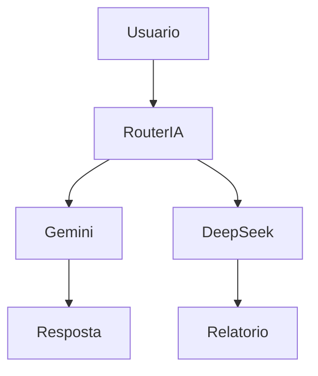

# PLANO CURSOR - ARQUITETURA IA E RELATÓRIOS

## Objetivo
Separar IA rápida e IA pesada.

## Modelo
Gemini:
- chat
- consultas rápidas

DeepSeek:
- relatórios
- pareceres
- análises

## Fluxo

```mermaid
flowchart TD
Usuario-->RouterIA
RouterIA-->Gemini
RouterIA-->DeepSeek
Gemini-->Resposta
DeepSeek-->Relatorio
```
