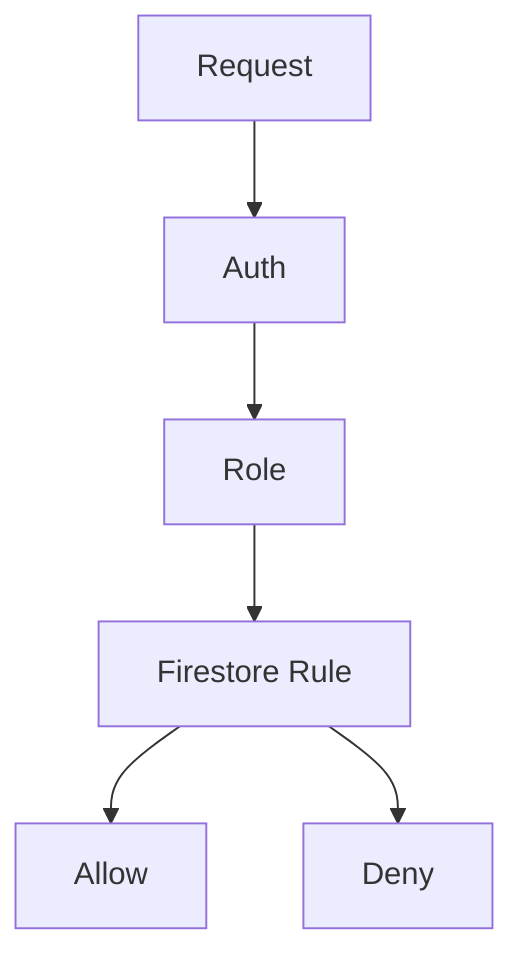

# PLANO CURSOR - AUDITORIA FIRESTORE RULES E PERMISSÕES

## Objetivo
Fortalecer segurança sem alterar regras de negócio.

## Escopo
- Revisar helpers
- Revisar RBAC
- Documentar regras
- Validar acesso por perfil

## Perfis
- admin
- gestor
- supervisor
- client
- cliente_autonomo

## Fluxo

## Critérios
- Nenhuma quebra funcional
- npm run deploy:rules validado
- apphosting:check aprovado
