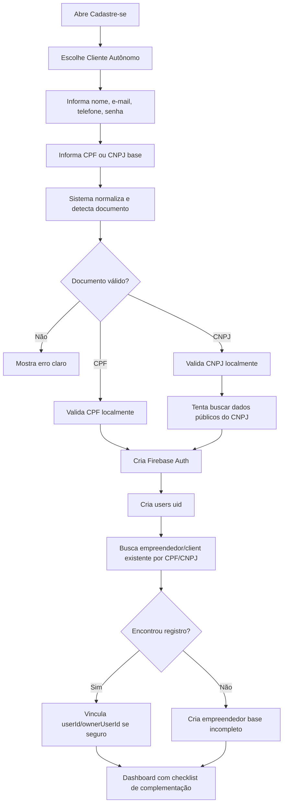
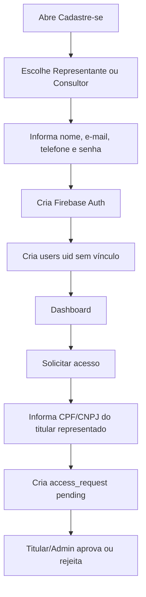

# PLANO-CURSOR-CADASTRO-CPF-CNPJ-CLIENTE-AUTONOMO-E-VINCULOS-AMBIENTAR

## 1. Objetivo do plano

Este documento orienta o agente do Cursor AI a implementar, em fases seguras, o novo fluxo de cadastro e vínculo do AmbientaR, preservando a arquitetura existente e evitando quebras em produção.

A melhoria central é:

> No cadastro público inicial, somente o perfil **Cliente Autônomo** deve informar CPF ou CNPJ.  
> Representante e Consultor-Representante não informam CPF/CNPJ no cadastro inicial; eles solicitam acesso depois.

O CPF/CNPJ do Cliente Autônomo será usado para criar ou vincular um **empreendedor base incompleto**, que depois será complementado pelo usuário.

---

## 2. Decisão final de produto

### Perfis no Cadastre-se

| Perfil | CPF/CNPJ no cadastro inicial? | Para que serve o documento? |
|---|---:|---|
| Cliente Autônomo | Sim | Identificar o titular/empreendedor base |
| Representante | Não | Solicita acesso depois informando CPF/CNPJ do titular |
| Consultor-Representante | Não | Solicita acesso depois informando CPF/CNPJ do titular |
| Cliente Gestão | Não aparece no cadastro público | Criado internamente pela consultoria |

---

## 3. Fluxo final desejado

### Cliente Autônomo



### Representante e Consultor-Representante



---

## 4. Diagnóstico da main atual

Com base na `main`, o arquivo principal do cadastro é:

```text
src/app/register/page.tsx
```

Pontos atuais que precisam ser corrigidos:

1. O schema exige CPF pessoal:

```ts
cpf: z.string().min(11, "Insira um CPF válido.")
```

2. O campo `cpfCnpjTitular` é opcional, mas usado de forma ambígua.
3. O cadastro ainda força documento para `representative`.
4. O fluxo de Cliente Autônomo usa fallback para CPF do usuário quando `cpfCnpjTitular` não é informado.
5. O sistema cria/vincula `clients` e `empreendedores` já no cadastro.
6. O arquivo mistura UI, validação, Firebase Auth, Firestore, contrato, pagamento, pedido de acesso e onboarding.

Já existem helpers úteis em:

```text
src/lib/document-lookup.ts
```

com:

```ts
normalizeDocumentDigits()
buildCpfCnpjVariants()
lookupClientAndEmpreendedorByDocument()
```

Já existe escopo por CPF/CNPJ em:

```text
src/lib/portal-empreendedor-scope.ts
```

Os modelos atuais já suportam campos importantes:

```text
Empreendedor.cpfCnpj
Empreendedor.userId
Empreendedor.approvedUserIds
Empreendedor.approvedConsultorIds
Client.cpfCnpj
Client.userId
Client.portalUserIds
Client.approvedUserIds
Client.approvedConsultorIds
```

Estratégia correta: **adicionar compatibilidade**, não substituir estrutura.

---

## 5. Princípios de implementação

O Cursor AI deve seguir estas regras:

1. Não recriar arquitetura.
2. Não mudar rotas públicas.
3. Não apagar campos antigos.
4. Não criar coleção `titulares` agora.
5. Não mexer em Firestore Rules antes do app compilar.
6. Não forçar consulta externa como condição de cadastro.
7. CPF: validar localmente, não buscar dados pessoais.
8. CNPJ: validar localmente e tentar consulta pública via backend/proxy, com fallback.
9. Representante/consultor nunca informam CPF/CNPJ no cadastro inicial.
10. Cliente Autônomo sempre informa CPF/CNPJ base.

---

## 6. Campos e nomenclatura recomendados

### Campo único visual

No formulário do Cliente Autônomo:

```text
CPF ou CNPJ do titular/empreendedor base
```

Não usar escolha prévia:

```text
Pessoa Física
Pessoa Jurídica
```

O sistema detecta automaticamente:

```text
11 dígitos -> CPF
14 dígitos -> CNPJ
```

### Campos internos novos, preservando legados

Adicionar gradualmente:

```ts
titularDocument?: string;
titularType?: "pessoa_fisica" | "pessoa_juridica";
ownerUserId?: string;
cadastroIncompleto?: boolean;
onboardingStep?: string;
cnpjLookupStatus?: "not_applicable" | "success" | "failed" | "not_found";
```

Preservar:

```ts
cpf
userCpf
cnpjs
cpfCnpj
userId
approvedUserIds
approvedConsultorIds
portalUserIds
```

---

# 7. Plano por etapas

## Etapa 0 — Baseline e branch

### Objetivo

Garantir que sabemos o estado atual antes da mudança.

### Comandos

```bash
git checkout main
git pull
git checkout -b refactor/cadastro-cliente-autonomo-cpf-cnpj
npm run typecheck
npm run lint
npm run build
npm run apphosting:check
```

### Criar pasta de logs

```text
docs/auditorias/cadastro-cpf-cnpj-baseline/
```

Salvar:

```text
typecheck-log.txt
lint-log.txt
build-log.txt
apphosting-log.txt
```

---

## Etapa 1 — Criar helper central CPF/CNPJ

### Arquivo novo

```text
src/lib/cpf-cnpj.ts
```

### Código sugerido

```ts
import { maskCnpj, maskCpf, unmask } from "@/lib/masks";
import type { EntityType } from "@/lib/types";

export type CpfCnpjKind = "cpf" | "cnpj" | "invalid";

export type TitularType = "pessoa_fisica" | "pessoa_juridica";

export function normalizeCpfCnpj(raw: string | undefined | null): string {
  return unmask(raw ?? "").trim();
}

export function detectCpfCnpjKind(raw: string | undefined | null): CpfCnpjKind {
  const digits = normalizeCpfCnpj(raw);
  if (digits.length === 11) return "cpf";
  if (digits.length === 14) return "cnpj";
  return "invalid";
}

export function formatCpfCnpj(raw: string | undefined | null): string {
  const digits = normalizeCpfCnpj(raw);
  if (digits.length === 11) return maskCpf(digits);
  if (digits.length === 14) return maskCnpj(digits);
  return raw ?? "";
}

export function isValidCpf(raw: string | undefined | null): boolean {
  const cpf = normalizeCpfCnpj(raw);
  if (!/^\d{11}$/.test(cpf)) return false;
  if (/^(\d)\1{10}$/.test(cpf)) return false;

  let sum = 0;
  for (let i = 0; i < 9; i++) sum += Number(cpf[i]) * (10 - i);
  let first = (sum * 10) % 11;
  if (first === 10) first = 0;
  if (first !== Number(cpf[9])) return false;

  sum = 0;
  for (let i = 0; i < 10; i++) sum += Number(cpf[i]) * (11 - i);
  let second = (sum * 10) % 11;
  if (second === 10) second = 0;

  return second === Number(cpf[10]);
}

export function isValidCnpj(raw: string | undefined | null): boolean {
  const cnpj = normalizeCpfCnpj(raw);
  if (!/^\d{14}$/.test(cnpj)) return false;
  if (/^(\d)\1{13}$/.test(cnpj)) return false;

  const calc = (base: string, weights: number[]) => {
    const sum = weights.reduce((acc, weight, index) => {
      return acc + Number(base[index]) * weight;
    }, 0);
    const rest = sum % 11;
    return rest < 2 ? 0 : 11 - rest;
  };

  const first = calc(cnpj.slice(0, 12), [5, 4, 3, 2, 9, 8, 7, 6, 5, 4, 3, 2]);
  const second = calc(cnpj.slice(0, 13), [6, 5, 4, 3, 2, 9, 8, 7, 6, 5, 4, 3, 2]);

  return first === Number(cnpj[12]) && second === Number(cnpj[13]);
}

export function isValidCpfCnpj(raw: string | undefined | null): boolean {
  const kind = detectCpfCnpjKind(raw);
  if (kind === "cpf") return isValidCpf(raw);
  if (kind === "cnpj") return isValidCnpj(raw);
  return false;
}

export function resolveTitularType(raw: string | undefined | null): TitularType | null {
  const kind = detectCpfCnpjKind(raw);
  if (kind === "cpf") return "pessoa_fisica";
  if (kind === "cnpj") return "pessoa_juridica";
  return null;
}

export function resolveEntityType(raw: string | undefined | null): EntityType {
  return detectCpfCnpjKind(raw) === "cnpj" ? "Pessoa Jurídica" : "Pessoa Física";
}

export function buildCpfCnpjIdentityFields(raw: string | undefined | null) {
  const digits = normalizeCpfCnpj(raw);
  const kind = detectCpfCnpjKind(digits);
  return {
    cpfCnpj: digits,
    titularDocument: digits,
    titularType: resolveTitularType(digits),
    entityType: resolveEntityType(digits),
    formattedDocument: formatCpfCnpj(digits),
    isCpf: kind === "cpf",
    isCnpj: kind === "cnpj",
  };
}
```

### Critério de aceite

```bash
npm run typecheck
```

---

## Etapa 2 — Serviço de consulta CNPJ com fallback

### Observação importante

A consulta de CNPJ deve ser feita preferencialmente por rota de backend/proxy, não diretamente no cliente, para evitar dependência direta de serviço externo, CORS, exposição de chaves e falhas em produção.

CPF é dado pessoal. O sistema deve apenas validar CPF localmente e não tentar buscar nome/endereço por CPF.

### Arquivo novo client-side

```text
src/lib/cnpj-lookup.ts
```

### Código sugerido

```ts
import { normalizeCpfCnpj } from "@/lib/cpf-cnpj";

export type CnpjLookupResult = {
  ok: boolean;
  cnpj: string;
  razaoSocial?: string;
  nomeFantasia?: string;
  email?: string;
  phone?: string;
  address?: string;
  numero?: string;
  complemento?: string;
  bairro?: string;
  municipio?: string;
  uf?: string;
  cep?: string;
  cnaePrincipal?: string;
  situacaoCadastral?: string;
  source?: string;
  error?: string;
};

export async function lookupCnpjPublicData(rawCnpj: string): Promise<CnpjLookupResult> {
  const cnpj = normalizeCpfCnpj(rawCnpj);

  try {
    const res = await fetch(`/api/cnpj-lookup?cnpj=${encodeURIComponent(cnpj)}`, {
      method: "GET",
      headers: { Accept: "application/json" },
    });

    if (!res.ok) {
      return { ok: false, cnpj, error: `HTTP ${res.status}` };
    }

    return (await res.json()) as CnpjLookupResult;
  } catch (error) {
    return {
      ok: false,
      cnpj,
      error: error instanceof Error ? error.message : "Erro desconhecido",
    };
  }
}
```

### Rota sugerida

```text
src/app/api/cnpj-lookup/route.ts
```

### Código base

```ts
import { NextResponse } from "next/server";
import { normalizeCpfCnpj, isValidCnpj } from "@/lib/cpf-cnpj";

export const runtime = "nodejs";

export async function GET(req: Request) {
  const { searchParams } = new URL(req.url);
  const cnpj = normalizeCpfCnpj(searchParams.get("cnpj"));

  if (!isValidCnpj(cnpj)) {
    return NextResponse.json(
      { ok: false, cnpj, error: "CNPJ inválido" },
      { status: 400 },
    );
  }

  try {
    const providerUrl = process.env.CNPJ_LOOKUP_PROVIDER_URL;

    if (!providerUrl) {
      return NextResponse.json({
        ok: false,
        cnpj,
        error: "CNPJ lookup provider não configurado",
      });
    }

    const url = providerUrl.replace("{cnpj}", cnpj);
    const response = await fetch(url, {
      headers: { Accept: "application/json" },
      next: { revalidate: 60 * 60 * 24 * 7 },
    });

    if (!response.ok) {
      return NextResponse.json({
        ok: false,
        cnpj,
        error: `Provider HTTP ${response.status}`,
      });
    }

    const data = await response.json();

    return NextResponse.json({
      ok: true,
      cnpj,
      razaoSocial: data.razao_social ?? data.nome ?? data.name,
      nomeFantasia: data.nome_fantasia ?? data.fantasia,
      email: data.email,
      phone: data.telefone ?? data.phone,
      address: data.logradouro,
      numero: data.numero,
      complemento: data.complemento,
      bairro: data.bairro,
      municipio: data.municipio,
      uf: data.uf,
      cep: data.cep,
      cnaePrincipal: data.cnae_fiscal_descricao ?? data.atividade_principal?.[0]?.text,
      situacaoCadastral: data.situacao ?? data.descricao_situacao_cadastral,
      source: "configured-provider",
    });
  } catch (error) {
    return NextResponse.json({
      ok: false,
      cnpj,
      error: error instanceof Error ? error.message : "Erro desconhecido",
    });
  }
}
```

---

## Etapa 3 — Ajustar schema do registro

### Arquivo

```text
src/app/register/page.tsx
```

### Ajuste principal

Manter `cpfCnpjTitular`, mas usar apenas para Cliente Autônomo.

```ts
const requiresBaseDocument = mode === "cliente_autonomo";
const isDelegateMode = mode === "representative" || mode === "consultor_representante";
```

Trocar:

```ts
cpf: z.string().min(11, "Insira um CPF válido."),
```

por:

```ts
cpf: z.string().optional(),
```

Adicionar validação:

```ts
.refine(
  (data) => {
    const digits = normalizeDocument(data.cpf);
    return digits.length === 0 || digits.length === 11;
  },
  {
    message: "Informe um CPF válido ou deixe em branco.",
    path: ["cpf"],
  },
)
.refine(
  (data) => {
    const digits = normalizeDocument(data.cpfCnpjTitular);
    return digits.length === 0 || digits.length === 11 || digits.length === 14;
  },
  {
    message: "Informe CPF/CNPJ válido.",
    path: ["cpfCnpjTitular"],
  },
)
```

No início de `onSubmit`:

```ts
const requiresBaseDocument = mode === "cliente_autonomo";
const baseDocument = normalizeDocument(values.cpfCnpjTitular);

if (requiresBaseDocument && !isValidCpfCnpj(baseDocument)) {
  toast({
    variant: "destructive",
    title: "CPF/CNPJ obrigatório",
    description:
      "Informe um CPF ou CNPJ válido para criar seu empreendedor base.",
  });
  return;
}
```

Remover bloqueio atual de representante sem documento.

---

## Etapa 4 — Ajustar UI do cadastro

### Cliente Autônomo

Mostrar campo:

```text
CPF ou CNPJ do titular/empreendedor base
```

### Representante e Consultor

Não mostrar campo CPF/CNPJ.

### Código orientativo

```tsx
{mode === "cliente_autonomo" && (
  <FormField
    control={form.control}
    name="cpfCnpjTitular"
    render={({ field }) => (
      <FormItem>
        <FormLabel>CPF ou CNPJ do titular/empreendedor base</FormLabel>
        <FormControl>
          <MaskedInput
            mask="cpfCnpj"
            placeholder="000.000.000-00 ou 00.000.000/0000-00"
            {...field}
            onBlur={() => {
              field.onBlur();
              void handleTitularDocumentBlur();
            }}
          />
        </FormControl>
        <FormMessage />
        <p className="text-xs text-muted-foreground">
          Informe o documento que identificará seu empreendedor base. Você poderá complementar os dados depois.
        </p>
      </FormItem>
    )}
  />
)}
```

---

## Etapa 5 — Ajustar canAdvanceStep1

Novo comportamento:

```ts
const requiresBaseDocument = mode === "cliente_autonomo";
const baseDocumentOk =
  !requiresBaseDocument || isValidCpfOrCnpj(cpfCnpjTitular);

const personalCpfOk =
  digitsCpf.length === 0 || digitsCpf.length === 11;

const base =
  name.trim().length >= 3 &&
  email.includes("@") &&
  digitsPhone.length >= 10 &&
  personalCpfOk &&
  password.length >= 6 &&
  confirmPassword.length >= 6 &&
  password === confirmPassword;

return base && baseDocumentOk;
```

Critério:

- Cliente Autônomo só avança com CPF/CNPJ base válido.
- Representante avança sem CPF/CNPJ.
- Consultor avança sem CPF/CNPJ.

---

## Etapa 6 — Criar/vincular empreendedor base somente para Cliente Autônomo

### Regra

No `onSubmit`, após criar `users/{uid}`:

```ts
if (mode === "cliente_autonomo") {
  await createOrLinkBaseEmpreendedor();
}
```

Para representante/consultor:

```ts
// Não cria empreendedor base.
// Não cria access_request.
// Não exige CPF/CNPJ.
```

### Campos do empreendedor base

```ts
{
  name,
  phone,
  email,
  cpfCnpj,
  titularDocument,
  titularType,
  entityType,
  userId: uid,
  ownerUserId: uid,
  cadastroIncompleto: true,
  onboardingStep: "completar_empreendedor",
  cnpjLookupStatus
}
```

---

## Etapa 7 — Ajustar gravação em users/{uid}

### Cliente Autônomo

```ts
{
  uid,
  name: values.name,
  email: normalizedEmail,
  phone: values.phone,
  cpf: baseDocument.length === 11 ? baseDocument : "",
  userCpf: normalizeDocument(values.cpf),
  cnpjs: baseDocument.length === 14 ? [baseDocument] : [],
  role: "cliente_autonomo",
  status: "active",
  cadastroIncompleto: true,
  onboardingStep: "completar_empreendedor",
  titularDocument: baseDocument,
  titularType: resolveTitularType(baseDocument),
  linkedClientId,
  linkedEmpreendedorId,
}
```

### Representante/Consultor

```ts
{
  uid,
  name: values.name,
  email: normalizedEmail,
  phone: values.phone,
  cpf: "",
  userCpf: "",
  cnpjs: [],
  role: registerRole,
  status: "active",
  cadastroIncompleto: false,
  pendingAccess: true,
  onboardingStep: "solicitar_acesso",
}
```

Não gravar CPF/CNPJ do titular representado no usuário representante.

---

## Etapa 8 — Remover access_requests do cadastro

Novo comportamento:

- Cadastro de representante não renderiza CPF/CNPJ.
- Cadastro de consultor não renderiza CPF/CNPJ.
- Não criar `access_requests` no register.
- Criar `access_requests` apenas em tela/ação pós-login.

### Componente novo

```text
src/components/delegate-access-request-form.tsx
```

### Código base

```tsx
"use client";

import * as React from "react";
import { collection, addDoc } from "firebase/firestore";
import { Button } from "@/components/ui/button";
import { Input } from "@/components/ui/input";
import { useFirebase } from "@/firebase";
import { useToast } from "@/hooks/use-toast";
import { normalizeCpfCnpj, isValidCpfCnpj } from "@/lib/cpf-cnpj";

export function DelegateAccessRequestForm() {
  const { firestore, user } = useFirebase();
  const { toast } = useToast();
  const [document, setDocument] = React.useState("");
  const [loading, setLoading] = React.useState(false);

  const isDelegate =
    user?.role === "representative" || user?.role === "consultor_representante";

  if (!isDelegate) return null;

  async function submit() {
    if (!firestore || !user) return;

    const targetDocument = normalizeCpfCnpj(document);
    if (!isValidCpfCnpj(targetDocument)) {
      toast({
        variant: "destructive",
        title: "CPF/CNPJ inválido",
        description: "Informe o documento do titular que você deseja representar.",
      });
      return;
    }

    setLoading(true);
    try {
      await addDoc(collection(firestore, "access_requests"), {
        requestedByUserId: user.uid || user.id,
        requestedByName: user.name,
        requestedByEmail: user.email,
        cpfOfInterested: targetDocument,
        targetDocument,
        requestType:
          user.role === "consultor_representante"
            ? "consultor_representante"
            : "representative",
        status: "pending",
        createdAt: new Date().toISOString(),
      });

      setDocument("");
      toast({
        title: "Pedido enviado",
        description: "O titular poderá aprovar ou rejeitar seu acesso.",
      });
    } finally {
      setLoading(false);
    }
  }

  return (
    <div className="rounded-lg border p-4 space-y-3">
      <div>
        <h3 className="font-semibold">Solicitar acesso</h3>
        <p className="text-sm text-muted-foreground">
          Informe o CPF ou CNPJ do cliente/empreendedor que você deseja representar.
        </p>
      </div>
      <Input
        value={document}
        onChange={(e) => setDocument(e.target.value)}
        placeholder="CPF ou CNPJ do titular"
      />
      <Button onClick={submit} disabled={loading}>
        {loading ? "Enviando..." : "Solicitar acesso"}
      </Button>
    </div>
  );
}
```

---

## Etapa 9 — Ajustar escopo do Cliente Autônomo

### Arquivo

```text
src/lib/portal-empreendedor-scope.ts
```

### Ajuste recomendado

Adicionar busca por:

```text
ownerUserId == uid
titularDocument in variants
```

Além de manter:

```text
userId == uid
cpfCnpj in variants
```

---

## Etapa 10 — Ajustar cadastro de Cliente e Empreendedor

Todo cadastro de Cliente e Empreendedor deve aceitar CPF ou CNPJ em campo único.

Regras:

- Não perguntar Pessoa Física/Jurídica antes.
- Campo único: CPF ou CNPJ.
- Detectar tipo automaticamente.
- CPF: valida localmente.
- CNPJ: valida localmente e busca dados públicos.
- Autopreencher apenas quando houver CNPJ e lookup retornar ok.
- Permitir edição manual.

Ao salvar:

```ts
const identity = buildCpfCnpjIdentityFields(values.cpfCnpj);

data.cpfCnpj = identity.cpfCnpj;
data.titularDocument = identity.titularDocument;
data.titularType = identity.titularType;
data.entityType = identity.entityType;
```

---

## Etapa 11 — Onboarding pós-cadastro

### Cliente Autônomo

Checklist:

```text
1. Completar dados do empreendedor base
2. Confirmar endereço
3. Cadastrar primeiro empreendimento/projeto
4. Conferir dados financeiros, se aplicável
```

### Representante/Consultor

Checklist:

```text
1. Solicitar acesso ao CPF/CNPJ do titular
2. Aguardar aprovação
3. Acessar carteira autorizada
```

---

## Etapa 12 — Firestore Rules somente depois

Não alterar regras antes de validar app.

Campos novos a considerar:

```text
ownerUserId
titularDocument
targetDocument
pendingAccess
onboardingStep
```

Regras futuras:

- Cliente Autônomo pode ler/escrever empreendedor com `ownerUserId == request.auth.uid`.
- Representante pode criar `access_requests` próprios.
- Representante não acessa dados do titular até aprovação.
- Admin/gestor/supervisor mantêm acesso atual.

---

## 8. Checklist de teste manual

### Cliente Autônomo com CPF

1. Abrir `/register`.
2. Escolher Cliente Autônomo.
3. Informar CPF válido no campo CPF/CNPJ base.
4. Concluir cadastro.
5. Verificar `users/{uid}`.
6. Verificar `empreendedores/{uid}`.
7. Verificar `clients/{uid}`.
8. Confirmar `cpfCnpj` com 11 dígitos.
9. Confirmar `titularType = pessoa_fisica`.

### Cliente Autônomo com CNPJ

1. Abrir `/register`.
2. Escolher Cliente Autônomo.
3. Informar CNPJ válido.
4. Concluir cadastro.
5. Se lookup funcionar, verificar razão social/endereço.
6. Se lookup falhar, cadastro deve concluir mesmo assim.
7. Confirmar `titularType = pessoa_juridica`.
8. Confirmar `cnpjs = [cnpj]`.

### Representante

1. Abrir `/register`.
2. Escolher Representante.
3. Confirmar que CPF/CNPJ não aparece.
4. Cadastrar.
5. Entrar no dashboard.
6. Usar Solicitar Acesso.
7. Informar CPF/CNPJ do titular.
8. Criar `access_requests`.

### Consultor-Representante

Mesmo teste do Representante.

### Cliente Gestão

1. Acessar `/register?tipo=client`.
2. Confirmar tela de convite interno.
3. Confirmar que não há auto-cadastro Cliente Gestão.

---

## 9. Commits recomendados

```bash
git commit -m "feat(cpf-cnpj): adiciona helper de documento unico"
git commit -m "feat(cnpj): adiciona rota segura de lookup com fallback"
git commit -m "refactor(register): exige cpf cnpj apenas para cliente autonomo"
git commit -m "refactor(register): cria empreendedor base para cliente autonomo"
git commit -m "feat(access): adiciona solicitacao pos-cadastro para representantes"
git commit -m "refactor(scope): inclui ownerUserId e titularDocument no escopo"
git commit -m "docs(cadastro): documenta fluxo cpf cnpj do cliente autonomo"
```

---

## 10. Comandos obrigatórios

Após cada etapa:

```bash
npm run typecheck
npm run lint
```

Antes de merge:

```bash
npm run build
npm run apphosting:check
```

Antes de deploy de regras:

```bash
npm run deploy:rules
```

Somente se houver alteração em regras.

---

## 11. Critérios finais de aceite

### Cadastro

- Cliente Autônomo exige CPF/CNPJ base.
- Representante não pede CPF/CNPJ no cadastro.
- Consultor-Representante não pede CPF/CNPJ no cadastro.
- Cliente Gestão continua convite interno.

### Documento único

- Campo aceita CPF ou CNPJ.
- Sistema detecta automaticamente.
- CPF é validado localmente.
- CNPJ é validado localmente e tenta lookup.
- Falha do lookup não bloqueia cadastro.

### Banco

- `users` preserva compatibilidade.
- `clients` preserva compatibilidade.
- `empreendedores` preserva compatibilidade.
- Novos campos são adicionais.

### Segurança

- Representante não acessa titular sem aprovação.
- Consultor não acessa titular sem aprovação.
- Cliente Autônomo só vê seus próprios empreendedores.

### Produção

- Nenhuma rota pública é removida.
- Nenhuma coleção é migrada obrigatoriamente.
- Nenhuma regra Firestore é alterada antes da validação do app.

---

## 12. Resumo para o Cursor AI

Implementar o fluxo conservador:

```text
Cliente Autônomo:
cadastro com CPF/CNPJ base obrigatório
cria usuário + empreendedor base incompleto

Representante/Consultor:
cadastro sem CPF/CNPJ
solicita acesso depois pelo CPF/CNPJ do titular

Cliente Gestão:
somente convite interno
```

Não mudar arquitetura geral.  
Não remover campos antigos.  
Não criar coleção `titulares`.  
Não quebrar produção.  
Validar tudo com typecheck, lint, build e apphosting:check.
