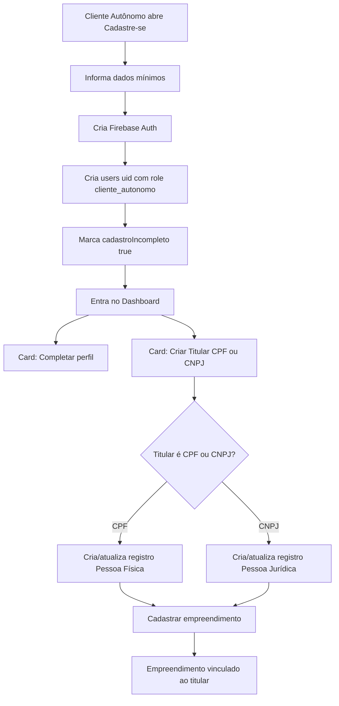
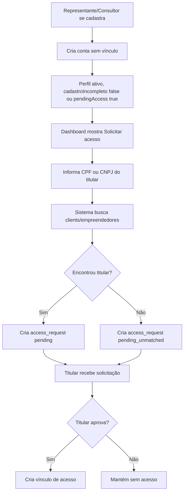
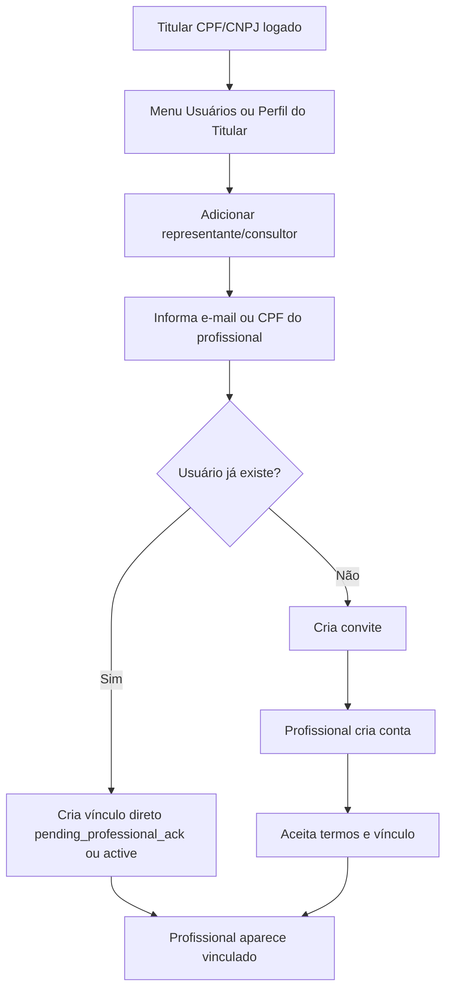

# PLANO-CURSOR-AJUSTE-FLUXO-TITULAR-CPF-CNPJ-AMBIENTAR

## 1. Contexto e objetivo

Este plano orienta o agente do Cursor AI a ajustar, de forma incremental e segura, o fluxo de cadastro público e de vínculo entre usuários, titulares CPF/CNPJ, clientes financeiros e empreendedores no AmbientaR.

O AmbientaR já está em produção. Portanto, o objetivo NÃO é reescrever a arquitetura, NÃO é trocar coleções e NÃO é quebrar rotas existentes.

Objetivo principal:

> Separar criação de conta de criação/vínculo de titular ambiental.

Nova regra conceitual:

```text
Conta de usuário ≠ Titular ambiental ≠ Cliente financeiro ≠ Empreendimento
```

O usuário entra no sistema.  
O titular CPF/CNPJ é quem possui ou representa o empreendimento.  
O empreendimento deve poder estar ligado tanto a CPF quanto a CNPJ.

---

## 2. Diagnóstico da main atual

Na versão atual da `main`, o cadastro público ainda mistura três coisas:

1. criação da conta Firebase;
2. identificação do titular por CPF/CNPJ;
3. criação ou vínculo inicial de `clients` e `empreendedores`.

No arquivo:

```text
src/app/register/page.tsx
```

o schema ainda exige CPF pessoal no cadastro:

```ts
cpf: z.string().min(11, "Insira um CPF válido.")
```

e possui o campo:

```ts
cpfCnpjTitular: z.string().optional()
```

Esse campo é usado como CPF/CNPJ vinculado ao titular/empreendedor ou ao titular que representante/consultor deseja representar.

Hoje também existe lógica que:

- valida CPF/CNPJ do titular no cadastro;
- para `representative`, ainda bloqueia envio caso o CPF/CNPJ do titular não seja informado;
- para `cliente_autonomo`, usa o CPF do usuário como fallback para criar cliente/empreendedor;
- cria documentos em `users`, `clients` e `empreendedores` já durante o cadastro.

Esse comportamento precisa ser simplificado sem apagar a compatibilidade existente.

---

## 3. Princípio do novo fluxo

### Antes

```text
Cadastro público
↓
Já pede CPF/CNPJ do titular
↓
Já tenta vincular cliente/empreendedor
↓
Já cria registros operacionais
```

### Depois

```text
Cadastro público
↓
Cria apenas a conta e perfil mínimo
↓
Usuário entra no sistema
↓
Onboarding orienta próxima ação
↓
Titular CPF/CNPJ é criado/vinculado depois
↓
Empreendimento nasce vinculado ao titular correto
```

---

## 4. Conceitos de domínio

### Usuário

Representa login e permissão.

```text
users/{uid}
```

Campos mínimos:

```ts
{
  uid: string;
  name: string;
  email: string;
  phone?: string;
  userCpf?: string;
  role: "cliente_autonomo" | "representative" | "consultor_representante" | "...";
  status: "active";
  cadastroIncompleto: boolean;
}
```

### Titular ambiental

É a pessoa física ou jurídica titular de dados ambientais.

Nesta fase NÃO criar obrigatoriamente nova coleção `titulares`.  
Usar conceito de titular dentro das coleções atuais:

```text
clients
empreendedores
```

Campos sugeridos de compatibilidade:

```ts
{
  cpfCnpj: string;
  entityType: "Pessoa Física" | "Pessoa Jurídica" | "Produtor Rural";
  titularDocument?: string;
  titularType?: "pessoa_fisica" | "pessoa_juridica" | "produtor_rural";
  ownerUserId?: string;
  userId?: string;
}
```

### Empreendimento

Deve pertencer a um titular CPF ou CNPJ.

```ts
{
  empreendedorId: string;
  titularDocument: string;
  titularType: "pessoa_fisica" | "pessoa_juridica" | "produtor_rural";
  ownerUserId?: string;
}
```

---

## 5. Fluxo alvo — Cliente Autônomo



### Regra

No cadastro inicial do Cliente Autônomo:

- NÃO obrigar CPF/CNPJ do titular;
- NÃO obrigar CNPJ de empresa;
- NÃO criar cliente financeiro completo se não houver documento titular;
- criar no máximo perfil mínimo e onboarding.

### Dado mínimo recomendado

```text
Nome
E-mail
Telefone
Senha
Aceite de contrato/plano, quando aplicável
```

CPF pessoal pode continuar existindo, mas preferencialmente como:

```text
CPF do usuário/responsável pelo login
```

e não como titular obrigatório do empreendimento.

---

## 6. Fluxo alvo — Representante e Consultor-Representante



### Regra

No cadastro inicial de representante/consultor:

- NÃO pedir CPF/CNPJ do titular;
- NÃO criar `access_requests` automaticamente durante o cadastro;
- criar a conta primeiro;
- depois o usuário solicita acesso dentro do sistema.

---

## 7. Fluxo inverso — Titular indica representante ou consultor



### Recomendação de segurança

Mesmo quando o titular indicar o profissional, o profissional deve confirmar ciência do vínculo no primeiro login ou ao acessar a área vinculada.

Não precisa bloquear o titular. O vínculo pode nascer como:

```text
pending_professional_ack
```

e virar:

```text
active
```

após aceite simples.

---

## 8. Estratégia para não quebrar produção

Não migrar tudo de uma vez.

Não criar uma coleção `titulares` agora.

Não apagar campos antigos.

Não alterar regras Firestore antes de adaptar leitura/escrita.

Não remover `cpf`, `userCpf`, `cnpjs`, `cpfCnpj`, `userId` imediatamente.

### Estratégia segura

Adicionar campos novos mantendo antigos:

```ts
ownerUserId
titularDocument
titularType
linkStatus
onboardingStep
pendingAccess
```

As telas antigas continuam funcionando com campos antigos.  
As telas novas passam a preferir campos novos.

---

# 9. Plano por fases

## Fase 0 — Preparação e proteção

### Objetivo

Preparar branch e garantir que qualquer quebra seja detectada cedo.

### Ações

1. Criar branch:

```bash
git checkout main
git pull
git checkout -b refactor/titular-cpf-cnpj-onboarding
```

2. Rodar baseline:

```bash
npm run typecheck
npm run lint
npm run build
npm run apphosting:check
```

3. Salvar logs em:

```text
docs/auditorias/baseline-titular-cpf-cnpj/
```

### Critério de aceite

- branch criada;
- baseline conhecido;
- nenhum deploy feito ainda.

---

## Fase 1 — Criar helpers de titular CPF/CNPJ

### Objetivo

Centralizar lógica de CPF/CNPJ sem mudar telas.

### Arquivo novo

```text
src/lib/titular-document.ts
```

### Código sugerido

```ts
import type { EntityType } from "@/lib/types";
import { normalizeDocumentDigits } from "@/lib/document-lookup";

export type TitularType = "pessoa_fisica" | "pessoa_juridica" | "produtor_rural";

export function isValidTitularDocument(raw: string | undefined | null): boolean {
  const digits = normalizeDocumentDigits(raw);
  return digits.length === 11 || digits.length === 14;
}

export function resolveTitularType(raw: string | undefined | null): TitularType | null {
  const digits = normalizeDocumentDigits(raw);
  if (digits.length === 11) return "pessoa_fisica";
  if (digits.length === 14) return "pessoa_juridica";
  return null;
}

export function resolveEntityTypeFromTitular(raw: string | undefined | null): EntityType {
  const type = resolveTitularType(raw);
  if (type === "pessoa_juridica") return "Pessoa Jurídica";
  return "Pessoa Física";
}

export function buildTitularFields(raw: string | undefined | null) {
  const titularDocument = normalizeDocumentDigits(raw);
  const titularType = resolveTitularType(titularDocument);

  return {
    titularDocument: titularDocument || "",
    titularType,
    cpfCnpj: titularDocument || "",
    entityType: resolveEntityTypeFromTitular(titularDocument),
  };
}
```

### Ajuste seguro

Não substituir tudo de uma vez. Apenas importar em novos fluxos ou refatorações pequenas.

### Critério de aceite

```bash
npm run typecheck
```

---

## Fase 2 — Ajustar cadastro público para não exigir CPF/CNPJ de titular

### Objetivo

Separar criação de conta de vínculo de titular.

### Arquivo principal

```text
src/app/register/page.tsx
```

### Mudança 2.1 — Schema

Hoje:

```ts
cpf: z.string().min(11, "Insira um CPF válido."),
cpfCnpjTitular: z.string().optional(),
```

Sugestão conservadora:

```ts
cpf: z.string().optional(),
cpfCnpjTitular: z.string().optional(),
```

Adicionar validação apenas se preenchido:

```ts
.refine(
  (data) => {
    const cpfDigits = normalizeDocument(data.cpf);
    return cpfDigits.length === 0 || cpfDigits.length === 11;
  },
  {
    message: "Informe um CPF válido ou deixe em branco.",
    path: ["cpf"],
  },
)
.refine(
  (data) => {
    const titularDigits = normalizeDocument(data.cpfCnpjTitular);
    return titularDigits.length === 0 || titularDigits.length === 11 || titularDigits.length === 14;
  },
  {
    message: "Informe um CPF/CNPJ válido ou deixe em branco.",
    path: ["cpfCnpjTitular"],
  },
)
```

### Mudança 2.2 — Botão avançar etapa 1

Hoje exige:

```ts
digitsCpf.length === 11
```

Trocar por:

```ts
(digitsCpf.length === 0 || digitsCpf.length === 11)
```

E para representante/consultor, não exigir mais `cpfCnpjTitular`:

```ts
const titularDocOk =
  titDigits.length === 0 || isValidCpfOrCnpj(cpfCnpjTitular);

return base && titularDocOk;
```

### Mudança 2.3 — Remover bloqueio para representative sem CPF/CNPJ

Hoje há bloqueio se `mode === "representative"` e `cpfCnpjTitular` vazio.

Trocar por comentário/fluxo:

```ts
// Representante/consultor não precisa informar titular no cadastro inicial.
// Solicitação de acesso será feita após login, em área própria.
```

Não criar `access_requests` no cadastro se campo estiver vazio.

### Critério de aceite

- cliente_autonomo consegue cadastrar sem CPF/CNPJ do titular;
- representative consegue cadastrar sem CPF/CNPJ do titular;
- consultor_representante consegue cadastrar sem CPF/CNPJ do titular;
- se o usuário preencher CPF/CNPJ, a lógica antiga pode continuar criando pedido/vínculo como compatibilidade temporária;
- não quebrar login.

---

## Fase 3 — Evitar criação prematura de clients/empreendedores incompletos

### Objetivo

Não criar cliente financeiro/empreendedor completo sem CPF/CNPJ real de titular.

### Arquivo

```text
src/app/register/page.tsx
```

### Mudança recomendada

Hoje, para `cliente_autonomo`, quando não há CPF/CNPJ titular, o código usa CPF do usuário como fallback e cria `clients/{uid}` e `empreendedores/{uid}`.

Alterar para:

```ts
const shouldCreateInitialTitularRecords =
  isTitularPlanMode && isValidCpfOrCnpj(values.cpfCnpjTitular);
```

Se `shouldCreateInitialTitularRecords === false`:

- não criar `clients`;
- não criar `empreendedores`;
- criar somente notificação/onboarding para completar titular.

### Código sugerido

```ts
if (isTitularPlanMode && shouldCreateInitialTitularRecords) {
  // manter bloco atual de criação/vínculo de client e empreendedor
}

if (isTitularPlanMode && !shouldCreateInitialTitularRecords) {
  await createNotificationForUser(firestore, uid, {
    title: "Cadastre seu titular CPF/CNPJ",
    description:
      "Para cadastrar empreendimentos, informe se o titular é Pessoa Física ou Pessoa Jurídica e complete os dados cadastrais.",
    link: `/empreendedores/new`,
    sourceType: "onboarding",
    sourceId: uid,
    actorRole: "admin",
  });
}
```

### Importante

Não apagar o bloco atual. Apenas condicionar sua execução.

### Critério de aceite

- cadastro sem CPF/CNPJ não cria cliente financeiro vazio;
- cadastro com CPF/CNPJ continua compatível com fluxo antigo;
- usuário recebe orientação clara.

---

## Fase 4 — Criar tela/ação pós-cadastro para solicitar acesso

### Objetivo

Permitir que representante/consultor solicite acesso após criar conta.

### Opção conservadora

Usar menu já existente de Usuários/Perfil, ou criar um componente pequeno reutilizável.

### Arquivo sugerido novo

```text
src/components/delegate-access-request-form.tsx
```

### Campos

```text
CPF/CNPJ do titular
Tipo: representante | consultor_representante
Mensagem opcional
```

### Código base sugerido

```ts
await addDoc(collection(firestore, "access_requests"), {
  requestedByUserId: uid,
  requestedByName: user.name,
  requestedByEmail: user.email,
  cpfOfInterested: normalizeDocumentDigits(document),
  targetDocument: normalizeDocumentDigits(document),
  requestType: user.role === "consultor_representante"
    ? "consultor_representante"
    : "representative",
  status: "pending",
  createdAt: new Date().toISOString(),
});
```

### Compatibilidade

Manter `cpfOfInterested`, pois o sistema atual já usa esse campo.

Adicionar `targetDocument` como campo novo, sem remover o antigo.

### Critério de aceite

- representante sem vínculo consegue solicitar acesso depois do login;
- consultor-representante sem vínculo consegue solicitar acesso depois do login;
- pedidos antigos continuam aparecendo.

---

## Fase 5 — Ajustar aprovação de vínculo por titular

### Objetivo

Permitir aprovação/recusa pelo titular CPF/CNPJ ou admin.

### Manter campos atuais

O sistema já usa:

```text
approvedUserIds
approvedConsultorIds
primaryConsultorUid
```

em `clients` e `empreendedores`.

### Regra

Ao aprovar pedido:

Se requestType = representative:

```ts
approvedUserIds: arrayUnion(requestedByUserId)
```

Se requestType = consultor_representante:

```ts
approvedConsultorIds: arrayUnion(requestedByUserId)
```

Também atualizar `access_requests/{id}`:

```ts
status: "approved"
approvedAt: serverTimestamp()
approvedBy: currentUser.uid
```

### Critério de aceite

- fluxo antigo continua funcionando;
- approval continua usando arrays atuais;
- não criar nova coleção obrigatória nesta fase.

---

## Fase 6 — Adicionar fluxo inverso: titular indica profissional

### Objetivo

Permitir que titular adicione representante/consultor por e-mail ou CPF.

### Implementação conservadora

Criar coleção simples:

```text
delegate_invites
```

Campos:

```ts
{
  createdByUserId: string;
  titularDocument: string;
  targetEmail?: string;
  targetCpf?: string;
  role: "representative" | "consultor_representante";
  status: "pending" | "accepted" | "expired";
  createdAt: string;
}
```

Se usuário já existir:

- criar vínculo direto com status `pending_professional_ack` ou `active`.
- recomendação segura: `pending_professional_ack`.

Se não existir:

- criar convite;
- futuramente enviar e-mail.

### Critério de aceite

- não interfere em access_requests;
- não quebra representante atual;
- convite pode existir sem envio de e-mail inicialmente.

---

## Fase 7 — Ajustar escopo de acesso para CPF e CNPJ

### Arquivo importante

```text
src/lib/portal-empreendedor-scope.ts
```

Esse arquivo já resolve escopo de empreendedores para `client`, `cliente_autonomo`, `representative` e `consultor_representante`.

### Ajuste recomendado

Garantir que as consultas considerem:

```text
cpf
userCpf
cnpjs
titularDocument
cpfCnpj
```

Sem remover o comportamento atual.

### Regra

Para `cliente_autonomo`, buscar empreendedores por:

1. `userId == uid`
2. `ownerUserId == uid`
3. `cpfCnpj in variants`
4. `titularDocument in variants`

### Cuidado Firestore

Queries `in` aceitam no máximo 10 elementos. Manter `slice(0, 10)`.

### Critério de aceite

- usuário antigo continua vendo seus empreendedores;
- usuário novo sem titular não quebra lista;
- usuário novo com titular vê empreendimentos vinculados.

---

## Fase 8 — UI de onboarding

### Objetivo

Guiar o usuário após cadastro.

### Para Cliente Autônomo

Cards:

```text
1. Complete seu perfil
2. Cadastre um titular CPF/CNPJ
3. Cadastre seu primeiro empreendimento
4. Vincule cliente financeiro, se necessário
```

### Para Representante/Consultor

Cards:

```text
1. Complete seu perfil
2. Solicite acesso a um titular CPF/CNPJ
3. Acompanhe pedidos pendentes
```

### Recomendação

Não criar página grande nova. Usar cards no dashboard atual ou componente reutilizável.

---

## Fase 9 — Firestore Rules

### Objetivo

Só ajustar depois que o fluxo estiver validado.

Campos novos a considerar:

```text
ownerUserId
titularDocument
targetDocument
delegate_invites
```

### Regras esperadas

- usuário pode ler seu próprio `users/{uid}`;
- cliente_autonomo pode criar/editar titular vinculado ao seu `ownerUserId`;
- representante pode criar `access_requests` próprios;
- titular pode aprovar pedidos ligados aos seus documentos;
- admin/gestor/supervisor mantêm permissões atuais.

### Importante

Não mexer nas regras antes das fases 1 a 8 estarem passando no app.

---

# 10. Campos legados que NÃO devem ser removidos agora

Manter:

```text
users.cpf
users.userCpf
users.cnpjs
clients.cpfCnpj
clients.userId
clients.approvedUserIds
clients.approvedConsultorIds
empreendedores.cpfCnpj
empreendedores.userId
empreendedores.approvedUserIds
empreendedores.approvedConsultorIds
access_requests.cpfOfInterested
```

Adicionar gradualmente:

```text
ownerUserId
titularDocument
titularType
targetDocument
pendingAccess
onboardingStep
```

---

# 11. Checklist técnico obrigatório para o Cursor

Após cada fase:

```bash
npm run typecheck
npm run lint
```

Antes de merge:

```bash
npm run build
npm run apphosting:check
```

Antes de mexer em regras:

```bash
npm run deploy:rules --dry-run
```

Se `--dry-run` não estiver disponível no script, apenas validar localmente e não publicar sem revisão manual.

---

# 12. Commits recomendados

```bash
git commit -m "refactor(register): relaxa vinculo inicial de titular cpf cnpj"
git commit -m "feat(access): adiciona solicitacao pos-cadastro de representante"
git commit -m "feat(onboarding): orienta criacao de titular cpf cnpj"
git commit -m "refactor(scope): preserva compatibilidade de escopo por cpf cnpj"
git commit -m "docs(flow): documenta novo fluxo titular cpf cnpj"
```

---

# 13. Critérios finais de aceite

## Cadastro público

- Cliente Autônomo cadastra sem CPF/CNPJ de titular.
- Representante cadastra sem CPF/CNPJ de titular.
- Consultor-Representante cadastra sem CPF/CNPJ de titular.
- Cliente Gestão continua somente por convite.

## Onboarding

- Cliente Autônomo vê orientação para criar titular CPF/CNPJ.
- Representante/Consultor vê orientação para solicitar acesso.

## Compatibilidade

- Usuários antigos continuam funcionando.
- Registros antigos em `clients` e `empreendedores` continuam válidos.
- `access_requests.cpfOfInterested` continua aceito.

## Segurança

- Ninguém ganha acesso automático a CPF/CNPJ de terceiros sem aprovação.
- O vínculo direto criado pelo titular deve ficar rastreável.
- Toda aprovação deve registrar quem aprovou e quando.

---

# 14. Resumo executivo para o agente

Faça mudanças pequenas e reversíveis.

Não recrie arquitetura.

Não crie coleção `titulares` agora.

Não apague campos antigos.

Não mude rotas públicas.

Ajuste primeiro o cadastro para criar conta sem vínculo obrigatório.

Depois adicione solicitação de acesso pós-cadastro.

Depois adicione onboarding.

Depois ajuste escopo e regras.

O sistema está em produção: compatibilidade vale mais que elegância.
