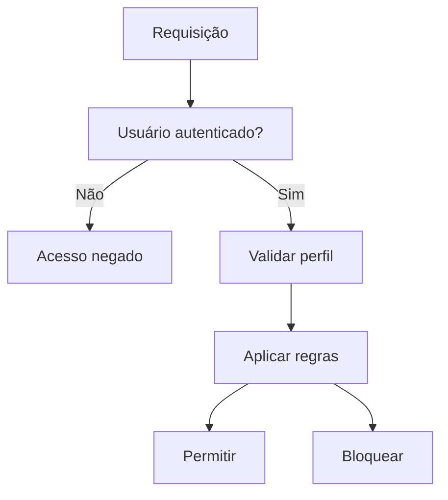
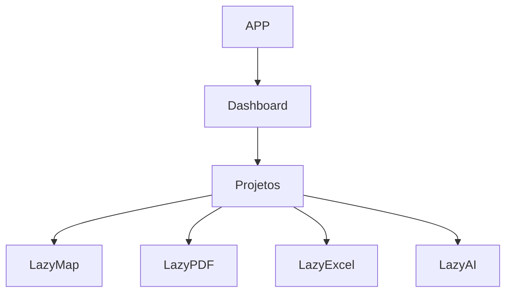
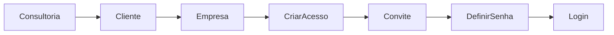

# PLANO-CURSOR-MELHORIAS-PONTUAIS-AMBIENTAR

## Objetivo

Este documento orienta agentes (Cursor AI, Copilot, Codex e similares) a realizar melhorias incrementais no AmbientaR sem alterar a arquitetura principal já definida.

Princípio:

> Evoluir sem reescrever.
> Refatorar sem reconstruir.
> Simplificar sem desmontar.

---

# Diretriz Principal

O AmbientaR possui uma arquitetura pensada e funcional.

O objetivo NÃO é criar uma nova estrutura de projeto.

O objetivo é:

- reduzir erros;
- melhorar manutenção;
- diminuir riscos;
- aumentar estabilidade;
- melhorar performance;
- facilitar evolução futura.

---

# O que NÃO fazer

## Arquitetura

Não:

- criar novo monorepo;
- mover grandes blocos de arquivos;
- alterar estrutura principal de pastas;
- criar arquitetura paralela;
- criar DDD completo neste momento;
- criar abstrações desnecessárias.

## Firebase

Não:

- mover firestore.rules;
- criar cópia das regras na raiz;
- alterar coleções sem análise;
- alterar IDs existentes.

Fonte oficial:

```text
src/firebase/rules/firestore.rules
```

## Rotas

Não alterar:

```text
/registro
/login
/dashboard
/cadastro
/projetos
```

Sem justificativa documentada.

---

# O que fazer

## 1. Refatoração de arquivos grandes

Prioridade máxima.

Exemplo:

```text
src/app/register/page.tsx
```

Objetivo:

- dividir componentes internos;
- manter mesma rota;
- manter mesmo comportamento;
- manter mesma UX.

### Estrutura sugerida

```text
src/features/register/

RegisterProfileChoice.tsx
RegisterInviteOnlyCard.tsx
RegisterPersonalStep.tsx
RegisterPackageStep.tsx
RegisterContractStep.tsx
RegisterPaymentStep.tsx
```

### Critério de aceite

- mesma funcionalidade;
- mesmo fluxo;
- typecheck sem erros.

---

## 2. Padronização de imports

Substituir apenas imports problemáticos.

Exemplo:

```ts
../../../../lib/firebase
```

por

```ts
@/lib/firebase
```

Somente onde o alias já estiver configurado.

---

## 3. Redução de duplicações

Localizar:

- máscaras;
- validadores;
- formatadores;
- helpers;
- permissões.

Consolidar apenas quando houver duplicação real.

---

## 4. Firestore Rules

Objetivo:

- melhorar legibilidade;
- adicionar comentários;
- adicionar helpers reutilizáveis;
- reduzir risco de erro.

Não alterar comportamento sem documentação.

Fluxo:



---

## 5. Performance

Aplicar lazy loading apenas em módulos pesados.

### Candidatos

```text
Leaflet
Turf
PDF
DOCX
XLSX
Mapas
IA
```

### Fluxo



---

## 6. Cadastro

Manter regra de negócio atual.

### Cadastro Público

```text
Cliente Autônomo
Representante
Consultor-Representante
```

### Cadastro Interno

```text
Cliente Gestão
Administrador
Gestor
Supervisor
```

Fluxo:



---

# Processo obrigatório antes de merge

Executar:

```bash
npm run typecheck
npm run lint
npm run build
npm run apphosting:check
```

Nenhuma alteração pode ser aprovada sem passar nesses comandos.

---

# Ordem de Prioridade

## Prioridade 1

Refatorar arquivos com mais de 1000 linhas.

## Prioridade 2

Auditar Firestore Rules.

## Prioridade 3

Corrigir warnings TypeScript.

## Prioridade 4

Otimizar bundle.

## Prioridade 5

Melhorar UX mobile.

---

# Critério Final

Toda melhoria deve:

- reduzir risco;
- reduzir complexidade;
- reduzir manutenção;
- manter compatibilidade;
- preservar arquitetura existente.

Se houver dúvida:

> Escolher sempre a solução mais simples e menos invasiva.
