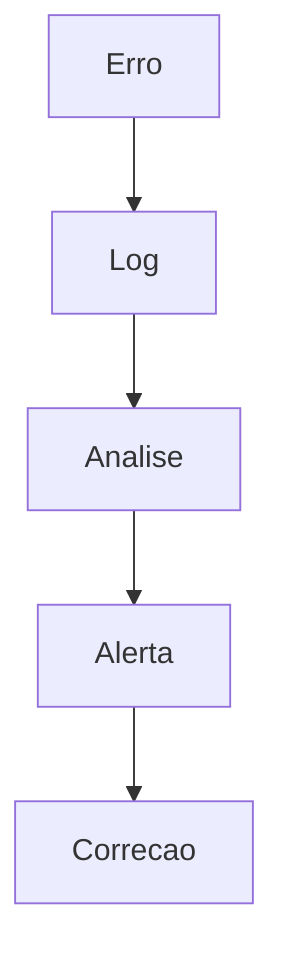

# PLANO CURSOR - MONITORAMENTO E LOGS

## Objetivo
Detectar falhas rapidamente.

## Itens
- Cloud Logging
- Firebase Errors
- Frontend Errors
- Auditoria

## Fluxo

```mermaid
flowchart TD
Erro-->Log
Log-->Analise
Analise-->Alerta
Alerta-->Correcao
```
