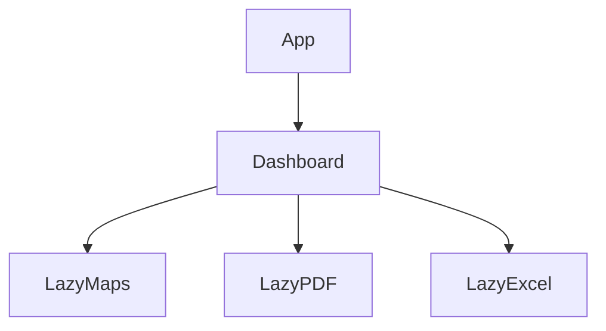

# PLANO CURSOR - PERFORMANCE E BUNDLE

## Objetivo
Reduzir bundle e tempo de carregamento.

## Alvos
- Leaflet
- Turf
- XLSX
- PDF
- DOCX

## Estratégia
- Dynamic import
- Lazy loading
- Code splitting

## Fluxo

