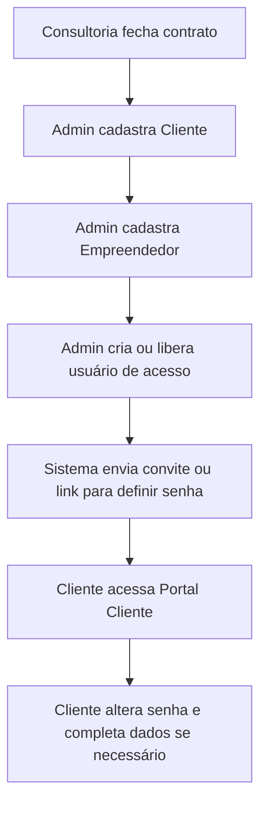
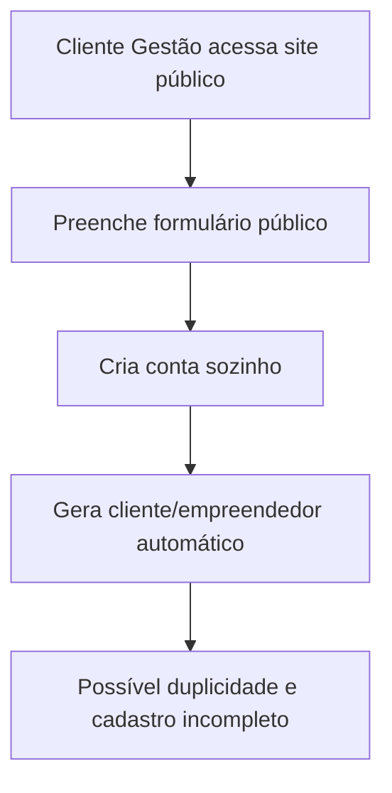
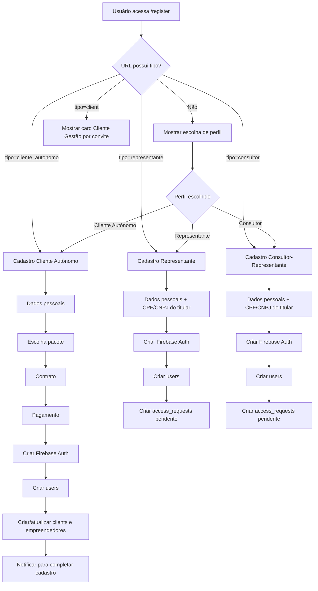
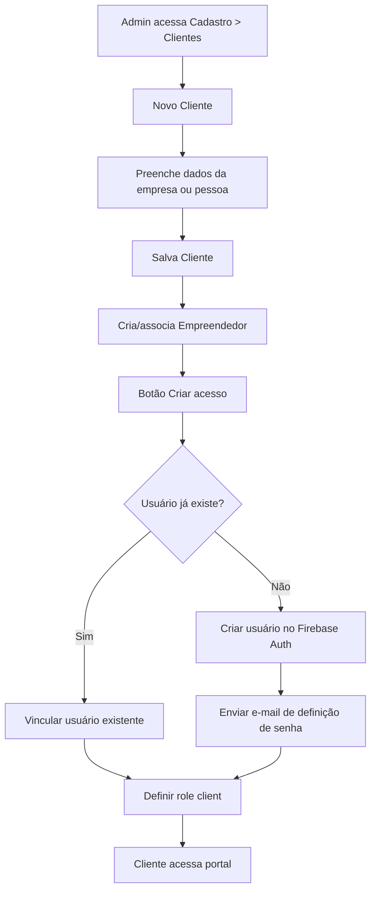
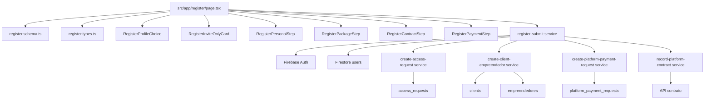
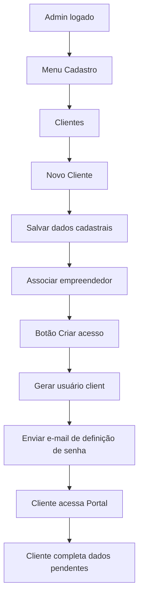

# Plano para o Agente Cursor.ai — Refatoração do Cadastro Público do AmbientaR

## Projeto

**AmbientaR / EcoGestão MG**

Aplicação Next.js 14 PWA de gestão ambiental para pequenas consultorias em Minas Gerais, com interface em português e backend Firebase Auth, Firestore e Storage.

Repositório:

```text
allanbeckk-cmyk/AmbientaR
```

Branch principal:

```text
main
```

Servidor local:

```text
http://localhost:9002
```

Comandos principais:

```bash
npm install
npm run dev
npm run dev:turbo
npm run build
npm run lint
npm run typecheck
npm run apphosting:check
npm run deploy:rules
```

---

# 1. Objetivo da tarefa

Refatorar a página pública de cadastro do AmbientaR para torná-la mais simples, modular, segura e alinhada ao fluxo real da consultoria ambiental.

O principal arquivo atual é:

```text
src/app/register/page.tsx
```

Este arquivo está muito grande e mistura muitas responsabilidades:

```text
UI
validação
Firebase Auth
Firestore
planos
contrato
pagamento
PIX
notificações
criação de cliente
criação de empreendedor
pedido de acesso
onboarding
```

O objetivo **não é reescrever tudo de uma vez**. A primeira etapa deve ser uma refatoração segura, com mudança mínima de comportamento.

---

# 2. Regra de negócio principal

## Cliente Gestão não deve ter auto-cadastro público

O perfil **Cliente Gestão** representa cliente atendido diretamente pela consultoria. Esse acesso deve ser criado internamente pela equipe administrativa da consultoria.

Fluxo correto:



Fluxo incorreto:



Portanto, na tela pública `/register`, devem existir somente perfis públicos.

---

# 3. Perfis públicos e internos

## Perfis públicos permitidos em `/register`

```text
Cliente Autônomo
Representante
Consultor-Representante
```

## Perfis internos, criados pela consultoria

```text
Cliente Gestão
Administrador
Gestor
Supervisor
Equipe interna
```

---

# 4. Diagnóstico atual

O código atual já possui parte da regra correta.

Foi identificado que `src/app/register/page.tsx` já trata `Cliente Gestão` como acesso por convite quando a URL recebe `?tipo=client`.

O texto atual indica:

```text
Cliente Gestão — acesso por convite
Titulares com assessoria da consultoria não se cadastram aqui.
A Pimenta cria seu acesso após o contrato e envia um e-mail para definir a senha.
```

Também foi visto que a escolha pública de perfil já oferece:

```text
Cliente Autônomo
Sou Representante
Consultor-Representante
```

Ou seja: a regra de negócio está quase correta. O problema principal é arquitetural: o arquivo está grande demais e difícil de manter.

---

# 5. Objetivo técnico da primeira refatoração

Transformar:

```text
src/app/register/page.tsx
```

em uma página orquestradora pequena.

Meta aproximada:

```text
Antes: ~1900 linhas
Depois: 150 a 300 linhas
```

A lógica deve ser extraída para módulos em `src/features/register`.

---

# 6. Estrutura alvo

Criar a seguinte estrutura:

```text
src/
  features/
    register/
      components/
        RegisterInviteOnlyCard.tsx
        RegisterProfileChoice.tsx
        RegisterStepIndicator.tsx
        RegisterPersonalStep.tsx
        RegisterPackageStep.tsx
        RegisterContractStep.tsx
        RegisterPaymentStep.tsx
      services/
        register-submit.service.ts
        create-access-request.service.ts
        create-client-empreendedor.service.ts
        create-platform-payment-request.service.ts
        record-platform-contract.service.ts
      schemas/
        register.schema.ts
      types/
        register.types.ts
      constants/
        profile-choice-text.ts
        package-icons.tsx
```

Manter:

```text
src/app/register/page.tsx
```

como entrada da rota.

---

# 7. Escopo da Fase 1

## Fazer agora

1. Criar `src/features/register`.
2. Extrair tipos do cadastro.
3. Extrair schema Zod.
4. Extrair textos dos perfis.
5. Extrair componentes visuais.
6. Extrair serviços auxiliares quando seguro.
7. Manter comportamento atual.
8. Garantir que `Cliente Gestão` continue apenas por convite.
9. Rodar validações.

## Não fazer ainda

1. Não alterar Firestore Rules.
2. Não alterar modelo de dados.
3. Não alterar cobrança/pagamento.
4. Não trocar Firebase Auth.
5. Não criar Cloud Function nova ainda.
6. Não remover `cliente_autonomo`, `representative` ou `consultor_representante`.
7. Não mudar URLs públicas sem necessidade.

---

# 8. Fluxo atual simplificado do cadastro público



---

# 9. Fluxo alvo do cadastro público

```mermaid
flowchart TD
  A[/register] --> B[Escolha de perfil público]
  B --> C[Cliente Autônomo]
  B --> D[Representante]
  B --> E[Consultor-Representante]

  C --> F[Formulário em etapas]
  F --> G[Pacote]
  G --> H[Contrato]
  H --> I[Pagamento]
  I --> J[Serviço: criar conta titular autônomo]

  D --> K[Formulário único]
  K --> L[Serviço: criar pedido de acesso]

  E --> M[Formulário único]
  M --> N[Serviço: criar pedido de acesso consultor]

  J --> O[Firestore]
  L --> O
  N --> O

  O --> P[Redirecionar]
```

---

# 10. Fluxo interno recomendado para Cliente Gestão

Esta parte pode ser implementada em fase posterior.



---

# 11. Organização recomendada dos arquivos

## `src/app/register/page.tsx`

Responsabilidades finais:

```text
Ler searchParams
Controlar modo selecionado
Controlar step atual
Montar provider/form
Chamar componentes
Chamar submit service
Renderizar fallback Suspense
```

Evitar dentro dele:

```text
lógica detalhada de Firestore
lógica de pagamento
lógica de contrato
textos longos
componentes grandes
schema Zod extenso
```

---

## `schemas/register.schema.ts`

Responsável por:

```text
formSchema
FormValues
validação de senha
validação de pacote
validação de aceite contratual
validação de opt-in comercial
```

Exemplo esperado:

```ts
export const registerFormSchema = z.object(...)
export type RegisterFormValues = z.infer<typeof registerFormSchema>
```

---

## `types/register.types.ts`

Responsável por:

```text
RegisterProfileMode
RegisterStep
RegisterSubmitContext
RegisterLinkedEntities
```

Exemplo:

```ts
export type RegisterProfileMode =
  | "cliente_autonomo"
  | "representative"
  | "consultor_representante";
```

Importante: não incluir `client` como modo selecionável público. `client` deve ser tratado como parâmetro legado/convite.

---

## `constants/profile-choice-text.ts`

Responsável por textos:

```text
intro
cliente_autonomo
representative
consultor_representante
clientGestaoInviteOnly
```

---

## `components/RegisterProfileChoice.tsx`

Responsável por renderizar:

```text
Cliente Autônomo
Representante
Consultor-Representante
Voltar ao início
Login
```

Não deve conter lógica Firebase.

---

## `components/RegisterInviteOnlyCard.tsx`

Responsável por renderizar mensagem de Cliente Gestão por convite.

Deve explicar:

```text
Cliente Gestão é criado pela consultoria.
O cliente recebe convite ou link para definir senha.
Se já recebeu convite, deve ir para login.
```

---

## `components/RegisterPersonalStep.tsx`

Responsável por:

```text
CPF pessoal
CPF/CNPJ do titular
nome
e-mail
telefone
senha
confirmar senha
botões cancelar/próximo/concluir
```

Não deve fazer `createUserWithEmailAndPassword`.

Pode receber callbacks:

```ts
onCancel
onNext
onSubmit
onTitularDocumentBlur
```

---

## `components/RegisterPackageStep.tsx`

Responsável por:

```text
listar pacotes
selecionar pacote
botões voltar/cancelar/próximo
```

---

## `components/RegisterContractStep.tsx`

Responsável por:

```text
mostrar contrato
checkbox aceite
checkbox marketing quando necessário
botões voltar/cancelar/próximo
```

---

## `components/RegisterPaymentStep.tsx`

Responsável por:

```text
valor anual
forma de pagamento
PIX
cartão em integração
confirmação de pagamento
botão concluir
```

---

# 12. Serviços recomendados

## `services/register-submit.service.ts`

Orquestra o submit.

Deve receber um objeto de contexto:

```ts
export async function submitRegisterForm(input: SubmitRegisterInput): Promise<SubmitRegisterResult>
```

Responsabilidades:

```text
validar Firebase disponível
bloquear admin bootstrap
criar Auth user
criar documento users
chamar serviços auxiliares conforme modo
retornar resultado para UI exibir toast e redirecionar
```

---

## `services/create-access-request.service.ts`

Responsável por criar registros em:

```text
access_requests
```

Para:

```text
representative
consultor_representante
```

---

## `services/create-client-empreendedor.service.ts`

Responsável por criar ou atualizar:

```text
clients
empreendedores
```

Para:

```text
cliente_autonomo
```

---

## `services/create-platform-payment-request.service.ts`

Responsável por criar:

```text
platform_payment_requests
```

Quando pagamento anual exigir verificação.

---

## `services/record-platform-contract.service.ts`

Responsável por chamar:

```text
/api/platform-subscription-contract/record
```

---

# 13. Cuidados obrigatórios

## Firebase Auth

Manter:

```ts
createUserWithEmailAndPassword(auth, email, password)
```

nesta primeira fase.

Não substituir por Admin SDK agora.

---

## Cliente Gestão

Não permitir auto-cadastro público para `client`.

Se URL for:

```text
/register?tipo=client
```

mostrar apenas card explicativo.

---

## Redirecionamento

Manter comportamento atual:

```ts
router.push("/")
```

ou, se já houver regra interna no app, não alterar nesta fase.

---

## Imports

Usar aliases atuais:

```ts
@/...
```

Não criar alias novo nesta primeira PR, a menos que seja estritamente necessário.

---

## Firestore Rules

Não mover regras.

Fonte única:

```text
src/firebase/rules/firestore.rules
```

Deploy:

```bash
npm run deploy:rules
```

---

# 14. Critérios de aceite

A tarefa só está pronta se:

```text
npm run typecheck
npm run lint
npm run build
npm run apphosting:check
```

passarem, ou se houver erro já existente e documentado.

Além disso:

1. `/register` abre normalmente.
2. `/register?tipo=client` mostra Cliente Gestão por convite.
3. Cliente Autônomo consegue avançar pelas etapas.
4. Representante vê etapa única.
5. Consultor-Representante vê etapa única.
6. Cliente Gestão não aparece como opção pública de auto-cadastro.
7. Nenhuma regra Firestore foi duplicada na raiz.
8. O arquivo `src/app/register/page.tsx` ficou menor.
9. Nenhuma lógica sensível foi removida sem substituição.

---

# 15. Plano de execução sugerido para o Cursor

## Passo 1 — Criar branch local

```bash
git checkout main
git pull origin main
git checkout -b refactor/cadastro-publico
```

---

## Passo 2 — Criar pastas

```bash
mkdir -p src/features/register/components
mkdir -p src/features/register/services
mkdir -p src/features/register/schemas
mkdir -p src/features/register/types
mkdir -p src/features/register/constants
```

---

## Passo 3 — Extrair tipos

Criar:

```text
src/features/register/types/register.types.ts
```

Mover para lá:

```text
RegisterProfileMode
FormValues ou RegisterFormValues
possíveis tipos auxiliares do cadastro
```

---

## Passo 4 — Extrair schema

Criar:

```text
src/features/register/schemas/register.schema.ts
```

Mover:

```text
formSchema
zod refinements
```

---

## Passo 5 — Extrair textos

Criar:

```text
src/features/register/constants/profile-choice-text.ts
```

Mover:

```text
PROFILE_CHOICE_TEXT
```

---

## Passo 6 — Extrair componentes simples primeiro

Começar pelos menores:

```text
RegisterInviteOnlyCard.tsx
RegisterProfileChoice.tsx
RegisterStepIndicator.tsx
```

Depois extrair:

```text
RegisterPersonalStep.tsx
RegisterPackageStep.tsx
RegisterContractStep.tsx
RegisterPaymentStep.tsx
```

---

## Passo 7 — Só depois extrair serviços

Após a UI estar separada, extrair os serviços com cuidado.

Prioridade:

```text
create-access-request.service.ts
create-client-empreendedor.service.ts
create-platform-payment-request.service.ts
record-platform-contract.service.ts
register-submit.service.ts
```

---

## Passo 8 — Validar

Rodar:

```bash
npm run typecheck
npm run lint
npm run build
npm run apphosting:check
```

---

# 16. Proposta de nova arquitetura do cadastro



---

# 17. Estado futuro desejado

Depois dessa refatoração, a próxima fase pode implementar o fluxo interno de Cliente Gestão.

## Novo fluxo interno



Coleções prováveis:

```text
users
clients
empreendedores
notifications
```

Campos recomendados para o usuário criado internamente:

```ts
{
  uid: string,
  name: string,
  email: string,
  phone?: string,
  role: "client",
  status: "pending_password_setup" | "active",
  cadastroIncompleto: true,
  linkedClientId: string,
  linkedEmpreendedorId?: string,
  createdBy: adminUid,
  createdAt: serverTimestamp(),
  invitedAt: serverTimestamp()
}
```

---

# 18. Observação sobre senha padrão

Evitar senha padrão sempre que possível.

Melhor fluxo:

```text
Admin cria acesso
Sistema envia link de definição de senha
Cliente define senha
Cliente acessa
```

Senha padrão gera risco de segurança e suporte.

Se for obrigatório usar senha padrão temporária, exigir troca no primeiro login.

---

# 19. Checklist final para PR

Antes de abrir PR, garantir:

```text
[ ] page.tsx reduzido
[ ] componentes extraídos
[ ] schema extraído
[ ] tipos extraídos
[ ] textos extraídos
[ ] Cliente Gestão continua invite-only
[ ] Cliente Autônomo funciona
[ ] Representante funciona
[ ] Consultor-Representante funciona
[ ] sem alteração em firestore.rules
[ ] sem criação de arquivo firestore.rules na raiz
[ ] npm run typecheck executado
[ ] npm run lint executado
[ ] npm run build executado
[ ] npm run apphosting:check executado
```

---

# 20. Mensagem sugerida para commit

```text
refactor(register): modularizar cadastro público e manter Cliente Gestão por convite
```

---

# 21. Mensagem sugerida para PR

```markdown
## Resumo

Refatora a página pública de cadastro para separar UI, schema, tipos e serviços em `src/features/register`, mantendo o comportamento atual.

## Regras preservadas

- Cliente Gestão continua somente por convite da consultoria.
- Cadastro público mantém Cliente Autônomo, Representante e Consultor-Representante.
- Nenhuma regra Firestore foi alterada.

## Validações

- [ ] npm run typecheck
- [ ] npm run lint
- [ ] npm run build
- [ ] npm run apphosting:check
```

---

# 22. Prioridade máxima para o agente

Não tentar resolver todos os problemas do cadastro em uma única mudança.

Esta PR deve ser de organização e redução de risco.

A mudança de fluxo interno para Cliente Gestão deve ficar para uma segunda PR.

