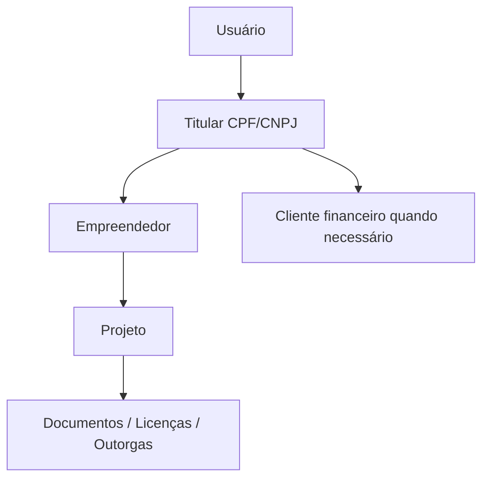

# PLANO F2 — TITULARIDADE E IDENTIDADE AMBIENTAR

## Objetivo
Padronizar a relação entre `users`, `clients`, `empreendedores` e projetos sem criar uma nova arquitetura nem migrar tudo de uma vez.

## Princípio
Usuário é login. Titular é CPF/CNPJ. Empreendedor é o cadastro ambiental. Cliente é o cadastro financeiro.



## Manter coleções atuais
- `users`
- `clients`
- `empreendedores`
- `projects`
- `access_requests`

## Campos novos compatíveis
```ts
ownerUserId?: string;
titularDocument?: string;
titularType?: "pessoa_fisica" | "pessoa_juridica";
cadastroIncompleto?: boolean;
onboardingStep?: string;
sourceClientId?: string;
```

## Campos legados que não remover
```text
cpf
userCpf
cnpjs
cpfCnpj
userId
approvedUserIds
approvedConsultorIds
portalUserIds
```

## Etapas para Cursor AI

### Etapa 1 — Auditar uso atual
Buscar no projeto:
```text
cpfCnpj
userId
ownerUserId
titularDocument
approvedUserIds
approvedConsultorIds
portalUserIds
sourceClientId
```
Gerar:
```text
docs/auditorias/f2-titularidade/campos-usados.md
```

### Etapa 2 — Criar helper
Arquivo:
```text
src/lib/titularidade.ts
```

Código sugerido:
```ts
import type { AppUser } from "@/lib/types";
import { normalizeCpfCnpj, buildCpfCnpjIdentityFields } from "@/lib/cpf-cnpj";

export function resolveOwnerUserId(record: { ownerUserId?: string; userId?: string }) {
  return record.ownerUserId || record.userId;
}

export function resolveTitularDocument(record: { titularDocument?: string; cpfCnpj?: string }) {
  return normalizeCpfCnpj(record.titularDocument || record.cpfCnpj || "");
}

export function buildTitularCompatibilityFields(rawDocument: string, uid?: string) {
  const identity = buildCpfCnpjIdentityFields(rawDocument);
  return {
    cpfCnpj: identity.cpfCnpj,
    titularDocument: identity.titularDocument,
    titularType: identity.titularType,
    entityType: identity.entityType,
    ...(uid ? { ownerUserId: uid, userId: uid } : {}),
  };
}

export function userCanOwnRecord(
  user: Pick<AppUser, "uid" | "id" | "role"> | null | undefined,
  record: { ownerUserId?: string; userId?: string },
) {
  const uid = user?.uid || user?.id;
  return !!uid && (record.ownerUserId === uid || record.userId === uid);
}
```

### Etapa 3 — Aplicar só em fluxos novos
Usar nos novos cadastros e vínculos, sem migrar documentos antigos.

### Etapa 4 — Compatibilidade em leitura
Toda consulta por dono deve aceitar:
```text
ownerUserId == uid OU userId == uid
```

## Critérios de aceite
- Nenhuma coleção obrigatória nova.
- Usuários antigos continuam funcionando.
- Novos registros gravam `ownerUserId` e `titularDocument`.
- `typecheck`, `lint`, `build` e `apphosting:check` passam.
