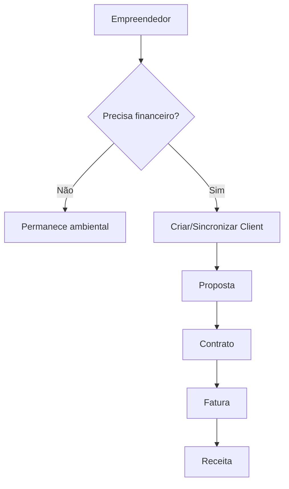

# PLANO F3 — CLIENTE FINANCEIRO E SINCRONIZAÇÃO

## Objetivo
Separar cadastro ambiental (`empreendedores`) do cadastro financeiro/CRM (`clients`) sem quebrar produção.

## Decisão
Nem todo empreendedor deve gerar cliente financeiro automaticamente. `Client` deve ser criado quando houver proposta, contrato, fatura, cobrança ou portal Cliente Gestão.



## Campos de compatibilidade
Em `clients`:
```ts
titularDocument?: string;
titularType?: "pessoa_fisica" | "pessoa_juridica";
sourceEmpreendedorId?: string;
ownerUserId?: string;
portalUserIds?: string[];
```

Em `empreendedores`:
```ts
sourceClientId?: string;
ownerUserId?: string;
titularDocument?: string;
```

## Etapas para Cursor AI

### Etapa 1 — Auditar criação de clients
Buscar:
```text
collection(firestore, "clients")
setDoc(doc(firestore, "clients"
addDoc(collection(firestore, "clients"
```

Gerar:
```text
docs/auditorias/f3-cliente-financeiro/pontos-de-criacao.md
```

### Etapa 2 — Criar helper de sincronização
Arquivo:
```text
src/lib/client-financeiro-sync.ts
```

Código sugerido:
```ts
import { doc, setDoc, updateDoc, serverTimestamp, type Firestore } from "firebase/firestore";
import { buildCpfCnpjIdentityFields } from "@/lib/cpf-cnpj";

export async function createOrUpdateClientFromEmpreendedor(input: {
  firestore: Firestore;
  empreendedorId: string;
  uid?: string;
  name: string;
  email?: string;
  phone?: string;
  cpfCnpj: string;
  address?: string;
  numero?: string;
  bairro?: string;
  municipio?: string;
  uf?: string;
  cep?: string;
}) {
  const identity = buildCpfCnpjIdentityFields(input.cpfCnpj);
  const clientRef = doc(input.firestore, "clients", input.empreendedorId);

  await setDoc(clientRef, {
    name: input.name,
    email: input.email || "",
    phone: input.phone || "",
    address: input.address || "",
    numero: input.numero || "",
    bairro: input.bairro || "",
    municipio: input.municipio || "",
    uf: input.uf || "",
    cep: input.cep || "",
    cpfCnpj: identity.cpfCnpj,
    titularDocument: identity.titularDocument,
    titularType: identity.titularType,
    entityType: identity.entityType,
    sourceEmpreendedorId: input.empreendedorId,
    ...(input.uid ? { ownerUserId: input.uid, userId: input.uid } : {}),
    updatedAt: serverTimestamp(),
  }, { merge: true });

  await updateDoc(doc(input.firestore, "empreendedores", input.empreendedorId), {
    sourceClientId: input.empreendedorId,
    updatedAt: serverTimestamp(),
  });
}
```

### Etapa 3 — Criar ação explícita
Botão:
```text
Criar/Sincronizar Cliente Financeiro
```

### Etapa 4 — Evitar duplicidade
Antes de criar `client`, buscar por `cpfCnpj`. Se existir, confirmar vínculo.

## Critérios de aceite
- Cliente Autônomo pode existir sem client financeiro completo.
- Empreendedor vira client por ação explícita.
- Não há duplicidade silenciosa.
- Financeiro continua lendo `clientId` legado.
