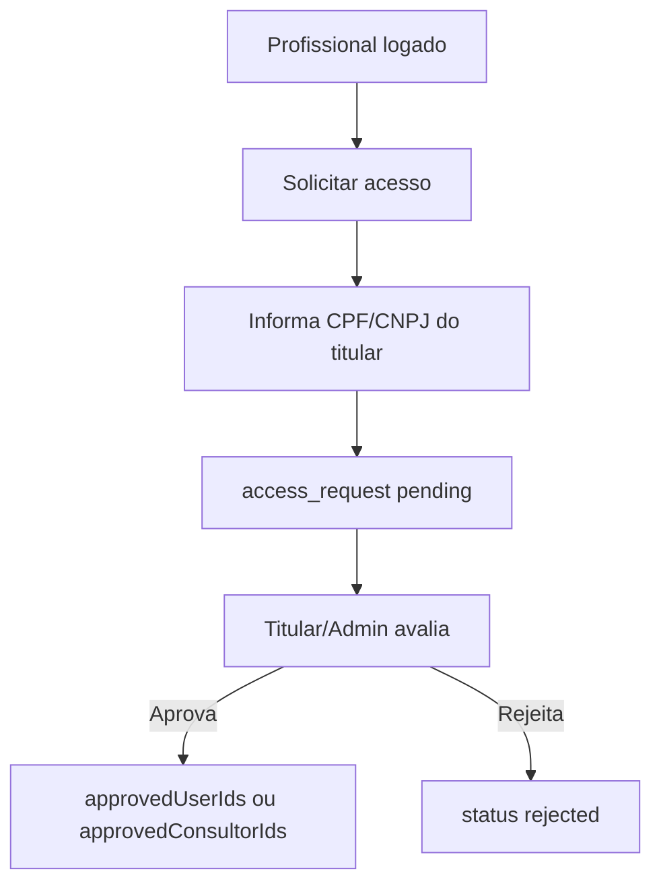

# PLANO F4 — REPRESENTAÇÃO, CONSULTORES E VÍNCULOS

## Objetivo
Padronizar o fluxo de representantes e consultores sem CPF/CNPJ no cadastro inicial.

## Regra
Representante e Consultor-Representante criam conta sem vínculo. Depois solicitam acesso informando CPF/CNPJ do titular.



## Campos atuais a preservar
```text
access_requests.cpfOfInterested
access_requests.requestedByUserId
access_requests.status
clients.approvedUserIds
clients.approvedConsultorIds
empreendedores.approvedUserIds
empreendedores.approvedConsultorIds
primaryConsultorUid
```

## Campos novos opcionais
```ts
targetDocument?: string;
approvedAt?: any;
approvedBy?: string;
rejectedAt?: any;
rejectedBy?: string;
linkStatus?: "pending_professional_ack" | "active" | "revoked";
expiresAt?: any;
```

## Etapas para Cursor AI

### Etapa 1 — Remover vínculo do cadastro
Em `src/app/register/page.tsx`:
- não renderizar CPF/CNPJ para representante/consultor;
- não criar `access_requests` no cadastro;
- gravar `pendingAccess: true`;
- gravar `onboardingStep: "solicitar_acesso"`.

### Etapa 2 — Criar componente
Arquivo:
```text
src/components/delegate-access-request-form.tsx
```

Deve:
- aceitar CPF/CNPJ do titular;
- validar com `isValidCpfCnpj`;
- gravar `cpfOfInterested` e `targetDocument`;
- status inicial `pending`.

### Etapa 3 — Aprovação
Ao aprovar:
```ts
if (requestType === "consultor_representante") {
  approvedConsultorIds: arrayUnion(requestedByUserId)
} else {
  approvedUserIds: arrayUnion(requestedByUserId)
}
```

Atualizar request:
```ts
status: "approved";
approvedAt: serverTimestamp();
approvedBy: currentUid;
```

### Etapa 4 — Revogação
Adicionar ação "Revogar acesso" com `arrayRemove(uid)` e auditoria.

## Critérios de aceite
- Representante cadastra sem CPF/CNPJ.
- Consultor cadastra sem CPF/CNPJ.
- Solicitação pós-login funciona.
- Acesso só ocorre após aprovação.
- Revogação remove acesso.
- App compila.
