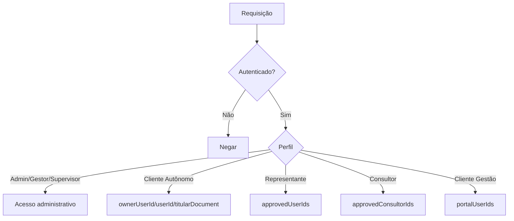

# PLANO F5 — PERMISSÕES, ESCOPO E SEGURANÇA

## Objetivo
Fortalecer RBAC/ABAC do AmbientaR preservando os perfis atuais e evitando abertura indevida de dados.

## Modelo
RBAC = papel do usuário.  
ABAC = escopo por `ownerUserId`, `userId`, `titularDocument`, `approvedUserIds`, `approvedConsultorIds`, `portalUserIds` e `access_requests`.



## Campos de escopo
```text
ownerUserId
userId
titularDocument
cpfCnpj
approvedUserIds
approvedConsultorIds
portalUserIds
requestedByUserId
targetDocument
cpfOfInterested
```

## Etapas para Cursor AI

### Etapa 1 — Auditar regras
Arquivo oficial:
```text
src/firebase/rules/firestore.rules
```
Não criar espelho na raiz.

Gerar:
```text
docs/auditorias/f5-permissoes/firestore-rules-auditoria.md
```

### Etapa 2 — Criar matriz de permissões
Arquivo:
```text
docs/arquitetura/matriz-permissoes.md
```

Tabela mínima:
```text
Coleção | Admin | Gestor | Supervisor | Cliente Autônomo | Cliente Gestão | Representante | Consultor
```

### Etapa 3 — Helpers nas rules
Padronizar helpers:
```js
function isSignedIn()
function userDoc()
function role()
function isAdminLike()
function isOwner(resource)
function hasRepresentativeAccess(resource)
function hasConsultorAccess(resource)
```

### Etapa 4 — Aplicar por coleção
Ordem segura:
1. `users`
2. `empreendedores`
3. `clients`
4. `access_requests`
5. `projects`
6. documentos/relatórios
7. financeiro

### Etapa 5 — Roteiro de teste
Testar:
- admin;
- cliente_autonomo;
- representative sem aprovação;
- representative aprovado;
- consultor aprovado;
- client Gestão.

## Regras conceituais

### Cliente Autônomo
Pode ler/escrever empreendedor se:
```text
ownerUserId == uid
OU userId == uid
OU titularDocument compatível com documento do usuário
```

### Representante
Pode ler somente se:
```text
uid em approvedUserIds
```

### Consultor-Representante
Pode operar se:
```text
uid em approvedConsultorIds
```

### Cliente Gestão
Pode ler dados financeiros/documentos se:
```text
portalUserIds contém uid
```

## Critérios de aceite
- Representante sem aprovação não acessa dados.
- Cliente Autônomo não vê terceiros.
- Admin mantém operação.
- `npm run deploy:rules` passa.
- `npm run apphosting:check` passa.
