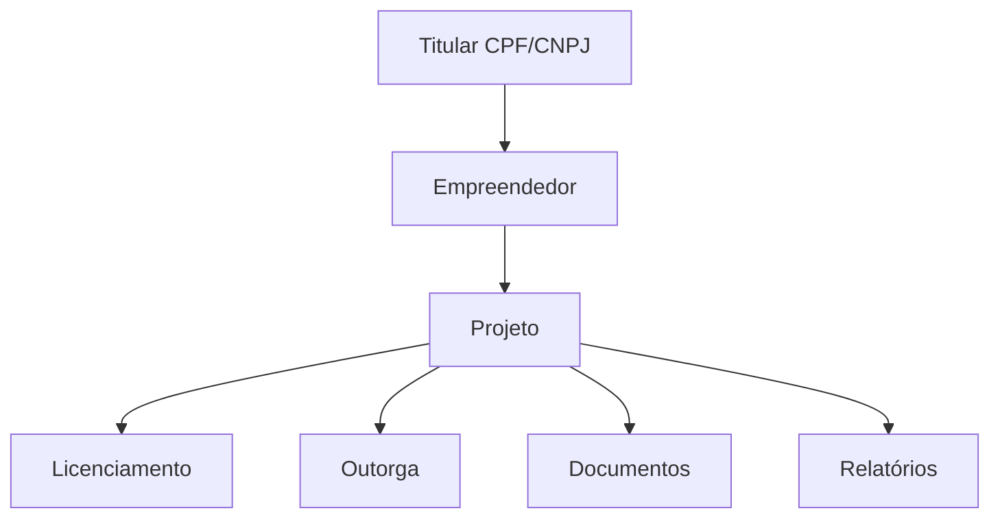

# PLANO F6 — EMPREENDIMENTOS, PROJETOS E ESTRUTURA OPERACIONAL

## Objetivo
Organizar a relação entre empreendedor, projetos, licenças, outorgas, documentos e relatórios sem migração radical.

## Modelo recomendado
```text
Empreendedor/Titular
  ├── Projetos
  ├── Licenças
  ├── Outorgas
  ├── CAR
  ├── Documentos
  └── Relatórios
```



## Campos recomendados em projetos e módulos
```ts
empreendedorId: string;
ownerUserId?: string;
titularDocument?: string;
clientId?: string;
createdBy?: string;
updatedAt?: any;
```

## Etapas para Cursor AI

### Etapa 1 — Auditar referências
Buscar:
```text
empreendedorId
clientId
projectId
createdBy
cpfCnpj
```

Gerar:
```text
docs/auditorias/f6-empreendimentos/referencias.md
```

### Etapa 2 — Regra de criação
Todo projeto novo deve exigir:
```text
empreendedorId
```

E copiar:
```text
ownerUserId
titularDocument
clientId se existir
```

### Etapa 3 — Evitar duplicidade
Antes de criar novo empreendedor:
- buscar por CPF/CNPJ;
- se existir, sugerir usar registro existente;
- se não, criar novo.

### Etapa 4 — Tela de detalhe do empreendedor
A tela deve mostrar:
```text
Dados cadastrais
Projetos
Licenças
Outorgas
Documentos
Representantes
Financeiro vinculado
```

### Etapa 5 — Onboarding
Cliente Autônomo após cadastro deve ir para:
```text
/empreendedores/{id}/edit
```
ou tela equivalente já existente.

### Etapa 6 — Filtro de escopo
Listas devem usar:
```text
fetchEmpreendedorIdsForPortalScope
```

Depois filtrar projetos por:
```text
empreendedorId in ids
```

## Critérios de aceite
- Novo projeto sempre ligado a empreendedor.
- Usuários antigos continuam acessando projetos.
- Não há duplicidade silenciosa.
- Tela do empreendedor vira central operacional.
- App compila.
