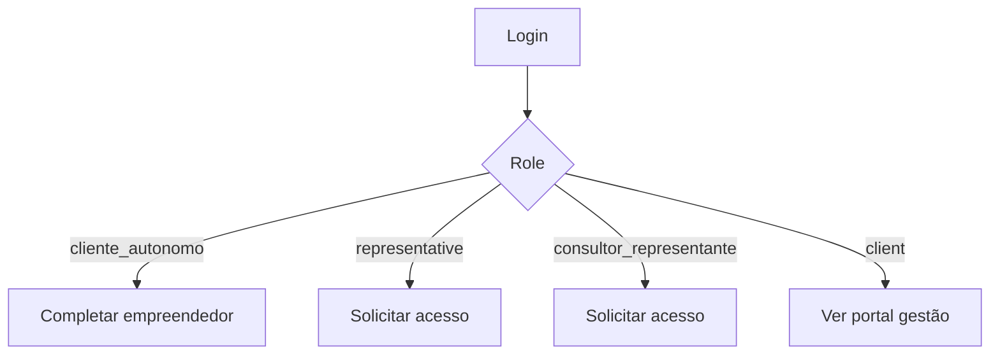

# PLANO F7 — PORTAL DO CLIENTE E ONBOARDING

## Objetivo
Organizar a experiência por perfil no portal, reduzindo cliques e deixando claro o próximo passo de cada usuário.

## Perfis

### Cliente Autônomo
```text
Meu empreendedor base
Meus projetos
Meus documentos
Minhas licenças/outorgas
Assinatura/plano
```

### Cliente Gestão
```text
Projetos acompanhados pela consultoria
Documentos liberados
Financeiro/faturas
Solicitações
Representantes autorizados
```

### Representante/Consultor
```text
Solicitar acesso
Carteira autorizada
Projetos autorizados
Tarefas operacionais
```

## Fluxo de onboarding



## Etapas para Cursor AI

### Etapa 1 — Criar componente
Arquivo:
```text
src/components/onboarding/portal-onboarding-card.tsx
```

Código base:
```tsx
"use client";

import Link from "next/link";
import { Button } from "@/components/ui/button";
import { Card, CardContent, CardHeader, CardTitle } from "@/components/ui/card";
import type { AppUser } from "@/lib/types";

export function PortalOnboardingCard({ user }: { user: AppUser }) {
  if (user.role === "cliente_autonomo" && user.cadastroIncompleto) {
    return (
      <Card>
        <CardHeader>
          <CardTitle>Complete seu cadastro ambiental</CardTitle>
        </CardHeader>
        <CardContent>
          <p className="text-sm text-muted-foreground">
            Revise os dados do seu empreendedor base e cadastre seu primeiro projeto.
          </p>
          <Button asChild className="mt-3">
            <Link href="/empreendedores">Continuar cadastro</Link>
          </Button>
        </CardContent>
      </Card>
    );
  }

  if (user.role === "representative" || user.role === "consultor_representante") {
    return (
      <Card>
        <CardHeader>
          <CardTitle>Solicite acesso a um titular</CardTitle>
        </CardHeader>
        <CardContent>
          <p className="text-sm text-muted-foreground">
            Informe o CPF ou CNPJ do cliente/empreendedor que você deseja representar.
          </p>
          <Button asChild className="mt-3">
            <Link href="/users">Solicitar acesso</Link>
          </Button>
        </CardContent>
      </Card>
    );
  }

  return null;
}
```

### Etapa 2 — Inserir no dashboard
Renderizar acima dos indicadores principais.

### Etapa 3 — Cliente Gestão
Garantir que `client` veja apenas registros com:
```text
portalUserIds contains uid
```
ou compatibilidade legada equivalente.

### Etapa 4 — Estados vazios
Criar empty states:
```text
sem projeto
sem documento
sem acesso aprovado
sem fatura
```

## Critérios de aceite
- Cliente Autônomo sabe o próximo passo.
- Representante sabe solicitar acesso.
- Cliente Gestão não vê dados indevidos.
- Mobile legível.
- App compila.
