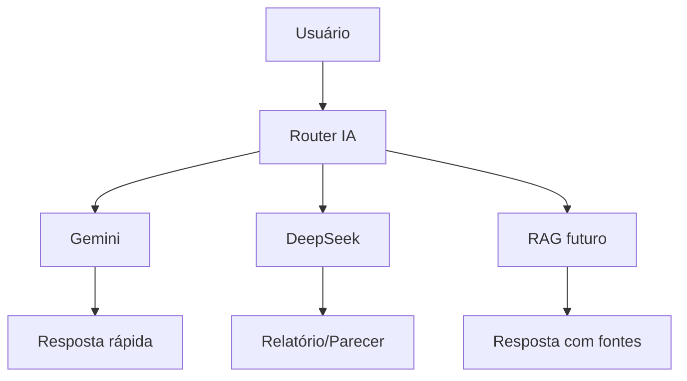
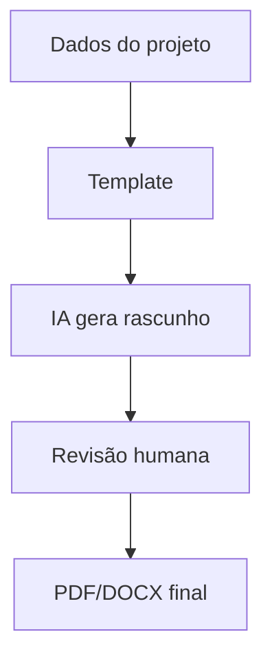

# PLANO F8 — IA JARVIS AMBIENTAL E RELATÓRIOS

## Objetivo
Organizar o uso de IA no AmbientaR com separação entre respostas rápidas, relatórios pesados, análise documental e RAG futuro.

## Princípio
```text
Gemini = chat rápido, triagem, sugestões e respostas curtas.
DeepSeek = relatórios longos, pareceres e análises complexas.
RAG futuro = legislação, documentos internos, normas e histórico.
```



## Etapas para Cursor AI

### Etapa 1 — Inventário IA
Buscar:
```text
genkit
gemini
deepseek
ai
flows
prompts
```

Gerar:
```text
docs/auditorias/f8-ia/inventario-ia.md
```

### Etapa 2 — Criar router de IA
Arquivo:
```text
src/lib/ai/ai-router.ts
```

Código:
```ts
export type AiTaskKind =
  | "chat_rapido"
  | "relatorio"
  | "parecer"
  | "analise_documental"
  | "resumo"
  | "classificacao";

export type AiProvider = "gemini" | "deepseek";

export function chooseAiProvider(task: AiTaskKind): AiProvider {
  if (task === "relatorio" || task === "parecer" || task === "analise_documental") {
    return "deepseek";
  }
  return "gemini";
}
```

### Etapa 3 — Padronizar prompts
Estrutura:
```text
src/lib/ai/prompts/
  relatorio-ambiental.ts
  parecer-tecnico.ts
  resumo-documental.ts
  chat-ambiental.ts
```

### Etapa 4 — Contexto mínimo
Não enviar tudo ao modelo. Enviar apenas:
```text
tipo de tarefa
empreendedorId
projectId
dados necessários
documentos selecionados
```

### Etapa 5 — Logs de IA
Criar coleção:
```text
ai_requests
```

Campos:
```ts
{
  userId: string;
  taskKind: string;
  provider: string;
  projectId?: string;
  empreendedorId?: string;
  status: "success" | "error";
  createdAt: any;
  tokensEstimate?: number;
  costEstimate?: number;
}
```

### Etapa 6 — Relatórios com revisão humana


Regra: IA gera rascunho; humano aprova.

### Etapa 7 — RAG futuro
Não implementar agora se gerar risco. Preparar:
```text
src/lib/ai/rag/
docs/ia/rag-roadmap.md
```

Fontes futuras:
```text
Legislação ambiental
Normas FEAM/SEMAD/IBAMA/IGAM
Documentos OneDrive/SharePoint
Histórico de relatórios
```

## Critérios de aceite
- Chamadas passam por router.
- Relatórios usam DeepSeek.
- Chat rápido usa Gemini.
- Logs registram uso.
- IA não sobrescreve documento final sem revisão humana.
- Falha de IA não quebra app.
