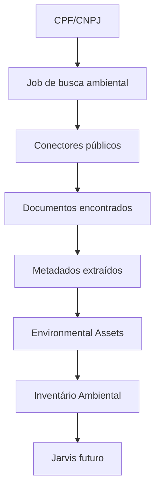
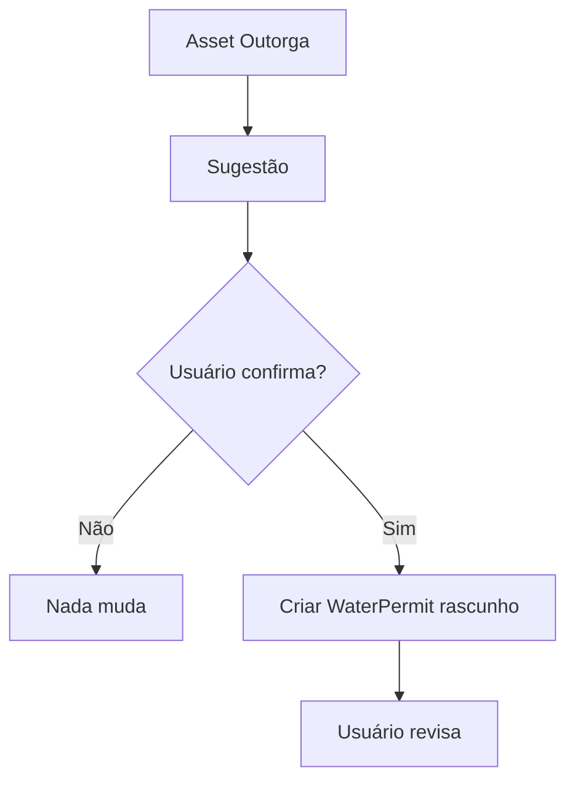

# VERSÃO 1.5 — EVOLUÇÃO SEGURA DO MÓDULO DE DOCUMENTOS AMBIENTAIS

**Projeto:** AmbientaR / EcoGestão MG  
**Versão:** 1.5  
**Data de geração:** 2026-06-11  
**Destino:** Cursor AI / Agente de implementação  
**Princípio:** evoluir sem quebrar produção, sem migrações destrutivas e sem substituir fluxos existentes.

---

## Objetivo geral

Transformar o módulo de busca documental pública em uma camada estruturada de Inventário Ambiental, mantendo o módulo atual intacto e adicionando somente entidades complementares.

---

## Regras absolutas para o Cursor AI

1. Não remover rotas existentes.
2. Não renomear coleções existentes.
3. Não apagar campos legados.
4. Não alterar regras Firestore sem etapa própria.
5. Não mover módulos grandes na mesma PR.
6. Não implementar scraping que burle CAPTCHA, login ou bloqueio técnico.
7. Não expor CPF/CNPJ completo sem necessidade operacional.
8. Não criar dependência pesada no bundle inicial.
9. Toda fase precisa passar em:
   - `npm run typecheck`
   - `npm run lint`
   - `npm run build`
   - `npm run apphosting:check`
10. Toda alteração deve ser reversível.

---

## Compatibilidade obrigatória

Este plano deve preservar a estrutura atual do AmbientaR, incluindo:

- Clientes.
- Empreendedores.
- Empreendimentos / Projetos.
- Documentos Ambientais.
- Outorgas.
- Licenças.
- Condicionantes.
- CRM.
- Financeiro.
- Portal do Cliente.
- IA / Jarvis.
- Firestore Rules existentes.
- Storage.
- Rotas atuais.

---

# Parte 1 — Visão da Versão 1.5

A versão 1.5 é uma camada intermediária entre a busca documental simples e a inteligência ambiental completa.

A versão atual busca documentos. A versão 1.5 começa a transformar documentos em **ativos ambientais estruturados**.

Fluxo conceitual:



## O que muda

A busca continua funcionando como antes, mas passa a criar, opcionalmente, uma camada nova:

```text
environmental_assets
```

## O que não muda

As coleções atuais continuam válidas:

```text
clients
empreendedores
projects
licenses
outorgas
environmental_documents
```

Nenhuma tela existente deve ser quebrada.

---

# Parte 2 — Nova camada: Environmental Assets

## Conceito

Um `EnvironmentalAsset` representa um item ambiental relevante, independentemente do PDF.

Exemplos:

- Licença.
- Outorga.
- TAC.
- Condicionante.
- Uso insignificante.
- Processo SLA.
- Processo SIAM.
- Publicação oficial.
- Documento hídrico.

Documento é evidência. Asset é a entidade de negócio.

## Modelo TypeScript sugerido

```ts
export type EnvironmentalAssetType =
  | "license"
  | "outorga"
  | "tac"
  | "condicionante"
  | "uso_insignificante"
  | "processo_sla"
  | "processo_siam"
  | "publicacao_oficial"
  | "documento_complementar"
  | "unknown";

export type EnvironmentalAssetStatus =
  | "active"
  | "expired"
  | "pending"
  | "suspended"
  | "revoked"
  | "unknown";

export type EnvironmentalAsset = {
  id: string;

  tenantId?: string;
  clientId?: string;
  empreendedorId?: string;
  projectId?: string;

  assetType: EnvironmentalAssetType;
  status: EnvironmentalAssetStatus;

  title: string;
  number?: string;
  processNumber?: string;
  protocolNumber?: string;

  issuingAgency?: string;
  municipality?: string;
  state?: "MG" | string;

  issueDate?: string;
  expirationDate?: string;

  sourcePortal?: string;
  sourceUrl?: string;

  linkedDocumentIds?: string[];

  confidenceScore?: number;
  extractionMethod?: "manual" | "rule" | "ai" | "import";

  createdAt: string;
  updatedAt: string;
};
```

## Firestore

Coleção nova:

```text
environmental_assets
```

Subcoleções opcionais futuras:

```text
environmental_assets/{assetId}/events
environmental_assets/{assetId}/documents
environmental_assets/{assetId}/risks
```

Na versão 1.5, evitar subcoleções se isso aumentar complexidade. Começar simples.

---

# Parte 3 — Vinculação com documentos

Adicionar campo opcional, sem obrigatoriedade:

```ts
export type EnvironmentalDocumentPatchV15 = {
  assetId?: string;
  assetType?: EnvironmentalAssetType;
  assetConfidenceScore?: number;
};
```

## Regra

Não migrar documentos antigos em massa.

Quando um novo documento for processado:

1. Tentar identificar se ele representa um asset.
2. Se sim, criar ou atualizar `environmental_assets`.
3. Vincular `assetId` ao documento.
4. Se não houver confiança, manter apenas como documento.

---

# Parte 4 — AssetExtractorService

Criar serviço:

```text
src/lib/environmental-assets/asset-extractor-service.ts
```

ou, se já estiver em monorepo:

```text
packages/web-documents/src/assets/asset-extractor-service.ts
```

## Responsabilidade

O serviço deve:

- Ler título do documento.
- Ler tipo documental.
- Ler texto extraído, se existir.
- Detectar número de licença, outorga, TAC ou processo.
- Criar um asset com score de confiança.
- Evitar duplicidade por tipo + número + processo + CPF/CNPJ.

## Pseudocódigo

```ts
export async function extractAssetFromDocument(document: EnvironmentalDocument) {
  const text = `${document.title || ""} ${document.extractedTextPreview || ""}`.toLowerCase();

  const assetType = detectAssetType(text);
  if (assetType === "unknown") return null;

  const number = detectDocumentNumber(text, assetType);
  const processNumber = detectProcessNumber(text);

  const confidenceScore = calculateAssetConfidence({
    assetType,
    number,
    processNumber,
    sourcePortal: document.sourcePortal,
  });

  if (confidenceScore < 0.65) {
    return null;
  }

  return {
    assetType,
    title: buildAssetTitle(document, assetType, number),
    number,
    processNumber,
    status: inferAssetStatus(text),
    issuingAgency: document.issuer || document.orgao_emissor,
    municipality: document.municipality,
    sourcePortal: document.sourcePortal,
    sourceUrl: document.originalUrl,
    linkedDocumentIds: [document.id],
    confidenceScore,
    extractionMethod: "rule",
  };
}
```

---

# Parte 5 — Tela Inventário Ambiental

Criar nova tela sem alterar as antigas:

```text
/documentos-ambientais/inventario
```

## Menu

Adicionar dentro de Documentos Ambientais:

```text
Inventário Ambiental
```

## Componentes

```text
EnvironmentalAssetsPage
EnvironmentalAssetsTable
EnvironmentalAssetFilters
EnvironmentalAssetDetailDrawer
EnvironmentalAssetLinkedDocuments
```

## Filtros

- Tipo.
- Status.
- Órgão.
- Município.
- Data de emissão.
- Data de vencimento.
- Fonte.
- Cliente.
- Empreendedor.
- Grau de confiança.

## Ações

- Ver documentos vinculados.
- Vincular manualmente a cliente.
- Vincular manualmente a empreendedor.
- Vincular manualmente a projeto.
- Converter em outorga, quando assetType = outorga.
- Converter em licença, quando assetType = license.
- Ignorar asset.
- Marcar como revisado.

---

# Parte 6 — Regras de não quebra

## Não criar automaticamente registros operacionais

A versão 1.5 **não deve** criar automaticamente:

- Licença em `licenses`.
- Outorga em `outorgas`.
- Lead em CRM.
- Projeto.
- Fatura.
- Condicionante.

Deve apenas sugerir.

## Exemplo de sugestão

```text
Asset de outorga encontrado.
Deseja criar um registro em Outorgas usando esses dados?
```

O usuário confirma antes de gravar.

---

# Parte 7 — Integração futura com Hídrico.ai

Quando assetType for `outorga`, exibir sugestão:

```text
Ativar monitoramento hídrico
```

Mas não criar telemetria automaticamente.

Fluxo seguro:



---

# Parte 8 — Integração futura com CRM

Quando asset indicar risco ou oportunidade:

- Licença vencendo.
- Outorga vencendo.
- TAC sem evidência.
- Processo ambiental encontrado.

Criar apenas sugestão:

```text
Criar oportunidade comercial
```

Nenhuma oportunidade automática na versão 1.5.

---

# Parte 9 — Auditoria

Criar logs:

```text
environmental_asset_events
```

ou array simples inicial:

```ts
events?: EnvironmentalAssetEvent[]
```

Modelo:

```ts
export type EnvironmentalAssetEvent = {
  id: string;
  type:
    | "created_from_document"
    | "linked_document"
    | "manual_review"
    | "status_changed"
    | "suggested_conversion"
    | "ignored";

  userId?: string;
  timestamp: string;
  message?: string;
  metadata?: Record<string, unknown>;
};
```

---

# Parte 10 — Fases de implantação 1.5

## Fase 1.5.1 — Modelos

Criar tipos:

```text
EnvironmentalAsset
EnvironmentalAssetType
EnvironmentalAssetStatus
EnvironmentalAssetEvent
```

## Fase 1.5.2 — Coleção

Criar escrita em:

```text
environmental_assets
```

Sem rules novas complexas na primeira PR, mas garantindo que somente admin/technical/gestor possa criar.

## Fase 1.5.3 — Serviço extrator

Criar AssetExtractorService.

## Fase 1.5.4 — Vinculação opcional

Adicionar `assetId?: string` em documentos novos.

## Fase 1.5.5 — UI

Criar tela `/documentos-ambientais/inventario`.

## Fase 1.5.6 — Sugestões assistidas

Criar botões:

- Criar licença a partir do asset.
- Criar outorga a partir do asset.
- Criar oportunidade CRM.

Todos dependem de confirmação.

## Fase 1.5.7 — Jarvis preview

Adicionar apenas endpoint de resumo simples:

```text
Resumo do inventário ambiental
```

Sem IA pesada se não houver infraestrutura pronta.

---

# Parte 11 — Checklist final

- Nenhuma rota atual removida.
- Nenhuma coleção atual renomeada.
- Documentos antigos continuam funcionando.
- Assets são complementares.
- UI nova não bloqueia fluxo antigo.
- Conversões são manuais.
- Build passa.
- Apphosting check passa.

---

# Parte 12 — Detecção de tipo documental

## Objetivo

Implementar a etapa de **detecção de tipo documental** sem alterar fluxos existentes.

## Diretrizes

- Criar funções puras sempre que possível.
- Testar com fixtures.
- Não alterar dados existentes em massa.
- Registrar logs de decisões automáticas.
- Permitir revisão humana.

## Tarefas para Cursor AI

1. Criar arquivo específico para esta responsabilidade.
2. Adicionar testes unitários.
3. Integrar ao pipeline somente atrás de feature flag.
4. Garantir fallback quando houver erro.
5. Documentar no README do módulo.

## Critério de aceite

- A aplicação continua funcionando.
- A etapa pode ser desativada.
- O processamento não impede visualização dos documentos.
- O usuário consegue corrigir manualmente se necessário.

---

# Parte 13 — Normalização de número de processo

## Objetivo

Implementar a etapa de **normalização de número de processo** sem alterar fluxos existentes.

## Diretrizes

- Criar funções puras sempre que possível.
- Testar com fixtures.
- Não alterar dados existentes em massa.
- Registrar logs de decisões automáticas.
- Permitir revisão humana.

## Tarefas para Cursor AI

1. Criar arquivo específico para esta responsabilidade.
2. Adicionar testes unitários.
3. Integrar ao pipeline somente atrás de feature flag.
4. Garantir fallback quando houver erro.
5. Documentar no README do módulo.

## Critério de aceite

- A aplicação continua funcionando.
- A etapa pode ser desativada.
- O processamento não impede visualização dos documentos.
- O usuário consegue corrigir manualmente se necessário.

---

# Parte 14 — Deduplicação de assets

## Objetivo

Implementar a etapa de **deduplicação de assets** sem alterar fluxos existentes.

## Diretrizes

- Criar funções puras sempre que possível.
- Testar com fixtures.
- Não alterar dados existentes em massa.
- Registrar logs de decisões automáticas.
- Permitir revisão humana.

## Tarefas para Cursor AI

1. Criar arquivo específico para esta responsabilidade.
2. Adicionar testes unitários.
3. Integrar ao pipeline somente atrás de feature flag.
4. Garantir fallback quando houver erro.
5. Documentar no README do módulo.

## Critério de aceite

- A aplicação continua funcionando.
- A etapa pode ser desativada.
- O processamento não impede visualização dos documentos.
- O usuário consegue corrigir manualmente se necessário.

---

# Parte 15 — Critérios de confiança

## Objetivo

Implementar a etapa de **critérios de confiança** sem alterar fluxos existentes.

## Diretrizes

- Criar funções puras sempre que possível.
- Testar com fixtures.
- Não alterar dados existentes em massa.
- Registrar logs de decisões automáticas.
- Permitir revisão humana.

## Tarefas para Cursor AI

1. Criar arquivo específico para esta responsabilidade.
2. Adicionar testes unitários.
3. Integrar ao pipeline somente atrás de feature flag.
4. Garantir fallback quando houver erro.
5. Documentar no README do módulo.

## Critério de aceite

- A aplicação continua funcionando.
- A etapa pode ser desativada.
- O processamento não impede visualização dos documentos.
- O usuário consegue corrigir manualmente se necessário.

---

# Parte 16 — Revisão manual

## Objetivo

Implementar a etapa de **revisão manual** sem alterar fluxos existentes.

## Diretrizes

- Criar funções puras sempre que possível.
- Testar com fixtures.
- Não alterar dados existentes em massa.
- Registrar logs de decisões automáticas.
- Permitir revisão humana.

## Tarefas para Cursor AI

1. Criar arquivo específico para esta responsabilidade.
2. Adicionar testes unitários.
3. Integrar ao pipeline somente atrás de feature flag.
4. Garantir fallback quando houver erro.
5. Documentar no README do módulo.

## Critério de aceite

- A aplicação continua funcionando.
- A etapa pode ser desativada.
- O processamento não impede visualização dos documentos.
- O usuário consegue corrigir manualmente se necessário.

---

# Parte 17 — Vinculação com clientes

## Objetivo

Implementar a etapa de **vinculação com clientes** sem alterar fluxos existentes.

## Diretrizes

- Criar funções puras sempre que possível.
- Testar com fixtures.
- Não alterar dados existentes em massa.
- Registrar logs de decisões automáticas.
- Permitir revisão humana.

## Tarefas para Cursor AI

1. Criar arquivo específico para esta responsabilidade.
2. Adicionar testes unitários.
3. Integrar ao pipeline somente atrás de feature flag.
4. Garantir fallback quando houver erro.
5. Documentar no README do módulo.

## Critério de aceite

- A aplicação continua funcionando.
- A etapa pode ser desativada.
- O processamento não impede visualização dos documentos.
- O usuário consegue corrigir manualmente se necessário.

---

# Parte 18 — Vinculação com empreendedores

## Objetivo

Implementar a etapa de **vinculação com empreendedores** sem alterar fluxos existentes.

## Diretrizes

- Criar funções puras sempre que possível.
- Testar com fixtures.
- Não alterar dados existentes em massa.
- Registrar logs de decisões automáticas.
- Permitir revisão humana.

## Tarefas para Cursor AI

1. Criar arquivo específico para esta responsabilidade.
2. Adicionar testes unitários.
3. Integrar ao pipeline somente atrás de feature flag.
4. Garantir fallback quando houver erro.
5. Documentar no README do módulo.

## Critério de aceite

- A aplicação continua funcionando.
- A etapa pode ser desativada.
- O processamento não impede visualização dos documentos.
- O usuário consegue corrigir manualmente se necessário.

---

# Parte 19 — Vinculação com projetos

## Objetivo

Implementar a etapa de **vinculação com projetos** sem alterar fluxos existentes.

## Diretrizes

- Criar funções puras sempre que possível.
- Testar com fixtures.
- Não alterar dados existentes em massa.
- Registrar logs de decisões automáticas.
- Permitir revisão humana.

## Tarefas para Cursor AI

1. Criar arquivo específico para esta responsabilidade.
2. Adicionar testes unitários.
3. Integrar ao pipeline somente atrás de feature flag.
4. Garantir fallback quando houver erro.
5. Documentar no README do módulo.

## Critério de aceite

- A aplicação continua funcionando.
- A etapa pode ser desativada.
- O processamento não impede visualização dos documentos.
- O usuário consegue corrigir manualmente se necessário.

---

# Parte 20 — Sugestões de oportunidade

## Objetivo

Implementar a etapa de **sugestões de oportunidade** sem alterar fluxos existentes.

## Diretrizes

- Criar funções puras sempre que possível.
- Testar com fixtures.
- Não alterar dados existentes em massa.
- Registrar logs de decisões automáticas.
- Permitir revisão humana.

## Tarefas para Cursor AI

1. Criar arquivo específico para esta responsabilidade.
2. Adicionar testes unitários.
3. Integrar ao pipeline somente atrás de feature flag.
4. Garantir fallback quando houver erro.
5. Documentar no README do módulo.

## Critério de aceite

- A aplicação continua funcionando.
- A etapa pode ser desativada.
- O processamento não impede visualização dos documentos.
- O usuário consegue corrigir manualmente se necessário.

---

# Parte 21 — Preparação para condicionantes

## Objetivo

Implementar a etapa de **preparação para condicionantes** sem alterar fluxos existentes.

## Diretrizes

- Criar funções puras sempre que possível.
- Testar com fixtures.
- Não alterar dados existentes em massa.
- Registrar logs de decisões automáticas.
- Permitir revisão humana.

## Tarefas para Cursor AI

1. Criar arquivo específico para esta responsabilidade.
2. Adicionar testes unitários.
3. Integrar ao pipeline somente atrás de feature flag.
4. Garantir fallback quando houver erro.
5. Documentar no README do módulo.

## Critério de aceite

- A aplicação continua funcionando.
- A etapa pode ser desativada.
- O processamento não impede visualização dos documentos.
- O usuário consegue corrigir manualmente se necessário.

---

# Parte 22 — Preparação para RAG

## Objetivo

Implementar a etapa de **preparação para rag** sem alterar fluxos existentes.

## Diretrizes

- Criar funções puras sempre que possível.
- Testar com fixtures.
- Não alterar dados existentes em massa.
- Registrar logs de decisões automáticas.
- Permitir revisão humana.

## Tarefas para Cursor AI

1. Criar arquivo específico para esta responsabilidade.
2. Adicionar testes unitários.
3. Integrar ao pipeline somente atrás de feature flag.
4. Garantir fallback quando houver erro.
5. Documentar no README do módulo.

## Critério de aceite

- A aplicação continua funcionando.
- A etapa pode ser desativada.
- O processamento não impede visualização dos documentos.
- O usuário consegue corrigir manualmente se necessário.

---

# Parte 23 — Preparação para Jarvis

## Objetivo

Implementar a etapa de **preparação para jarvis** sem alterar fluxos existentes.

## Diretrizes

- Criar funções puras sempre que possível.
- Testar com fixtures.
- Não alterar dados existentes em massa.
- Registrar logs de decisões automáticas.
- Permitir revisão humana.

## Tarefas para Cursor AI

1. Criar arquivo específico para esta responsabilidade.
2. Adicionar testes unitários.
3. Integrar ao pipeline somente atrás de feature flag.
4. Garantir fallback quando houver erro.
5. Documentar no README do módulo.

## Critério de aceite

- A aplicação continua funcionando.
- A etapa pode ser desativada.
- O processamento não impede visualização dos documentos.
- O usuário consegue corrigir manualmente se necessário.

---

# Parte 24 — Permissões

## Objetivo

Implementar a etapa de **permissões** sem alterar fluxos existentes.

## Diretrizes

- Criar funções puras sempre que possível.
- Testar com fixtures.
- Não alterar dados existentes em massa.
- Registrar logs de decisões automáticas.
- Permitir revisão humana.

## Tarefas para Cursor AI

1. Criar arquivo específico para esta responsabilidade.
2. Adicionar testes unitários.
3. Integrar ao pipeline somente atrás de feature flag.
4. Garantir fallback quando houver erro.
5. Documentar no README do módulo.

## Critério de aceite

- A aplicação continua funcionando.
- A etapa pode ser desativada.
- O processamento não impede visualização dos documentos.
- O usuário consegue corrigir manualmente se necessário.

---

# Parte 25 — Feature flags

## Objetivo

Implementar a etapa de **feature flags** sem alterar fluxos existentes.

## Diretrizes

- Criar funções puras sempre que possível.
- Testar com fixtures.
- Não alterar dados existentes em massa.
- Registrar logs de decisões automáticas.
- Permitir revisão humana.

## Tarefas para Cursor AI

1. Criar arquivo específico para esta responsabilidade.
2. Adicionar testes unitários.
3. Integrar ao pipeline somente atrás de feature flag.
4. Garantir fallback quando houver erro.
5. Documentar no README do módulo.

## Critério de aceite

- A aplicação continua funcionando.
- A etapa pode ser desativada.
- O processamento não impede visualização dos documentos.
- O usuário consegue corrigir manualmente se necessário.

---

# Parte 26 — Testes

## Objetivo

Implementar a etapa de **testes** sem alterar fluxos existentes.

## Diretrizes

- Criar funções puras sempre que possível.
- Testar com fixtures.
- Não alterar dados existentes em massa.
- Registrar logs de decisões automáticas.
- Permitir revisão humana.

## Tarefas para Cursor AI

1. Criar arquivo específico para esta responsabilidade.
2. Adicionar testes unitários.
3. Integrar ao pipeline somente atrás de feature flag.
4. Garantir fallback quando houver erro.
5. Documentar no README do módulo.

## Critério de aceite

- A aplicação continua funcionando.
- A etapa pode ser desativada.
- O processamento não impede visualização dos documentos.
- O usuário consegue corrigir manualmente se necessário.

---

# Parte 27 — Rollback

## Objetivo

Implementar a etapa de **rollback** sem alterar fluxos existentes.

## Diretrizes

- Criar funções puras sempre que possível.
- Testar com fixtures.
- Não alterar dados existentes em massa.
- Registrar logs de decisões automáticas.
- Permitir revisão humana.

## Tarefas para Cursor AI

1. Criar arquivo específico para esta responsabilidade.
2. Adicionar testes unitários.
3. Integrar ao pipeline somente atrás de feature flag.
4. Garantir fallback quando houver erro.
5. Documentar no README do módulo.

## Critério de aceite

- A aplicação continua funcionando.
- A etapa pode ser desativada.
- O processamento não impede visualização dos documentos.
- O usuário consegue corrigir manualmente se necessário.

---
