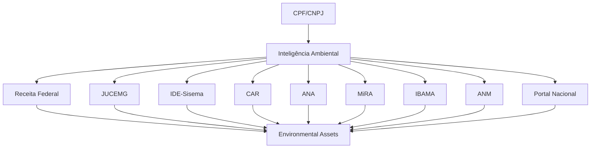

# VERSÃO 2.0 — ECOSSISTEMA DE INTELIGÊNCIA AMBIENTAL

**Projeto:** AmbientaR / EcoGestão MG  
**Versão:** 2.0  
**Data de geração:** 2026-06-11  
**Destino:** Cursor AI / Agente de implementação  
**Princípio:** evoluir sem quebrar produção, sem migrações destrutivas e sem substituir fluxos existentes.

---

## Objetivo geral

Expandir o módulo de Documentos Ambientais e Inventário Ambiental para integrar fontes externas estratégicas: Receita Federal, JUCEMG, IDE-Sisema, CAR, ANA, MiRA, IBAMA, ANM e Portal Nacional de Licenciamento.

---

## Regras absolutas para o Cursor AI

1. Não remover rotas existentes.
2. Não renomear coleções existentes.
3. Não apagar campos legados.
4. Não alterar regras Firestore sem etapa própria.
5. Não mover módulos grandes na mesma PR.
6. Não implementar scraping que burle CAPTCHA, login ou bloqueio técnico.
7. Não expor CPF/CNPJ completo sem necessidade operacional.
8. Não criar dependência pesada no bundle inicial.
9. Toda fase precisa passar em:
   - `npm run typecheck`
   - `npm run lint`
   - `npm run build`
   - `npm run apphosting:check`
10. Toda alteração deve ser reversível.

---

## Compatibilidade obrigatória

Este plano deve preservar a estrutura atual do AmbientaR, incluindo:

- Clientes.
- Empreendedores.
- Empreendimentos / Projetos.
- Documentos Ambientais.
- Outorgas.
- Licenças.
- Condicionantes.
- CRM.
- Financeiro.
- Portal do Cliente.
- IA / Jarvis.
- Firestore Rules existentes.
- Storage.
- Rotas atuais.

---

# Parte 1 — Visão da Versão 2.0

A versão 2.0 transforma o AmbientaR em uma plataforma de **Inteligência Ambiental Integrada**.

A versão 1.5 criou o Inventário Ambiental. A versão 2.0 enriquece esse inventário com fontes oficiais e complementares.



---

# Parte 2 — Grupos de conectores

## Grupo A — Identidade Empresarial

- Receita Federal.
- JUCEMG.

## Grupo B — Inteligência Territorial

- IDE-Sisema.
- CAR.

## Grupo C — Recursos Hídricos

- ANA.
- MiRA.

## Grupo D — Fiscalização e Passivos

- IBAMA.

## Grupo E — Mineração

- ANM.

## Grupo F — Expansão Nacional

- Portal Nacional de Licenciamento.

---

# Parte 3 — Estratégia conservadora

Nenhum conector da versão 2.0 deve alterar cadastros existentes automaticamente.

Cada conector deve:

1. Consultar fonte.
2. Normalizar resultado.
3. Criar registro bruto.
4. Criar ou sugerir asset.
5. Aguardar revisão humana para alterações em módulos operacionais.

---

# Parte 4 — Novas coleções complementares

```text
external_source_records
company_profiles
territorial_constraints
rural_properties
hydric_external_records
environmental_enforcement_records
mining_assets
national_license_records
```

Essas coleções são complementares.

Nenhuma substitui:

```text
clients
empreendedores
projects
licenses
outorgas
```

---

# Parte 5 — Modelo comum para resultado externo

```ts
export type ExternalSourceId =
  | "receita_federal_cnpj"
  | "jucemg"
  | "ide_sisema"
  | "car"
  | "ana"
  | "mira"
  | "ibama"
  | "anm"
  | "portal_nacional_licenciamento";

export type ExternalSourceRecord = {
  id: string;

  sourceId: ExternalSourceId;
  sourceName: string;

  clientId?: string;
  empreendedorId?: string;
  projectId?: string;

  cpfCnpj?: string;
  cpfCnpjNormalized?: string;

  title: string;
  summary?: string;

  sourceUrl?: string;
  originalPayload?: Record<string, unknown>;

  normalizedData?: Record<string, unknown>;

  relatedAssetId?: string;
  confidenceScore?: number;

  status:
    | "raw"
    | "normalized"
    | "linked"
    | "ignored"
    | "error";

  createdAt: string;
  updatedAt: string;
};
```

---

# Parte 6 — Receita Federal

## Objetivo

Validar e enriquecer CNPJ.

## Dados esperados

- Razão social.
- Nome fantasia.
- Situação cadastral.
- CNAEs.
- Natureza jurídica.
- Endereço.
- Município.
- UF.
- CEP.
- Data de abertura.

## Uso no AmbientaR

- Autopreencher cadastro de empreendedor.
- Corrigir razão social.
- Validar CNPJ.
- Melhorar busca em SLA, SIAM e GTAC.
- Criar `CompanyProfile`.

## Modelo

```ts
export type CompanyProfile = {
  id: string;
  cnpj: string;
  cnpjNormalized: string;

  legalName: string;
  tradeName?: string;
  registrationStatus?: string;

  mainCnae?: string;
  secondaryCnaes?: string[];

  legalNature?: string;

  address?: {
    street?: string;
    number?: string;
    complement?: string;
    district?: string;
    city?: string;
    state?: string;
    zipCode?: string;
  };

  source: "receita_federal_cnpj" | "manual";
  sourceFetchedAt?: string;

  linkedClientId?: string;
  linkedEmpreendedorId?: string;

  createdAt: string;
  updatedAt: string;
};
```

## Regras

- Não sobrescrever cadastro existente sem confirmação.
- Mostrar comparação: valor atual x valor Receita.
- Permitir aplicar campos selecionados.

---

# Parte 7 — JUCEMG

## Objetivo

Complementar identidade empresarial com dados societários e histórico.

## Dados esperados

- NIRE, quando aplicável.
- Quadro societário, se público.
- Capital social.
- Alterações.
- Situação empresarial.

## Uso

- Due diligence.
- Verificação de representante.
- Enriquecimento de CRM.
- Validação de titularidade.

## Implementação

Criar conector separado:

```text
jucemgConnector
```

Como algumas informações podem exigir autenticação ou consulta específica, o conector deve começar como fonte configurável e manual/semiautomática.

---

# Parte 8 — IDE-Sisema

## Objetivo

Adicionar inteligência territorial.

## Camadas prioritárias

- Unidades de Conservação.
- Zonas de amortecimento.
- APP.
- Reserva Legal.
- Hidrografia.
- Cavidades.
- Zoneamentos.
- Áreas prioritárias.
- Infraestrutura ambiental.

## Modelo

```ts
export type TerritorialConstraint = {
  id: string;

  projectId?: string;
  empreendedorId?: string;
  clientId?: string;

  sourceId: "ide_sisema";
  layerId: string;
  layerName: string;

  geometry?: GeoJSON.Geometry;
  intersectionAreaHa?: number;
  distanceMeters?: number;

  severity:
    | "info"
    | "attention"
    | "restriction"
    | "critical";

  description: string;

  sourceUrl?: string;

  createdAt: string;
  updatedAt: string;
};
```

## Integração

- RCA.
- PCA.
- PRADA.
- PIA.
- Licenciamento.
- Outorgas.
- Georreferenciamento.
- Jarvis Ambiental.

## Regra

Não carregar mapas no bundle principal. Usar `@ambientar/web-maps`.

---

# Parte 9 — CAR

## Objetivo

Consultar e estruturar informações de Cadastro Ambiental Rural.

## Dados esperados

- Número do CAR.
- Situação.
- Área.
- Município.
- Proprietário/possuidor, quando público.
- APP.
- Reserva Legal.
- Remanescente de vegetação.
- Área consolidada.

## Modelo

```ts
export type RuralPropertyRecord = {
  id: string;

  carNumber?: string;
  cpfCnpj?: string;
  cpfCnpjNormalized?: string;

  propertyName?: string;
  municipality?: string;
  state?: string;

  totalAreaHa?: number;
  appAreaHa?: number;
  legalReserveAreaHa?: number;
  nativeVegetationAreaHa?: number;

  status?: string;

  sourceId: "car";
  sourceUrl?: string;

  linkedProjectId?: string;
  linkedEmpreendedorId?: string;

  createdAt: string;
  updatedAt: string;
};
```

## Uso

- Diagnóstico rural.
- PRADA.
- Reserva Legal.
- Licenciamento.
- Regularização ambiental.
- Due diligence.

---

# Parte 10 — ANA

## Objetivo

Integrar dados hidrológicos nacionais.

## Fontes

- Estações fluviométricas.
- Estações pluviométricas.
- Séries históricas.
- HidroWeb/SNIRH, conforme disponibilidade.

## Modelo

```ts
export type AnaStationRecord = {
  id: string;

  stationCode: string;
  stationName?: string;

  stationType:
    | "fluviometrica"
    | "pluviometrica"
    | "qualidade_agua"
    | "unknown";

  latitude?: number;
  longitude?: number;
  riverName?: string;
  basin?: string;
  municipality?: string;
  state?: string;

  sourceId: "ana";
  sourceUrl?: string;

  createdAt: string;
  updatedAt: string;
};
```

## Uso

- Hídrico.ai.
- Estudos de disponibilidade hídrica.
- Outorgas.
- Relatórios técnicos.
- Jarvis Hídrico.

---

# Parte 11 — MiRA

## Objetivo

Integrar dados e metadados de monitoramento telemétrico de MG.

## Modelo

```ts
export type MiraStationRecord = {
  id: string;

  miraStationId?: string;
  miraPointCode?: string;
  stationLabel: string;

  waterPermitId?: string;
  empreendedorId?: string;

  stationType:
    | "captacao"
    | "jusante"
    | "poco"
    | "fluviometrica"
    | "limnimetrica"
    | "unknown";

  lastReadingAt?: string;
  status?: "active" | "inactive" | "error" | "unknown";

  sourceId: "mira";

  createdAt: string;
  updatedAt: string;
};
```

## Uso

- Hídrico.ai.
- Outorgas.
- Telemetria.
- Alertas.
- Relatórios MiRA/IGAM.

---

# Parte 12 — IBAMA

## Objetivo

Consultar passivos ambientais federais.

## Possíveis dados

- CTF.
- TCFA.
- Embargos.
- Autos de infração.
- Sanções.
- Áreas embargadas.

## Modelo

```ts
export type EnvironmentalEnforcementRecord = {
  id: string;

  sourceId: "ibama";
  cpfCnpj?: string;
  cpfCnpjNormalized?: string;

  recordType:
    | "auto_infracao"
    | "embargo"
    | "sancao"
    | "ctf"
    | "tcfa"
    | "unknown";

  title: string;
  processNumber?: string;
  issueDate?: string;
  status?: string;

  municipality?: string;
  state?: string;

  sourceUrl?: string;
  originalPayload?: Record<string, unknown>;

  relatedAssetId?: string;

  createdAt: string;
  updatedAt: string;
};
```

## Uso

- Due diligence.
- Risco ambiental.
- CRM.
- Jarvis Ambiental.
- Pareceres.

---

# Parte 13 — ANM

## Objetivo

Consultar processos minerários.

## Dados

- Número do processo.
- Titular.
- Substância.
- Fase.
- Área.
- Município.
- Poligonal.

## Modelo

```ts
export type MiningAsset = {
  id: string;

  sourceId: "anm";

  processNumber: string;
  holderName?: string;
  cpfCnpj?: string;
  cpfCnpjNormalized?: string;

  substance?: string;
  phase?: string;
  areaHa?: number;

  municipality?: string;
  state?: string;

  geometry?: GeoJSON.Geometry;

  status?: string;
  sourceUrl?: string;

  relatedProjectId?: string;
  relatedAssetId?: string;

  createdAt: string;
  updatedAt: string;
};
```

## Uso

- Licenciamento minerário.
- RCA/PCA.
- Due diligence.
- Sobreposição territorial.
- CRM.

---

# Parte 14 — Portal Nacional de Licenciamento

## Objetivo

Preparar expansão nacional.

## Uso

- Clientes multiestado.
- Consulta de processos fora de MG.
- Normalização nacional de licenças.
- Futuro marketplace de módulos.

## Regra

Implementar depois que MG estiver estável.

---

# Parte 15 — Feature flags da versão 2.0

```ts
export const environmentalIntelligenceFlags = {
  receitaFederalConnector: false,
  jucemgConnector: false,
  ideSisemaConnector: false,
  carConnector: false,
  anaConnector: false,
  miraConnector: false,
  ibamaConnector: false,
  anmConnector: false,
  portalNacionalConnector: false,
};
```

---

# Parte 16 — Roadmap da versão 2.0

1. Receita Federal.
2. CAR.
3. IDE-Sisema.
4. ANA.
5. MiRA.
6. IBAMA.
7. ANM.
8. JUCEMG.
9. Portal Nacional.

Ordem recomendada para valor rápido:

```text
Receita Federal → CAR → IDE-Sisema → ANA/MiRA → IBAMA/ANM
```

---

# Parte 17 — Regras para Cursor AI

- Criar um conector por PR.
- Cada conector atrás de feature flag.
- Não alterar cadastros sem confirmação.
- Persistir payload bruto.
- Persistir dados normalizados.
- Criar testes com fixtures.
- Não usar scraping agressivo.
- Respeitar termos de uso.
- Registrar fonte e data.

---

# Parte 18 — Plano detalhado do conector Receita Federal

## Objetivo

Implementar o conector **Receita Federal** como fonte complementar, não destrutiva e revisável.

## Arquitetura

```text
Input
↓
Connector Receita Federal
↓
Raw result
↓
Normalizer
↓
ExternalSourceRecord
↓
EnvironmentalAsset suggestion
↓
Review UI
```

## Tarefas

1. Criar pasta do conector.
2. Criar tipo de entrada.
3. Criar tipo de saída bruta.
4. Criar normalizador.
5. Criar fixture de teste.
6. Criar feature flag.
7. Integrar ao orquestrador somente se habilitado.
8. Criar logs.
9. Criar tela de revisão.
10. Documentar limitações.

## Arquivos sugeridos

```text
packages/web-documents/src/connectors/receita-federal/connector.ts
packages/web-documents/src/connectors/receita-federal/normalizer.ts
packages/web-documents/src/connectors/receita-federal/fixtures/sample.json
packages/web-documents/src/connectors/receita-federal/README.md
```

## Critério de aceite

- Conector pode ser ligado/desligado.
- Falha do conector não falha o job.
- Dados brutos são preservados.
- Dados normalizados são criados.
- Nenhum cadastro é sobrescrito automaticamente.

---

# Parte 19 — Plano detalhado do conector JUCEMG

## Objetivo

Implementar o conector **JUCEMG** como fonte complementar, não destrutiva e revisável.

## Arquitetura

```text
Input
↓
Connector JUCEMG
↓
Raw result
↓
Normalizer
↓
ExternalSourceRecord
↓
EnvironmentalAsset suggestion
↓
Review UI
```

## Tarefas

1. Criar pasta do conector.
2. Criar tipo de entrada.
3. Criar tipo de saída bruta.
4. Criar normalizador.
5. Criar fixture de teste.
6. Criar feature flag.
7. Integrar ao orquestrador somente se habilitado.
8. Criar logs.
9. Criar tela de revisão.
10. Documentar limitações.

## Arquivos sugeridos

```text
packages/web-documents/src/connectors/jucemg/connector.ts
packages/web-documents/src/connectors/jucemg/normalizer.ts
packages/web-documents/src/connectors/jucemg/fixtures/sample.json
packages/web-documents/src/connectors/jucemg/README.md
```

## Critério de aceite

- Conector pode ser ligado/desligado.
- Falha do conector não falha o job.
- Dados brutos são preservados.
- Dados normalizados são criados.
- Nenhum cadastro é sobrescrito automaticamente.

---

# Parte 20 — Plano detalhado do conector IDE-Sisema

## Objetivo

Implementar o conector **IDE-Sisema** como fonte complementar, não destrutiva e revisável.

## Arquitetura

```text
Input
↓
Connector IDE-Sisema
↓
Raw result
↓
Normalizer
↓
ExternalSourceRecord
↓
EnvironmentalAsset suggestion
↓
Review UI
```

## Tarefas

1. Criar pasta do conector.
2. Criar tipo de entrada.
3. Criar tipo de saída bruta.
4. Criar normalizador.
5. Criar fixture de teste.
6. Criar feature flag.
7. Integrar ao orquestrador somente se habilitado.
8. Criar logs.
9. Criar tela de revisão.
10. Documentar limitações.

## Arquivos sugeridos

```text
packages/web-documents/src/connectors/ide-sisema/connector.ts
packages/web-documents/src/connectors/ide-sisema/normalizer.ts
packages/web-documents/src/connectors/ide-sisema/fixtures/sample.json
packages/web-documents/src/connectors/ide-sisema/README.md
```

## Critério de aceite

- Conector pode ser ligado/desligado.
- Falha do conector não falha o job.
- Dados brutos são preservados.
- Dados normalizados são criados.
- Nenhum cadastro é sobrescrito automaticamente.

---

# Parte 21 — Plano detalhado do conector CAR

## Objetivo

Implementar o conector **CAR** como fonte complementar, não destrutiva e revisável.

## Arquitetura

```text
Input
↓
Connector CAR
↓
Raw result
↓
Normalizer
↓
ExternalSourceRecord
↓
EnvironmentalAsset suggestion
↓
Review UI
```

## Tarefas

1. Criar pasta do conector.
2. Criar tipo de entrada.
3. Criar tipo de saída bruta.
4. Criar normalizador.
5. Criar fixture de teste.
6. Criar feature flag.
7. Integrar ao orquestrador somente se habilitado.
8. Criar logs.
9. Criar tela de revisão.
10. Documentar limitações.

## Arquivos sugeridos

```text
packages/web-documents/src/connectors/car/connector.ts
packages/web-documents/src/connectors/car/normalizer.ts
packages/web-documents/src/connectors/car/fixtures/sample.json
packages/web-documents/src/connectors/car/README.md
```

## Critério de aceite

- Conector pode ser ligado/desligado.
- Falha do conector não falha o job.
- Dados brutos são preservados.
- Dados normalizados são criados.
- Nenhum cadastro é sobrescrito automaticamente.

---

# Parte 22 — Plano detalhado do conector ANA

## Objetivo

Implementar o conector **ANA** como fonte complementar, não destrutiva e revisável.

## Arquitetura

```text
Input
↓
Connector ANA
↓
Raw result
↓
Normalizer
↓
ExternalSourceRecord
↓
EnvironmentalAsset suggestion
↓
Review UI
```

## Tarefas

1. Criar pasta do conector.
2. Criar tipo de entrada.
3. Criar tipo de saída bruta.
4. Criar normalizador.
5. Criar fixture de teste.
6. Criar feature flag.
7. Integrar ao orquestrador somente se habilitado.
8. Criar logs.
9. Criar tela de revisão.
10. Documentar limitações.

## Arquivos sugeridos

```text
packages/web-documents/src/connectors/ana/connector.ts
packages/web-documents/src/connectors/ana/normalizer.ts
packages/web-documents/src/connectors/ana/fixtures/sample.json
packages/web-documents/src/connectors/ana/README.md
```

## Critério de aceite

- Conector pode ser ligado/desligado.
- Falha do conector não falha o job.
- Dados brutos são preservados.
- Dados normalizados são criados.
- Nenhum cadastro é sobrescrito automaticamente.

---

# Parte 23 — Plano detalhado do conector MiRA

## Objetivo

Implementar o conector **MiRA** como fonte complementar, não destrutiva e revisável.

## Arquitetura

```text
Input
↓
Connector MiRA
↓
Raw result
↓
Normalizer
↓
ExternalSourceRecord
↓
EnvironmentalAsset suggestion
↓
Review UI
```

## Tarefas

1. Criar pasta do conector.
2. Criar tipo de entrada.
3. Criar tipo de saída bruta.
4. Criar normalizador.
5. Criar fixture de teste.
6. Criar feature flag.
7. Integrar ao orquestrador somente se habilitado.
8. Criar logs.
9. Criar tela de revisão.
10. Documentar limitações.

## Arquivos sugeridos

```text
packages/web-documents/src/connectors/mira/connector.ts
packages/web-documents/src/connectors/mira/normalizer.ts
packages/web-documents/src/connectors/mira/fixtures/sample.json
packages/web-documents/src/connectors/mira/README.md
```

## Critério de aceite

- Conector pode ser ligado/desligado.
- Falha do conector não falha o job.
- Dados brutos são preservados.
- Dados normalizados são criados.
- Nenhum cadastro é sobrescrito automaticamente.

---

# Parte 24 — Plano detalhado do conector IBAMA

## Objetivo

Implementar o conector **IBAMA** como fonte complementar, não destrutiva e revisável.

## Arquitetura

```text
Input
↓
Connector IBAMA
↓
Raw result
↓
Normalizer
↓
ExternalSourceRecord
↓
EnvironmentalAsset suggestion
↓
Review UI
```

## Tarefas

1. Criar pasta do conector.
2. Criar tipo de entrada.
3. Criar tipo de saída bruta.
4. Criar normalizador.
5. Criar fixture de teste.
6. Criar feature flag.
7. Integrar ao orquestrador somente se habilitado.
8. Criar logs.
9. Criar tela de revisão.
10. Documentar limitações.

## Arquivos sugeridos

```text
packages/web-documents/src/connectors/ibama/connector.ts
packages/web-documents/src/connectors/ibama/normalizer.ts
packages/web-documents/src/connectors/ibama/fixtures/sample.json
packages/web-documents/src/connectors/ibama/README.md
```

## Critério de aceite

- Conector pode ser ligado/desligado.
- Falha do conector não falha o job.
- Dados brutos são preservados.
- Dados normalizados são criados.
- Nenhum cadastro é sobrescrito automaticamente.

---

# Parte 25 — Plano detalhado do conector ANM

## Objetivo

Implementar o conector **ANM** como fonte complementar, não destrutiva e revisável.

## Arquitetura

```text
Input
↓
Connector ANM
↓
Raw result
↓
Normalizer
↓
ExternalSourceRecord
↓
EnvironmentalAsset suggestion
↓
Review UI
```

## Tarefas

1. Criar pasta do conector.
2. Criar tipo de entrada.
3. Criar tipo de saída bruta.
4. Criar normalizador.
5. Criar fixture de teste.
6. Criar feature flag.
7. Integrar ao orquestrador somente se habilitado.
8. Criar logs.
9. Criar tela de revisão.
10. Documentar limitações.

## Arquivos sugeridos

```text
packages/web-documents/src/connectors/anm/connector.ts
packages/web-documents/src/connectors/anm/normalizer.ts
packages/web-documents/src/connectors/anm/fixtures/sample.json
packages/web-documents/src/connectors/anm/README.md
```

## Critério de aceite

- Conector pode ser ligado/desligado.
- Falha do conector não falha o job.
- Dados brutos são preservados.
- Dados normalizados são criados.
- Nenhum cadastro é sobrescrito automaticamente.

---

# Parte 26 — Plano detalhado do conector Portal Nacional de Licenciamento

## Objetivo

Implementar o conector **Portal Nacional de Licenciamento** como fonte complementar, não destrutiva e revisável.

## Arquitetura

```text
Input
↓
Connector Portal Nacional de Licenciamento
↓
Raw result
↓
Normalizer
↓
ExternalSourceRecord
↓
EnvironmentalAsset suggestion
↓
Review UI
```

## Tarefas

1. Criar pasta do conector.
2. Criar tipo de entrada.
3. Criar tipo de saída bruta.
4. Criar normalizador.
5. Criar fixture de teste.
6. Criar feature flag.
7. Integrar ao orquestrador somente se habilitado.
8. Criar logs.
9. Criar tela de revisão.
10. Documentar limitações.

## Arquivos sugeridos

```text
packages/web-documents/src/connectors/portal-nacional-de-licenciamento/connector.ts
packages/web-documents/src/connectors/portal-nacional-de-licenciamento/normalizer.ts
packages/web-documents/src/connectors/portal-nacional-de-licenciamento/fixtures/sample.json
packages/web-documents/src/connectors/portal-nacional-de-licenciamento/README.md
```

## Critério de aceite

- Conector pode ser ligado/desligado.
- Falha do conector não falha o job.
- Dados brutos são preservados.
- Dados normalizados são criados.
- Nenhum cadastro é sobrescrito automaticamente.

---
