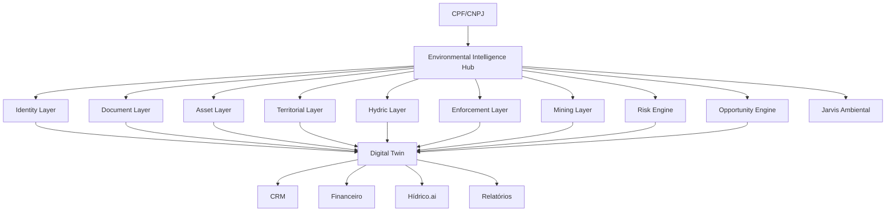
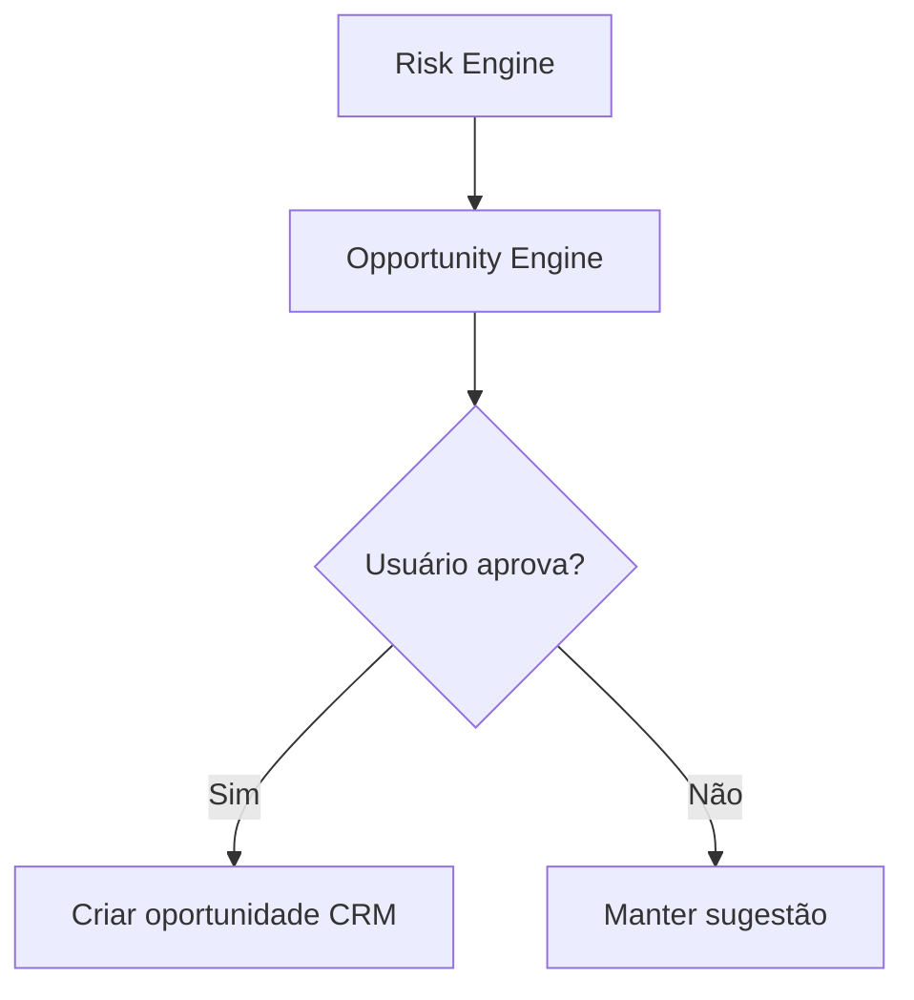

# VERSÃO 3.0 — PLANO DIRETOR DO ECOSSISTEMA DE INTELIGÊNCIA AMBIENTAL

**Projeto:** AmbientaR / EcoGestão MG  
**Versão:** 3.0  
**Data de geração:** 2026-06-11  
**Destino:** Cursor AI / Agente de implementação  
**Princípio:** evoluir sem quebrar produção, sem migrações destrutivas e sem substituir fluxos existentes.

---

## Objetivo geral

Definir a arquitetura-alvo de longo prazo do AmbientaR como plataforma de Environmental Intelligence Hub, criando um Gêmeo Digital Ambiental do empreendedor e conectando Documentos, Ativos, Riscos, Oportunidades, CRM, Financeiro, Hídrico.ai e Jarvis Ambiental.

---

## Regras absolutas para o Cursor AI

1. Não remover rotas existentes.
2. Não renomear coleções existentes.
3. Não apagar campos legados.
4. Não alterar regras Firestore sem etapa própria.
5. Não mover módulos grandes na mesma PR.
6. Não implementar scraping que burle CAPTCHA, login ou bloqueio técnico.
7. Não expor CPF/CNPJ completo sem necessidade operacional.
8. Não criar dependência pesada no bundle inicial.
9. Toda fase precisa passar em:
   - `npm run typecheck`
   - `npm run lint`
   - `npm run build`
   - `npm run apphosting:check`
10. Toda alteração deve ser reversível.

---

## Compatibilidade obrigatória

Este plano deve preservar a estrutura atual do AmbientaR, incluindo:

- Clientes.
- Empreendedores.
- Empreendimentos / Projetos.
- Documentos Ambientais.
- Outorgas.
- Licenças.
- Condicionantes.
- CRM.
- Financeiro.
- Portal do Cliente.
- IA / Jarvis.
- Firestore Rules existentes.
- Storage.
- Rotas atuais.

---

# Parte 1 — Visão da Versão 3.0

A versão 3.0 é a arquitetura-alvo de longo prazo.

Ela não deve ser implementada de uma vez.

Ela define o destino:

```text
AmbientaR
↓
Environmental Intelligence Hub
↓
Environmental Digital Twin
```

## Conceito central

O sistema deixa de ser apenas um gerenciador de documentos e passa a montar automaticamente um **Gêmeo Digital Ambiental** de cada cliente, empreendedor ou empreendimento.

---

# Parte 2 — Gêmeo Digital Ambiental

## Definição

Um Gêmeo Digital Ambiental é a representação estruturada de:

- Identidade do empreendedor.
- Empreendimentos.
- Ativos ambientais.
- Documentos.
- Licenças.
- Outorgas.
- TACs.
- Condicionantes.
- CAR.
- Passivos.
- Riscos.
- Oportunidades.
- Monitoramentos.
- Telemetria.
- Histórico.
- Inteligência IA.

---

# Parte 3 — Arquitetura macro



---

# Parte 4 — Novas camadas lógicas

## Identity Layer

Fontes:

- Receita Federal.
- JUCEMG.
- Cadastro interno.

## Document Layer

Fontes:

- GTAC.
- SLA.
- SIAM.
- SOUT.
- Diário Oficial.
- Uploads internos.

## Asset Layer

Entidades:

- Licença.
- Outorga.
- TAC.
- Condicionante.
- CAR.
- Auto.
- Embargo.
- Processo ANM.

## Territorial Layer

Fontes:

- IDE-Sisema.
- CAR.
- Mapas.
- Georreferenciamento.

## Hydric Layer

Fontes:

- ANA.
- MiRA.
- Outorgas.
- Telemetria.

## Enforcement Layer

Fontes:

- IBAMA.
- Órgãos estaduais.
- Autos internos.

## Risk Engine

Detecta riscos.

## Opportunity Engine

Gera oportunidades comerciais e operacionais.

## Jarvis Ambiental

Explica, resume, prioriza e recomenda.

---

# Parte 5 — Environmental Digital Twin

Modelo sugerido:

```ts
export type EnvironmentalDigitalTwin = {
  id: string;

  tenantId?: string;
  clientId?: string;
  empreendedorId?: string;
  projectId?: string;

  cpfCnpj?: string;
  cpfCnpjNormalized?: string;

  displayName: string;

  identityProfileId?: string;
  companyProfileId?: string;

  assetIds: string[];
  documentIds: string[];
  riskIds: string[];
  opportunityIds: string[];

  hydricProfileId?: string;
  territorialProfileId?: string;
  enforcementProfileId?: string;
  miningProfileId?: string;

  summary?: string;
  healthScore?: number;
  complianceScore?: number;
  riskScore?: number;
  opportunityScore?: number;

  lastRefreshedAt?: string;

  createdAt: string;
  updatedAt: string;
};
```

---

# Parte 6 — Environmental Relationships

A versão 3.0 precisa entender relações.

Exemplos:

```text
CNPJ possui empreendimento
Empreendimento possui licença
Licença possui condicionante
Outorga exige monitoramento
TAC gera obrigação
CAR se sobrepõe a APP
Processo ANM se sobrepõe a imóvel
Embargo impacta oportunidade
```

Modelo:

```ts
export type EnvironmentalRelationship = {
  id: string;

  fromType: string;
  fromId: string;

  toType: string;
  toId: string;

  relationshipType:
    | "owns"
    | "linked_to"
    | "requires"
    | "overlaps"
    | "depends_on"
    | "evidence_of"
    | "risk_for"
    | "opportunity_for";

  confidenceScore?: number;
  source?: string;

  createdAt: string;
  updatedAt: string;
};
```

---

# Parte 7 — Environmental Timeline

Linha do tempo ambiental.

```ts
export type EnvironmentalTimelineEvent = {
  id: string;

  twinId: string;
  assetId?: string;
  documentId?: string;

  eventDate: string;
  eventType:
    | "license_issued"
    | "license_expired"
    | "outorga_issued"
    | "tac_signed"
    | "condition_due"
    | "monitoring_started"
    | "enforcement_record"
    | "document_found"
    | "risk_detected"
    | "opportunity_created";

  title: string;
  description?: string;

  severity?: "info" | "attention" | "warning" | "critical";

  createdAt: string;
};
```

---

# Parte 8 — Risk Engine

## Objetivo

Gerar riscos automaticamente.

Tipos:

- Licença vencendo.
- Licença vencida.
- Outorga vencendo.
- Condicionante atrasada.
- TAC sem evidência.
- Embargo.
- Sobreposição com área restritiva.
- Falha de telemetria.
- Excesso de captação.
- Inconsistência cadastral.

Modelo:

```ts
export type EnvironmentalRisk = {
  id: string;

  twinId: string;
  assetId?: string;
  documentId?: string;

  riskType:
    | "license_expiration"
    | "outorga_expiration"
    | "condition_overdue"
    | "tac_non_compliance"
    | "territorial_restriction"
    | "enforcement_record"
    | "hydric_non_compliance"
    | "data_inconsistency"
    | "unknown";

  severity: "low" | "medium" | "high" | "critical";

  title: string;
  description: string;

  detectedAt: string;
  dueDate?: string;

  recommendedAction?: string;

  status: "open" | "acknowledged" | "resolved" | "ignored";

  createdAt: string;
  updatedAt: string;
};
```

---

# Parte 9 — Opportunity Engine

## Objetivo

Transformar riscos e necessidades em oportunidades.

Exemplos:

- Renovar licença.
- Renovar outorga.
- Contratar monitoramento.
- Regularizar CAR.
- Elaborar PRADA.
- Atender condicionante.
- Criar proposta de telemetria.

Modelo:

```ts
export type EnvironmentalOpportunity = {
  id: string;

  twinId: string;
  riskId?: string;
  assetId?: string;

  opportunityType:
    | "license_renewal"
    | "outorga_renewal"
    | "telemetry_service"
    | "regularization"
    | "technical_study"
    | "monitoring_report"
    | "legal_defense"
    | "consulting";

  title: string;
  description?: string;

  estimatedValue?: number;
  suggestedDueDate?: string;

  crmOpportunityId?: string;
  status:
    | "suggested"
    | "accepted"
    | "converted_to_crm"
    | "ignored";

  createdAt: string;
  updatedAt: string;
};
```

---

# Parte 10 — Jarvis Ambiental 3.0

## Capacidades

O Jarvis deve responder com base em:

- Documentos.
- Assets.
- Riscos.
- Oportunidades.
- Histórico.
- Fontes externas.
- Telemetria.
- Mapas.

Exemplo:

```text
Jarvis, quais riscos ambientais esse CNPJ possui?
```

Resposta esperada:

```text
Foram identificados 7 ativos ambientais:
- 3 licenças
- 2 outorgas
- 1 TAC
- 1 CAR

Riscos:
- 1 licença vence em 93 dias
- 1 condicionante não possui evidência
- 1 outorga exige monitoramento hídrico
- Não foram encontrados embargos IBAMA
```

---

# Parte 11 — Integração com CRM

Fluxo:



Regra:

```text
Nunca criar oportunidade sem confirmação na primeira versão.
```

---

# Parte 12 — Integração com Financeiro

A oportunidade pode virar:

- Proposta.
- Contrato.
- Fatura.
- Projeto.

Sempre com confirmação.

---

# Parte 13 — Integração com Hídrico.ai

Quando asset for outorga:

```text
EnvironmentalAsset
↓
WaterPermit
↓
TelemetryStation
↓
MiRA
↓
Relatório
```

Sempre em modo assistido.

---

# Parte 14 — Marketplace futuro

Módulos derivados:

- AmbientaR Completo.
- Hídrico.ai.
- Mineração.ai.
- Rural.ai.
- Compliance Ambiental.
- Due Diligence Ambiental.
- Jarvis Ambiental Pro.

---

# Parte 15 — Implementação segura

A versão 3.0 deve ser implementada em ondas:

## Onda 1

Digital Twin somente leitura.

## Onda 2

Relacionamentos.

## Onda 3

Timeline.

## Onda 4

Risk Engine.

## Onda 5

Opportunity Engine.

## Onda 6

Jarvis 3.0.

## Onda 7

Marketplace.

---

# Parte 16 — O que NÃO implementar agora

Não implementar tudo de uma vez.

Não substituir clientes.

Não substituir projetos.

Não substituir documentos.

Não criar CRM automático.

Não criar financeiro automático.

Não criar telemetria automática.

---

# Parte 17 — Feature flags

```ts
export const environmentalHubFlags = {
  digitalTwin: false,
  environmentalRelationships: false,
  environmentalTimeline: false,
  riskEngine: false,
  opportunityEngine: false,
  jarvisEnvironmentalHub: false,
  crmOpportunitySuggestions: false,
  hydricActivationSuggestions: false,
};
```

---

# Parte 18 — Roadmap executivo

```text
1.5 → Inventário Ambiental
2.0 → Fontes externas e inteligência
3.0 → Hub, Digital Twin, riscos e oportunidades
```

---

# Parte 19 — Critérios de sucesso

A versão 3.0 será considerada bem-sucedida quando:

- Cada CNPJ possuir um Twin Ambiental.
- O sistema consolidar ativos.
- O sistema consolidar documentos.
- O sistema gerar riscos.
- O sistema sugerir oportunidades.
- O Jarvis responder com contexto estruturado.
- O usuário puder navegar pela linha do tempo ambiental.
- Hídrico.ai puder aproveitar outorgas automaticamente.
- CRM puder receber oportunidades aprovadas.

---

# Parte 20 — Modelo de permissões do Hub

## Objetivo

Definir como o componente **Modelo de permissões do Hub** deve funcionar dentro do Ecossistema de Inteligência Ambiental.

## Diretrizes

- Implementar de forma incremental.
- Usar feature flags.
- Não sobrescrever dados humanos com dados automáticos.
- Guardar origem de cada informação.
- Permitir revisão e correção.
- Registrar auditoria.
- Manter compatibilidade com os módulos atuais.

## Tarefas para Cursor AI

1. Criar modelo ou helper específico.
2. Criar documentação técnica.
3. Criar testes unitários.
4. Criar fixture de exemplo.
5. Integrar sem ativar por padrão.
6. Criar tela administrativa apenas se necessário.
7. Validar build.
8. Criar rollback simples.

## Critério de aceite

- Funciona isoladamente.
- Pode ser desligado por feature flag.
- Não quebra módulos existentes.
- Tem log de auditoria.
- Tem documentação.

---

# Parte 21 — Governança LGPD

## Objetivo

Definir como o componente **Governança LGPD** deve funcionar dentro do Ecossistema de Inteligência Ambiental.

## Diretrizes

- Implementar de forma incremental.
- Usar feature flags.
- Não sobrescrever dados humanos com dados automáticos.
- Guardar origem de cada informação.
- Permitir revisão e correção.
- Registrar auditoria.
- Manter compatibilidade com os módulos atuais.

## Tarefas para Cursor AI

1. Criar modelo ou helper específico.
2. Criar documentação técnica.
3. Criar testes unitários.
4. Criar fixture de exemplo.
5. Integrar sem ativar por padrão.
6. Criar tela administrativa apenas se necessário.
7. Validar build.
8. Criar rollback simples.

## Critério de aceite

- Funciona isoladamente.
- Pode ser desligado por feature flag.
- Não quebra módulos existentes.
- Tem log de auditoria.
- Tem documentação.

---

# Parte 22 — Estratégia de cache

## Objetivo

Definir como o componente **Estratégia de cache** deve funcionar dentro do Ecossistema de Inteligência Ambiental.

## Diretrizes

- Implementar de forma incremental.
- Usar feature flags.
- Não sobrescrever dados humanos com dados automáticos.
- Guardar origem de cada informação.
- Permitir revisão e correção.
- Registrar auditoria.
- Manter compatibilidade com os módulos atuais.

## Tarefas para Cursor AI

1. Criar modelo ou helper específico.
2. Criar documentação técnica.
3. Criar testes unitários.
4. Criar fixture de exemplo.
5. Integrar sem ativar por padrão.
6. Criar tela administrativa apenas se necessário.
7. Validar build.
8. Criar rollback simples.

## Critério de aceite

- Funciona isoladamente.
- Pode ser desligado por feature flag.
- Não quebra módulos existentes.
- Tem log de auditoria.
- Tem documentação.

---

# Parte 23 — Atualização periódica

## Objetivo

Definir como o componente **Atualização periódica** deve funcionar dentro do Ecossistema de Inteligência Ambiental.

## Diretrizes

- Implementar de forma incremental.
- Usar feature flags.
- Não sobrescrever dados humanos com dados automáticos.
- Guardar origem de cada informação.
- Permitir revisão e correção.
- Registrar auditoria.
- Manter compatibilidade com os módulos atuais.

## Tarefas para Cursor AI

1. Criar modelo ou helper específico.
2. Criar documentação técnica.
3. Criar testes unitários.
4. Criar fixture de exemplo.
5. Integrar sem ativar por padrão.
6. Criar tela administrativa apenas se necessário.
7. Validar build.
8. Criar rollback simples.

## Critério de aceite

- Funciona isoladamente.
- Pode ser desligado por feature flag.
- Não quebra módulos existentes.
- Tem log de auditoria.
- Tem documentação.

---

# Parte 24 — Jobs assíncronos

## Objetivo

Definir como o componente **Jobs assíncronos** deve funcionar dentro do Ecossistema de Inteligência Ambiental.

## Diretrizes

- Implementar de forma incremental.
- Usar feature flags.
- Não sobrescrever dados humanos com dados automáticos.
- Guardar origem de cada informação.
- Permitir revisão e correção.
- Registrar auditoria.
- Manter compatibilidade com os módulos atuais.

## Tarefas para Cursor AI

1. Criar modelo ou helper específico.
2. Criar documentação técnica.
3. Criar testes unitários.
4. Criar fixture de exemplo.
5. Integrar sem ativar por padrão.
6. Criar tela administrativa apenas se necessário.
7. Validar build.
8. Criar rollback simples.

## Critério de aceite

- Funciona isoladamente.
- Pode ser desligado por feature flag.
- Não quebra módulos existentes.
- Tem log de auditoria.
- Tem documentação.

---

# Parte 25 — Auditoria e trilha de origem

## Objetivo

Definir como o componente **Auditoria e trilha de origem** deve funcionar dentro do Ecossistema de Inteligência Ambiental.

## Diretrizes

- Implementar de forma incremental.
- Usar feature flags.
- Não sobrescrever dados humanos com dados automáticos.
- Guardar origem de cada informação.
- Permitir revisão e correção.
- Registrar auditoria.
- Manter compatibilidade com os módulos atuais.

## Tarefas para Cursor AI

1. Criar modelo ou helper específico.
2. Criar documentação técnica.
3. Criar testes unitários.
4. Criar fixture de exemplo.
5. Integrar sem ativar por padrão.
6. Criar tela administrativa apenas se necessário.
7. Validar build.
8. Criar rollback simples.

## Critério de aceite

- Funciona isoladamente.
- Pode ser desligado por feature flag.
- Não quebra módulos existentes.
- Tem log de auditoria.
- Tem documentação.

---

# Parte 26 — Explicabilidade da IA

## Objetivo

Definir como o componente **Explicabilidade da IA** deve funcionar dentro do Ecossistema de Inteligência Ambiental.

## Diretrizes

- Implementar de forma incremental.
- Usar feature flags.
- Não sobrescrever dados humanos com dados automáticos.
- Guardar origem de cada informação.
- Permitir revisão e correção.
- Registrar auditoria.
- Manter compatibilidade com os módulos atuais.

## Tarefas para Cursor AI

1. Criar modelo ou helper específico.
2. Criar documentação técnica.
3. Criar testes unitários.
4. Criar fixture de exemplo.
5. Integrar sem ativar por padrão.
6. Criar tela administrativa apenas se necessário.
7. Validar build.
8. Criar rollback simples.

## Critério de aceite

- Funciona isoladamente.
- Pode ser desligado por feature flag.
- Não quebra módulos existentes.
- Tem log de auditoria.
- Tem documentação.

---

# Parte 27 — Controle de confiança dos dados

## Objetivo

Definir como o componente **Controle de confiança dos dados** deve funcionar dentro do Ecossistema de Inteligência Ambiental.

## Diretrizes

- Implementar de forma incremental.
- Usar feature flags.
- Não sobrescrever dados humanos com dados automáticos.
- Guardar origem de cada informação.
- Permitir revisão e correção.
- Registrar auditoria.
- Manter compatibilidade com os módulos atuais.

## Tarefas para Cursor AI

1. Criar modelo ou helper específico.
2. Criar documentação técnica.
3. Criar testes unitários.
4. Criar fixture de exemplo.
5. Integrar sem ativar por padrão.
6. Criar tela administrativa apenas se necessário.
7. Validar build.
8. Criar rollback simples.

## Critério de aceite

- Funciona isoladamente.
- Pode ser desligado por feature flag.
- Não quebra módulos existentes.
- Tem log de auditoria.
- Tem documentação.

---

# Parte 28 — Revisão humana obrigatória

## Objetivo

Definir como o componente **Revisão humana obrigatória** deve funcionar dentro do Ecossistema de Inteligência Ambiental.

## Diretrizes

- Implementar de forma incremental.
- Usar feature flags.
- Não sobrescrever dados humanos com dados automáticos.
- Guardar origem de cada informação.
- Permitir revisão e correção.
- Registrar auditoria.
- Manter compatibilidade com os módulos atuais.

## Tarefas para Cursor AI

1. Criar modelo ou helper específico.
2. Criar documentação técnica.
3. Criar testes unitários.
4. Criar fixture de exemplo.
5. Integrar sem ativar por padrão.
6. Criar tela administrativa apenas se necessário.
7. Validar build.
8. Criar rollback simples.

## Critério de aceite

- Funciona isoladamente.
- Pode ser desligado por feature flag.
- Não quebra módulos existentes.
- Tem log de auditoria.
- Tem documentação.

---

# Parte 29 — Dashboards executivos

## Objetivo

Definir como o componente **Dashboards executivos** deve funcionar dentro do Ecossistema de Inteligência Ambiental.

## Diretrizes

- Implementar de forma incremental.
- Usar feature flags.
- Não sobrescrever dados humanos com dados automáticos.
- Guardar origem de cada informação.
- Permitir revisão e correção.
- Registrar auditoria.
- Manter compatibilidade com os módulos atuais.

## Tarefas para Cursor AI

1. Criar modelo ou helper específico.
2. Criar documentação técnica.
3. Criar testes unitários.
4. Criar fixture de exemplo.
5. Integrar sem ativar por padrão.
6. Criar tela administrativa apenas se necessário.
7. Validar build.
8. Criar rollback simples.

## Critério de aceite

- Funciona isoladamente.
- Pode ser desligado por feature flag.
- Não quebra módulos existentes.
- Tem log de auditoria.
- Tem documentação.

---

# Parte 30 — Dashboards técnicos

## Objetivo

Definir como o componente **Dashboards técnicos** deve funcionar dentro do Ecossistema de Inteligência Ambiental.

## Diretrizes

- Implementar de forma incremental.
- Usar feature flags.
- Não sobrescrever dados humanos com dados automáticos.
- Guardar origem de cada informação.
- Permitir revisão e correção.
- Registrar auditoria.
- Manter compatibilidade com os módulos atuais.

## Tarefas para Cursor AI

1. Criar modelo ou helper específico.
2. Criar documentação técnica.
3. Criar testes unitários.
4. Criar fixture de exemplo.
5. Integrar sem ativar por padrão.
6. Criar tela administrativa apenas se necessário.
7. Validar build.
8. Criar rollback simples.

## Critério de aceite

- Funciona isoladamente.
- Pode ser desligado por feature flag.
- Não quebra módulos existentes.
- Tem log de auditoria.
- Tem documentação.

---

# Parte 31 — Relatórios automáticos

## Objetivo

Definir como o componente **Relatórios automáticos** deve funcionar dentro do Ecossistema de Inteligência Ambiental.

## Diretrizes

- Implementar de forma incremental.
- Usar feature flags.
- Não sobrescrever dados humanos com dados automáticos.
- Guardar origem de cada informação.
- Permitir revisão e correção.
- Registrar auditoria.
- Manter compatibilidade com os módulos atuais.

## Tarefas para Cursor AI

1. Criar modelo ou helper específico.
2. Criar documentação técnica.
3. Criar testes unitários.
4. Criar fixture de exemplo.
5. Integrar sem ativar por padrão.
6. Criar tela administrativa apenas se necessário.
7. Validar build.
8. Criar rollback simples.

## Critério de aceite

- Funciona isoladamente.
- Pode ser desligado por feature flag.
- Não quebra módulos existentes.
- Tem log de auditoria.
- Tem documentação.

---

# Parte 32 — Integração com RAG

## Objetivo

Definir como o componente **Integração com RAG** deve funcionar dentro do Ecossistema de Inteligência Ambiental.

## Diretrizes

- Implementar de forma incremental.
- Usar feature flags.
- Não sobrescrever dados humanos com dados automáticos.
- Guardar origem de cada informação.
- Permitir revisão e correção.
- Registrar auditoria.
- Manter compatibilidade com os módulos atuais.

## Tarefas para Cursor AI

1. Criar modelo ou helper específico.
2. Criar documentação técnica.
3. Criar testes unitários.
4. Criar fixture de exemplo.
5. Integrar sem ativar por padrão.
6. Criar tela administrativa apenas se necessário.
7. Validar build.
8. Criar rollback simples.

## Critério de aceite

- Funciona isoladamente.
- Pode ser desligado por feature flag.
- Não quebra módulos existentes.
- Tem log de auditoria.
- Tem documentação.

---

# Parte 33 — Integração com mapas

## Objetivo

Definir como o componente **Integração com mapas** deve funcionar dentro do Ecossistema de Inteligência Ambiental.

## Diretrizes

- Implementar de forma incremental.
- Usar feature flags.
- Não sobrescrever dados humanos com dados automáticos.
- Guardar origem de cada informação.
- Permitir revisão e correção.
- Registrar auditoria.
- Manter compatibilidade com os módulos atuais.

## Tarefas para Cursor AI

1. Criar modelo ou helper específico.
2. Criar documentação técnica.
3. Criar testes unitários.
4. Criar fixture de exemplo.
5. Integrar sem ativar por padrão.
6. Criar tela administrativa apenas se necessário.
7. Validar build.
8. Criar rollback simples.

## Critério de aceite

- Funciona isoladamente.
- Pode ser desligado por feature flag.
- Não quebra módulos existentes.
- Tem log de auditoria.
- Tem documentação.

---

# Parte 34 — Integração com telemetria

## Objetivo

Definir como o componente **Integração com telemetria** deve funcionar dentro do Ecossistema de Inteligência Ambiental.

## Diretrizes

- Implementar de forma incremental.
- Usar feature flags.
- Não sobrescrever dados humanos com dados automáticos.
- Guardar origem de cada informação.
- Permitir revisão e correção.
- Registrar auditoria.
- Manter compatibilidade com os módulos atuais.

## Tarefas para Cursor AI

1. Criar modelo ou helper específico.
2. Criar documentação técnica.
3. Criar testes unitários.
4. Criar fixture de exemplo.
5. Integrar sem ativar por padrão.
6. Criar tela administrativa apenas se necessário.
7. Validar build.
8. Criar rollback simples.

## Critério de aceite

- Funciona isoladamente.
- Pode ser desligado por feature flag.
- Não quebra módulos existentes.
- Tem log de auditoria.
- Tem documentação.

---

# Parte 35 — Migração gradual

## Objetivo

Definir como o componente **Migração gradual** deve funcionar dentro do Ecossistema de Inteligência Ambiental.

## Diretrizes

- Implementar de forma incremental.
- Usar feature flags.
- Não sobrescrever dados humanos com dados automáticos.
- Guardar origem de cada informação.
- Permitir revisão e correção.
- Registrar auditoria.
- Manter compatibilidade com os módulos atuais.

## Tarefas para Cursor AI

1. Criar modelo ou helper específico.
2. Criar documentação técnica.
3. Criar testes unitários.
4. Criar fixture de exemplo.
5. Integrar sem ativar por padrão.
6. Criar tela administrativa apenas se necessário.
7. Validar build.
8. Criar rollback simples.

## Critério de aceite

- Funciona isoladamente.
- Pode ser desligado por feature flag.
- Não quebra módulos existentes.
- Tem log de auditoria.
- Tem documentação.

---

# Parte 36 — Rollback

## Objetivo

Definir como o componente **Rollback** deve funcionar dentro do Ecossistema de Inteligência Ambiental.

## Diretrizes

- Implementar de forma incremental.
- Usar feature flags.
- Não sobrescrever dados humanos com dados automáticos.
- Guardar origem de cada informação.
- Permitir revisão e correção.
- Registrar auditoria.
- Manter compatibilidade com os módulos atuais.

## Tarefas para Cursor AI

1. Criar modelo ou helper específico.
2. Criar documentação técnica.
3. Criar testes unitários.
4. Criar fixture de exemplo.
5. Integrar sem ativar por padrão.
6. Criar tela administrativa apenas se necessário.
7. Validar build.
8. Criar rollback simples.

## Critério de aceite

- Funciona isoladamente.
- Pode ser desligado por feature flag.
- Não quebra módulos existentes.
- Tem log de auditoria.
- Tem documentação.

---

# Parte 37 — Plano de testes

## Objetivo

Definir como o componente **Plano de testes** deve funcionar dentro do Ecossistema de Inteligência Ambiental.

## Diretrizes

- Implementar de forma incremental.
- Usar feature flags.
- Não sobrescrever dados humanos com dados automáticos.
- Guardar origem de cada informação.
- Permitir revisão e correção.
- Registrar auditoria.
- Manter compatibilidade com os módulos atuais.

## Tarefas para Cursor AI

1. Criar modelo ou helper específico.
2. Criar documentação técnica.
3. Criar testes unitários.
4. Criar fixture de exemplo.
5. Integrar sem ativar por padrão.
6. Criar tela administrativa apenas se necessário.
7. Validar build.
8. Criar rollback simples.

## Critério de aceite

- Funciona isoladamente.
- Pode ser desligado por feature flag.
- Não quebra módulos existentes.
- Tem log de auditoria.
- Tem documentação.

---

# Parte 38 — Plano de CI/CD

## Objetivo

Definir como o componente **Plano de CI/CD** deve funcionar dentro do Ecossistema de Inteligência Ambiental.

## Diretrizes

- Implementar de forma incremental.
- Usar feature flags.
- Não sobrescrever dados humanos com dados automáticos.
- Guardar origem de cada informação.
- Permitir revisão e correção.
- Registrar auditoria.
- Manter compatibilidade com os módulos atuais.

## Tarefas para Cursor AI

1. Criar modelo ou helper específico.
2. Criar documentação técnica.
3. Criar testes unitários.
4. Criar fixture de exemplo.
5. Integrar sem ativar por padrão.
6. Criar tela administrativa apenas se necessário.
7. Validar build.
8. Criar rollback simples.

## Critério de aceite

- Funciona isoladamente.
- Pode ser desligado por feature flag.
- Não quebra módulos existentes.
- Tem log de auditoria.
- Tem documentação.

---

# Parte 39 — Métricas de produto

## Objetivo

Definir como o componente **Métricas de produto** deve funcionar dentro do Ecossistema de Inteligência Ambiental.

## Diretrizes

- Implementar de forma incremental.
- Usar feature flags.
- Não sobrescrever dados humanos com dados automáticos.
- Guardar origem de cada informação.
- Permitir revisão e correção.
- Registrar auditoria.
- Manter compatibilidade com os módulos atuais.

## Tarefas para Cursor AI

1. Criar modelo ou helper específico.
2. Criar documentação técnica.
3. Criar testes unitários.
4. Criar fixture de exemplo.
5. Integrar sem ativar por padrão.
6. Criar tela administrativa apenas se necessário.
7. Validar build.
8. Criar rollback simples.

## Critério de aceite

- Funciona isoladamente.
- Pode ser desligado por feature flag.
- Não quebra módulos existentes.
- Tem log de auditoria.
- Tem documentação.

---
