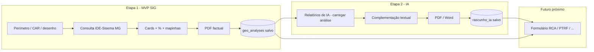

# Duas etapas acordadas — SIG factual primeiro, IA complementar depois

Documento de refinamento (continuação da discussão). Reflete a decisão do utilizador: **não é a arquitetura ideal de longo prazo**, mas é a **mais possível agora** dentro da realidade técnica e de prazo.

---

## Visão das duas etapas

| | **Etapa 1 — MVP SIG** | **Etapa 2 — Complementação IA** |
|---|------------------------|----------------------------------|
| **Onde vive** | Menu IA → **Análise Geoespacial (IA)** (`/analise-ambiental`) | Submenu **Relatórios de IA** (`/ai-lab/automations`) |
| **Entrada** | CAR, coordenadas, polígono, (futuro KML/SHP) | **Carregar** o relatório/pacote gerado na Etapa 1 |
| **Processamento** | Consulta WFS/OGC IDE-Sisema (MG) + motor de interseção | IA lê JSON factual + redige texto técnico, contexto, alertas |
| **Saída** | PDF (e opcional CSV/GeoJSON) com **mapas básicos**, **% por camada**, tabelas — **sem depender de IA para os números** | Relatório complementar exportável **PDF** e **Word** |
| **Persistência** | Pacote `geo_analyses` (ou equivalente): geometria, stats, thumbnails, fontes, timestamp | Rascunho IA vinculado ao `geo_analysis_id`; status `rascunho` / `revisado` |
| **Uso downstream** | — | Campos/trechos **reutilizáveis** nos **Estudos Técnicos** (RCA, PTRF, inventário, fauna, etc.) |

---

## Fluxo do utilizador (produto)



### Por que esta divisão faz sentido agora

1. **Etapa 1** entrega valor auditável (mapa + %) mesmo se a IA estiver indisponível ou sem API key.
2. **Etapa 2** não recalcula geometria — evita IA “inventar” percentagens; só **explica** o que o SIG já mediu.
3. **Relatórios de IA** já existe como hub (`/ai-lab/automations`); encaixa como “segunda passagem” sem refazer o mapa na mesma tela.
4. **Estudos técnicos** puxam dados **estruturados** da Etapa 1 (números) e **texto opcional** da Etapa 2 (parágrafos), com revisão humana.

### Limitação aceite (honesta)

- O utilizador precisa de **dois passos** (analisar → complementar com IA) em vez de um único botão “estudo completo”.
- Mitigação: na Etapa 1, botão visível **“Enviar para complementação IA”** que abre Relatórios de IA com o `geo_analysis_id` pré-preenchido.

---

## Contrato de dados entre etapas

### Pacote Etapa 1 (`geo_analysis` / relatório factual)

Campos mínimos para a Etapa 2 e para estudos:

```json
{
  "id": "uuid",
  "projectId": "opcional",
  "perimeter": { "geojson": {}, "areaHa": 0, "source": "car|polygon|..." },
  "generatedAtUtc": "ISO-8601",
  "layers": [
    {
      "layerId": "mg_hidrografia",
      "title": "Hidrografia",
      "source": { "catalog": "IDE-Sisema", "endpoint": "...", "layerName": "A_CONFIRMAR" },
      "stats": [{ "label": "...", "areaHa": 0, "pctOfPerimeter": 0 }],
      "mapThumbnailUrl": "...",
      "featureCount": 0
    }
  ],
  "pdfStoragePath": "opcional",
  "factualOnly": true
}
```

### Pacote Etapa 2 (`geo_analysis_complement` / relatório IA)

```json
{
  "geoAnalysisId": "uuid",
  "sections": [
    { "key": "meio_fisico", "title": "...", "bodyMarkdown": "...", "sourcesUsed": ["mg_geologia", "mg_pedologia"] },
    { "key": "meio_biotico", "title": "...", "bodyMarkdown": "..." }
  ],
  "status": "rascunho_ia | em_revisao | aprovado",
  "exports": { "pdfPath": "...", "docxPath": "..." }
}
```

### O que vai para formulários de estudo

| Origem | Tipo de dado | Exemplo de campo no estudo |
|--------|--------------|----------------------------|
| Etapa 1 | Número + tabela + mapa | % APP, classes de solo, bioma |
| Etapa 2 | Texto longo (markdown) | Caracterização da vegetação, descrição pedológica narrativa |
| Etapa 2 aprovado | Bloco “colar no RCA” | Secção 4 — caracterização do entorno |

Regra: formulários devem guardar **`geoAnalysisId`** (e opcionalmente `complementId`) para rastreio.

---

## Etapa 1 — entregáveis MVP (checklist)

- [ ] Perímetro estável (polígono + área ha)
- [ ] Catálogo com camadas IDE-Sisema MG (ver [MVP-CAMADAS-IDE-SISEMA-MG.md](./MVP-CAMADAS-IDE-SISEMA-MG.md))
- [ ] Interseção real + % do empreendimento por classe
- [ ] Card por camada na UI + mesma informação no PDF
- [ ] `geo_analyses` persistido no Firestore
- [ ] Botão “Abrir complementação IA” → `/ai-lab/automations?geoAnalysisId=...`

## Etapa 2 — entregáveis (checklist)

- [ ] Listar análises factuais disponíveis para complementar
- [ ] Prompt/fluxo que **só** usa `layers[]` + metadados (sem tools que recalculam mapa)
- [ ] Secções configuráveis (meio físico, biótico, hidrografia, resumo executivo)
- [ ] Export PDF + Word (DOCX)
- [ ] Persistir rascunho e permitir reedição
- [ ] API ou ação “Importar trecho no estudo X” (piloto: um formulário, ex. PTRF ou RCA)

---

## Arquitetura ideal vs. realidade (nota para o futuro)

| Ideal (longo prazo) | Agora (duas etapas) |
|---------------------|---------------------|
| Um módulo “Estudo” que já nasce com SIG + texto | SIG separado; IA no hub Relatórios de IA |
| Contexto ambiental único (`AmbientalContext` em `PLANO-IMPLEMENTACAO.md`) | `geo_analyses` como âncora; estudos ligam depois |
| Motor DOCX unificado Fase 3 | PDF factual Etapa 1; Word na Etapa 2 |

Quando o motor de relatórios e `getAmbientalContextByEmpreendimentoId` amadurecerem, pode fundir-se num fluxo — a Etapa 1 continua a ser a fonte dos **números**.

---

## Recomendações de produto (resumo)

1. **Nunca** misturar no mesmo PDF, sem rótulo, página factual e página IA — usar cabeçalhos “Dados SIG” vs “Complementação (rascunho IA)”.
2. Na Etapa 2, mostrar **lado a lado** o card factual e o texto gerado, para revisão rápida.
3. Só permitir “Importar no estudo” quando `status >= em_revisao` ou com aviso explícito de rascunho.
4. Manter link “Conferir no IDE-Sisema / Geosisemanet” por camada na Etapa 1.

---

## Histórico

- 2026-05-21: divisão em duas etapas e encaixe em Relatórios de IA + estudos técnicos acordados em discussão.
