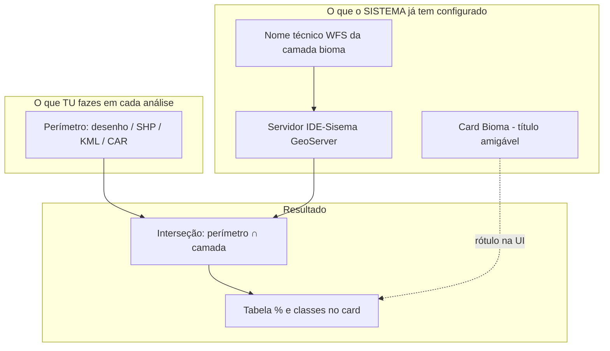

# O que precisa para a análise geoespacial funcionar

Explicação para alinhar **antes de agir** — sem código. Responde à dúvida: *“Preciso do nome exacto da camada do IDE-Sisema? Preciso subir ficheiro por card (bioma, solos…)?”*

---

## Resposta curta

| O que **tu** precisas fornecer | O que **não** precisas subir por card |
|--------------------------------|-------------------------------------|
| **Uma única área do empreendimento** (perímetro) | Um ficheiro separado para “bioma”, outro para “solos”, etc. |
| Forma recomendada: **polígono** desenhado no mapa da Análise Geoespacial | O nome técnico WFS de cada camada no portal |
| Alternativas: **SHP/KML** do perímetro, **CAR** (se houver geometria), coordenada (menos fiável para %) | Copiar manualmente o layer do Geosisemanet em cada análise |

| O que a **equipa / sistema** precisa configurar (uma vez) | Porquê |
|--------------------------------------------------------|--------|
| **Nome técnico exacto** de cada camada no servidor (`workspace:camada`) | Para o AmbientaR **ir buscar** os dados ao IDE-Sisema em teu nome |
| URL do serviço WFS que funciona (não dar 404) | Sem isto, o card “Bioma” aparece **Indisponível** mesmo com polígono perfeito |

**O teu teste com ~850 ha provou que o perímetro está OK.** Os oito cards “Indisponível” vêm quase de certeza do **catálogo técnico das camadas** (404), não do desenho da área.

---

## Duas coisas diferentes (não misturar)

### 1) Perímetro do empreendimento (entrada tua — **obrigatório**)

É **só a forma da propriedade / empreendimento** (ADA), não o mapa inteiro de MG.

| Forma de entrada | Funciona para análise? | Nota |
|------------------|------------------------|------|
| **Desenho no mapa** (polígono fechado) | **Melhor** | O que usaste no teste; área 850 ha calculada |
| **SHP ou KML** do perímetro | **Sim** | Mesmo efeito que o desenho, se CRS estiver correto |
| **GeoJSON / WKT** colado no campo polígono | Sim | Para quem já tem geometria exportada |
| **Número CAR** | Sim **se** a API/SICAR devolver polígono; senão desenhar à mesma | Atributos do CAR são extra |
| **Uma coordenada** (lat, lng) | Fraco | O sistema cria um buffer mínimo; % menos confiáveis |

**Não precisas** enviar um shapefile de “bioma” nem de “hidrografia”. Esses mapas **já estão no servidor do governo**; o AmbientaR tenta descarregá-los e cortar pelo teu polígono.

### 2) Nome de cada card (configuração técnica — **uma vez no projeto**)

Os títulos que escolheste estão **certos como produto**:

- Bioma, Solos, Hidrografia, Geologia, etc. = nomes que vês no **IDE-Sisema / Geosisemanet**.

Na aplicação cada card tem:

| Campo | Exemplo | Quem define |
|-------|---------|-------------|
| **Título no ecrã** | “Bioma / cobertura (MapBiomas MG)” | Tu / produto — pode manter o nome que faz sentido ao consultor |
| **layerName WFS** | `ide:ide_1403_mg_nat_ant_mapbiomas_col9` (exemplo) | **Tem de ser o nome exacto no GeoServer**, confirmado no catálogo |
| **URL do serviço** | `.../geoserver/ows` | Equipa técnica |

Se o `layerName` estiver errado ou o serviço mudou → **HTTP 404** → card “Indisponível” (foi o teu caso nas 8 camadas).

**Analogia:** o título “Bioma” é a etiqueta na pasta; o `layerName` é o endereço da pasta no servidor. Tu envias a **encomenda** (perímetro); o sistema precisa do **endereço certo** de cada prateleira (camada).

---

## O que vês no Geosisemanet vs o que o código precisa

No **Geosisemanet** ligas a camada “Bioma” ou “MapBiomas” visualmente.

Para o AmbientaR reproduzir isso automaticamente, alguém (equipa técnica) deve **uma vez**:

1. No **mesmo** visualizador ou no **GeoNetwork** (`idesisema.meioambiente.mg.gov.br/geonetwork`), pesquisar “bioma”, “solos”, “hidrografia”…
2. Anotar o nome técnico que o serviço WFS usa — muitas vezes `workspace:nome_da_camada`.
3. Testar com **GetFeature** ou ferramenta GIS na **mesma área** do teu polígono de teste.
4. Preencher a tabela em `MVP-CAMADAS-IDE-SISEMA-MG.md` (coluna **confirmado**).

**Tu não precisas fazer isto em cada cliente** — só na fase de **configurar o catálogo** (fase M1.1 do plano cirúrgico).

Se quiseres ajudar na validação: para **um** polígono de teste, abre no Geosisemanet as camadas que consideras “bioma” e “solos” e envia à equipa (print ou texto):

- Nome exacto da camada no painel de camadas (se aparecer).
- Link ou captura do metadado no GeoNetwork.

---

## Precisas de outro documento além do perímetro?

| Documento | Obrigatório para análise automática? |
|-----------|--------------------------------------|
| Perímetro (desenho / SHP / KML) | **Sim** |
| Modelo Word RCA, etc. | Não — isso é **Passo 3** (estudos) |
| PDF de termo de referência | Não para SIG — útil para IA depois |
| Shapefile oficial de bioma de MG | **Não** para o fluxo normal (dados vêm do WFS) |
| Shapefile oficial | **Só** se plano B: WFS continuar em 404 e decidirmos **cache local** da camada |

Para **progressar agora** no submenu Análise Geoespacial:

1. **Perímetro** — continua a usar desenho ou SHP/KML da **propriedade** (como já fizeste).
2. **Catálogo** — equipa confirma **um** `layerName` por card (começar por hidrografia, bioma, solos).
3. **Teste** — mesmo polígono: card deixa de ser 404 e mostra tabela com %.

---

## Porque a análise “não aconteceu” no teu teste (esclarecimento)

| Parte | Estado no teu teste |
|-------|---------------------|
| Mapa + polígono + área 850 ha | **OK** |
| Consulta às 8 camadas no servidor MG | **Falhou (404)** |
| Texto / % por classe | Não houve dados para calcular |
| Etapa 2 “análise salva” | Não listou (outro ponto a corrigir depois) |

Ou seja: **não falta** subires mais ficheiros por tema. Falta o **servidor responder** com a camada certa para cada card.

---

## Plano repassado — ordem antes de agir (só Análise Geoespacial)

Foco **M1** do [PLANO-FASES-CIRURGICAS.md](./PLANO-FASES-CIRURGICAS.md), simplificado:

| Passo | Quem | Acção | Debug antes do seguinte |
|-------|------|-------|-------------------------|
| **A** | Consultoria | Manter polígono de teste fixo (ex. 850 ha) | Anotar bbox ou guardar SHP do perímetro |
| **B** | Consultoria + GIS | No Geosisemanet/GeoNetwork: confirmar **nome WFS** de hidrografia, bioma, solos | Tabela preenchida em `MVP-CAMADAS-IDE-SISEMA-MG.md` |
| **C** | Dev | Corrigir **só** hidrografia no catálogo | Card hidrografia ≠ 404; % plausível |
| **D** | Dev | Corrigir bioma, depois solos (um de cada vez) | 3 cards OK no mesmo polígono |
| **E** | Dev | Persistência `geo_analyses` + Etapa 2 ver análise | Complemento IA desbloqueado |
| **F** | Tu | Validar PDF factual vs Geosisemanet | Aprovar “SIG utilizável” |

**M0** (branding, templates Word) corre **em paralelo** — não bloqueia o perímetro, mas não substitui o passo B.

**M3 / M4** (RCA, licenciamento) — **depois** de C–F.

---

## Perguntas frequentes

**Posso usar só coordenada GPS?**  
Pode, mas para relatório com % o ideal é **polígono** (desenho ou SHP).

**O nome “Bioma” no card tem de ser igual ao do IDE-Sisema?**  
Não. O título pode ser amigável. O que tem de estar certo é o **layerName** na configuração (invisível ao utilizador final).

**Tenho de subir KML da hidrografia?**  
Não. Só KML/SHP do **limite do empreendimento**. A hidrografia vem do mapa oficial intersectado com esse limite.

**E se no Geosisemanet a camada for só WMS (imagem) e não WFS?**  
Aí precisamos de outra estratégia (outra fonte vectorial, ou download SHP oficial, ou outro serviço). Isso define-se no passo B por camada.

---

## Decisões do utilizador (2026-05-21 — antes de codificar)

| # | Decisão |
|---|---------|
| 1 | Perímetro de teste validado com **desenho no mapa** (~850 ha). Quer **validar também com SHP** (mesma área ou equivalente). |
| 2 | Nomes das camadas a recolher no **painel do Geosisemanet** (ver modelo abaixo). |
| 3 | **Prioridade de implementação:** hidrografia → bioma → solos primeiro; as outras **5 camadas mantêm a mesma importância** — fila Onda B/C depois, não “menos importantes”. |

### Modelo para enviar nome do painel (por camada)

Para cada tema, na próxima mensagem ou numa tabela:

- **Título no painel** (como aparece no Geosisemanet)
- **Nome técnico** (se o painel mostrar `workspace:layer` ou ao clicar em propriedades)
- **Município / região** do polígono de teste
- **Print** (opcional mas útil)

Ordem sugerida de envio: hidrografia, bioma, solos → depois geologia, geomorfologia, pedologia, inventário, fauna.

---

## Histórico

- Documento criado para separar “entrada do utilizador (perímetro)” vs “configuração técnica (layerName)”.
