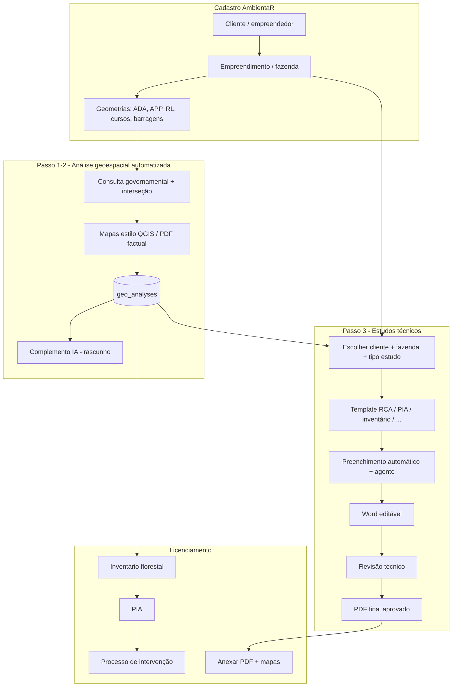
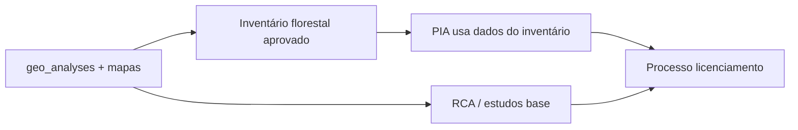

# Passo 3 — Linha de montagem: Estudos técnicos → Word → PDF → Licenciamento

Documento de **arquitetura e produto** (refinamento, sem código). Depende do **Passo actual** (análise geoespacial automatizada) estar **utilizável**: sem % e mapas reais, o Passo 3 só gera texto genérico — baixa acurácia.

Integra a visão do utilizador: **cadastro rico** → **geometrias SHP/KML** → **análise SIG** → **estudos quase completos** → **revisão humana** → **PDF** → **processo de licenciamento** (PIA, inventário florestal, etc.).

---

## Posição na linha completa (visão SaaS)

---

## Passo 3 — o que o utilizador quer fazer

Ao abrir **Estudos técnicos** → submenu (ex. **RCA**, **PIA**, **inventário florestal**):

1. **Escolher cliente** e **fazenda/empreendimento** (já cadastrados).
2. Sistema já tem:
   - Dados completos de **empreendedor** e **empreendimento** (CNPJ, atividade, CNAE, localização, etc.).
   - **SHP/KML** lançados: perímetro **ADA**, **APP**, **reserva legal**, **cursos d’água**, **barragens**, outras feições.
3. Com isso, **preencher automaticamente** campos do estudo:
   - Meio físico, faunístico, social, florístico/mata, inserção regional, etc.
4. Usar **análise geoespacial** do perímetro (Passo 1–2): tabelas, % e **mapas** integrados no documento.
5. Gerar **Word** (.docx) para editar; após aprovação, **PDF** final.
6. PDF e anexos **puxados no menu Licenciamento** (processo de intervenção: PIA + inventário encadeados).

**Princípio:** celeridade + acurácia, com **revisão humana obrigatória** em cada etapa.

---

## Fontes de dados (camadas de verdade)

| Fonte | O que alimenta | Exemplos de uso no estudo |
|-------|----------------|---------------------------|
| **Cadastro AmbientaR** | Empreendedor, empreendimento, projeto | Capa, identificação, responsável técnico |
| **Geometrias do cliente** | SHP/KML por tema | ADA, APP, RL, hidrografia desenhada, barragens |
| **Passo 1 — SIG** | % por camada, resumo factual | Meio físico/biótico com números |
| **Passo 2 — IA** | Parágrafos rascunho | Caracterização narrativa |
| **Governamental** | CAR, SICAR, IDE-Sisema, IBGE, outorgas | Conformidade, contexto regional |
| **Agente + RAG** | Legislação, ToR, modelos Pimenta | Tom técnico, estrutura de seções |

Ordem de confiança no documento final: **geometria cadastrada + SIG factual** > **cadastro** > **IA (rascunho)**.

---

## Mapas “estilo QGIS” (stack acordada)

Objetivo: mapas de produção semelhantes aos feitos em QGIS, com stack **gratuita / open source**:

| Componente | Papel |
|------------|--------|
| **QGIS** (referência visual / layout) | Legenda, escala, norte, moldura |
| **Python** | Orquestração, ETL, relatórios |
| **GDAL / ogr2ogr** | Reprojetação, clip, export |
| **PyQGIS ou qgis_process** (batch) | Layouts complexos em servidor (worker) |
| **Turf / Shapely** (leve) | Interseção rápida na API (já iniciado) |
| **Leaflet** (web) | Pré-visualização; export PNG para Word |

**Não** substituir QGIS no dia 1 — **replicar saída** (PDF/PNG por tema: localização, uso do solo, APP, hidrografia).

Worker previsto no repo: `infra/geo-export-worker/` + plano `mapas-geoprocessing-opcao-b.md`.

---

## Modelo de documento (RCA como exemplo)

| Secção típica RCA | Origem automática |
|-------------------|-------------------|
| Identificação do empreendimento | Cadastro |
| Localização e acesso | Cadastro + mapa localização |
| Caracterização do meio físico | SIG geologia, geomorfologia, solos, pedologia + IA |
| Hidrografia e APP | SIG + geometrias APP/RL/cursos + IA |
| Meio biótico — flora | SIG vegetação/bioma + inventário se existir |
| Meio biótico — fauna | SIG fauna + estudos fauna se existir |
| Meio socioeconômico | IBGE + cadastro município |
| Inserção regional / zoneamento | SIG + ZEE quando no catálogo |
| Conclusões e recomendações | IA + checklist humano |

Cada secção no Word: campo `{{origem: geo_analysis.layers.mg_solos}}` ou bloco markdown importado.

---

## Integração licenciamento (linha de montagem)

Regras de produto:

- **Inventário florestal** gera PDF + pacote estruturado (espécies, parcelas) → **PIA** importa sem redigitar.
- **PIA** aprovado → PDF disponível em **Licenciamento** → anexo do processo do **cliente/fazenda** activo.
- **RCA** e outros estudos: mesmo `projectId` / `empreendimentoId` para listar anexos coerentes.

---

## Agente de IA no Passo 3

| Função | Entrada | Saída |
|--------|---------|-------|
| **Preencher template** | JSON cadastro + `geo_analyses` + tipo estudo | DOCX com placeholders preenchidos |
| **Redigir secção** | Secção + factual + RAG legislação | Texto markdown → Word |
| **Aprender / refinar** | Correções do técnico (diff) | Melhorar prompts / memória por tipo estudo (fase madura) |

**Sempre:** status `rascunho_ia` → `em_revisao` → `aprovado` (só PDF final após aprovado).

---

## Dependências do Passo actual (bloqueadores)

Passo 3 **não deve avançar em produção** sem:

1. **WFS/catálogo MG funcional** (ou fallback SHP cache) — ver `REGISTRO-TESTES-PRODUCAO.md`.
2. **`geo_analyses` persistido** e ligado a `empreendimentoId` / `projectId`.
3. **Export de mapas** (pelo menos PNG por camada ou mapa de localização).
4. **Etapa 2** a ler análise salva e gerar Word útil (mesmo que curto).

---

## O que precisas para fazer isto (checklist para o negócio / equipa)

### Dados e cadastro

- [ ] Modelo **empreendimento** com campos obrigatórios para RCA/PIA (CNAE, porte, coordenadas, município, CAR).
- [ ] Upload **SHP/KML** por tipo: ADA, APP, RL, hidrografia, barragem (metadados + CRS).
- [ ] Vínculo claro: Cliente → Empreendimento(s) → Projeto/Estudo → `geo_analyses`.

### Catálogo geoespacial

- [ ] Planilha **oficial** layerName WFS (GeoNetwork) — 1 dia de trabalho técnico GIS.
- [ ] Política: WFS online vs **cache mensal** em Storage para camadas críticas.

### Templates e estudos

- [ ] Modelos **Word** (`.docx`) carregados em **Configurações → Templates** — `public/templates/{slug}/template.docx` (RCA, PIA, inventário, etc.).
- [ ] **Todos os PDFs** exportados dos estudos com **cabeçalho, marca d’água e rodapé** — mesmo padrão do menu **Financeiro** (`src/lib/pdf-branding-layout.ts`, `public/branding/`). Ver [TEMPLATES-E-BRANDING-UNIFICADO.md](./TEMPLATES-E-BRANDING-UNIFICADO.md).
- [ ] Fluxo: **DOCX editável** (geração) → revisão → **PDF branded** (entrega/anexo).
- [ ] Mapa de placeholders: campo formulário ↔ secção Word ↔ fonte de dados (`docs/PLACEHOLDERS-DOCX.md` + `GEO_*`).

### Infra e custos

- [ ] Worker **Cloud Run** GDAL/QGIS para mapas pesados (plano opção B).
- [ ] Chaves IA em produção (App Hosting).
- [ ] Orçamento tokens para geração longa (Passo 3 consome mais que Passo 2).

### Processo humano

- [ ] Fluxo de **revisão** definido (quem aprova, prazo, versão PDF).
- [ ] Responsabilidade técnica: texto IA não vai a órgão sem assinatura/revisão.

### Licenciamento

- [ ] Modelo **processo de intervenção** com slots de anexo (RCA, PIA, inventário, mapas).
- [ ] Regras: só anexar PDF com `status === aprovado`.

---

## Fases sugeridas de implementação (quando sair do “só pensar”)

| Fase | Entregável | Depende de |
|------|------------|------------|
| **3.0** | RCA: escolher cliente/fazenda + importar `geo_analyses` + 3 secções automáticas | Passo 1 OK + template RCA em Configurações |
| **3.1** | Word RCA + mapa localização PNG; PDF RCA **branded** | Worker ou export simples + `pdf-branding-layout` |
| **3.2** | Inventário → PIA (dados estruturados) | Módulos fauna/florestal |
| **3.3** | Licenciamento: anexar PDF aprovado | Processo intervenção |
| **3.4** | Agente + RAG + aprendizagem com revisões | Histórico de diffs |

---

## Documentos relacionados

- [REGISTRO-TESTES-PRODUCAO.md](./REGISTRO-TESTES-PRODUCAO.md) — resultado do teste (404 WFS)
- [ETAPA-1-E-ETAPA-2.md](./ETAPA-1-E-ETAPA-2.md) — Passo actual
- [docs/ARQUITETURA-IA-E-RELATORIOS.md](../ARQUITETURA-IA-E-RELATORIOS.md) — IA e templates
- [docs/PLANO-IMPLEMENTACAO.md](../PLANO-IMPLEMENTACAO.md) — `AmbientalContext`, laudos, motor DOCX

---

## Histórico

- 2026-05-21: Passo 3 descrito — linha de montagem estudos → licenciamento, stack QGIS/Python, checklist de necessidades.
