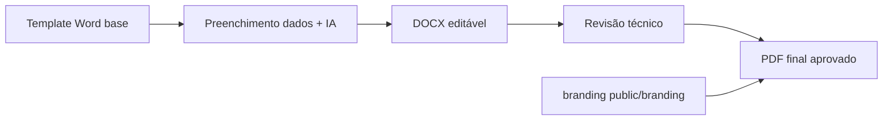

# Templates Word e branding unificado (estudos + análise geoespacial)

Requisito acordado: **todos os documentos Word** servem de base via **Configurações → Templates**; **todos os trabalhos exportados** dos estudos (e relatórios da análise geoespacial) devem ter **cabeçalho, marca d’água e rodapé** no mesmo padrão do **menu Financeiro**.

Documento de refinamento — **antes de executar** código.

---

## Padrão já existente no AmbientaR (referência)

| Recurso | Onde | Uso actual |
|---------|------|------------|
| **Branding** (imagens) | `public/branding/` + API `/api/branding` | Cabeçalho, rodapé, marca d’água |
| **Hook / URLs** | `useLocalBranding`, `brandingUrlsFromLocal` | Carregar imagens no cliente/servidor |
| **PDF unificado** | `src/lib/pdf-branding-layout.ts` | `createMmBrandedPdfSession`, `drawWatermarkOnPage`, cabeçalho/rodapé em **todas as páginas** |
| **Financeiro** | DRE, curva ABC, etc. | PDF export com sessão branded |
| **Análise geoespacial** | `export-wave-a-pdf.ts`, complemento PDF | Já usa `createMmBrandedPdfSession` |
| **Templates DOCX** | `public/templates/{tipo}/template.docx` | Configurações → Templates; placeholders `{{...}}` |
| **Convenção placeholders** | `docs/PLACEHOLDERS-DOCX.md` | RCA, PIA, BLOCO_* para IA |
| **Fluxo TR + templates** | `docs/FLUXO-TEMPLATES-TERMOS-RAG.md` | Termos de referência ↔ RAG ↔ templates |

**Regra de produto:** não inventar um segundo sistema de identidade visual para estudos — **reutilizar** `pdf-branding-layout` + pasta `public/branding/`.

---

## O que o utilizador vai subir (base em configuração)

### 1. Templates Word (por tipo de estudo)

- Upload em **Configurações → Templates** (rotas `/settings/templates`, `/settings/templates/{tipo}`).
- Ficheiro: `template.docx` (ou `.dotx` convertido) por slug.
- Tipos previstos (já no sistema): `rca`, `pia`, `pca`, `prada`, `ptrf`, `eia-rima`, `las-ras`, `pea`, `reserva-legal`, `fauna`, `outorgas`, `barragens`, etc.
- Conteúdo do Word:
  - Texto fixo + **placeholders** `{{EMPREENDIMENTO_NOME}}`, `{{BLOCO_MEIO_FISICO}}`, etc.
  - Opcional: **cabeçalho/rodapé nativos do Word** no próprio modelo (imagens da consultoria) — útil na fase **editável** (.docx).
- Pasta local de trabalho (até migrar tudo): `public/templates/{slug}/template.docx`.
- Os **termos de referência** (pasta `termos de referencia` ou `public/ambientar-data/termos-referencia/`) alimentam RAG e definem estrutura; os **templates** materializam o laudo.

### 2. Branding (cabeçalho, marca d’água, rodapé)

- Mesma configuração que Financeiro: imagens em `public/branding/` (header, footer, watermark).
- **Não** é obrigatório duplicar no upload de templates se o **PDF final** passar sempre pelo motor branded.

---

## Duas saídas de documento (fluxo acordado)

| Etapa | Formato | Branding |
|-------|---------|----------|
| Geração automática | **DOCX** | Modelo pode incluir header/footer Word; foco em **edição** |
| Entrega / anexo licenciamento | **PDF** | **Obrigatório:** cabeçalho + marca d’água + rodapé via `pdf-branding-layout` (igual Financeiro) |

### PDF final (obrigatório branded)

Aplicar a **todos**:

- Relatório factual análise geoespacial (Etapa 1)
- Complemento IA (Etapa 2)
- RCA, PIA, inventário, PTRF, relatórios diversos, etc.
- Anexos gerados a partir de estudos aprovados

Implementação alvo (quando executar):

1. Conteúdo → HTML/texto ou geração directa jsPDF (como hoje em vários relatórios).
2. **`createMmBrandedPdfSession(brandingUrlsFromLocal(...))`**
3. **`finalizeBrandedPdfPages`** (ou equivalente que aplica header/footer em **cada página**).
4. `doc.save(...)`.

### DOCX intermédio

- `docxtemplater` (ou fluxo existente) preenche placeholders.
- Mapas SIG (PNG) inseridos em secções definidas no template.
- Técnico edita no Word; export PDF pode ser:
  - **Opção A:** “Exportar PDF” na app → conversão servidor + **branding** (recomendado, igual padrão visual).
  - **Opção B:** técnico imprime PDF no Word — fora do app (não recomendado para anexos oficiais).

---

## Novos placeholders sugeridos (ligação análise geoespacial)

Além dos de `PLACEHOLDERS-DOCX.md`, incluir no template quando Passo 3 existir:

| Placeholder | Origem |
|-------------|--------|
| `{{GEO_AREA_HA}}` | `geo_analyses.perimeter.areaHa` |
| `{{GEO_RESUMO_FACTUAL}}` | `factualSummary` |
| `{{GEO_DATA_ANALISE}}` | `generatedAtUtc` |
| `{{BLOCO_MEIO_FISICO}}` | SIG + IA (geologia, solos, pedologia…) |
| `{{BLOCO_HIDROGRAFIA_APP}}` | SIG hidrografia + geometrias APP |
| `{{MAPA_LOCALIZACAO}}` | Imagem PNG (worker/QGIS) |
| `{{MAPA_USO_SOLO}}` | Camada bioma/vegetação |

---

## Configuração na app (ecrãs)

| Ecrã | Função |
|------|--------|
| **Configurações → Branding** | Cabeçalho, rodapé, marca d’água (já usado Financeiro) |
| **Configurações → Templates** | Upload `template.docx` por tipo de estudo |
| **(Futuro) TR por estudo** | Associar termos de referência ao slug do template — ver `FLUXO-TEMPLATES-TERMOS-RAG.md` |

---

## Critérios de aceite (branding + templates)

- [ ] Cada tipo de estudo piloto tem `template.docx` carregado em Configurações.
- [ ] PDF exportado de estudo piloto (ex. RCA) mostra **cabeçalho, marca d’água e rodapé** iguais ao PDF do Financeiro (DRE ou ABC).
- [ ] PDF da análise geoespacial mantém o mesmo padrão (já iniciado).
- [ ] Documentação de placeholders actualizada com campos `GEO_*` e mapas.
- [ ] Laudo aprovado só disponível para licenciamento em versão **PDF branded**.

---

## Histórico

- Acordado em refinamento: bases Word em templates; exports com branding unificado como Financeiro.
