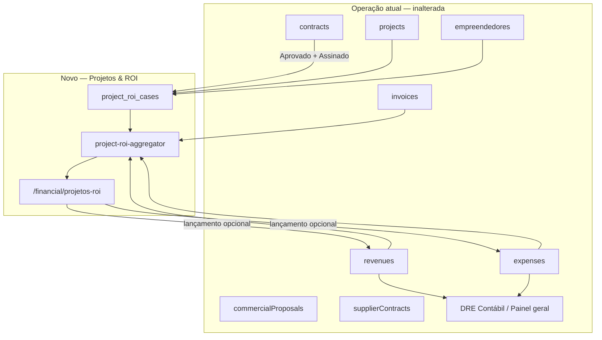
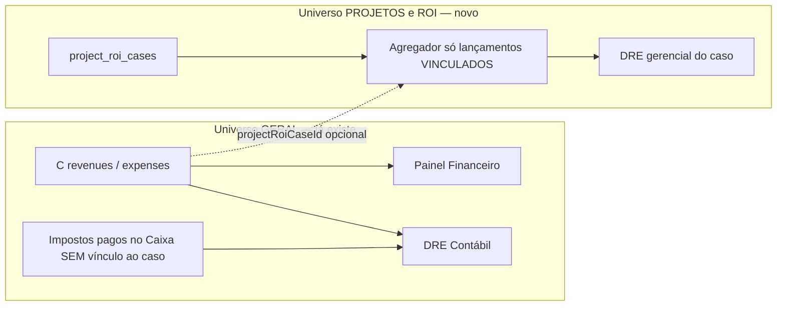
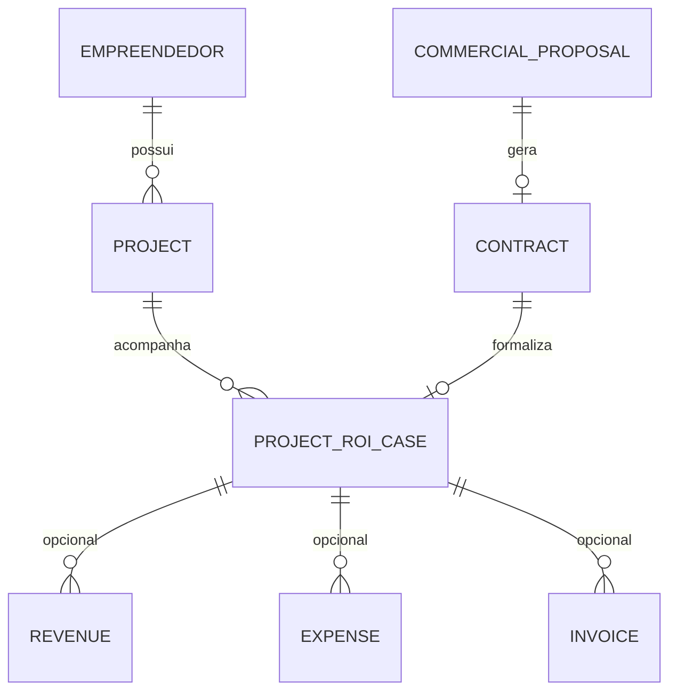
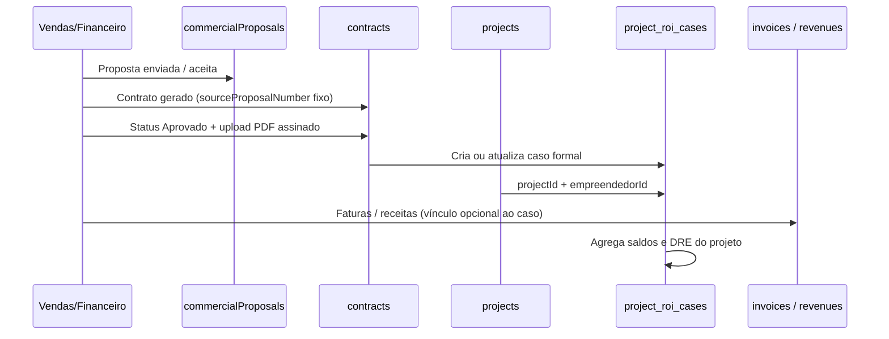

# Projetos & ROI — Especificação funcional e técnica

**Status:** Fase 1 implementada no código (2026-05-29); ver §19 e rotas `/financial/projetos-roi`  
**Última atualização:** 2026-05-29 (rodada 3 — D15–D21; separação DRE empresa × projeto; sem CRM)  
**Relacionado:** `docs/FINANCEIRO-MELHORIAS.md`, `docs/auditoria-menu-financeiro.md`, `AGENTS.md`

---

## Sumário

1. [Visão e objetivos](#1-visão-e-objetivos)
2. [Princípios de arquitetura](#2-princípios-de-arquitetura)
3. [O que já existe no AmbientaR](#3-o-que-já-existe-no-ambientar)
4. [Conceitos de negócio](#4-conceitos-de-negócio)
5. [Unidade de análise: caso de ROI](#5-unidade-de-análise-caso-de-roi)
6. [Origens do caso: formal vs manual](#6-origens-do-caso-formal-vs-manual)
7. [Cadeia comercial e governança](#7-cadeia-comercial-e-governança)
8. [Modelo de dados (Firestore)](#8-modelo-de-dados-firestore)
9. [Vínculos nos lançamentos existentes](#9-vínculos-nos-lançamentos-existentes)
10. [Agregação e indicadores](#10-agregação-e-indicadores)
11. [Impostos (despesa e perfil)](#11-impostos-despesa-e-perfil)
12. [Horas técnicas](#12-horas-técnicas)
13. [Custos indiretos e DRE geral](#13-custos-indiretos-e-dre-geral)
14. [Interface: menu e telas](#14-interface-menu-e-telas)
15. [DRE gerencial por projeto](#15-dre-gerencial-por-projeto)
16. [Fluxos operacionais](#16-fluxos-operacionais)
17. [Casos especiais e legado](#17-casos-especiais-e-legado)
18. [Segurança e papéis](#18-segurança-e-papéis)
19. [Plano de implementação por fases](#19-plano-de-implementação-por-fases)
20. [Fora de escopo e histórico](#20-fora-de-escopo-e-histórico)
21. [Decisões registradas](#21-decisões-registradas)
22. [Questionário de refinamento (detalhado)](#22-questionário-de-refinamento-detalhado)
23. [Reanálise de consistência do spec](#23-reanálise-de-consistência-do-spec)

---

## 1. Visão e objetivos

### 1.1 Problema

A consultoria precisa saber, **por empreendimento / projeto de cliente**, se o trabalho está dando lucro ou prejuízo — não apenas o resultado global da empresa (já coberto pela **DRE Contábil** e pelo **Painel Financeiro**).

Hoje existem contratos, faturas, receitas e despesas, mas falta uma **vitrine gerencial** que:

- Consolide recebidos e pagos **por projeto**.
- Mostre **saldo remanescente** (quanto ainda cabe no orçamento e quanto ainda falta receber).
- Permita **avaliação informal** (combinação verbal, piloto, parceria) **sem** contrato no sistema.
- **Não altere** os fluxos operacionais atuais de Caixa, Faturas ou Contratos.

### 1.2 Objetivos do módulo **Projetos & ROI**

| Objetivo | Descrição |
|----------|-----------|
| **ROI por projeto** | Margem e indicadores por empreendimento/caso, alimentados por lançamentos reais. |
| **Governança financeira** | Caso formal só entra quando contrato está **Aprovado** e **Assinado** (PDF). |
| **Rastreabilidade opcional** | Todo vínculo a projeto é **opcional** no lançamento; sem vínculo → custo/receita geral. |
| **Fonte única de caixa** | Receitas e despesas continuam em `revenues` / `expenses`; o submenu **agrega** e oferece atalho de lançamento. |
| **DRE gerencial por projeto** | Visão **administrativa** por caso (ganhando / perdendo / empatando em custos diretos); **não** substitui nem recalcula a DRE geral da empresa. |
| **Flexibilidade** | Projeto manual para ROI mesmo sem proposta/contrato no sistema. |
| **Sem CRM na v1** | Submenu **isolado** do Financeiro; zero links/widgets no CRM até decisão futura explícita. |

### 1.3 Público

- **Primário:** `admin`, `financial`
- **Secundário (leitura, futuro):** `sales` (pipeline vs realizado por cliente)
- **Não alvo na v1:** `client`, `representative` (sem acesso ao submenu)

### 1.4 Referências de mercado (job costing / project profitability)

| Referência | Conceito aplicável |
|------------|-------------------|
| Harvest / Toggl | Orçamento vs consumido (“burn rate”) |
| FreshBooks Projects | Painel de lucratividade por job |
| QuickBooks Job Costing | Classificar cada lançamento a um “Job” (opcional) |
| Monday.com | Board por projeto com receita/custo |
| Procore | Orçamento por linha vs realizado |

O AmbientaR adapta isso à cadeia: **Orçamento/Proposta → Contrato → Faturas/Receitas → Despesas/Fornecedores**, com **empreendimento** (`projects`) e **empreendedor** como eixo cadastral.

---

## 2. Princípios de arquitetura

### 2.1 Regra de ouro

> **Nada do que já roda é alterado na lógica de negócio.**  
> Só se **agregam** informações e se adiciona um **submenu independente** mais campos **opcionais** nas coleções existentes.

### 2.2 Padrão: read model + perfil isolado



### 2.3 Uma fonte de verdade para caixa

- Toda receita/despesa continua em **`revenues`** e **`expenses`**.
- Lançar pelo **Caixa** ou pelo **detalhe do caso** grava na **mesma coleção**.
- O submenu **nunca** duplica valores em coleção paralela de “movimentos” (evita divergência).

### 2.4 Alocação explícita apenas

| Situação | Onde entra |
|----------|------------|
| Lançamento **sem** vínculo ao caso (`projectRoiCaseId`) | **Somente** caixa / DRE global da empresa |
| Lançamento **com** `projectRoiCaseId` (aba Lançar em Projetos & ROI) | **Somente** extrato gerencial do caso — **não** entra no caixa global |
| Custos indiretos (aluguel, energia, salário fixo sem vínculo) | **Nunca** rateados automaticamente para o projeto |

**Não haverá** rateio proporcional, percentual de overhead nem “distribuir despesas do mês entre projetos”.

### 2.5 Dois universos financeiros (decisão D20 — essencial)

O módulo **não mistura** contabilidade da empresa com painel por projeto.



| Pergunta | Resposta |
|----------|----------|
| O imposto pago da empresa (DARF, ISS global, etc.) entra na DRE **geral**? | **Sim**, como hoje — todo lançamento em `expenses` sem distinção. |
| Esse imposto global aparece automaticamente na DRE **do projeto**? | **Não.** |
| O que entra na DRE do projeto? | Só despesas/receitas **vinculadas** ao caso + provisão opcional **no perfil do caso** (estimativa gerencial). |
| Para que serve a DRE do projeto? | Decisão administrativa: ver se **aquele** contrato/combinação está ganhando, perdendo ou empatando em **custos diretos** alocados. |
| Substitui contador / DRE Contábil? | **Não.** É indicador interno de rentabilidade por job. |

**Semáforo do caso (ganhando / perdendo / empatando):** baseado em `resultado = recebido − pago − impostosDoCaso` (impostos do caso = despesas de imposto vinculadas + provisão do perfil, nunca imposto global não alocado).

### 2.6 Módulo histórico removido

Em auditoria anterior foi retirado `financial/controle-projetos/**` (experimental).  
**Projetos & ROI** é módulo **novo**, isolado, com especificação neste documento — **não** reativar o código antigo.

---

## 3. O que já existe no AmbientaR

### 3.1 Mapa de coleções relevantes

| Módulo | Rota | Coleção Firestore | Vínculos úteis hoje |
|--------|------|-------------------|---------------------|
| Empreendedores | `/empreendedores` | `empreendedores` | `projectIds[]`, `cpfCnpj` |
| Empreendimentos | `/projects` | `projects` | `empreendedorId`, `propertyName`, `fantasyName` |
| Orçamentos e Propostas | `/commercial-proposals` | `commercialProposals` | `clientId`, `amount`, `itens`, `contractId` |
| Contratos cliente | `/contracts` | `contracts` | `sourceProposalId/Number`, `pagamento.valorTotal`, `objeto.itens`, `status`, `fileUrl` |
| Contratos fornecedor | `/contracts-suppliers` | `supplierContracts` | `contractNumber`, `prestador.supplierId`, `objeto.empreendimento` (texto) |
| Faturas | `/invoices` | `invoices` | `contractId`, `clientId`, `projectId` (opcionais) |
| Receitas | `/cash-flow` | `revenues` | `contractId`, `invoiceId`, `clientId`, `projectId` (tipo; UI parcial) |
| Despesas | `/cash-flow` | `expenses` | `supplierId`, `projectId`, `category` — **sem** `contractId` |
| DRE Contábil | `/financial/dre-contabil` | agregação | Empresa / ano |
| Orçamento Anual | `/financial/orcamento` | `financial_budgets` | Metas globais por categoria |

### 3.2 Tipos TypeScript existentes (referência)

- `Contract` — `src/lib/types.ts` (`pagamento.valorTotal`, `objeto.empreendimento`, `sourceProposalNumber`)
- `Revenue` — já possui `contractId?` no tipo; formulário de Caixa **ainda não persiste** `contractId` em receita manual
- `Expense` — `projectId?` como texto livre no formulário (`transaction-extra-fields.tsx`)
- `Invoice` — `contractId?` no formulário de faturas; receita automática propaga vínculos via `src/lib/financial-invoice-revenue.ts`

### 3.3 Regra anti-dupla contagem (DRE global)

A DRE Contábil usa regime **`combinado_sem_duplicar`**: faturas pagas + receitas de caixa **sem** `invoiceId` (`src/lib/financial-core.ts`).

O agregador de **Projetos & ROI** deve usar a **mesma lógica** por caso, para não contar fatura e receita vinculada duas vezes.

### 3.4 Lacunas identificadas (a endereçar na implementação)

| Lacuna | Impacto | Prioridade |
|--------|---------|------------|
| Caixa não grava `contractId` em receita manual | Recebimentos avulsos não entram no caso por contrato | Fase 2 |
| `projectId` é campo texto, não dropdown | Erros de ID, baixa adoção do vínculo | Fase 2 |
| Despesa sem `contractId` / `projectRoiCaseId` | Subcontratação não aparece no projeto | Fase 1–2 |
| Contrato fornecedor sem `projectId` / `clientContractId` | Ligação fraca ao empreendimento | Fase 3 |
| Sem coleção de “caso de ROI” | Impossível projeto manual e apelido | Fase 1 |

---

## 4. Conceitos de negócio

### 4.1 Glossário

| Termo | Significado no AmbientaR |
|-------|--------------------------|
| **Empreendedor** | Titular ou PJ no cadastro (`empreendedores`); dono do vínculo comercial/ambiental. |
| **Empreendimento** | Unidade `projects` (propriedade, atividade, município); **eixo principal** do ROI. |
| **Proposta / Orçamento** | `commercialProposals` — número fixo `proposalNumber`, valor, itens. |
| **Contrato cliente** | `contracts` — derivado da proposta; `sourceProposalNumber` é referência imutável. |
| **Caso de ROI** | Registro em `project_roi_cases` — linha no submenu **Projetos & ROI**. |
| **Formal** | Caso ligado à cadeia orçamento → contrato assinado → empreendimento. |
| **Manual / informal** | Caso criado só para acompanhamento financeiro, sem contrato no sistema. |
| **Recebido** | Entradas de caixa (e faturas pagas, sem duplicar) vinculadas ao caso. |
| **Pago** | Saídas de caixa vinculadas ao caso. |
| **Saldo de caixa do projeto** | Recebido − Pago (o que “sobrou” em caixa naquele caso). |
| **Saldo orçamentário** | Orçamento − Pago (quanto ainda pode ser **gasto** dentro do contrato). |
| **A receber** | Orçamento − Recebido (parcelas / faturamento futuro). |

### 4.2 Número do contrato vs apelido

| Campo | Editável? | Origem |
|-------|-----------|--------|
| Número / referência (`sourceProposalNumber` ou número do contrato fornecedor) | **Não** (após criação) | Proposta ou sequência do módulo |
| Apelido do caso (`apelido`) | **Sim** | Perfil do caso — ex.: “EIA Fazenda Santa Rita 2025” |

O apelido é **somente visual** no submenu; não altera PDFs nem contratos.

---

## 5. Unidade de análise: caso de ROI

### 5.1 Definição

Um **caso de ROI** (`project_roi_cases/{id}`) representa **um acompanhamento financeiro gerencial** centrado em:

1. **Empreendimento cadastrado** (`projectId`) — obrigatório no fluxo **formal**; recomendado no **manual**.
2. **Empreendedor** (`empreendedorId`) — sempre que o empreendimento existir ou for escolhido no manual.
3. Opcionalmente: **contrato**, **proposta**, **cliente** (espelhos da cadeia formal).

Um mesmo empreendimento pode ter **vários casos** ao longo do tempo (ex.: contrato 2024 encerrado + contrato 2026 ativo), diferenciados por `contractId` / `sourceProposalNumber` / datas.

### 5.2 Relação empreendimento × contrato × caso



---

## 6. Origens do caso: formal vs manual

### 6.1 Caso formal (`origin: 'formal'`)

**Nasce quando:**

1. Existe contrato em `contracts` com `status === 'Aprovado'`.
2. Existe `fileUrl` (PDF do contrato **assinado** carregado).

**`projectId` (empreendimento cadastrado) é opcional (D16):** contratos e combinações comerciais podem existir **sem** vínculo ao cadastro ambiental/fiscal do empreendimento. Nesse caso o caso formal usa texto espelhado do contrato (`empreendimentoTexto`) e permite vincular `projectId` depois, se fizer sentido.

**Carrega automaticamente (espelho, somente leitura no ROI):**

- `empreendimentoTexto` ← `contracts.objeto.empreendimento` (sempre que houver)
- `empreendedorId` ← `projects.empreendedorId` **se** `projectId` informado; senão opcional via `clientId`/contratante
- `clientId` ← `contracts.contratante.clientId`
- `contractId`, `sourceProposalId`, `sourceProposalNumber`
- `orcamentoValor` ← `contracts.pagamento.valorTotal`
- Itens de orçamento ← `contracts.objeto.itens` (para aba Orçamento vs realizado)

**Status de governança:** `statusGovernanca: 'ativo'`.

### 6.2 Caso manual (`origin: 'manual'`)

**Nasce quando** o financeiro clica em **“Novo projeto para avaliação”** no submenu.

**Uso típico:**

- Combinação informal (“vamos fazer o estudo por R$ X”).
- Piloto antes de proposta.
- Parceria ou subcontratação avulsa ligada a um empreendimento.
- Simulação de ROI **antes** de fechar contrato no sistema.

**Campos mínimos sugeridos na criação:**

| Campo | Obrigatório? |
|-------|----------------|
| Apelido ou nome de exibição | Sim |
| `projectId` (empreendimento) | Recomendado; pode ser opcional se for avaliação totalmente genérica |
| `empreendedorId` | Se `projectId` informado, preenchido automaticamente |
| `orcamentoValor` | Opcional (se vazio, UI oculta “saldo orçamentário” e mostra só caixa) |
| `clientId` | Opcional |

**Status de governança:** `statusGovernanca: 'informal'`.

**Importante:** lançamentos de receita/despesa no caso manual **funcionam igual** ao formal — saldo remanescente sempre visível.

### 6.3 Promoção manual → formal

Quando um contrato for assinado para o mesmo empreendimento:

1. Admin usa **“Vincular contrato assinado”** no caso manual existente.
2. O caso passa a `origin: 'formal'`, preenche `contractId`, proposta, orçamento.
3. **Mantém** o mesmo `project_roi_cases.id` e todos os lançamentos já vinculados (`projectRoiCaseId`).

Evita duplicar histórico financeiro.

---

## 7. Cadeia comercial e governança

### 7.1 Sequência esperada (fluxo formal)



### 7.2 Regra de governança: Aprovado + Assinado

| Condição | Efeito |
|----------|--------|
| Contrato `Rascunho` ou sem PDF assinado | **Não** cria caso `ativo` automático; pode listar em **“Pendente de assinatura”** (somente admin/financeiro) |
| `Aprovado` + `fileUrl` preenchido | Cria/atualiza caso com `statusGovernanca: 'ativo'` |
| Contrato encerrado/cancelado (futuro) | `statusGovernanca: 'encerrado'` — caso histórico, somente leitura |

**Objetivo:** cobrar disciplina da operação — projeto-contrato no ROI gerencial só após fechamento documental.

### 7.3 Vínculo opcional ao empreendimento cadastrado (D16)

**Não bloqueia** criação do caso formal. Serve apenas para cruzar com `projects` / `empreendedores` quando existir cadastro.

Ordem de sugestão na UI (todas opcionais):

1. Campo futuro `contracts.projectId` (Fase 2+).
2. `invoices.projectId` / lançamentos com o mesmo `contractId`.
3. Match textual `objeto.empreendimento` ↔ `propertyName` / `fantasyName` (confirmar humano).
4. Botão “Vincular empreendimento” no detalhe do caso.

Status `pendente_vinculo_empreendimento` **somente** se a operação quiser marcar “ainda vou vincular”; caso pode permanecer `ativo` sem `projectId`.

---

## 8. Modelo de dados (Firestore)

### 8.1 Nova coleção: `project_roi_cases` (decisão D14)

**Nome definitivo:** `project_roi_cases` (não `financial_project_cases`).

| Critério | Motivo |
|----------|--------|
| Domínio claro | “ROI por projeto/caso”, não orçamento anual da empresa |
| Diferenciação | `financial_budgets` = metas globais; `project_roi_cases` = casos gerenciais |
| Código | Prefixo `project-roi-*` nos módulos TS alinhado ao nome da coleção |

Documento Firestore: `project_roi_cases/{caseId}`.

**Documento ID:** auto (`addDoc`) ou derivado — recomenda-se ID automático para evitar colisão entre manual e formal.

```typescript
type ProjectRoiParcelaPrevista = {
  id: string;
  vencimento: string;       // ISO date
  valor: number;
  status?: 'prevista' | 'recebida' | 'atrasada';
  observacao?: string;
};

/** Origem do caso no submenu Projetos & ROI */
export type ProjectRoiCaseOrigin = 'formal' | 'manual';

/** Governança e ciclo de vida */
export type ProjectRoiCaseGovernanceStatus =
  | 'pendente_assinatura'      // contrato existe mas sem fileUrl
  | 'pendente_vinculo_empreendimento'
  | 'ativo'
  | 'informal'                 // manual
  | 'encerrado';

export type ProjectRoiCase = {
  id: string;
  origin: ProjectRoiCaseOrigin;
  statusGovernanca: ProjectRoiCaseGovernanceStatus;

  // --- Eixo cadastral (D16: projectId opcional) ---
  /** Empreendimento cadastrado — opcional */
  projectId?: string;
  /** Texto do contrato ou manual — quando não há projectId */
  empreendimentoTexto?: string;
  /** Preenchido automaticamente se projectId existir */
  empreendedorId?: string;
  /** Cliente contratante (espelho) */
  clientId?: string;

  // --- Cadeia formal (opcional no manual) ---
  contractId?: string;
  sourceProposalId?: string;
  /** Número imutável de referência comercial */
  sourceProposalNumber?: string;

  // --- Exibição e orçamento ---
  /** Nome amigável opcional; não altera contrato */
  apelido?: string;
  /** Orçamento: espelho do contrato ou valor informado no manual */
  orcamentoValor?: number;
  /** Cópia opcional dos itens do contrato para orçamento vs realizado */
  orcamentoItens?: { descricao: string; valor: number }[];

  // --- Imposto avulso do projeto (ver seção 11) ---
  impostoEstimadoValor?: number;
  aliquotaImpostoPct?: number;
  impostoObservacao?: string;

  // --- Horas (ver seção 12) ---
  horasEstimadas?: number;
  horasRegistradas?: number;

  // --- Parcelamento (D18 — Fase 2) ---
  parcelasPrevistas?: ProjectRoiParcelaPrevista[];

  // --- Metadados ---
  observacoes?: string;
  contractSignedAt?: string;   // ISO — data do upload do assinado ou informada
  encerradoAt?: string;
  createdAt: string;
  createdByUid?: string;
  updatedAt: string;
  updatedByUid?: string;
};
```

### 8.2 Campos opcionais novos nas coleções existentes

Adicionar **sem quebrar** documentos antigos:

```typescript
// revenues, expenses, invoices
projectRoiCaseId?: string;

// expenses (Fase 2)
impostoValor?: number;
contractId?: string;

// revenues, expenses (Fase 2 — estorno D11)
estornoDeId?: string;
isEstorno?: boolean;
estornadoPorId?: string;
```

**Compatibilidade:** o agregador também considera, para documentos legados:

- `projectId` igual ao do caso
- `contractId` igual ao do caso
- `centroCusto` contendo `sourceProposalNumber` (último recurso, configurável)

### 8.3 Índices Firestore recomendados

| Coleção | Campos | Uso |
|---------|--------|-----|
| `project_roi_cases` | `statusGovernanca`, `updatedAt` | Lista filtrada |
| `project_roi_cases` | `projectId`, `statusGovernanca` | Casos por empreendimento |
| `project_roi_cases` | `contractId` | Unicidade formal por contrato |
| `revenues` | `projectRoiCaseId`, `date` | Extrato |
| `expenses` | `projectRoiCaseId`, `date` | Extrato |

### 8.4 Regras de segurança (rascunho)

```
match /project_roi_cases/{caseId} {
  allow read: if isSignedIn() && (isAdmin() || isFinancial());
  allow write: if isAdmin() || isFinancial();
}
```

Leitura restrita na v1; expansão para `sales` (read-only) em fase posterior.

**Deploy:** `npm run deploy:rules` após incluir em `src/firebase/rules/firestore.rules`.

### 8.5 Storage

Comprovantes continuam nos lançamentos (`revenues.fileUrl`, `expenses.fileUrl`).  
Sem pasta nova obrigatória; opcional prefixo `project-roi/{caseId}/` para anexos exclusivos do módulo (Fase 3).

---

## 9. Vínculos nos lançamentos existentes

### 9.1 Onde o usuário pode lançar

| Local | Grava em | Observação |
|-------|----------|------------|
| **Lançamentos de Caixa** (`/cash-flow`) | `revenues` / `expenses` | Fluxo atual preservado |
| **Detalhe do caso** (`/financial/projetos-roi/[id]`) | Mesmas coleções + `projectRoiCaseId` | Atalho; não é segunda fonte |

### 9.2 Campos no formulário de lançamento (receita e despesa)

| Campo | Obrigatório | Descrição |
|-------|-------------|-----------|
| Descrição, valor, data | Sim | Igual hoje |
| Cliente (`clientId`) — receita | Opcional | De quem recebemos |
| Fornecedor (`supplierId`) — despesa | Opcional | A quem pagamos |
| **Caso Projetos & ROI** (`projectRoiCaseId`) | Opcional | Dropdown buscável |
| Contrato (`contractId`) | Opcional | Reforço no fluxo formal |
| Empreendimento (`projectId`) | Opcional | Legado; preferir `projectRoiCaseId` |
| Fatura (`invoiceId`) | Opcional | Receita; anti-duplicação |
| Categoria — despesa | Opcional | `subcontratacao`, `impostos`, etc. |
| **Imposto na despesa** (`impostoValor`) | Opcional | Ver seção 11 |
| Comprovante | Opcional | `fileUrl` |

**Sem `projectRoiCaseId`:** lançamento segue **apenas** para o universo geral.

### 9.3 Propagação automática a partir de faturas

Ao marcar fatura como **Paga** e criar receita (`createRevenueFromPaidInvoice`):

- Propagar `projectRoiCaseId` se a fatura tiver o campo.
- Se não tiver, tentar resolver caso ativo por `contractId` + `projectId`.

### 9.4 Contratos com fornecedores

Na Fase 3, campos opcionais em `supplierContracts`:

- `projectRoiCaseId?`
- `clientContractId?` / `projectId?`

Despesas pagas ao fornecedor com vínculo ao caso alimentam o ROI sem alterar o PDF do contrato fornecedor.

---

## 10. Agregação e indicadores

### 10.1 Função agregadora (conceito)

`buildProjectRoiSnapshot(caseId, options)` em `src/lib/project-roi-aggregator.ts` (a criar):

**Entradas:** caso + queries em `revenues`, `expenses`, `invoices`, opcionalmente `supplierContracts`.

**Saída:** objeto `ProjectRoiSnapshot` com KPIs e listas para UI/DRE/export.

### 10.2 Receita do caso (sem dupla contagem)

Alinhar à DRE global (`DreRevenueRegime = 'combinado_sem_duplicar'`):

| Fonte | Regra |
|-------|--------|
| Faturas `Paid` com vínculo ao caso | Somam em **recebido fiscal** |
| Receitas com `invoiceId` | Não somam de novo (já na fatura) |
| Receitas sem `invoiceId` com vínculo ao caso | Somam em **recebido caixa** |
| **Recebido total** | Faturas pagas vinculadas + receitas avulsas vinculadas |

### 10.3 Despesas do caso

- Soma de `expenses` onde `projectRoiCaseId === caseId` (e fallbacks de legado).
- **Excluir** despesas estornadas (`isEstorno === true` ou que possuem contrapartida ativa via `estornoDeId`).
- **Excluir** despesas cujo id foi referenciado em `estornoDeId` de outro documento (já neutralizadas).
- Separar por `category` para gráficos (subcontratação, impostos, etc.).

### 10.3.1 Receitas e estornos (D11)

Mesma lógica de neutralização para `revenues`. Estorno de receita reduz `recebido`; estorno de despesa reduz `pago`.

### 10.4 Indicadores principais

| Indicador | Fórmula | Quando exibir |
|-----------|---------|---------------|
| **Orçamento** | `orcamentoValor` | Se definido |
| **Recebido** | Ver 10.2 | Sempre |
| **Pago** | Σ despesas vinculadas | Sempre |
| **Saldo de caixa do projeto** | Recebido − Pago | Sempre |
| **Saldo orçamentário** | Orçamento − Pago | Se orçamento definido |
| **A receber** | Orçamento − Recebido | Se orçamento definido |
| **% Orçamento consumido (gasto)** | Pago / Orçamento × 100 | Se orçamento > 0 |
| **% Recebido do contrato** | Recebido / Orçamento × 100 | Se orçamento > 0 |
| **Resultado do projeto** | Recebido − Pago − Impostos projeto | Sempre |
| **Margem %** | Resultado / Recebido × 100 (se Recebido > 0) | Sempre |
| **Semáforo** | Verde / amarelo / vermelho | Ver 10.5 |

### 10.5 Semáforo gerencial (sugestão padrão)

| Cor | Condição |
|-----|----------|
| Verde | Resultado > 0 e margem ≥ 15% |
| Amarelo | Resultado ≥ 0 e margem < 15%, ou Pago > 85% do orçamento com Recebido < 70% |
| Vermelho | Resultado < 0, ou Pago > Orçamento |

Limiares configuráveis no perfil da empresa (Fase 3).

### 10.6 Linha do tempo (extrato)

Ordenar por data unificada:

- Receitas (`type: credit`)
- Despesas (`type: debit`)
- Faturas pagas (`type: invoice_paid`) — se não duplicadas com receita

Cada linha: data, descrição, contraparte, valor, saldo acumulado do caso, link para editar no Caixa.

---

## 11. Impostos (despesa e perfil)

### 11.1 Duas vias opcionais

| Via | Onde | Quando usar |
|-----|------|-------------|
| **A — Na despesa** | `expenses.impostoValor` ou `category: 'impostos'` | Pagamento de DARF, retenção, ISS ligado àquele lançamento |
| **B — No perfil do caso** | `project_roi_cases.impostoEstimadoValor` ou `aliquotaImpostoPct` | Estimativa da contabilidade **sem** lançar despesa ainda |

Ambas são **opcionais**. Se nenhuma for preenchida, imposto do projeto = 0 na visão gerencial.

### 11.2 Cálculo na DRE do projeto (decisão D12)

```
impostosDespesas = Σ expense.impostoValor (vinculadas ao caso, não estornadas)
                 + Σ expense.amount onde category === 'impostos' (se impostoValor vazio)

// Provisão do perfil — dois modos ativos (decisão: usar ambos quando preenchidos, com regra abaixo)
impostosProvisaoPct = recebidoNoPeriodo × (caso.aliquotaImpostoPct / 100)
impostosProvisaoFixa = caso.impostoEstimadoValor ?? 0

impostosProvisao = impostosProvisaoPct + impostosProvisaoFixa   // se ambos preenchidos
                 | impostosProvisaoPct                          // só %
                 | impostosProvisaoFixa                         // só valor fixo

impostosTotal = impostosDespesas + impostosProvisao
```

**Regra anti-dupla contagem (UI obrigatória):**

| Situação | Comportamento |
|----------|----------------|
| Só `aliquotaImpostoPct` | Provisão recalcula quando muda o **recebido no período** da DRE |
| Só `impostoEstimadoValor` | Valor fixo de referência (ex.: estimativa anual da contabilidade) |
| **Ambos** preenchidos | **Somar** as duas linhas na DRE do projeto, com aviso: “Provisão % + valor fixo ativos” |
| Despesa `category: impostos` ou `impostoValor` | Entra em `impostosDespesas`; **não** substitui a provisão do perfil |

**Decisão D12 (2026-05-29):** **Sim** — manter **% sobre recebido acumulado no período** e **valor fixo avulso** no perfil; exibir linhas separadas no PDF/CSV.

Na exportação PDF/CSV, exibir **linhas separadas**:

- Impostos pagos (despesas)
- Provisão estimada (perfil)

### 11.3 Relação com DRE Contábil geral (decisão D20)

| Tipo de valor | DRE Contábil (empresa) | DRE Projetos & ROI (caso) |
|---------------|------------------------|---------------------------|
| Receita/despesa **sem** `projectRoiCaseId` | ✅ Entra | ❌ Não entra (até vínculo confirmado — Fase 2) |
| Receita/despesa **com** `projectRoiCaseId` (gerencial) | ❌ **Não** entra | ✅ Entra no caso |
| Imposto pago no Caixa **sem** vínculo ao caso | ✅ Entra na DRE geral | ❌ **Não** rateado para projetos |
| Imposto em despesa **vinculada** ao caso | ✅ Entra na DRE geral | ✅ Linha “impostos pagos do caso” |
| Provisão % / fixa no **perfil do caso** | ❌ Não existe na DRE geral | ✅ Só estimativa gerencial do caso |

**Mensagem fixa na UI do submenu:**  
*“Esta DRE é para decisão administrativa por projeto. A DRE Contábil da empresa continua em Financeiro → DRE Contábil e usa todos os lançamentos, inclusive impostos gerais.”*

Lançamento gerencial vinculado ao caso (`projectRoiCaseId`) **não** entra no caixa/DRE global — universos isolados. Vínculo de lançamentos reais do caixa ao caso (sem duplicar) = **Fase 2**.

---

## 12. Horas técnicas

### 12.1 Objetivo

Responder: *“Este projeto deu lucro **por hora** de trabalho da equipe?”*

Margem em R$ sozinha não revela eficiência (20 h vs 200 h no mesmo fee).

### 12.2 Níveis de maturidade

| Nível | Nome | O que é | Fase sugerida |
|-------|------|---------|---------------|
| **A** | Estimativa | `horasEstimadas` no caso — planejamento | Fase 1 (campo no perfil) |
| **B** | Total manual | `horasRegistradas` — gestor atualiza um número | Fase 3 |
| **C** | Timesheet | Subcoleção `time_entries` com data, profissional, horas, atividade | Fase 3+ |

### 12.3 Fórmulas (quando horas > 0)

```
custoHoraImplicito = despesasDiretasCaso / horasRegistradas
margemPorHora = (recebido - despesasDiretas - impostosCaso) / horasRegistradas
```

Comparar `custoHoraImplicito` com `services.cost` (tabela de serviços) para alerta “abaixo do custo hora”.

### 12.4 O que horas **não** fazem

- **Não** substituem lançamento de folha/pessoal no Caixa.
- **Não** entram automaticamente na DRE em R$ sem despesa `category: 'pessoal'` vinculada ao caso.
- São indicador **gerencial**, não contábil-fiscal.

### 12.5 Modelo futuro: `time_entries` (nível C)

Subcoleção: `project_roi_cases/{caseId}/time_entries/{entryId}`

```typescript
type ProjectRoiTimeEntry = {
  id: string;
  date: string;           // ISO date
  hours: number;
  userId?: string;        // profissional
  userDisplayName?: string;
  activity?: string;      // campo, escritório, revisão, viagem
  notes?: string;
  createdAt: string;
};
```

`horasRegistradas` no pai = Σ `hours` (cache atualizado ao salvar).

---

## 13. Custos indiretos e DRE geral

### 13.1 Regra explícita

> Custos indiretos **não são alocados** ao projeto salvo vínculo explícito no lançamento.

Exemplos que permanecem **somente** no geral:

- Aluguel do escritório
- Energia, internet
- Salário fixo não marcado com `projectRoiCaseId`
- Depreciação automática de bens (salvo despesa manual vinculada)
- Material de escritório genérico

### 13.2 Coexistência com módulos atuais

| Módulo | Relação com Projetos & ROI |
|--------|---------------------------|
| **DRE Contábil** (`/financial/dre-contabil`) | Empresa inteira; **inalterada**; usa **todos** os impostos/receitas/despesas do Caixa |
| **Painel Financeiro** | KPIs globais; link opcional “casos em prejuízo” (Fase 3) |
| **Orçamento Anual** (`financial_budgets`) | Metas globais por categoria; **sem** overlap |
| **Curva ABC** | Agregações globais |
| **ROI geral** (se existir submenu/rota) | Mantido; Projetos & ROI é **por caso** |
| **CRM** (`/crm/*`) | **Sem integração** (D19) — nenhum link, widget ou card |

### 13.3 Lançamentos no Caixa: geral + opcional por caso

Todo lançamento em `revenues` / `expenses` continua entrando na DRE/Painel **gerais** como hoje.  
Se tiver `projectRoiCaseId`, **também** alimenta o agregador do caso — **sem** remover do universo geral.

### 13.4 Indicador ganhando / perdendo / empatando (administrativo)

| Situação | Rótulo sugerido na UI |
|----------|----------------------|
| `resultado > 0` e margem ≥ 15% | **Ganhando** (verde) |
| `resultado` ≈ 0 (tolerância ex.: \|valor\| < 1% do recebido ou < R$ 50) | **Empatando** (neutro) |
| `resultado < 0` | **Perdendo** (vermelho) |
| Sem recebido e sem pago | **Sem movimento** |

Tolerância de “empate” configurável na Fase 3; v1 usa regra fixa documentada no código.

---

## 14. Interface: menu e telas

### 14.1 Navegação

| Item | Valor |
|------|-------|
| Label no menu | **Projetos & ROI** |
| Rota lista | `/financial/projetos-roi` |
| Rota detalhe | `/financial/projetos-roi/[caseId]` |
| Menu pai | Financeiro (`navigation-config.ts`) |
| Papéis v1 | `admin`, `financial` |
| Constantes | Incluir em `FINANCIAL_ROUTES` / `FINANCIAL_PATH_PREFIXES` (`financial-menu-debug.tsx`) |

### 14.2 Tela: Lista de casos

**Componentes:**

- Cabeçalho + botão **“Novo projeto para avaliação”** (manual)
- Filtros: empreendedor, empreendimento, origem (formal/manual), status governança, período, margem, semáforo
- Busca por apelido, nº proposta, nome do empreendimento
- Tabela ou cards com colunas:

| Coluna | Conteúdo |
|--------|----------|
| Exibição | `apelido` ou `propertyName` |
| Empreendedor | Nome |
| Referência | `sourceProposalNumber` ou “Informal” |
| Orçamento | R$ |
| Recebido | R$ |
| Pago | R$ |
| Saldo caixa | R$ |
| Saldo orçamento | R$ (se houver orçamento) |
| Margem % | Calculada |
| Badge | Formal / Informal / Pendente |

**Ações:** abrir detalhe, encerrar caso, exportar lista CSV (Fase 2).

### 14.3 Tela: Pendências de governança (opcional na lista ou aba)

- Contratos **Aprovado** sem `fileUrl`
- Contratos assinados **sem** `projectId` resolvido
- Ação: upload assinado (link para Contratos) ou wizard de vínculo ao empreendimento

### 14.4 Tela: Detalhe do caso

**Abas:**

| Aba | Conteúdo |
|-----|----------|
| **Resumo** | KPIs, semáforo, barras % orçamento consumido e % recebido, cards saldo caixa / saldo orçamento / a receber |
| **Extrato** | Timeline com saldo acumulado; filtros por tipo e período |
| **Lançar** | Formulário receita/despesa rápido → grava em `revenues`/`expenses` |
| **Orçamento** | Itens do contrato vs realizado por linha (formal; Fase 2) |
| **Fornecedores** | Despesas + contratos fornecedor ligados (Fase 3) |
| **Impostos** | Despesas de imposto + provisão do perfil; edição provisão |
| **DRE Projeto** | Tabela gerencial + export PDF/CSV (Fase 2) |
| **Horas** | Estimativa (Fase 1); registradas / timesheet (Fase 3) |
| **Config** | Apelido, observações, vincular contrato, encerrar, imposto perfil |

**Cabeçalho do detalhe (sempre visível):**

- Empreendimento + empreendedor (links para cadastros)
- Cliente / CPF-CNPJ (se houver)
- Nº proposta/contrato (imutável)
- Apelido editável
- Origem: Formal / Informal

### 14.5 UX: dropdown de caso nos lançamentos

Substituir campo texto `projectId` por:

1. **Caso Projetos & ROI** (dropdown busca por apelido, empreendimento, nº proposta)
2. Empreendimento (`projectId`) — legado, secundário

Ao selecionar caso, preencher automaticamente `projectId`, `contractId`, `clientId` quando existirem no caso.

---

## 15. DRE gerencial por projeto

### 15.1 Propósito (decisão D20)

Demonstração **simplificada** para a **gestão administrativa e financeira** da consultoria:

- Enxergar **custos individualizados** de cada contrato/combinação.
- Saber quando o caso está **ganhando, perdendo ou empatando** em termos de caixa direto alocado.
- Apoiar decisão (continuar, renegociar, encerrar, cobrar parcela) — **sem** substituir a DRE Contábil nem a visão fiscal global.

**Não usar** esta DRE para: IRPJ, SPED, entrega à contabilidade oficial (usar **DRE Contábil** + export contábil existentes).

### 15.2 Estrutura sugerida

| Linha | Valor |
|-------|-------|
| (+) Receita contratada / orçamento | `orcamentoValor` |
| (+) Receitas recebidas (realizado) | `recebido` |
| (−) Despesas diretas alocadas | `pago` |
| (−) Impostos pagos (despesas do caso) | `impostosDespesas` |
| (−) Provisão de impostos (perfil) | `impostosProvisao` |
| **(=) Resultado do projeto** | `resultado` |
| Indicadores auxiliares | Margem %, saldo orçamentário, saldo de caixa, horas (se houver) |

### 15.3 Exportação

- **CSV:** período, linhas, lançamentos detalhados
- **PDF:** branding local (`useLocalBranding`) — padrão dos outros PDFs financeiros
- Nome arquivo sugerido: `DRE_Projeto_{apelido ou projectId}_{ano}.pdf`

### 15.4 Período

Seletor: mês, trimestre, ano, “desde o início do caso”, personalizado.

---

## 16. Fluxos operacionais

### 16.1 Exemplo numérico (validação de regra de negócio)

**Cenário:** Contrato R$ 10.000 → recebido R$ 10.000 → pago fornecedor R$ 3.000.

| Evento | Lançamento | Vínculo | Efeito no caso |
|--------|------------|---------|----------------|
| Contrato assinado | — | Caso formal criado | Orçamento = 10.000 |
| Recebimento cliente | Receita 10.000 | `projectRoiCaseId` | Recebido = 10.000 |
| Pagamento fornecedor | Despesa 3.000, categoria subcontratação | `projectRoiCaseId` + `supplierId` | Pago = 3.000 |
| | | | Saldo caixa = 7.000 |
| | | | Saldo orçamento = 7.000 |
| | | | Resultado = 7.000 (sem imposto) |

### 16.2 Projeto manual sem orçamento

- Recebido R$ 5.000, Pago R$ 2.000 → Saldo caixa R$ 3.000.
- Sem barra de orçamento; margem % sobre recebido.

### 16.3 Lançamento só no Caixa com vínculo tardio

- Despesa criada sem caso; depois editada com `projectRoiCaseId`.
- Agregador recalcula na próxima leitura — **sem** migração de dados.

### 16.4 Fatura parcial

- Orçamento R$ 10.000; faturas/receitas R$ 4.000 → A receber R$ 6.000; % recebido = 40%.

---

## 17. Casos especiais e legado

### 17.1 Documentos antigos sem `projectRoiCaseId`

- Agregador usa fallback `projectId`, `contractId`, `centroCusto`.
- UI pode oferecer **“Classificar lançamentos órfãos”** (lista de receitas/despesas do mesmo `projectId` sem caso).

### 17.2 Múltiplos casos no mesmo empreendimento

Permitido (contratos diferentes). Lista filtra por empreendimento mostrando todos os casos com badge de referência.

### 17.3 Caso formal sem lançamentos

Exibir zeros com mensagem: “Nenhum lançamento vinculado — use Caixa ou aba Lançar”.

### 17.4 Cancelamento / estorno (decisão D11)

**Decisão D11 (2026-05-29):** **Sim** — implementar estorno auditável com campo `estornoDeId` (não usar valor negativo em `amount`).

| Regra | Detalhe |
|-------|---------|
| Proibido | `delete` de `revenues` / `expenses` usados em relatório |
| Proibido | `amount` negativo (formulário exige valor positivo hoje) |
| Obrigatório | Novo lançamento com `estornoDeId` = id do lançamento original |
| Valor | Mesmo valor do original (positivo); tipo oposto (estorno de receita = despesa ou receita com flag) |
| Vínculo | Copiar `projectRoiCaseId`, `contractId`, `clientId` / `supplierId` do original |
| Agregador | Lançamento com `estornoDeId` **reduz** o total (receita estornada não conta em recebido; despesa estornada não conta em pago) |
| Extrato | Par de linhas ligadas: “Estorno de #…” |

**Campos novos (opcionais) em `revenues` e `expenses`:**

```typescript
estornoDeId?: string;      // id do lançamento estornado
isEstorno?: boolean;       // true no lançamento de estorno
estornadoPorId?: string;   // no original, id do estorno (bidirecional, opcional)
```

**UI:** botão “Estornar” na visualização do lançamento (Caixa e extrato do caso) → abre formulário pré-preenchido.

**Fase:** Fase 2 (junto com vínculos no Caixa).

### 17.5 Encerramento de caso (padrão sugerido — ver Q4 em §22)

Comportamento adotado no spec até nova decisão explícita:

| Ação | Comportamento |
|------|----------------|
| Encerrar caso | `statusGovernanca: 'encerrado'`, `encerradoAt` preenchido |
| Lista | Por padrão oculta encerrados; filtro “Incluir encerrados” |
| Lançar pela aba do caso | **Bloqueado** com mensagem; sugerir reabrir ou lançar no Caixa |
| Lançar no Caixa com `projectRoiCaseId` | **Permitido** (histórico contábil não trava); toast de aviso “Caso encerrado” |
| Reabrir | Somente `admin` / `financial` |

### 17.6 Sincronização ao alterar contrato

Se `pagamento.valorTotal` for editado no contrato, atualizar `orcamentoValor` do caso formal (espelho) com confirmação na UI.

---

## 18. Segurança e papéis

| Papel | Lista | Detalhe | Criar caso manual | Lançar | Config / encerrar |
|-------|-------|---------|-------------------|--------|-------------------|
| `admin` | Sim | Sim | Sim | Sim | Sim |
| `financial` | Sim | Sim | Sim | Sim | Sim |
| `sales` | Futuro (read) | Futuro | Não | Não | Não |
| Outros | Não | Não | Não | Não | Não |

Auditoria: `logUserAction` em criar caso, vincular contrato, encerrar caso (padrão Caixa).

---

## 19. Plano de implementação por fases

### Fase 1 — MVP (valor imediato, baixo risco)

| # | Entrega |
|---|---------|
| 1.1 | Coleção `project_roi_cases` + tipos em `src/lib/types.ts` |
| 1.2 | Regras Firestore + `deploy:rules` |
| 1.3 | `src/lib/project-roi-aggregator.ts` |
| 1.4 | Rotas `/financial/projetos-roi` e `[caseId]` |
| 1.5 | Entrada no menu Financeiro |
| 1.6 | Criação automática caso **formal** (Aprovado + `fileUrl`) |
| 1.7 | Criação **manual** de caso |
| 1.8 | Lista + detalhe (Resumo, Extrato, Lançar, Config básica) |
| 1.9 | Lançamento rápido → `revenues`/`expenses` com `projectRoiCaseId` |
| 1.10 | Campo `horasEstimadas` no perfil (sem timesheet) |
| 1.11 | `npm run typecheck` + documentação atualizada |

**Critério de aceite Fase 1:** Usuário financeiro vê saldo remanescente (recebido, pago, saldos) em caso formal e manual; lançamento no detalhe reflete no extrato; Caixa sem vínculo não quebra nada.

### Fase 2 — Vínculos e governança

**Estado (2026-05-29):** em implementação — itens 2.1–2.4, 2.6–2.11 entregues no código; 2.5 (wizard empreendimento) e export PDF da DRE ficam para refinamento.

| # | Entrega | Estado |
|---|---------|--------|
| 2.1 | Dropdown **Caso Projetos & ROI** no Caixa (receita e despesa) | ✅ |
| 2.2 | Persistir `contractId` em receita manual | ✅ |
| 2.3 | `impostoValor` em despesa + UI impostos no caso | ✅ |
| 2.4 | Provisão imposto no perfil do caso | ✅ (Fase 1) |
| 2.5 | Tela/aba **Pendente assinatura** e wizard vínculo empreendimento | ⚠️ lista pendências (F1); wizard F2+ |
| 2.6 | **Vincular contrato assinado** em caso manual | ✅ |
| 2.7 | `projectRoiCaseId` em faturas + propagação na receita automática | ✅ |
| 2.8 | DRE do projeto + export CSV/PDF | ✅ CSV; PDF pendente |
| 2.9 | Aba Orçamento vs realizado (itens) | ✅ (agregado) |
| 2.10 | Estorno com `estornoDeId` (Caixa + extrato do caso) | ✅ |
| 2.11 | `parcelasPrevistas[]` no caso + UI “a receber” por parcela (D18) | ✅ cadastro; KPI por parcela F2+ |

### Fase 3 — Refino e inteligência operacional

**Estado (2026-05-29):** implementado no código.

| # | Entrega | Estado |
|---|---------|--------|
| 3.1 | `horasRegistradas` (total manual) | ✅ |
| 3.2 | Timesheet `time_entries` (opcional) | ✅ subcoleção + aba Horas |
| 3.3 | Vínculos em `supplierContracts` | ✅ |
| 3.4 | Alertas no Painel Financeiro (casos vermelhos) | ✅ |
| 3.5 | Assistente Financeiro IA: consultas por ROI de projeto | ✅ contexto automático |
| 3.6 | Limiares configuráveis do semáforo | ✅ `companySettings/projectRoi` |
| 3.7 | Leitura `sales` no submenu | ✅ read-only (sem custos) |

---

## 20. Fora de escopo e histórico

### 20.1 Explicitamente fora deste módulo

- Rateio automático de custos indiretos
- Substituir DRE Contábil ou SPED/LALUR
- Open Finance / conciliação automática por projeto
- NFS-e automática por caso
- Alterar fluxo de aprovação de contratos ou propostas
- Portal do cliente ver ROI (v1)
- **Qualquer integração com CRM** (oportunidades, pipeline, cards) — **proibido** até spec futura (D19)
- Puxar impostos globais da empresa para dentro da DRE do caso

### 20.2 Arquivos de código previstos (referência para implementação futura)

```
src/lib/project-roi-types.ts          # opcional: tipos dedicados
src/lib/project-roi-aggregator.ts
src/lib/project-roi-case-service.ts   # CRUD + sync formal
src/app/(app)/financial/projetos-roi/page.tsx
src/app/(app)/financial/projetos-roi/[caseId]/page.tsx
src/components/financial/project-roi-*.tsx
src/firebase/rules/firestore.rules    # match project_roi_cases
```

### 20.3 Testes sugeridos

- Agregador: fatura paga + receita com `invoiceId` não duplica
- Caso manual: saldo caixa com lançamentos só via Caixa + vínculo
- Formal: não cria caso sem `fileUrl`
- Lançamento sem `projectRoiCaseId` não aparece no extrato do caso
- Estorno: par original + estorno não duplica totais
- Caso encerrado: lançamento via aba bloqueado; via Caixa permitido com aviso

---

## 21. Decisões registradas

| # | Decisão | Data |
|---|---------|------|
| D1 | Nome do submenu: **Projetos & ROI** | 2026-05-29 |
| D2 | Eixo cadastral: **empreendimento** (`projects`), com **empreendedor** na cadeia formal | 2026-05-29 |
| D3 | Caso formal exige contrato **Aprovado + Assinado** (`fileUrl`) | 2026-05-29 |
| D4 | Imposto opcional na **despesa** e no **perfil do caso** | 2026-05-29 |
| D5 | Horas: estimativa na v1; timesheet detalhado é evolução | 2026-05-29 |
| D6 | **Sem** alocação automática de indiretos; só vínculo explícito | 2026-05-29 |
| D7 | Permitir **caso manual** para ROI informal com mesma UX de saldos | 2026-05-29 |
| D8 | **Não alterar** operação atual; agregar + submenu independente | 2026-05-29 |
| D9 | Fonte única de caixa: `revenues` / `expenses` | 2026-05-29 |
| D10 | Número comercial imutável; apelido editável só no caso | 2026-05-29 |
| D11 | **Estorno:** sim — via `estornoDeId` + lançamento de contrapartida (valor positivo); sem `amount` negativo | 2026-05-29 |
| D12 | **Provisão de imposto:** sim — **% sobre recebido no período** + **valor fixo avulso** no perfil; linhas separadas na DRE | 2026-05-29 |
| D13 | **Encerramento:** padrão sugerido no spec — arquiva (`encerrado`), bloqueia aba Lançar do caso, Caixa global continua com aviso | 2026-05-29 |
| D14 | **Coleção Firestore:** `project_roi_cases` (padrão sugerido confirmado) | 2026-05-29 |
| D15 | **Q1:** Um caso **ativo** por `contractId` (Opção A) | 2026-05-29 |
| D16 | **Q6:** Vínculo a `projectId` / empreendimento cadastrado **opcional** — contrato pode existir sem cadastro ambiental/fiscal | 2026-05-29 |
| D17 | **Q5:** `sales` **sem** acesso ao submenu na v1 | 2026-05-29 |
| D18 | **Q7:** **Sim** — cronograma de parcelas no caso (`parcelasPrevistas`, Fase 2); v1 mantém saldo simples com rótulo explicativo | 2026-05-29 |
| D19 | **Q9:** **Sem integração CRM** — módulo isolado; evitar confusão com pipeline | 2026-05-29 |
| D20 | **DRE:** impostos **gerais** só na DRE Contábil; DRE do caso = custos **vinculados** + provisão gerencial do perfil; decisão administrativa ganhando/perdendo/empatando | 2026-05-29 |
| D21 | **Q8:** Fase 1 = lista manual; Fase 2 = notificação in-app automática (7 dias) | 2026-05-29 |
| D22 | **Q1:** Opção A — um caso ativo por `contractId` | 2026-05-29 |
| D23 | **Q5:** Opção A — `sales` sem acesso na v1 | 2026-05-29 |
| D24 | **Q6:** `projectId` opcional; contrato/combina sem cadastro ambiental permitido | 2026-05-29 |
| D25 | **Q7:** Sim — parcelas no caso (Fase 2); v1 saldo simples | 2026-05-29 |
| D26 | **Q9:** Sem integração CRM | 2026-05-29 |

**Nota sobre D2:** o eixo **preferencial** continua sendo o empreendimento cadastrado quando existir; D16 flexibiliza para contratos/combinas sem esse vínculo.

---

## 22. Questionário de refinamento (detalhado)

Cada item abaixo pode ser respondido **isoladamente**. Campos **Resposta** / **Status** indicam o que já foi decidido.

---

### Q1 — Quantos casos formais por contrato?

**Contexto:** Um `contractId` pode, em tese, gerar mais de um registro em `project_roi_cases` (ex.: erro operacional, renegociação, aditivo mal modelado).

**Opção A — Um caso ativo por contrato (recomendado)**  
- Índice lógico: no máximo um caso com `statusGovernanca: 'ativo'` por `contractId`.  
- Aditivo de valor: atualiza `orcamentoValor` do **mesmo** caso (com histórico em `observacoes` ou log).  
- Renegociação total: encerra caso antigo + novo contrato → novo caso.

**Opção B — Vários casos ativos no mesmo contrato**  
- Permite “fases” (Fase 1 licenciamento, Fase 2 monitoramento) no mesmo PDF.  
- Risco: duplicar orçamento e confundir recebido/pago se lançamentos não forem bem filtrados.

**Impacto técnico:** Opção A simplifica dropdown no Caixa e unicidade na sync automática.

| | |
|--|--|
| **Recomendação** | **Opção A** |
| **Resposta** | **A** — um caso ativo por contrato |
| **Status** | ✅ Decidido (D15) |

---

### Q2 — Como registrar estorno?

**Contexto:** Devolução ao cliente, estorno de pagamento a fornecedor, correção de valor lançado errado. O formulário atual exige `amount > 0`.

**Opção A — Valor negativo no mesmo documento**  
- Simples de ler no extrato.  
- **Conflita** com validação atual do Caixa e com exportações que assumem positivo.

**Opção B — `estornoDeId` + novo lançamento (adotado — D11)**  
- Novo documento referencia o original; agregador neutraliza o par.  
- Trilha de auditoria clara; compatível com `logUserAction`.  
- UI: botão “Estornar” pré-preenche contrapartida.

**Opção C — Apenas editar o lançamento original**  
- Perde histórico; **não recomendado** para governança.

| | |
|--|--|
| **Recomendação** | **Opção B** |
| **Resposta** | **Sim — Opção B (`estornoDeId`)** |
| **Status** | ✅ Decidido (D11) |

---

### Q3 — Provisão de imposto no perfil do projeto

**Contexto:** Contabilidade informa faixa de imposto sem lançar despesa no Caixa. Dois modos complementares.

**Opção A — Só % sobre recebido (`aliquotaImpostoPct`)**  
- Provisão acompanha faturamento: `recebidoNoPeriodo × alíquota`.  
- Bom quando imposto escala com receita (ISS, estimativa sobre faturamento).

**Opção B — Só valor fixo (`impostoEstimadoValor`)**  
- Ex.: “R$ 1.200 estimados para o ano neste projeto”.  
- Bom quando contabilidade passa número fechado.

**Opção C — Ambos disponíveis (adotado — D12)**  
- DRE mostra: Impostos pagos (despesas) + Provisão % + Provisão fixa (linhas distintas).  
- UI avisa se ambos % e fixo estiverem preenchidos.

**Opção D — Valor fixo mensal recorrente**  
- Exigiria subcoleção ou cronograma; **fora da v1** — usar fixo anual/total no campo avulso.

| | |
|--|--|
| **Recomendação** | **Opção C** |
| **Resposta** | **Sim — % sobre recebido no período + valor fixo avulso** |
| **Status** | ✅ Decidido (D12) |

---

### Q4 — Encerramento de caso: bloqueia lançamentos?

**Contexto:** Projeto concluído (licença emitida, entrega fechada). Deve ainda aceitar lançamentos tardios (NF atrasada)?

**Opção A — Bloqueio total**  
- Nenhum lançamento novo com `projectRoiCaseId`.  
- Rígido; atrapalha correções tardias.

**Opção B — Só arquiva na lista (fraco)**  
- Caso encerrado ainda recebe lançamentos sem aviso; polui histórico.

**Opção C — Padrão sugerido (adotado provisoriamente — D13)**  
- `statusGovernanca: 'encerrado'`: some da lista principal (filtro para incluir).  
- Aba **Lançar** do caso: **bloqueada**.  
- **Caixa** global: ainda permite vínculo ao caso, com **toast de aviso** (correções contábeis tardias).  
- **Reabrir** caso: admin/financeiro.

| | |
|--|--|
| **Recomendação** | **Opção C** |
| **Resposta** | **Padrão sugerido (Opção C)** — confirme se mantém |
| **Status** | ✅ Adotado no spec (D13); confirmação explícita opcional |

---

### Q5 — Papel `sales` vê o submenu na v1?

**Contexto:** Vendas pode querer ver margem por cliente para negociar aditivos; risco de expor custos de subcontratação.

**Opção A — Não na v1 (recomendado)**  
- Apenas `admin` e `financial`.  
- Menos superfície de permissão e regras Firestore.

**Opção B — Read-only na v1**  
- Vê lista e resumo; **sem** extrato de despesas detalhado ou sem valores de custo (só receita e margem %).

**Opção C — Fase 3**  
- Como planejado originalmente.

| | |
|--|--|
| **Recomendação** | **Opção A** |
| **Resposta** | **A** — sem acesso `sales` na v1 |
| **Status** | ✅ Decidido (D17) |

---

### Q6 — Contrato assinado sem empreendimento cadastrado em `projects`

**Contexto:** `contracts.objeto.empreendimento` é texto; pode não existir `projectId` em `projects`.

**Opção A — Bloquear caso formal até cadastrar empreendimento**  
- Governança forte; força cadastro ambiental correto.

**Opção B — Caso “pendente empreendimento” com wizard**  
- Caso criado em `pendente_vinculo_empreendimento`; financeiro escolhe ou cria empreendimento.

**Opção C — Só texto do contrato, sem `projectId` (adotado — D16)**  
- Caso formal **ativo** com `empreendimentoTexto` espelhado do contrato.  
- Vínculo a `projects` **opcional** depois — combinas e contratos podem existir sem cadastro ambiental/fiscal direto.

| | |
|--|--|
| **Recomendação** | **Opção C + wizard opcional** |
| **Resposta** | **Sim — vínculo NÃO obrigatório** |
| **Status** | ✅ Decidido (D16) |

---

### Q7 — Parcelamento e previsão “a receber”

**Contexto:** Contrato R$ 10.000 em 4 parcelas; hoje “a receber” = orçamento − recebido (simples).

**Opção A — Manter fórmula simples (v1)**  
- A receber = `orcamentoValor − recebido`.  
- Sem cronograma de parcelas.

**Opção B — Cronograma no contrato (futuro)**  
- Campo `contracts.parcelas[]` com datas e valores; fluxo projetado por caso.  
- Integração com `/financial/fluxo-projetado` (Fase 3+).

**Opção C — Cronograma só no caso ROI**  
- `project_roi_cases.parcelasPrevistas[]` sem alterar `contracts`.

| | |
|--|--|
| **Recomendação** | **Opção A** na v1; **C** na Fase 2 |
| **Resposta** | **Sim** — implementar parcelas no caso (Fase 2) |
| **Status** | ✅ Decidido (D18) |

**Comportamento v1:** `aReceber = orcamentoValor − recebido` com rótulo *“Saldo contratual (sem cronograma de parcelas)”*.  
**Fase 2:** cadastro de `parcelasPrevistas[]`; status por parcela; próximo vencimento na aba Resumo.

---

### Q8 — Notificações de governança (contrato sem assinatura)

**Contexto:** Contrato `Aprovado` sem `fileUrl` não gera caso ativo; pode ficar esquecido.

#### Diferença entre Opção A e Opção B (o que confundiu)

| | **Opção A — Fase 1 (manual)** | **Opção B — Fase 2 (automática)** |
|--|-------------------------------|-----------------------------------|
| **O que é** | Uma **página ou aba** no submenu: “Pendências — aguardando assinatura” | O **sistema avisa sozinho** o financeiro |
| **Como o financeiro descobre** | Precisa **abrir** Projetos & ROI (ou Contratos) e olhar a lista | Recebe **alerta** no sino de notificações do app (como outros avisos) |
| **Quando dispara** | Sempre que existir contrato aprovado sem PDF | Ex.: 7 dias após aprovar **sem** upload do assinado |
| **Esforço de dev** | Baixo: só query + tabela | Médio: job/cron ou trigger + `notifications` |
| **Risco** | Esquecimento se ninguém abrir o menu | Menor esquecimento |

**Opção C (Fase 3):** e-mail ou push no celular — além do in-app.

**Analogia:** A = quadro na parede que você precisa olhar; B = alarme que toca no dia X.

| | |
|--|--|
| **Recomendação** | **A** na Fase 1 + **B** na Fase 2 |
| **Resposta** | **Sim — A na Fase 1 + B na Fase 2** (lista + notificação in-app) |
| **Status** | ✅ Decidido (D21) |

---

### Q9 — Integração CRM (margem no pipeline)

**Contexto:** Oportunidade fechada → proposta → contrato → caso ROI. Vendas veria margem real vs valor da oportunidade?

**Opção A — Fora de escopo v1**  
- Módulo ROI isolado no Financeiro.

**Opção B — Link read-only na oportunidade (Fase 3)**  
- Se `commercialProposals.contractId` → link para `/financial/projetos-roi/[caseId]`.

**Opção C — Widget margem % no CRM**  
- Exige Q5 (sales read) e API agregadora.

| | |
|--|--|
| **Recomendação** | **Opção A** |
| **Resposta** | **A** — por enquanto **não** ligar este submenu a nenhuma tela do CRM |
| **Status** | ✅ Decidido (D19) |

---

### Q10 — Nome da coleção Firestore

**Contexto:** Padrão existente `financial_budgets` (global) vs nome semântico por domínio.

**Opção A — `project_roi_cases` (adotado — D14)**  
- Alinhado a rotas `/financial/projetos-roi` e libs `project-roi-*`.  
- Deixa claro que não é orçamento anual.

**Opção B — `financial_project_cases`**  
- Prefixo `financial_*` uniforme; nome mais longo.

| | |
|--|--|
| **Recomendação** | **Opção A** |
| **Resposta** | **Sim — `project_roi_cases` (padrão sugerido)** |
| **Status** | ✅ Decidido (D14) |

---

### Resumo do questionário

| Q | Tema | Status |
|---|------|--------|
| Q1 | Um caso por contrato | ✅ D15 |
| Q2 | Estorno `estornoDeId` | ✅ D11 |
| Q3 | Provisão % + fixo | ✅ D12 |
| Q4 | Encerramento (padrão C) | ✅ D13 |
| Q5 | Sales sem acesso v1 | ✅ D17 |
| Q6 | `projectId` opcional | ✅ D16 |
| Q7 | Parcelamento no caso (F2) | ✅ D18 |
| Q8 | Notificações A→B | ⚠️ D21 (padrão; confirmar) |
| Q9 | Sem CRM | ✅ D19 |
| Q10 | Nome coleção | ✅ D14 |

**Todas as perguntas respondidas** exceto confirmação explícita do combo Q8 (lista manual + alarme Fase 2).

---

## 23. Reanálise de consistência do spec (rodada 3)

### 23.1 Coerência arquitetural

| Verificação | Resultado |
|-------------|-----------|
| Fonte única `revenues` / `expenses` | ✅ |
| Sem rateio de indiretos / impostos globais no caso | ✅ D6 + D20 |
| DRE Contábil = universo **geral** (inclui todo imposto pago no Caixa) | ✅ §2.5, §11.3 |
| DRE do caso = só vinculados + provisão perfil | ✅ D20 |
| Sem CRM / sem links cruzados | ✅ D19, §13.2, §20.1 |
| Um caso ativo por `contractId` | ✅ D15 |
| `projectId` opcional; `empreendimentoTexto` fallback | ✅ D16 |
| Dupla contagem fatura/receita | ✅ §10.2 |
| Estorno `estornoDeId` | ✅ D11 |
| Parcelas Fase 2 | ✅ D18 |
| Coleção `project_roi_cases` | ✅ D14 |

### 23.2 Ajustes incorporados na rodada 3

1. **§2.5** — Diagrama e tabela “dois universos” (geral × caso).  
2. **§6.1, §7.3** — Formal sem obrigatoriedade de empreendimento cadastrado.  
3. **§11.3** — Imposto global **não** entra no caso; mensagem de UI.  
4. **§13.2–13.4** — CRM fora; rótulos ganhando/perdendo/empatando.  
5. **§15.1** — Propósito administrativo explícito.  
6. **§8** — `empreendimentoTexto`, `parcelasPrevistas`.  
7. **§22** — Respostas Q1, Q5–Q7, Q9; Q8 explicada.  
8. **D15–D21** — Novas decisões.

### 23.3 Implementação Fase 1 — escopo fechado

Pode iniciar código com:

- `project_roi_cases` (formal assinado + manual).  
- Agregador **somente** `projectRoiCaseId` (+ fallbacks legado).  
- Lista + detalhe + saldos + semáforo ganhando/perdendo/empatando.  
- Sem CRM, sem `sales`, sem parcelas (rótulo simples), sem notificação automática (lista pendências opcional).  
- DRE do caso na Fase 2 (estrutura de KPIs na Fase 1).

### 23.4 Único ponto opcional restante

**Q8:** ✅ Confirmado — **A na Fase 1 + B na Fase 2** (lista manual + notificação in-app após 7 dias).

---

## Histórico do documento

| Versão | Data | Notas |
|--------|------|-------|
| 0.1 | 2026-05-29 | Rascunho inicial consolidando discussão de produto e auditoria do código existente |
| 0.2 | 2026-05-29 | Questionário detalhado (§22); D11–D14; reanálise §23; estorno, provisão, encerramento, coleção |
| 0.3 | 2026-05-29 | D15–D21; separação DRE empresa/projeto (D20); Q6 opcional; sem CRM; Q8 explicada; parcelas F2 |
| 0.4 | 2026-05-29 | Fase 1 concluída; Fase 2 (vínculos Caixa, faturas, DRE CSV, estorno, parcelas, vínculo contrato manual) |
| 0.5 | 2026-05-29 | Fase 3: horas/timesheet, alertas painel, sales read-only, limiares semáforo, IA ROI, contratos-fornecedor |

---

*Spec consolidado. Implementar Fase 1 conforme §19; referência cruzada em `docs/FINANCEIRO-MELHORIAS.md` quando o módulo existir.*
