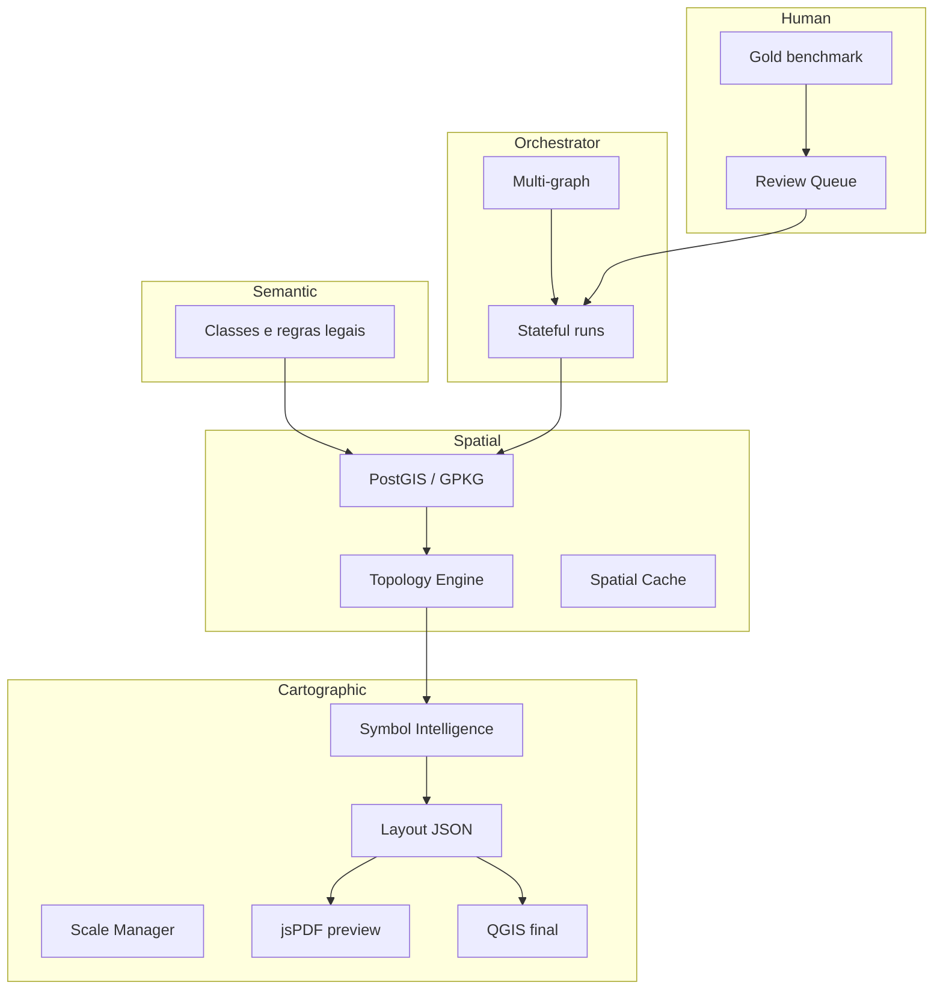

# MCA — Arquitetura Cartographic OS (refinamento enterprise)

**Plano executivo:** [`PLANO-EXECUTIVO.md`](PLANO-EXECUTIVO.md) · **Plano mestre:** [`PLANO-MAESTRO.md`](PLANO-MAESTRO.md)  
**Refinamento cirúrgico (fonte):** [`.cursor/plans/mca_refinamento_cartográfico_8aa68742.plan.md`](../../.cursor/plans/mca_refinamento_cartográfico_8aa68742.plan.md)

Visão: o MCA deixa de ser apenas um pipeline GIS com IA e torna-se uma **plataforma operacional cartográfica** para mapas técnicos rurais/ambientais (padrão Pimenta Consultoria).

## Estado actual (v1 implementado)

| Componente | Estado |
|------------|--------|
| 15 etapas E01–E15 + debugger UI | Implementado |
| 72 agentes em `mca_agent_registry.yaml` | Implementado |
| Orquestrador linear `resolveAgentOrder` → `runAgent` | Implementado |
| Firestore `mca_projects` + subcoleção `layers` (GeoJSON) | Implementado |
| PDF híbrido: jsPDF preview (E13) | Implementado |
| Export legado `study-maps` | Preservado |
| Geometrias uso/APP/RL/hidro | **Stubs** (estrutura pronta) |

**Decisão de timing (confirmada):** concluir **MVP v1** (E02–E15 reais onde possível) **antes** da plataforma cartográfica completa; PDF **híbrido** (jsPDF preview + QGIS/CAD final em v3).

---

## Modelo de três camadas (núcleo v2+)

```text
Semantic  →  o que significa (classe, base legal, origem)
Spatial   →  geometria pura (topologia, checksum)
Cartographic → como desenhar (estilo, escala, labels, zIndex)
```

### Tipos alvo (`src/lib/mca/types.ts` — evolução)

```typescript
type SemanticLayer = {
  layerId: string;
  semanticClass: string;       // ex. APP_HIDRICA
  legalBasis?: string;         // Lei 12.651
  origin?: string;             // buffer_hydro | dwg_import | ia_sam
  derivedFrom?: string[];      // layerIds
  reviewStatus?: ReviewStatus;
};

type SpatialLayer = {
  layerId: string;
  geometryRef: string;         // firestore:... | postgis:... (v3)
  checksum: string;            // cache key
  topologyStatus: "valid" | "invalid" | "repaired";
};

type CartographicView = {
  viewId: string;
  layerId: string;
  styleProfile: string;        // pimenta_uso_ocupacao
  scaleDenominator?: number;   // 12000
  labelRules?: LabelRule[];
  zIndex: number;
};
```

**Benefício:** mesma geometria → múltiplos layouts, órgãos e normas sem duplicar vetores.

---

## Orquestrador stateful (v2)

Estados por layer/agent run:

| Estado | Significado |
|--------|-------------|
| `pending` | Aguarda dependência |
| `running` | Em execução |
| `blocked` | Conflito não resolvido |
| `invalidated` | Dependência upstream mudou |
| `stale` | Precisa reprocessar |
| `reviewed` | Humano validou |
| `promoted` | Aprovado para export legal |

**Propagação exemplo:**

```text
HYD_CORREGO updated
  → AMB_APP_BUFFER invalidated
  → AMB_APP invalidated
  → AMB_RL_GLEBA stale
  → META_SCORE stale
```

Implementação alvo: `src/lib/mca/orchestrator/stateful.ts` + `invalidation-graph.ts`.

---

## Multi-graph (além de `depends_on`)

| Grafo | Exemplo |
|-------|---------|
| **execution** | Hidro antes de APP (actual DAG) |
| **semantic** | RL depende de vegetação |
| **legal** | APP depende de legislação/param |
| **visual** | Legenda depende de layers visíveis |
| **scale** | Labels dependem de escala |

Registo alvo: `mca_behavior_registry.yaml` com `invalidates`, `execution_deps`, `semantic_deps`, etc.

---

## Persistência híbrida

| Dado | v1 | v3+ |
|------|-----|-----|
| Metadados projeto, etapas, scores | Firestore | Firestore |
| Geometria pesada | Firestore subcoleção `layers` | **PostGIS** + `layerRef` |
| Raster / orto | — | GCS COG |
| Vector tiles | — | PMTiles / tile server |

Firestore **não** deve guardar `FeatureCollection` gigante em produção (>500 ha, muitas feições).

---

## Módulos enterprise (roadmap)

| Módulo | Função |
|--------|--------|
| `src/lib/mca/cache/` | Hash AOI, tiles, IA, buffers, layout (ver tabela abaixo) |
| `src/lib/mca/tiles/` | Quadkey, limiar **>500 ha** ou **>10k vértices**, PMTiles |
| `src/lib/mca/topology/` | Snap, sliver, overlap, simplify topológico |
| `src/lib/mca/symbols/` | Symbol Intelligence (colisão, peso, harmonia) |
| `src/lib/mca/scale/` | Multi-scale 1:5k / 1:12k / 1:50k / inset |
| `src/lib/mca/layout/` | **Layout JSON** intermediário (jsPDF + QGIS) |
| `src/lib/mca/review/` | Fila humana oficial `mca_reviews` |
| `src/lib/mca/gold/` | Benchmark Palmeiras, Mangabeiras, Catingueiro |

---

## Layout JSON intermediário (PDF híbrido)

Contrato único consumido por:

- **Preview:** `layout-pdf.ts` (jsPDF) — rápido, E13 v1
- **Final:** `infra/mca-qgis-worker` (PyQGIS) — v3, fidelidade Pimenta

```json
{
  "templateId": "pimenta_uso_ocupacao",
  "scale": "1:12000",
  "crs": "EPSG:31983",
  "frames": [{ "type": "main", "extent": [] }],
  "legend": [{ "group": "Uso e ocupação", "items": [] }],
  "tables": { "uso": [], "app": [], "rl": [] },
  "northArrow": true,
  "grid": { "utm": true },
  "inset": { "scale": "1:48000" },
  "stamp": { "crea": "144.093/D" }
}
```

`layoutMeta` no Firestore (v1) é subconjunto deste contrato.

---

## Behavior Registry (evolução do YAML actual)

```yaml
agent_id: MCA_APP_Polygon
semantic_role: APP_HIDRICA
legal_role: buffer_from_hydro
visual_role: fill_ambiental
execution_deps: [MCA_APP_Buffer_From_Hydro]
invalidates: [MCA_RL_Gleba_Polygon]
style_profile: pimenta_app
scale_profile: rural_12k
qa_profile: topology_overlap
cacheable: true
learning_profile: gold_catingueiro
```

---

## Score multidimensional (substitui “99%” simplista)

| Eixo | Peso v2 |
|------|---------|
| Geométrico | 25% |
| Topológico | 20% |
| Ambiental (legal/semântico) | 20% |
| Visual (vs gold map) | 20% |
| Semântico (classes coerentes) | 15% |

Calibrado com **mapas ouro** em `docs/mca/gold/`.

---

## Human Review Layer (oficial, não fallback)

- Coleção `mca_reviews`: agentId, layerId, status, reviewerUid, diff
- Export legal (PDF final, DWG) **bloqueado** até `promoted` nas layers críticas (APP, RL, limite)
- Integra com `mca_corrections` (v1 stub → v2 fila)

---

## Mapas ouro (benchmark)

| ID | Ficheiro referência | Uso |
|----|---------------------|-----|
| `gold_palmeiras` | Mapa Faz. Palmeiras | E05–E06, E12 layout simples |
| `gold_mangabeiras` | Mapa Faz. Mangabeiras | E09–E10 |
| `gold_catingueiro` | Mapa Faz. Catingueiro | E14–E15, regressão máxima |

Manifests: `docs/mca/gold/{id}/manifest.json` — áreas esperadas, contagens pivô/APP/RL, checklist visual.

---

## Roadmap v1 → v5

### v1 — MVP operacional (actual + disciplina)

- Concluir E02–E15 com agentes mínimos reais onde possível
- Congelar `produces` / `layerKey`
- Proibir estilo embutido no GeoJSON
- `checksum` opcional por layer
- Gold manifests + [`TESTING.md`](TESTING.md)
- **Não bloquear** por PostGIS/QGIS

### v2 — Fundação cartográfica

- Tipos Semantic / Spatial / Cartographic
- Behavior Registry parser
- Orchestrator stateful v1 + invalidation
- Topology engine (básico)
- Layout JSON builder
- Review queue oficial
- Score 5 eixos

### v3 — Produção enterprise

- PostGIS + `layerRef`
- Spatial cache + tile engine
- QGIS worker + export pipeline
- Versionamento de projeto (`mca_project_versions`)

### v4 — Inteligência cartográfica

- Symbol intelligence
- Benchmark CI vs gold (SSIM / checklist)
- Spatial memory graph
- Learning loop por `agent_id`
- SAM/MapBiomas integrados

### v5 — Cartographic OS

- Agentes cognitivos, multi-tenant
- Scheduler distribuído (Celery/Cloud Tasks)
- CAR automático, passivos, auditoria

---

## v1 — disciplina mínima (não travar agente actual)

1. Um agente → um `produces` / `layerKey` estável.
2. GeoJSON sem simbologia (só geometria + atributos semânticos mínimos).
3. Estilos só em `CartographicView` / QML / Layout JSON.
4. Documentar contrato em [`IMPLEMENTATION-SPEC.md`](IMPLEMENTATION-SPEC.md).
5. Testes: [`TESTING.md`](TESTING.md).

---

## Diagrama alvo



---

## Cache espacial (v3)

| Tipo | Chave | TTL | Storage |
|------|-------|-----|---------|
| Tile satélite | `hash(AOI)+source+date` | 30d | GCS |
| Inferência IA | `hash(tile)+model+version` | 7d | GCS |
| Buffer APP | `hash(parentGeom)+distance+rule` | por projeto | PostGIS/GCS |
| Layout render | `hash(layoutJson)+scale+template` | 1d | GCS |

**v1:** `checksum` SHA256 do GeoJSON no doc da layer; skip de cache só em v3.

---

## Tile engine (v3)

| Problema | Solução |
|----------|---------|
| FC inteira no browser | Vector tiles por AOI + zoom |
| Limite 1MB Firestore | PostGIS + PMTiles |
| Turf em polígono gigante | Worker por tile |

**v1:** `meta.processingMode: "monolith" | "tiled"` (default `monolith`).

---

## Export pipeline (v3)

| Export | Agente | Geometria | Símbolo |
|--------|--------|-----------|---------|
| GeoPackage | `MCA_Vector_Exporter` | PostGIS | — |
| DXF/DWG | `MCA_CAD_Exporter` | PostGIS | layers nomeados |
| QGZ | `MCA_QGIS_Exporter` | PostGIS + template | QGIS project |
| PDF final | `MCA_Layout_Exporter` | Layout JSON | QGIS print |

**Regra CAD:** model space = geometria; hatch via layer (`APP_HIDRICA`), nunca no GeoJSON.

---

## Aprendizado (v4+)

| Fonte | Mecanismo |
|-------|-----------|
| DWG ingest | `MCA_Learn_DWG_Ingest` → `symbols/profiles` |
| Correções | `mca_corrections` → `learning_profile` |
| Gold | drift se score < limiar vs manifest |

---

## Critérios de aceite por versão

| Versão | Aceite-chave |
|--------|----------------|
| **v1** | [`TESTING.md`](TESTING.md) checklist; E15 manual Catingueiro |
| **v2** | Catingueiro 1:12k + inset; APP invalida se hidro muda; PDF via Layout JSON |
| **v3** | >500 ha em modo tiled; re-run <30% custo (cache) |
| **v4** | `npm run mca:benchmark -- catingueiro` ≥ limiar |
| **v5** | Multi-tenant; scheduler Pub/Sub; agentes cognitivos |

---

## Árvore de módulos alvo

Ver árvore completa em [`PLANO-MAESTRO.md`](PLANO-MAESTRO.md#árvore-de-módulos-alvo).
