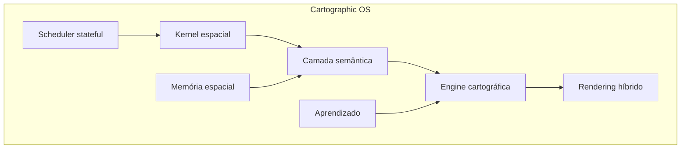

# MCA — Plano executivo consolidado

**Motor Cartográfico Automatizado** · EcoGestão MG / AmbientaR  
**Versão:** 1.0 · **Data:** 2026-05-28  
**Documento único:** reúne todas as discussões, planos, specs e auditoria do código actual.

**Índice geral:** [`INDEX.md`](INDEX.md)

---

## 1. Sumário executivo

O MCA substitui o submenu **Estudos Técnicos → Mapas** (`/studies/mapas`) por uma aplicação **standalone** (sem integração inicial com PIA, AIA, `geo_analyses` ou outros módulos do SaaS). O nome do projeto mantém-se para evolução futura como produto próprio.

**Objectivo:** produzir mapas técnicos rurais/ambientais com **fidelidade ao padrão Pimenta Consultoria** (cliente Célio Fontana / CF Agrícola), com **40+ micro-agentes** (um por layer, legenda, linha, quadro, rótulo), **15 etapas de projeto** e **debugger obrigatório** em cada etapa antes de avançar.

**Estado hoje (honesto):**

| Dimensão | Situação |
|----------|----------|
| **Estrutura** | ~72 agentes no registry, UI 3 abas, APIs MCA, Firestore, PDF jsPDF, export legado preservado |
| **Geometria real** | Perímetro, limite fundiário, buffer APP simplificado (~30 m); **maioria das layers vazias (stubs)** |
| **Fidelidade Pimenta** | Cartucho/tabelas em PDF; **sem** mapa vetorial, inset, grade QGIS, satélite embutido |
| **Debugger** | Automático forte em **E03** e **E05**; E01–E04 e E15 documentados; **E06–E14 sem `*-pass.md`** |
| **Enterprise** | Documentado (Cartographic OS v2–v5); **não implementado** (PostGIS, QGIS, stateful orchestrator) |

**Próximo passo recomendado:** executar [`TESTING.md`](TESTING.md), depois **Fechar v1** etapa a etapa (E05→E15) com debugger real e geometrias mínimas — **sem** misturar v2 enterprise no mesmo sprint.

---

## 2. Contexto e motivação (discussão completa)

### 2.1 O que existia antes

O workbench antigo de Mapas era leve: perímetro Leaflet, export ZIP/DXF/GPKG via worker GDAL (`study-maps`), STAC Sentinel-2. **Não** gerava folha técnica completa (grade UTM, legenda hierárquica, cartucho CREA, tabelas APP/RL, inset, multi-matrícula).

### 2.2 O que os PDFs Pimenta exigem

Mapas analisados na conversa (Downloads + rede `\\SERVIDOR\Pimenta Ltda\...`):

| Mapa | Área / escala | Destaques cartográficos |
|------|---------------|-------------------------|
| **Faz. Palmeiras** | ~1.748 ha · 1:12.000 | 2 matrículas; Córrego Guaribas/Soberbo; inset localização |
| **Faz. Mangabeiras** | RL fracionada | Pivôs, lavouras, APPs, veredas, gleba M-37.669, DAIA corretiva, rede elétrica |
| **Faz. Catingueiro** | ~2.074 ha · 1:17.000 | **Mapa ouro:** 7 matrículas, 25+ glebas RL, compensada, 6+ pivôs, SILOS, pista pouso, confrontantes nomeados |
| **Brejinho CF Agrícola** | ~2.846 ha | Compensação florestal + SEI, rodovia, lagos, 8 matrículas |
| **DWGs** (Catingueiro, Mangabeiras, Palmeiras, …) | CAD 2010 | Fonte para ingestão e catálogo de layers |

**Padrão fixo em todas as folhas:**

- Título: **Uso e Ocupação do Solo**
- CRS: **UTM SIRGAS 2000** (`EPSG:31983` em MG)
- Cartucho: propriedade, proprietário, município, comarca, cartório CNS 06.151-5, matrículas, CAR, área total, data, escala
- Coordenadas geodésicas da **SEDE** (DMS)
- Responsável técnico CREA-MG (ex. Elaine de Sales Fernandes **144.093/D**)
- Norte, barra de escala (m), **grade UTM** nas bordas, **mapa de localização** (inset 1:48.000 / 1:3.000)
- Legendas agrupadas: uso/ocupação, reservas legais, APP
- Rótulos de área: `Classe` + quebra + `XX,XXXX ha` (vírgula decimal)

### 2.3 Pesquisa de ecossistema (decisões técnicas)

| Tecnologia | Papel no MCA |
|------------|--------------|
| **QGIS headless** (PyQGIS) | PDF/DWG final, layout profissional (v3) |
| **PostGIS** | Geometria pesada, topologia, tiles (v3) |
| **MapBiomas / SAM** | Prior e segmentação uso (E14, v4) |
| **PRODES / IDE-Semana** | Contexto desmatamento (futuro) |
| **jsPDF** | Preview rápido E13 (v1 — actual) |
| **Turf.js** | Validação/buffer em perímetros pequenos (v1) |
| **ODA / DXF** | Export CAD (v3+) |
| **Firebase** | Auth, metadados, runs, layers v1 |
| **FastAPI** (`mca-engine`) | Health, DAG espelho (opcional porta 8090) |

### 2.4 Decisões de produto (fechadas)

| Tema | Decisão |
|------|---------|
| Integração SaaS | **Nenhuma** na v1 (PIA, AIA, geo_analyses fora) |
| Escopo MVP | **Pipeline completo** E01–E15 (não só perímetro+PDF) |
| Agentes | **Ultra-especializados** (~40–72), não um agente “mapa” genérico |
| Etapas de projeto | **15** (equilíbrio debug vs gestão; não 2–3 nem 48 marcos) |
| Debugger | **3 níveis:** macro (etapa), meso (família), micro (`/debug/agent`) |
| PDF | **Híbrido:** jsPDF preview + QGIS/CAD final |
| Evolução | **Cartographic OS** — Semantic → Spatial → Cartographic (não só GIS+IA) |
| Revisão humana | **Oficial** (`mca_reviews`), não fallback |
| Não quebrar SaaS | Export **legado** `study-maps` colapsável na UI |
| Gold maps | Palmeiras, Mangabeiras, **Catingueiro** (regressão máxima) |

---

## 3. Visão alvo: Cartographic OS

O MCA evolui para **sistema operacional cartográfico** com 7 subsistemas:



**10 pilares de longevidade** (detalhe em [`ARCHITECTURE.md`](ARCHITECTURE.md)):

1. Semantic layer  
2. Separação Semantic → Spatial → Cartographic  
3. MCA Behavior Registry (multi-perfil)  
4. Topology engine  
5. Scale-aware rendering  
6. PostGIS para geometria pesada  
7. Multi-graph orchestration  
8. Human review architecture  
9. Layout JSON intermediário  
10. Gold maps benchmark  

**Roadmap de ondas:**

| Onda | Foco | Aceite-chave |
|------|------|--------------|
| **v1** | MVP E02–E15 testável | Checklist [`TESTING.md`](TESTING.md); Catingueiro processado manualmente |
| **v2** | Fundação cartográfica (2–3 sprints) | APP invalida se hidro muda; Layout JSON; score 5 eixos |
| **v3** | PostGIS, tiles, QGIS worker | PDF final = QGIS; >500 ha tiled |
| **v4** | IA + benchmark CI | `mca:benchmark -- catingueiro` |
| **v5** | Multi-tenant, cognitivo, CAR | Cartographic OS completo |

---

## 4. Inventário de documentação (tudo reunido)

| # | Documento | O que contém |
|---|-----------|--------------|
| 1 | **Este ficheiro** | Plano executivo + auditoria + debugger por fase |
| 2 | [`INDEX.md`](INDEX.md) | Índice navegável |
| 3 | [`PLANO-MAESTRO.md`](PLANO-MAESTRO.md) | Fusão v6 refinamento + estado repo |
| 4 | [`ARCHITECTURE.md`](ARCHITECTURE.md) | Tipos, cache, tiles, topology, symbols, export, riscos |
| 5 | [`IMPLEMENTATION-SPEC.md`](IMPLEMENTATION-SPEC.md) | Contrato v1/v2, tipos TS, Behavior Registry |
| 6 | [`ETAPAS.md`](ETAPAS.md) | Tabela 15 etapas |
| 7 | [`TESTING.md`](TESTING.md) | Roteiro 7 passos, matriz, template erro |
| 8 | [`REFERENCIA-PIMENTA.md`](REFERENCIA-PIMENTA.md) | Classes, cartucho, mapa ouro |
| 9 | [`CAD-LAYER-CATALOG.md`](CAD-LAYER-CATALOG.md) | DWG → agent_id |
| 10 | [`gold/README.md`](gold/README.md) + manifests | Benchmark |
| 11 | `debug-reports/E0X-pass.md` | Gates por etapa |
| 12 | `.cursor/plans/mca_motor_cartográfico_*.plan.md` | Planos Cursor |
| 13 | `.cursor/plans/mca_refinamento_cartográfico_*.plan.md` | Refinamento cirúrgico |
| 14 | `infra/mca-engine/README.md` | Worker Python |
| 15 | `AGENTS.md` (raiz) | Dev, deploy, testes celular |

---

## 5. Auditoria do que já está implementado

### 5.1 Por componente

| Componente | Ficheiros | Estado | Notas |
|------------|-----------|--------|-------|
| **UI MCA** | `mca-workbench.tsx` | ✅ Funcional | Abas Projeto \| Pipeline \| Debugger; mapa Leaflet; import KML/GeoJSON |
| **Export legado** | `mapas-legacy-export.tsx` | ✅ Preservado | ZIP/DXF/GPKG via worker externo |
| **APIs REST** | `src/app/api/mca/*` | ✅ | health, projects CRUD, run, pdf, debug |
| **Orquestrador** | `orchestrator.ts` | ✅ Linear | Sem invalidação stateful |
| **Registry** | `mca_agent_registry.yaml` + `registry.ts` | ✅ | **72** entradas YAML; parser regex |
| **DAG** | `dag.ts` | ✅ | Ordenação topológica + deps |
| **Handlers** | `agents/handlers.ts` | ⚠️ Misto | ~30 referências a `emptyFc`/placeholder |
| **Debugger** | `debug.ts` + APIs | ⚠️ Parcial | E03, E05 automáticos; resto manual |
| **PDF** | `layout-pdf.ts` | ✅ Preview | Cartucho + tabelas; sem mapa vetorial |
| **Firestore** | `mca_projects`, `layers`, `mca_agent_runs` | ✅ | Regras `canStudyMapsRole` |
| **FastAPI** | `infra/mca-engine/` | ✅ Opcional | Health espelho; não obrigatório em dev |
| **Gold** | 3× `manifest.json` | ✅ Meta | Sem PDFs/geometrias no repo |
| **PostGIS / QGIS** | — | ❌ | v3 |
| **IA MapBiomas/SAM** | handlers disabled | ❌ | E14 stub |
| **Review queue** | — | ❌ | v2 |

### 5.2 Por família de agentes (72 no registry)

| Família | Exemplos | Implementação real | Stub / parcial |
|---------|----------|-------------------|----------------|
| **orchestration** | Master, DAG, Score, Conflict | Meta PASS | Sem invalidação |
| **ingest** | Perimeter, CRS, KML | ✅ Perímetro + CRS | Tile splitter stub |
| **learn** | DWG_Ingest | ⚠️ Só regista `dwgGcsPath` | Sem vetorização CAD |
| **fund** | Limite, Matrícula, CAR, Área | ✅ Limite = perímetro; labels meta | Confrontantes vazios |
| **hydro** | Ribeirão, Córrego, Vereda… | ❌ FC vazias | `placeholderNames` |
| **uso** | Lavoura, Pivô, Pasto… | ❌ FC vazias | Tabela derivada de layers vazias |
| **ambient** | APP buffer, RL, DAIA | ⚠️ Buffer 30 m Turf | RL polígonos vazios |
| **infra** | Sede, Silos, Rede… | ❌ FC vazias | Rede com LineString vazio |
| **layout** | Título, CREA, Grade, Inset… | ⚠️ Fragmentos `layoutMeta` | Sem render no PDF |
| **qa** | Topology, Visual | ⚠️ Topology = perímetro | Visual = nota humana |
| **cad** | DWG, QGZ, Layer export | ❌ Meta only | Worker futuro |
| **ia** | MapBiomas, SAM | ❌ `enabled: false` | E14 |

**Estimativa global v1:** estrutura **~85%** · fidelidade cartográfica **~25%** · debugger cobertura **~40%**.

### 5.3 Relatórios `debug-reports/` (honestidade)

| Etapa | Ficheiro | Declarado | Realidade |
|-------|----------|-----------|-----------|
| E01 | E01-pass.md | PASS | ✅ Docs criados |
| E02 | E02-pass.md | PASS | ✅ Health OK |
| E03 | E03-pass.md | PASS | ✅ DAG 72 agentes |
| E04 | E04-pass.md | PASS | ✅ UI CRUD |
| E05 | — | — | **Falta** — testar perímetro + debugger UI |
| E06–E14 | — | — | **Faltam** |
| E15 | E15-pass.md | PASS | ⚠️ Pipeline corre; **Catingueiro não benchmarkado** |

> **Regra:** não marcar PASS definitivo sem cumprir critérios da secção 6 correspondente.

---

## 6. Plano executivo — 15 fases com debugger

**Regra de ouro:** não avançar para etapa **N+1** sem `docs/mca/debug-reports/E0N-pass.md` com evidência + checks PASS.

**Três níveis de debugger:**

| Nível | Ferramenta | Quando |
|-------|------------|--------|
| **Macro** | `npm run mca:verify-etapa -- NN` + `E0N-pass.md` | Gate de etapa |
| **Meso** | `GET /api/mca/debug/etapa/N?projectId=` | Com projeto activo |
| **Micro** | `POST /api/mca/debug/agent` + botão Bug na UI | Agente isolado |

---

### Fase E01 — Especificação Pimenta

| Item | Detalhe |
|------|---------|
| **Objectivo** | Congelar requisitos visuais e taxonomia de agentes a partir dos mapas reais |
| **Entregáveis** | `REFERENCIA-PIMENTA.md`, `CAD-LAYER-CATALOG.md`, `ETAPAS.md`, agentes no YAML |
| **Estado** | ✅ Documentação base |
| **Debugger automático** | `npm run mca:verify-etapa -- 01` |
| **Critérios PASS** | Ficheiros existem; classes Pimenta listadas; mapa ouro = Catingueiro |
| **Melhorias** | Copiar PDFs para `docs/mca/gold/*/referencia.pdf` (opcional); expandir `CAD-LAYER-CATALOG` após 1º DWG |
| **Evidência** | `debug-reports/E01-pass.md` ✅ |

---

### Fase E02 — Infraestrutura + health

| Item | Detalhe |
|------|---------|
| **Objectivo** | Serviços MCA acessíveis; health com contagem de agentes |
| **Entregáveis** | `/api/mca/health`, `infra/mca-engine`, script `mca:verify-etapa` |
| **Estado** | ✅ |
| **Debugger** | `curl http://localhost:9002/api/mca/health` → `status: ok`, `agents` ≥ 40 |
| **Critérios PASS** | 200 JSON; opcional FastAPI :8090 |
| **Melhorias** | Health reportar versão registry + etapas suportadas |
| **Evidência** | `E02-pass.md` ✅ |

---

### Fase E03 — Registry + DAG

| Item | Detalhe |
|------|---------|
| **Objectivo** | 40+ agentes com `depends_on` sem ciclos; ordem de execução determinística |
| **Entregáveis** | `mca_agent_registry.yaml`, `registry.ts`, `dag.ts` |
| **Estado** | ✅ 72 agentes |
| **Debugger** | `npm run mca:verify-etapa -- 03`; UI Debugger E03 → PASS |
| **Critérios PASS** | DAG resolve todos os IDs; zero ciclos |
| **Melhorias v2** | Parser `yaml` nativo; `npm run mca:verify-registry` com `invalidates` |
| **Evidência** | `E03-pass.md` ✅ |

---

### Fase E04 — UI wizard + projetos Firestore

| Item | Detalhe |
|------|---------|
| **Objectivo** | CRUD projetos MCA; mapa perímetro; não regressão SaaS |
| **Entregáveis** | `McaWorkbench`, APIs projects, regras `mca_projects` |
| **Estado** | ✅ |
| **Debugger** | Criar projeto → listar → seleccionar → perímetro persiste |
| **Critérios PASS** | Sem `permission-denied`; `uid` correcto |
| **Melhorias** | Upload DWG na UI (E06); campo `dwgGcsPath`; progress bar por etapa |
| **Pré-requisitos** | `npm run deploy:rules`; Firebase Admin no `.env.local` para APIs |
| **Evidência** | `E04-pass.md` ✅ |

---

### Fase E05 — Perímetro + CRS

| Item | Detalhe |
|------|---------|
| **Objectivo** | Polígono válido, área em ha, CRS EPSG:31983 |
| **Entregáveis** | `MCA_Ingest_Perimeter`, `MCA_CRS_SIRGAS_UTM`, `MCA_QA_Topology` |
| **Estado** | ✅ Lógica real |
| **Debugger** | `GET /api/mca/debug/etapa/5?projectId=`; UI Bug em E05 |
| **Critérios PASS** | `perimeter_valid` + `area_ha` > 0 + CRS EPSG:* |
| **Melhorias** | Gate opcional: área Palmeiras **1748 ha ±0,5%** se usar perímetro gold |
| **Gold** | `gold_palmeiras/manifest.json` |
| **Evidência** | **Criar `E05-pass.md` após teste manual** |

---

### Fase E06 — DWG upload + catálogo CAD

| Item | Detalhe |
|------|---------|
| **Objectivo** | Ingerir DWG Pimenta; mapear layers → agentes |
| **Entregáveis** | Upload GCS; `MCA_Learn_DWG_Ingest`; `CAD-LAYER-CATALOG.md` completo |
| **Estado** | ⚠️ Só meta `dwgGcsPath` |
| **Debugger** | Projeto com DWG → agente retorna `imported: true`; catálogo ≥ 20 layers |
| **Critérios PASS** | Ficheiro no Storage; catálogo actualizado; GPKG derivado **ou** plano worker documentado |
| **Melhorias prioritárias** | UI upload; worker `geo-export` ou ODA; normalizar para `layers/*` |
| **Fontes** | `\\SERVIDOR\Pimenta Ltda\...\*.dwg` |
| **Evidência** | **Criar `E06-pass.md`** |

---

### Fase E07 — Fundiário

| Item | Detalhe |
|------|---------|
| **Objectivo** | Limite propriedade, matrículas M-37.xxx, quadro matrículas, confrontantes |
| **Entregáveis** | `FUND_LIMITE`, `FUND_MATRICULA`, labels, CAR, área total |
| **Estado** | ⚠️ Limite OK; confrontantes vazios |
| **Debugger** | Pipeline etapa 7; layers `FUND_*` no Firestore |
| **Critérios PASS** | N matrículas no meta = N features ou labels; área total coerente |
| **Melhorias** | Confrontantes com nome+fazenda+matrícula (Catingueiro); split real por matrícula |
| **Gold** | Palmeiras (2 matr.), Catingueiro (7 matr.) |
| **Evidência** | **Criar `E07-pass.md`** |

---

### Fase E08 — Hidrografia + base satélite

| Item | Detalhe |
|------|---------|
| **Objectivo** | Feições linha/polígono hidro nomeadas; basemap referência |
| **Entregáveis** | `HYD_*` layers; `MCA_Base_Satellite` |
| **Estado** | ❌ FC hidro vazias; basemap só Leaflet UI |
| **Debugger** | Após run: pelo menos 1 `HYD_*` com geometria **ou** import DWG hidro |
| **Critérios PASS** | ≥1 feição linha com `coordinates.length > 0` **ou** documentar fonte externa |
| **Melhorias** | Extrair hidro do DWG; OSM/ANA futuro; nomes «Córrego Guaribas» |
| **Evidência** | **Criar `E08-pass.md`** |

---

### Fase E09 — Uso e ocupação

| Item | Detalhe |
|------|---------|
| **Objectivo** | Polígonos uso (lavoura, pivô, pasto…); tabela resumo; legenda grupo |
| **Entregáveis** | `USO_*`, `MCA_Uso_Tabela_Resumo`, `MCA_Uso_Legend_Group` |
| **Estado** | ❌ Polígonos vazios; tabela com zeros |
| **Debugger** | `USO_LAVOURA` ou `USO_PIVO` com área > 0 **ou** tabela com linhas reais |
| **Critérios PASS** | Soma áreas uso ≈ área total ±10% (configurável) |
| **Melhorias** | DWG → polígonos; MapBiomas prior (E14); rótulos `Classe\nXX,XXXX ha` |
| **Gold** | Mangabeiras (pivôs + lavouras) |
| **Evidência** | **Criar `E09-pass.md`** |

---

### Fase E10 — APP + Reserva Legal

| Item | Detalhe |
|------|---------|
| **Objectivo** | APP a partir hidro; polígonos RL por gleba; flags compensada; tabelas |
| **Entregáveis** | `AMB_APP*`, `AMB_RL_*`, `MCA_Conflict_Merger` |
| **Estado** | ⚠️ Buffer 30 m simplificado; RL sem geometria |
| **Debugger** | `AMB_APP` área > 0; tabela APP; RL glebas ≥ 1 polígono **ou** meta `rlRows` |
| **Critérios PASS** | APP ≥ 0,09% área propriedade (regra mínima); conflitos listados |
| **Melhorias** | Buffer legal real (30/50/100 m por tipo hidro); RL do DWG; compensada |
| **Gold** | Mangabeiras, Catingueiro |
| **Evidência** | **Criar `E10-pass.md`** |

---

### Fase E11 — Infraestrutura no mapa

| Item | Detalhe |
|------|---------|
| **Objectivo** | Sede, silos, pista, rede elétrica, DAIA, rodovia, compensação SEI |
| **Entregáveis** | `INFRA_*`, `AMB_DAIA`, `CTX_*` |
| **Estado** | ❌ Stubs |
| **Debugger** | ≥2 `INFRA_*` com geometria pontual/linear |
| **Critérios PASS** | Sede dentro do perímetro; rede como LineString não vazia |
| **Melhorias** | Pontos do DWG; coordenadas DMS sede no cartucho |
| **Evidência** | **Criar `E11-pass.md`** |

---

### Fase E12 — Layout cartográfico (metadados)

| Item | Detalhe |
|------|---------|
| **Objectivo** | `layoutMeta` completo para PDF/QGIS futuro |
| **Entregáveis** | Agentes `MCA_Layout_*`; `layoutMeta` no projeto |
| **Estado** | ⚠️ Fragmentos booleanos |
| **Debugger** | `layoutMeta` contém título, CREA, escala, north, grid flags |
| **Critérios PASS** | 8+ chaves layout preenchidas após pipeline |
| **Melhorias v2** | `buildLayoutJson()` completo; inset bbox |
| **Evidência** | **Criar `E12-pass.md`** |

---

### Fase E13 — PDF técnico (preview)

| Item | Detalhe |
|------|---------|
| **Objectivo** | Download PDF uso e ocupação |
| **Entregáveis** | `GET /projects/{id}/pdf`, `layout-pdf.ts` |
| **Estado** | ✅ Cartucho + tabelas |
| **Debugger** | Download abre; contém título, quadro, tabelas se existirem |
| **Critérios PASS** | PDF válido < 30s; sem 500 |
| **Limitação v1** | Sem mapa vetorial/satélite/inset |
| **Melhorias v2** | Renderer Layout JSON; v3 QGIS |
| **Evidência** | Incluir em `E13-pass.md` após teste |

---

### Fase E14 — IA (rascunho)

| Item | Detalhe |
|------|---------|
| **Objectivo** | Segmentação SAM / prior MapBiomas; fila revisão |
| **Entregáveis** | `MCA_Uso_IA_*`, `MCA_Uso_Segment_SAM`, `mca_corrections` |
| **Estado** | ❌ `enabled: false` |
| **Debugger** | Agentes não crasham; status `skipped` ou `pass` com nota |
| **Critérios PASS v1** | Pipeline E14 sem fail; documentar activação v4 |
| **Melhorias** | Chaves API; tiles; review UI |
| **Gold** | Catingueiro (complexidade máxima) |
| **Evidência** | **Criar `E14-pass.md`** |

---

### Fase E15 — CAD + release v1

| Item | Detalhe |
|------|---------|
| **Objectivo** | Release MCA v1; score; export; legado intacto |
| **Entregáveis** | Score aggregator; CAD meta; checklist QA |
| **Estado** | ⚠️ Score simplificado (4 eixos, não 5) |
| **Debugger** | Pipeline 15; toast nota; legado export opcional |
| **Critérios PASS v1** | [`TESTING.md`](TESTING.md) checklist 8 itens; **processar perímetro tipo Catingueiro** e documentar desvios |
| **Critérios PASS v4** | `npm run mca:benchmark -- catingueiro` |
| **Melhorias** | GeoJSON ZIP export; DWG via worker |
| **Evidência** | Actualizar `E15-pass.md` com resultado benchmark manual |

---

## 7. Matriz etapa × debugger × implementação

| Etapa | Nome | Código | Debugger auto | `*-pass.md` | Prioridade melhoria |
|-------|------|--------|---------------|-------------|---------------------|
| E01 | Spec | Docs ✅ | CLI 01 ✅ | ✅ | PDFs em gold/ |
| E02 | Infra | ✅ | health ✅ | ✅ | — |
| E03 | Registry | ✅ | CLI 03 ✅ | ✅ | Parser yaml v2 |
| E04 | UI | ✅ | Manual | ✅ | Upload DWG |
| E05 | Perímetro | ✅ | API 05 ✅ | ❌ | Teste + pass |
| E06 | DWG | Stub | Manual | ❌ | **Alta** |
| E07 | Fundiário | Parcial | Manual | ❌ | Confrontantes |
| E08 | Hidro | Stub | Manual | ❌ | **Alta** |
| E09 | Uso | Stub | Manual | ❌ | **Alta** |
| E10 | APP/RL | Parcial | Manual | ❌ | **Alta** |
| E11 | Infra mapa | Stub | Manual | ❌ | Média |
| E12 | Layout | Parcial | Manual | ❌ | Layout JSON v2 |
| E13 | PDF | ✅ | Download | ❌ | Mapa no PDF v2 |
| E14 | IA | Stub | Manual | ❌ | v4 |
| E15 | Release | Parcial | Pipeline | ⚠️ | Benchmark ouro |

---

## 8. Roteiro de execução recomendado (sprints)

### Sprint 0 — Validação (agora)

1. `npm run dev` + login `technical`  
2. Seguir [`TESTING.md`](TESTING.md) completo  
3. Preencher template de erro se falhar  
4. Criar `E05-pass.md` … `E14-pass.md` com evidências reais  

### Sprint 1 — Geometria mínima v1 (2–3 semanas)

Ordem técnica (respeita DAG):

1. **E06** — Upload DWG + extracção layers básicas  
2. **E08** — Hidro do DWG ou desenho assistido  
3. **E09** — Uso do DWG  
4. **E10** — APP buffer legal + RL polígonos  
5. **E07** — Confrontantes e split matrícula  
6. **E11** — Pontos infra  

**Disciplina:** sem `fill`/`stroke` no GeoJSON; `checksum` em cada layer.

### Sprint 2 — PDF e layout (1–2 semanas)

1. **E12** — `layoutMeta` rico  
2. **E13** — Melhorar jsPDF (opcional: preview mapa raster Leaflet)  
3. **E15** — Benchmark manual Catingueiro → actualizar `E15-pass.md`  

### Sprint 3 — Fundação v2 (ver [`PLANO-MAESTRO.md`](PLANO-MAESTRO.md))

1. Tipos Semantic / Spatial / Cartographic  
2. Behavior Registry parser  
3. Layout JSON builder  
4. Orchestrator stateful + invalidação  

### Sprint 4+ — v3 enterprise

PostGIS, cache, tiles, `mca-qgis-worker`, PDF final QGIS.

---

## 9. O que NÃO fazer agora (evitar dispersão)

- PostGIS, PMTiles, cache distribuído  
- Stateful orchestrator completo  
- Symbol Intelligence / collision  
- Multi-tenant v5  
- Integração PIA/AIA/geo_analyses  
- Prometer «99%» de fidelidade sem gold benchmark  

---

## 10. Riscos e mitigação

| Risco | Impacto | Mitigação |
|-------|---------|-----------|
| Firestore 1MB | Projeto grande falha | Limite v1; PostGIS v3 |
| Falsos PASS (stubs) | Confiança errada | Debugger por etapa; gold manual |
| Sem DWG worker | E06–E11 bloqueadas | Priorizar upload + parser mínimo |
| jsPDF limitado | PDF «pobre» | Layout JSON v2; QGIS v3 |
| Custo IA | Orçamento | E14 off até v4; cache checksum |
| Regras Firestore | 500/permission | `deploy:rules` + Admin SDK |

---

## 11. Template de reporte (obrigatório em falhas)

```text
1. Passo: (ex. Fase E09 — Pipeline)
2. Ambiente: dev local | App Hosting
3. Role: technical | admin | …
4. deploy:rules feito? sim/não
5. Firebase Admin configurado? sim/não
6. projectId:
7. Mensagem exacta:
8. Esperado vs obtido:
```

---

## 12. Decisões da conversa preservadas (checklist)

- [x] Substituir submenu Mapas, manter rota `/studies/mapas`  
- [x] Standalone sem PIA/AIA inicial  
- [x] 40+ micro-agentes especializados (72 no registry)  
- [x] 15 etapas com debugger (não 2 nem 48 marcos de projeto)  
- [x] 3 níveis debug: macro / meso / micro  
- [x] Mapas Pimenta: Palmeiras, Mangabeiras, Catingueiro, Brejinho  
- [x] DWGs servidor Pimenta como fonte CAD  
- [x] PDF híbrido jsPDF + QGIS futuro  
- [x] Cartographic OS Semantic→Spatial→Cartographic  
- [x] Export legado study-maps preservado  
- [x] Gold Catingueiro = regressão máxima  
- [x] Revisão humana oficial (v2)  
- [x] MVP pipeline completo E01–E15 (estrutura)  
- [ ] Fidelidade cartográfica alta (pendente geometrias reais DWG no repo)  
- [x] Benchmark Catingueiro automatizado (v4 — `mca:verify-gold-v4` + API visual-verify)  
- [x] Satélite Esri server-side no PDF MCA (`resolve-pdf-map-image-server.ts`)  
- [x] Import CAD ouro — `layers-import.json` via `mca:regenerate-gold-perimeters`  

---

## 13. Ligações rápidas

| Acção | Onde |
|-------|------|
| Testar agora | [`TESTING.md`](TESTING.md) |
| Arquitectura | [`ARCHITECTURE.md`](ARCHITECTURE.md) |
| Contrato código | [`IMPLEMENTATION-SPEC.md`](IMPLEMENTATION-SPEC.md) |
| Visão longo prazo | [`PLANO-MAESTRO.md`](PLANO-MAESTRO.md) |
| Todos Cursor | [`.cursor/plans/mca_motor_cartográfico_a1071e68.plan.md`](../../.cursor/plans/mca_motor_cartográfico_a1071e68.plan.md) |

---

*Documento gerado pela consolidação dos planos MCA, refinamento enterprise 8aa68742, implementação v1 no repositório e histórico da conversa de desenvolvimento.*
