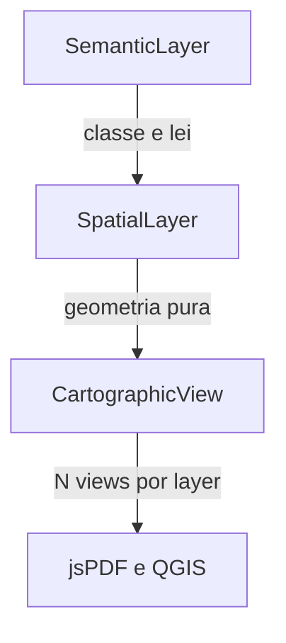
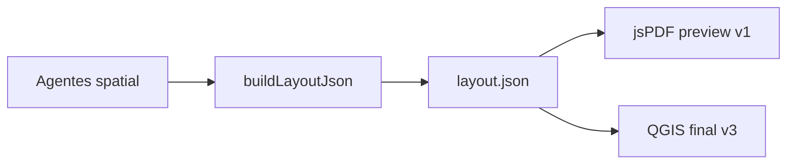

# MCA — Plano mestre Cartographic OS

> **Operação e debugger por fase:** [`PLANO-EXECUTIVO.md`](PLANO-EXECUTIVO.md) · **Índice:** [`INDEX.md`](INDEX.md)

**Versão:** 6 (fusão do refinamento enterprise + implementação v1)  
**Fontes:** [`.cursor/plans/mca_refinamento_cartográfico_8aa68742.plan.md`](../../.cursor/plans/mca_refinamento_cartográfico_8aa68742.plan.md) (refinamento cirúrgico ~960 linhas), código em `src/lib/mca/`, [`ARCHITECTURE.md`](ARCHITECTURE.md), [`TESTING.md`](TESTING.md)

---

## Posicionamento

O MCA **não é um pipeline GIS com IA** — é um **sistema operacional cartográfico** (Cartographic OS):

| Subsistema | Função | Módulo (pós-v1) |
|------------|--------|------------------|
| Kernel espacial | geometria, topologia, tiles | `topology/`, `tiles/`, PostGIS |
| Camada semântica | significado legal/ambiental | `semantic/`, `knowledge/` |
| Engine cartográfica | símbolos, escala, layout | `symbols/`, `scale/`, `layout/` |
| Scheduler | DAG + invalidação encadeada | `orchestrator/` stateful |
| Memória espacial | reutilização matrícula/CAR | `memory/`, `mca_spatial_index` |
| Rendering | preview + export premium | jsPDF + QGIS (Layout JSON) |
| Aprendizado | DWG, gold, correções | `learn/`, `gold/` |

**Decisões fechadas**

| Tema | Decisão |
|------|---------|
| Timing | **v1 (E02–E15)** primeiro; enterprise v2–v5 em ondas |
| PDF | **Híbrido:** jsPDF preview (E13) + QGIS/CAD final (v3) |
| Modelo | **Semantic → Spatial → Cartographic** |
| Persistência | Firestore v1 → PostGIS v3 |
| Revisão humana | **Oficial** (`mca_reviews`), não fallback |
| Benchmark | Gold: Palmeiras, Mangabeiras, **Catingueiro** (ouro) |

---

## Estado actual do repositório

| Componente | Ficheiro | Estado |
|------------|----------|--------|
| UI MCA | [`mca-workbench.tsx`](../src/app/(app)/studies/mapas/mca-workbench.tsx) | Implementado |
| APIs | `src/app/api/mca/*` | Implementado |
| Orquestrador linear | [`orchestrator.ts`](../src/lib/mca/orchestrator.ts) | Implementado |
| Registry | 72 agentes YAML + parser regex | Implementado |
| PDF preview | [`layout-pdf.ts`](../src/lib/mca/layout-pdf.ts) | Implementado |
| Export legado | [`mapas-legacy-export.tsx`](../src/app/(app)/studies/mapas/mapas-legacy-export.tsx) | Preservado |
| Semantic/PostGIS/stateful | — | v2–v3 |
| Gold manifests | [`gold/*/manifest.json`](gold/) | Criados |
| Testes | [`TESTING.md`](TESTING.md) | Criado |

---

## Os 10 pilares de longevidade

1. Semantic layer  
2. Separação Semantic → Spatial → Cartographic  
3. MCA Behavior Registry (multi-perfil)  
4. Topology engine  
5. Scale-aware / multi-scale rendering  
6. Migração spatial → PostGIS  
7. Knowledge / multi-graph orchestration  
8. Human review architecture  
9. Layout JSON intermediate  
10. Gold maps benchmark  

Detalhe técnico: [`ARCHITECTURE.md`](ARCHITECTURE.md) (secções 1–15).

---

## Modelo de três camadas (resumo)



- **Semantic:** `class`, `legalBasis`, `origin`, `reviewStatus`, `derivedFrom`  
- **Spatial:** `geometryRef`, `checksum`, `topologyStatus` — **sem** cor/espessura no GeoJSON  
- **Cartographic:** `styleProfile`, `scaleDenominator`, `labels`, `zIndex`  

**Regra:** agentes spatial escrevem geometria; agentes cognitive (`MCA_Interpret_*`, v5) escrevem semântica.

---

## Orquestrador stateful (v2 — não bloqueia v1)

Estados: `pending` → `running` → `pass` | `fail` | `blocked` → `invalidated` | `stale` → `reviewed` → `promoted`

```text
HYD_CORREGO updated → APP invalidated → RL stale → score stale
```

**v1:** guardar `checksum` + `sourceAgentId` + `updatedAt` por layer; sem state machine completa.

---

## Multi-graph (v2+)

| Grafo | Campo registry | Exemplo |
|-------|----------------|---------|
| execution | `depends_on` | Hidro → APP |
| semantic | `semantic_deps` | RL ↔ vegetação |
| legal | `legal_deps` | APP ↔ Lei 12.651 |
| visual | `visual_deps` | Legenda ↔ layers |
| scale | `scale_deps` | Labels ↔ escala |

**v1:** só `depends_on`; `knowledge/relations.ts` estático em v2.

---

## Infraestrutura enterprise (ondas)

| Módulo | Função | Versão |
|--------|--------|--------|
| `cache/` | tiles, IA, buffers, layout por hash | v3 |
| `tiles/` | quadkey, PMTiles, limiar >500 ha | v3 |
| `topology/` | snap, sliver, overlap, repair | v2 |
| `symbols/` | Symbol Intelligence Engine | v2–v4 |
| `scale/` | 1:5k / 1:12k / 1:50k / inset | v2 |
| `layout/` | Layout JSON + renderers | v2–v3 |
| `review/` | fila `mca_reviews` | v2 |
| `export/` | GPKG, DXF, QGZ, PDF final | v3 |
| `graph/` | multi-graph resolver | v2 |

---

## Layout JSON + PDF híbrido



`layoutMeta` (v1) = subconjunto do contrato. Ver exemplo JSON em [`ARCHITECTURE.md`](ARCHITECTURE.md).

---

## Score multidimensional (v2)

| Eixo | Peso |
|------|------|
| Geométrico | 25% |
| Topológico | 20% |
| Ambiental | 20% |
| Visual | 20% |
| Semântico | 15% |

**v1:** score agregado indicativo; calibrar com gold em v4.

---

## v1 — disciplina (AGORA — não travar código)

| Regra | Detalhe |
|-------|---------|
| Geometria pura | Sem `fill`/`stroke`/`color` em properties |
| `produces` / `layerKey` | Congelados (`HYD_*`, `APP_*`, `FUND_*`) |
| Semântica mínima | Só `properties.class` opcional |
| `checksum` | Opcional por layer (prepara cache) |
| Firestore | GeoJSON inline (aceitar limite v1) |
| PDF | jsPDF apenas |
| Gold | manifests + teste manual Catingueiro |

**Não fazer em v1:** PostGIS, tiles, state machine, cache distribuído, Symbol Intelligence completo.

---

## Roadmap v1 → v5


### v1 — MVP operacional

- E02–E15, agentes reais mínimos, export básico, jsPDF, gold docs  
- **Gate:** [`TESTING.md`](TESTING.md) checklist + `E15-pass.md` com Catingueiro processado  

### v2 — Fundação cartográfica (2–3 sprints)

Tipos triplos, Behavior Registry parser (`yaml`), orchestrator invalidation, topology TS, symbols/profiles Pimenta, scale manager, Layout JSON builder, review queue, score 5 eixos  

**Aceite:** Catingueiro 1:12k; APP invalida ao mudar hidro; PDF via Layout JSON  

### v3 — Produção enterprise (2–3 sprints)

PostGIS, cache, tiles, `infra/mca-qgis-worker`, export pipeline, versioning, PDF final QGIS  

**Aceite:** >500 ha em modo tiled; re-run <30% custo com cache  

### v4 — Inteligência cartográfica

Symbol intelligence, QA visual vs gold, `npm run mca:benchmark`, spatial memory, SAM/learning  

**Aceite:** benchmark Catingueiro ≥ limiar  

### v5 — Cartographic OS

Agentes cognitivos, multi-tenant, CAR/passivo, scheduler Pub/Sub, spatial event bus  

---

## 15 etapas + debugger

Ver [`ETAPAS.md`](ETAPAS.md). Regra: **PASS** em `docs/mca/debug-reports/E0X-pass.md` antes de avançar.

---

## Guia de testes

**Documento operacional:** [`TESTING.md`](TESTING.md) (roteiro UI 7 passos, CLI, matriz etapa×gate, limitações v1, template 8 campos, erros frequentes).

**Validação imediata:** role `technical` → login → Mapas → perímetro → criar → pipeline → PDF → debugger E05 PASS.

---

## Árvore de módulos alvo

```text
src/lib/mca/
  types.ts
  registry.ts
  dag.ts
  orchestrator/          # v2: state-machine, invalidation, scheduler
  graph/                 # v2: execution + knowledge + multi-graph
  semantic/              # v2
  spatial/               # v3: geometryRef helpers
  symbols/               # Symbol Intelligence
  scale/
  topology/
  knowledge/
  layout/
    layout-spec.ts
    layout-builder.ts
    renderers/jspdf-renderer.ts
    renderers/qgis-renderer.ts
  cache/                 # v3
  tiles/                 # v3
  conflict/
  review/                # v2
  export/                # v3
  memory/                # v4
  agents/
  gold/                  # loaders benchmark
  templates/
```

---

## Riscos e mitigação

| Risco | Mitigação |
|-------|-----------|
| Firestore 1MB / geometria grande | v1 limite; v3 PostGIS obrigatório > threshold |
| Custo IA/satélite | checksum v1; cache v3 |
| Orchestrator linear | v2 invalidação antes de mais agentes |
| jsPDF limitado | Layout JSON v2; QGIS v3 |
| Registry regex | parser `yaml` v2 |
| Falsos PASS com stubs | gold CI v4; review manual v1 |

---

## Ordem de implementação (após testes v1)

1. **Não parar E02–E15** — estabilizar v1.  
2. Disciplina geométrica nos handlers.  
3. Contrato em [`IMPLEMENTATION-SPEC.md`](IMPLEMENTATION-SPEC.md).  
4. **v2 nesta ordem:** `types` triplos → Behavior Registry parser → Layout JSON builder → orchestrator stateful.  
5. **v3:** PostGIS + QGIS quando v1 estável.

**Diferencial sustentável:** Behavior Registry + Knowledge Graph + Gold Maps = prática Pimenta como dados executáveis.

---

## Documentação relacionada

| Documento | Conteúdo |
|-----------|----------|
| [`ARCHITECTURE.md`](ARCHITECTURE.md) | Detalhe técnico secções 1–15 |
| [`TESTING.md`](TESTING.md) | Guia de testes v1 |
| [`IMPLEMENTATION-SPEC.md`](IMPLEMENTATION-SPEC.md) | Contrato código actual |
| [`REFERENCIA-PIMENTA.md`](REFERENCIA-PIMENTA.md) | Padrão visual |
| [`gold/README.md`](gold/README.md) | Mapas ouro |
| [`.cursor/plans/mca_motor_cartográfico_a1071e68.plan.md`](../../.cursor/plans/mca_motor_cartográfico_a1071e68.plan.md) | Índice Cursor (todos) |
