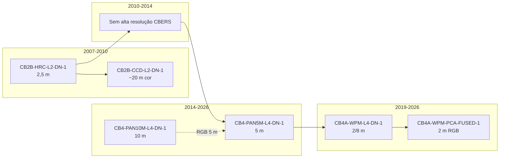
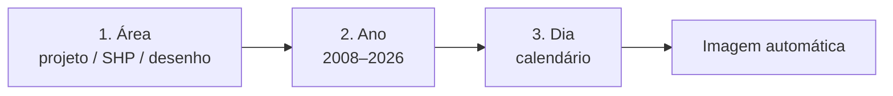
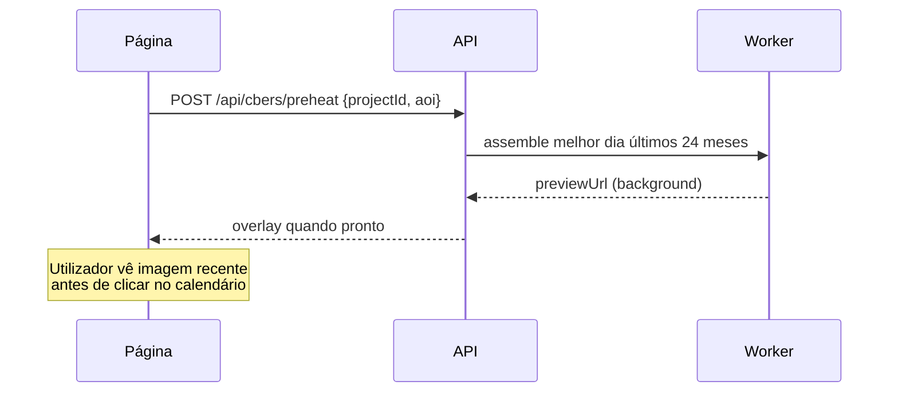
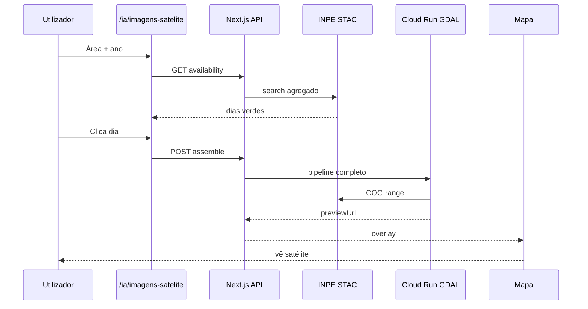

# Imagens de satélite INPE (CBERS) — Plano consolidado para avaliação

**AmbientaR / EcoGestão MG**  
**Versão:** 3.1 · **Data:** 2026-06-11  
**Estado:** **aprovado para implementação — Fase 1 (MVP leigo)** (sem código ainda)  
**Ficheiro:** `docs/CBERS-ARQUIVO-INPE-PLANO.md`

| Campo | Valor |
|-------|-------|
| Menu proposto | IA → **Imagens de satélite (INPE)** |
| Rota UI | `/ia/imagens-satelite` |
| Worker | `infra/cbers-mosaic-worker/` (Cloud Run + GDAL) |
| Fonte de imagens | INPE STAC — `https://data.inpe.br/bdc/stac/v1/` |
| Custo imagens | **R$ 0** (atribuição CBERS/INPE obrigatória) |
| Limite AOI | **Sem limite de hectares** |
| Pré-aquecimento | **Sim** — imagem recente ao abrir projeto |
| GeoTIFF no MVP | **Sim** — download no accordion / botão |
| CAR no MVP | **Sim** — importar geometria SICAR automática |

---

## Índice

1. [Sumário executivo](#1-sumário-executivo)
2. [Checklist de avaliação (stakeholder)](#2-checklist-de-avaliação-stakeholder)
3. [Decisões fechadas](#3-decisões-fechadas)
4. [Princípio anti-SPRING](#4-princípio-anti-spring)
5. [Personas e user stories](#5-personas-e-user-stories)
6. [Enquadramento legal e produto](#6-enquadramento-legal-e-produto)
7. [Sensores, coleções STAC e lacunas](#7-sensores-coleções-stac-e-lacunas)
8. [UX para leigos — fluxo completo](#8-ux-para-leigos--fluxo-completo)
9. [Motor automático de bandas (GDAL)](#9-motor-automático-de-bandas-gdal)
10. [Integração AmbientaR ↔ INPE](#10-integração-ambientar--inpe)
11. [Modelo de dados e Storage](#11-modelo-de-dados-e-storage)
12. [Detecção de mudanças e relatórios](#12-detecção-de-mudanças-e-relatórios)
13. [Integração com módulos existentes](#13-integração-com-módulos-existentes)
14. [API STAC — referência operacional](#14-api-stac--referência-operacional)
15. [Fases, cronograma e critérios de aceitação](#15-fases-cronograma-e-critérios-de-aceitação)
16. [Riscos, custos e decisões resolvidas](#16-riscos-custos-e-decisões-resolvidas)
17. [Referências](#17-referências)
18. [Glossário e histórico de versões](#18-glossário-e-histórico-de-versões)

---

## 1. Sumário executivo

### 1.1 Problema

Consultorias ambientais em MG precisam de **imagens históricas e actuais** da propriedade para:

- comprovar **ocupação antropizada consolidada** (DN 130, PCA, RCA, regularização);
- comparar **antes / depois** (estilo PRODES / MapBiomas);
- anexar evidência visual a estudos e defesas.

Hoje isso exige **software técnico** (ex. [SPRING](https://www.dpi.inpe.br/spring/index.html): importar cena, escolher bandas R/G/B, contrastar, fundir PAN+MS manualmente) ou **portais INPE** pouco integrados ao fluxo de trabalho.

### 1.2 Solução proposta

Módulo no AmbientaR onde **qualquer utilizador** (incluindo leigo):

1. define a **área** (projeto, desenho, SHP/KML);
2. escolhe o **ano**;
3. **clica no dia** no calendário;
4. vê a **imagem de satélite em alta resolução** no mapa — bandas montadas, fusionadas e recortadas **automaticamente**.

### 1.3 Princípios de produto

| Princípio | Descrição |
|-----------|-----------|
| **Custo zero em imagens** | Dados CBERS gratuitos via INPE |
| **INPE = fonte canónica** | STAC API; não replicar acervo nacional |
| **Arquivo por projeto/cliente** | Só mosaicos recortados na fazenda |
| **UX leigo** | Zero jargão (STAC, bandas, GDAL) na interface principal |
| **Anti-SPRING** | Toda fusão de bandas invisível no backend |
| **Evidência, não parecer legal** | IA e mapas apoiam; conclusão jurídica é humana |

### 1.4 Capacidades por camada

| Camada | Utilizador | Entrega |
|--------|------------|---------|
| **MVP (Fase 1)** | Leigo | Ano + dia → imagem no mapa; **CAR**; **GeoTIFF**; **pré-aquecimento** |
| **v2** | Técnico | Comparar duas datas (slider) + HRC 2008–2010 |
| **v3** | Consultor | Relatório PDF mudanças + PRODES/MapBiomas |
| **v4** | Admin | Cache regional, MCA, modo técnico avançado |

---

## 2. Checklist de avaliação (stakeholder)

**Estado geral:** aprovado em **2026-06-11** (stakeholder EcoGestão MG). Pronto para **Fase 1 — MVP leigo**.

### 2.1 Produto e UX

- [x] O fluxo **área → ano → dia → imagem** é suficiente para utilizadores não-técnicos?
- [x] O nome **“Imagens de satélite (INPE)”** no menu IA é adequado?
- [x] Aceitamos calendário com **verde / amarelo / cinza** (sem % nuvem na UI principal)?
- [x] Aceitamos espera de **até 2 min** na primeira imagem de um dia/área (mitigado por pré-aquecimento)?
- [x] Imagem **preto-e-branco** em alguns dias HRC sem CCD é aceitável com mensagem amigável?

### 2.2 Cobertura temporal

- [x] Série **2008 (HRC) → 2026 (4A/PAN)** aprovada?
- [x] Lacuna **2010–2014** (sem alta resolução) documentada para o utilizador?
- [x] **CBERS-4 PAN 5 m** como ponte 2014–2026 aprovado?
- [x] **CBERS-4A fusionado 2 m** (desde mar/2023) como preferência recente?

### 2.3 Técnico e infra

- [x] **Cloud Run + GDAL** (`infra/cbers-mosaic-worker`) aprovado?
- [x] Cache em Firebase Storage por projeto aprovado?
- [x] Variáveis `CBERS_MOSAIC_WORKER_URL` + `WORKER_SHARED_SECRET` no App Hosting?
- [x] Região Cloud Run: **southamerica-east1**?
- [x] **Sem limite de hectares** na AOI (mosaico multi-cena + timeout alargado)?
- [x] **Pré-aquecimento** da imagem mais recente ao abrir projeto com área definida?
- [x] **Download GeoTIFF** incluído no MVP (não adiado)?
- [x] **Integração CAR (SICAR)** no MVP para definir área automaticamente?

### 2.4 Legal e relatórios

- [x] Relatório automático com ressalva **“não vinculante”** aprovado? (Fase 3)
- [x] Cruzamento **PRODES + MapBiomas** (já no repo) no PDF CBERS? (Fase 3)
- [x] Ligação ao campo **`areaAntropizadaConsolidada`** (DN 130) desejada na v3?

### 2.5 Go / No-go

| Decisão | Responsável | Data | Assinatura / nota |
|---------|-------------|------|-------------------|
| **Aprovar Fase 1 (MVP leigo)** | Stakeholder EcoGestão MG | **2026-06-11** | **Aprovado** — inclui CAR, GeoTIFF, pré-aquecimento, sem limite ha |
| Aprovar orçamento Cloud Run | Stakeholder EcoGestão MG | 2026-06-11 | Aprovado (custo estimado baixo; ver §16.2) |
| Prioridade vs outros módulos IA | Stakeholder EcoGestão MG | 2026-06-11 | Fase 1 MVP leigo é prioridade de implementação |

---

## 3. Decisões fechadas

| # | Decisão |
|---|---------|
| 1 | Cobertura **2008 → 2026**, começando por **HRC ~2,5 m** |
| 2 | Incluir **CBERS-4 PAN 5 m** + fusão **PAN5M+PAN10M** → RGB 5 m (2014–2026) |
| 3 | Incluir **CBERS-4A fusionado 2 m** (`CB4A-WPM-PCA-FUSED-1`) quando existir |
| 4 | AOI na **fazenda**; recorte/mosaico automático (não acervo nacional) |
| 5 | Arquivo **por projeto/cliente** (Firestore + Storage) |
| 6 | **Cloud Run + GDAL**, máxima automação |
| 7 | Resoluções: **HRC 2,5 m**, **PAN 5 m**, **4A 2 m** |
| 8 | **UX leigo:** calendário + clique no dia; **sem** escolha de bandas |
| 9 | Integração **directa STAC**; sem redireccionar para portal INPE/SPRING |
| 10 | **Sem limite de hectares** na AOI — suportar propriedades de qualquer tamanho |
| 11 | **Pré-aquecimento:** ao abrir projeto com área, montar imagem do **melhor dia recente** em background |
| 12 | **GeoTIFF** disponível para download no **MVP** (botão + accordion Detalhes) |
| 13 | **CAR (SICAR)** no **MVP** — botão “Usar imóvel CAR” importa geometria automaticamente |

---

## 4. Princípio anti-SPRING

O [SPRING (INPE/DPI)](https://www.dpi.inpe.br/spring/index.html) foi descontinuado em 2019. Ilustra o que **automatizamos**:

| No SPRING / SIG clássico | No AmbientaR |
|--------------------------|--------------|
| Importar PI para banco local | Leitura COG directa do STAC (`/vsicurl/`) |
| Escolher 3 bandas → R, G, B | Motor escolhe composição por sensor/data |
| Realce de contraste manual | Stretch percentil 2–98 automático |
| Fundir HRC+CCD ou PAN5M+PAN10M à mão | GDAL pansharpen / IHS no worker |
| Recortar e georreferenciar | `gdalwarp` com AOI do projeto |
| Exportar PI sintético | WebP no mapa + GeoTIFF arquivado |

Fusões documentadas INPE que o worker replica:

- [HRC + CCD (CBERS-2B)](https://wiki.dpi.inpe.br/doku.php?id=spring%3Aspring) → RGB ~2,5 m
- [PAN5M + PAN10M (CBERS-4)](https://wiki.dpi.inpe.br/doku.php?id=spring%3Aspring) → RGB 5 m
- [WPM BAND0 + BAND1–4 (CBERS-4A)](https://wiki.dpi.inpe.br/doku.php?id=spring%3Aspring) → RGB 2 m
- Ou asset **`tci`** da coleção `CB4A-WPM-PCA-FUSED-1` (fusionado pelo INPE)

**Meta:** técnico de campo ou cliente usa **sem curso de sensoriamento remoto**.

---

## 5. Personas e user stories

### 5.1 Personas

| Persona | Necessidade | Nível técnico |
|---------|-------------|---------------|
| **Marina — consultora ambiental** | Anexar foto 2009 + 2024 ao estudo de consolidada | Médio |
| **João — cliente rural** | Ver se a propriedade “já era aberta” em 2008 | Leigo |
| **Rafael — advogado** | Evidência visual + cruzamento PRODES no PDF | Baixo |
| **Admin EcoGestão** | Cache, custos Cloud Run, modo técnico | Alto |

### 5.2 User stories (prioridade)

| ID | Como… | Quero… | Para… | Fase |
|----|-------|--------|-------|------|
| US-01 | leigo | escolher ano e clicar no dia verde | ver satélite na minha fazenda | 1 |
| US-02 | consultora | carregar SHP do CAR | não redesenhar o perímetro | 1 |
| US-03 | consultora | reabrir imagem já gerada | não esperar de novo | 1 |
| US-04 | consultora | comparar 2009 com 2024 com slider | mostrar mudança ao órgão | 2 |
| US-05 | consultora | gerar PDF de mudanças | anexar ao processo de regularização | 3 |
| US-06 | sistema | cruzar com PRODES/MapBiomas | validar alerta visual | 3 |
| US-07 | consultora | ligar ao campo DN 130 no projeto | preencher `areaAntropizadaConsolidada` | 3 |
| US-08 | técnico | descarregar GeoTIFF | usar no QGIS externo | **1** |
| US-09 | consultora | abrir projeto e ver imagem recente já carregada | não esperar no 1.º uso | **1** |
| US-10 | consultora | buscar imóvel por **número CAR** | não desenhar perímetro | **1** |

---

## 6. Enquadramento legal e produto

O módulo **não substitui** parecer do órgão nem classificação oficial PRODES/MapBiomas. É **evidência técnica complementar**.

### 6.1 Ligação ao AmbientaR existente

| Base / módulo | Uso |
|---------------|-----|
| **Lei 12.651/2012** | Contexto APP, RL, preservação |
| **DN 130** — `criteriosDN130.areaAntropizadaConsolidada` | Suporte fotográfico à declaração |
| **PCA / RCA** — agendas ocupação em APP | Evidência de consolidação |
| **Extrato socioambiental** — PRODES, MapBiomas Alerta | Validação cruzada no relatório |
| **Análise Geoespacial** — `run-wave-a-analysis` | Reuso de camadas WFS |

### 6.2 Camadas do relatório (v3)

1. **Imagem histórica** (HRC 2009 / PAN 2016)
2. **Imagem recente** (4A 2 m / PAN 5 m)
3. **Mapa de mudança** (polígonos perda/ganho)
4. **Validação** PRODES + MapBiomas + APP/RL (CAR)
5. **Síntese IA** (não vinculante)

> “Ocupação consolidada” é conceito **jurídico-administrativo**. CBERS dá **indício fotográfico** e **área alterada (ha)**; conclusão legal é humana.

---

## 7. Sensores, coleções STAC e lacunas

*Verificado com API INPE em jun/2026.*

### 7.1 Linha temporal



### 7.2 Tabela de coleções (IDs exactos)

| Era | Coleção STAC | `gsd` | Período STAC | Assets | Uso automático |
|-----|--------------|-------|--------------|--------|----------------|
| HRC | `CB2B-HRC-L2-DN-1` | 2,5 m | 2007-09 → 2010-03 | `BAND1` | Histórico; fusão com CCD |
| CCD | `CB2B-CCD-L2-DN-1` | ~20 m | 2007+ | multibanda | Cor para fusão HRC |
| PAN 5 m | `CB4-PAN5M-L4-DN-1` | 5 m | 2014-12 → 2026-06 | `BAND1` | Base pansharpen |
| PAN 10 m | `CB4-PAN10M-L4-DN-1` | 10 m | 2014-12 → 2026-06 | `BAND2–4` | RGB → 5 m |
| MUX | `CB4-MUX-L4-SR-1` | 20 m | 2016-01 → 2026-05 | `BAND5–8`, `CMASK` | Fallback + nuvem |
| 4A bruto | `CB4A-WPM-L4-DN-1` | 2 m PAN | 2019-12 → 2026-06 | `BAND0–4` | Fusão local |
| 4A fusionado | `CB4A-WPM-PCA-FUSED-1` | 2 m | **2023-03** → 2026-05 | `tci` | **Preferir** |

### 7.3 Lacunas e mensagens UI

| Intervalo | Situação | Mensagem para leigo |
|-----------|----------|---------------------|
| 2010-03 → 2014-12 | Sem HRC nem CBERS-4 | “Neste ano não há satélite de alta resolução. Experimente **2009** ou **2016**.” |
| 2019-12 → 2023-03 | 4A bruto; fusionado só desde mar/2023 | Automático (worker funde); sem aviso se cor sair bem |
| Poucas passagens | Revisita longa (HRC ~130 d) | Calendário com poucos dias verdes — normal |

### 7.4 HRC no STAC (sem DGI manual)

Teste MG (`bbox: -44.5,-20.2,-44.3,-20.0`, 2008–2010): retornou `CBERS_2B_HRC_20100128_152_B_123_1_L2` com asset `BAND1`. **Pipeline HRC 100% automático.**

### 7.5 Algoritmo `resolvePipeline(date)` (backend)

```
PARA date clicado:
  SE CB4A-WPM-PCA-FUSED-1 disponível → tci (RGB 2 m)
  SENÃO SE CB4A-WPM-L4-DN-1 → BAND0+1,2,3 pansharpen (RGB 2 m)
  SENÃO SE CB4-PAN5M + PAN10M (mesma cena) → RGB 5 m
  SENÃO SE só PAN5M → cinza 5 m + sugerir dia vizinho com cor
  SENÃO SE era HRC:
    SE CCD ±7 dias → fusão HRC+CCD RGB ~2,5 m
    SENÃO → HRC cinza 2,5 m
  SENÃO SE MUX/WFI → RGB 20/64 m + aviso qualidade
  SENÃO → dia cinza no calendário
```

---

## 8. UX para leigos — fluxo completo

### 8.1 O que nunca / sempre aparece

| Nunca (UI principal) | Sempre |
|----------------------|--------|
| STAC, COG, GDAL, bandas, pansharpen, EPSG | Mapa, calendário, foto, data |
| Escolha R/G/B | “~2 m” ou “~5 m” |
| Login portal INPE | “Fonte: CBERS/INPE” |

### 8.2 Três passos



### 8.3 Passo 1 — Área

| Botão | Acção | Fase |
|-------|--------|------|
| **Usar imóvel CAR** | Pesquisa por código/recorte SICAR → geometria automática | **MVP** |
| **Usar projeto** | Perímetro `project-perimetro-referencia` | MVP |
| **Desenhar** | `study-area-map` (Leaflet) | MVP |
| **Carregar arquivo** | SHP, KML, KMZ, GeoJSON | MVP |
| **Pesquisar lugar** | Município ou coordenadas | v2 |

**Sem limite de hectares:** propriedades grandes usam mosaico multi-cena no worker; UI mostra aviso só se o processamento exceder ~5 min (*“Área extensa — a preparar mosaico…”*), sem bloquear.

### 8.4 Passo 2 — Ano

- Dropdown **2008 … 2026**
- `GET /api/cbers/availability?bbox&year` → actualiza calendário
- Texto: *“Dias a verde têm imagem do INPE sobre a sua área.”*

### 8.5 Passo 3 — Calendário

| Cor | Significado |
|-----|-------------|
| Verde | Boa qualidade (nuvem &lt; 20 %, res ≤ 5 m) |
| Amarelo | Qualidade média |
| Cinzento | Sem imagem |
| Azul | Dia seleccionado |

**Clique no dia:**

1. Overlay “A preparar a sua imagem…”
2. `POST /api/cbers/assemble`
3. 15 s – 2 min (1.ª vez) ou &lt; 3 s (cache)
4. Imagem no mapa + rodapé *“CBERS/INPE · 16/04/2024 · ~2 m”*

### 8.6 Textos UI (jargão → leigo)

| Interno | Tela |
|---------|------|
| `CB4A-WPM-PCA-FUSED-1` | Satélite CBERS-4A · melhor qualidade (2 m) |
| `CB4-PAN5M+PAN10M` | Satélite CBERS-4 · alta qualidade (5 m) |
| `CB2B-HRC` | Satélite CBERS-2B · arquivo histórico (2,5 m) |
| `eo:cloud_cover` | ☀️ Poucas nuvens / ⛅ Parcial / ☁️ Nublado |

### 8.7 Modo comparação (v2)

1. Toggle **Comparar duas datas**
2. Clicar dia **antigo** + dia **recente**
3. Slider antes/depois (estilo MapBiomas Explorer)
4. **Gerar relatório de mudanças**

Defaults: melhor dia **2008–2010** vs melhor dia **últimos 24 meses**.

### 8.8 Detalhes da imagem + GeoTIFF (MVP)

Accordion **“Detalhes da imagem”** — fechado por omissão:

- Botão principal visível: **Descarregar GeoTIFF** (URL assinada `mosaic_rgb.tif`)
- Metadados (modo técnico): ID STAC, bandas usadas, % nuvem, CRS, data real da cena

O leigo usa só o botão de download; consultor vê metadados ao expandir.

### 8.9 Pré-aquecimento (MVP)

Ao abrir a página com **projeto seleccionado** que já tenha AOI (perímetro, CAR ou SHP):



| Regra | Comportamento |
|-------|----------------|
| Quando dispara | Projeto com AOI válida + utilizador entra em `/ia/imagens-satelite` |
| Qual data | Melhor dia **verde** nos últimos **24 meses** (menor nuvem, maior resolução) |
| Não bloqueia UI | Calendário e botões activos durante pré-aquecimento |
| Indicador | Chip *“A carregar vista recente…”* → *“Vista recente pronta”* |
| Cache | Resultado = cache L1; clique no mesmo dia = instantâneo |
| Falha INPE | Silenciosa; utilizador usa calendário normalmente |

**API:** `POST /api/cbers/preheat` (body: `projectId`, `aoi` opcional se já no projeto).

### 8.10 Integração CAR — SICAR (MVP)

| Passo | Implementação |
|-------|----------------|
| 1 | Campo **Código CAR** ou selector de imóvel já ligado ao projeto |
| 2 | API reutiliza padrão extrato socioambiental: WFS/GeoServer SICAR ou geometria guardada no projeto |
| 3 | Geometria → AOI normalizada (GeoJSON, EPSG:4326) |
| 4 | Mapa zoom + dispara `availability` + opcionalmente **preheat** |

**Reuso no repo:**

- `car_sicar_imoveis` — critério extrato (`socioambiental-criteria-catalog`)
- `resolve-localizacao-imovel` — normalização de perímetros
- Plano localizador: `docs/analise-ambiental-automatizada/PLANO-LOCALIZADOR-CAR-GPS-SOCIOAMBIENTAL.md`

**UI:** botão **Usar imóvel CAR** em destaque (primeiro da lista de área).

### 8.11 Wireframe (MVP aprovado)

```
┌──────────────────────────────────────────────────────────────┐
│ Imagens de satélite (INPE) · Projeto: Fazenda Exemplo         │
│ ● Vista recente pronta (pré-aquecida)                        │
├───────────────────┬──────────────────────────────────────────┤
│ [Usar imóvel CAR] │                                          │
│ [Usar projeto]    │              MAPA Leaflet                │
│ [Desenhar área]   │   CAR/perímetro + overlay satélite       │
│ [Carregar SHP]    │                                          │
│                   │  Fonte: CBERS/INPE · 16/04/2024 · ~2 m   │
│ Ano: [2024 ▼]     │                                          │
│ ┌─ Calendário ──┐ │                                          │
│ │ .. █ ██ █ ..   │ │                                          │
│ └────────────────┘ │                                          │
│ [⬇ GeoTIFF]       │                                          │
│ ☐ Comparar datas  │  (Fase 2)                                │
│ [Gerar relatório] │  (Fase 3)                                │
│ ▸ Detalhes imagem │                                          │
└───────────────────┴──────────────────────────────────────────┘
```

### 8.12 Índice de disponibilidade (calendário rápido)

**Request:** `GET /api/cbers/availability?bbox=w,s,e,n&year=2024`

**Response:**

```json
{
  "year": 2024,
  "days": [
    { "date": "2024-04-16", "quality": "good", "resolutionM": 2, "label": "CBERS-4A" },
    { "date": "2024-06-03", "quality": "fair", "resolutionM": 5, "label": "CBERS-4" }
  ]
}
```

**Cache L2:** Firestore `cbers_availability/{geohash6}_{year}`, TTL 7 dias.

---

## 9. Motor automático de bandas (GDAL)

Worker: `infra/cbers-mosaic-worker/` (padrão `infra/geo-export-worker`).

**Regra:** um clique → uma imagem RGB (ou cinza se inevitável).

### 9.1 Saídas

| Ficheiro | Uso |
|----------|-----|
| `preview.webp` | Overlay Leaflet (≤ 2048 px) |
| `mosaic_rgb.tif` | Arquivo COG no projeto |
| `thumb_calendar.jpg` | Histórico / miniatura |

Stretch: **percentil 2–98** em todas as bandas.

### 9.2 Pipeline HRC + CCD (cor ~2,5 m)

```
CB2B-HRC-L2-DN-1 → BAND1
CB2B-CCD-L2-DN-1 ±7 dias → RGB
Fusão IHS/Brovey → RGB ~2,5 m
gdalwarp -cutline aoi -t_srs EPSG:31983
```

### 9.3 Pipeline CBERS-4 RGB 5 m

```
CB4-PAN5M-L4-DN-1 → BAND1 (5 m)
CB4-PAN10M-L4-DN-1 → BAND2,3,4 (10 m) [mesmo id cena]
gdal_pansharpen → RGB 5 m
clip AOI
```

Exemplo IDs correlacionados: `CBERS_4_PAN5M_20150619_153_122_L4` ↔ `CBERS_4_PAN10M_20150619_153_122_L4`.

### 9.4 Pipeline CBERS-4A RGB 2 m

**A:** `CB4A-WPM-PCA-FUSED-1` → `tci` → clip  
**B:** `CB4A-WPM-L4-DN-1` → BAND0 + BAND1–3 → pansharpen → clip

### 9.5 Multi-cena

`gdalbuildvrt` + merge com feather (v2) quando AOI &gt; uma swath.

### 9.6 Leitura eficiente

- COG via `/vsicurl/` + HTTP Range — **não** baixar cena inteira se AOI pequena
- Upload só recorte final

---

## 10. Integração AmbientaR ↔ INPE

### 10.1 Sequência (um clique)



**Não:** redirect INPE, login DGI, TerraView, SPRING.

### 10.2 Componentes

| Peça | Path / serviço |
|------|----------------|
| UI | `src/app/(app)/ia/imagens-satelite/` |
| API | `src/app/api/cbers/*` |
| Cliente worker | `src/lib/cbers/cbers-worker-client.ts` |
| Worker | `infra/cbers-mosaic-worker/` |
| STAC | `https://data.inpe.br/bdc/stac/v1/` |

### 10.3 API pública (leigo)

| Endpoint | Método | Função |
|----------|--------|--------|
| `/api/cbers/availability` | GET | Dias com imagem (calendário) |
| `/api/cbers/assemble` | POST | Montar imagem (clique no dia) |
| `/api/cbers/assemble/[id]` | GET | Progresso + mensagens humanas |
| `/api/cbers/preview/[key]` | GET | Imagem cache |
| `/api/cbers/preheat` | POST | **MVP** — monta melhor dia recente em background |
| `/api/cbers/download/[archiveId]` | GET | **MVP** — GeoTIFF assinado |
| `/api/cbers/car-geometry` | GET/POST | **MVP** — geometria imóvel por código CAR |
| `/api/cbers/compare` | POST | Duas datas + slider (Fase 2) |
| `/api/cbers/report` | POST | PDF mudanças (Fase 3) |

### 10.4 Worker Cloud Run

| Rota | Função |
|------|--------|
| `GET /health` | Readiness |
| `POST /v1/cbers/availability` | Agregar STAC por dia |
| `POST /v1/cbers/assemble` | Bandas + fusão + clip + preview |
| `POST /v1/cbers/compare` | Change detection |

**Auth:** header `X-Worker-Secret` = `WORKER_SHARED_SECRET`  
**Env Next:** `CBERS_MOSAIC_WORKER_URL`  
**Região:** `southamerica-east1` · **RAM:** 4–8 GiB (AOI sem limite ha) · **Timeout:** **900 s** (mosaicos grandes)

### 10.5 Cache (3 níveis)

| Nível | Chave | TTL | Efeito |
|-------|-------|-----|--------|
| L1 Preview | `hash(aoi)+date` | permanente/projeto | Re-clique instantâneo |
| L2 Calendário | `geohash6+year` | 7 dias | Ano muda em &lt; 3 s |
| L3 Cena | `stacItemId` | 90 dias | Reuso regional |

### 10.6 Mensagens de progresso (polling)

| % | Mensagem |
|---|----------|
| 10 | A procurar imagem no INPE… |
| 30 | Imagem encontrada · a obter bandas… |
| 50 | A melhorar resolução (fusão automática)… |
| 70 | A recortar na sua propriedade… |
| 90 | A preparar visualização… |
| 100 | Pronto |

---

## 11. Modelo de dados e Storage

### 11.1 Firestore

**Coleção:** `projects/{projectId}/cbers_archives/{archiveId}`

```typescript
// Documentação — não é código implementado
type CbersArchive = {
  clientId: string;
  projectId: string;
  createdAt: Timestamp;
  createdBy: string;
  status: "queued" | "processing" | "ready" | "failed";
  aoi: GeoJSON.Polygon;
  requestedDate: string;       // YYYY-MM-DD (dia clicado)
  sceneDate: string;           // ISO datetime real STAC
  pipeline: "hrc" | "pan5m" | "wpm" | "fused" | "mux";
  resolutionM: number;
  cloudCover?: number;
  quality: "good" | "fair";
  stacCollection: string;
  stacItemId: string;
  storage: {
    previewPath: string;
    mosaicPath: string;
    manifestPath: string;
    bytes: number;
  };
  attribution: "CBERS/INPE";
  compareWith?: string;        // archiveId baseline
  changeSummary?: {
    areaLossHa: number;
    areaGainHa: number;
    polygonsPath?: string;
  };
  reportPath?: string;
};
```

**Índice disponibilidade:** `cbers_availability/{geohash6}_{year}`

### 11.2 Storage paths

```
clients/{clientId}/projects/{projectId}/cbers/{archiveId}/
  preview.webp
  mosaic_rgb.tif
  thumb_calendar.jpg
  manifest.json
  compare/
    change_mask.tif
    change_polygons.geojson
    change_map.png
  reports/
    relatorio_{date}.pdf
```

### 11.3 Acervo — decisão final

| Camada | Guardar? |
|--------|----------|
| Brasil inteiro | **Não** |
| Cena STAC completa | Só cache L3 opcional |
| Recorte fazenda (preview + COG) | **Sim**, por projeto |
| Índice calendário | Metadados leves (Firestore) |

---

## 12. Detecção de mudanças e relatórios

### 12.1 Visual (v3)

- Antes / depois lado a lado
- Mapa mudança: vermelho/laranja perda, azul ganho (estilo PRODES/MapBiomas)
- Tabela: ha alterados, % AOI

### 12.2 Pipeline worker

| Passo | Operação |
|-------|----------|
| 1 | Alinhar grids (EPSG:31983) |
| 2 | NDVI por época (ou textura se PAN/HRC) |
| 3 | delta_ndvi |
| 4 | Limiar + sieve + polygonize |
| 5 | Filtrar &lt; 0,05 ha |
| 6 | GeoJSON `change_type`, `area_ha` |

### 12.3 Validação cruzada

| Fonte | Papel |
|-------|-------|
| CBERS change | Escala fazenda (2–5 m) |
| PRODES WFS | Desmatamento oficial |
| MapBiomas Alerta | Alertas recentes |
| CAR APP/RL | Restrição espacial |

**Semáforo:** Coincidente PRODES = alerta alto · Só CBERS = médio · Só PRODES = nota de escala.

### 12.4 PDF + IA

- Template branded (`export-socioambiental-pdf`)
- Gemini (leve) / DeepSeek (relatório longo) — `docs/IA-ROTEAMENTO.md`
- Secções: imóvel, metodologia, mapas, tabela, PRODES/MapBiomas, síntese IA, ressalva legal

---

## 13. Integração com módulos existentes

| Módulo | Ficheiro / rota | Integração |
|--------|-----------------|------------|
| Menu IA | `src/lib/navigation-config.ts` | Novo subitem |
| Análise Geoespacial | `/analise-ambiental` | Fundo raster CBERS vs Esri |
| Extrato socioambiental | `socioambiental-criteria-catalog` | PRODES/MapBiomas no PDF |
| Projetos DN 130 | `form-default.tsx` | Link arquivo CBERS |
| Georeferenciamento | perímetros partilhados | SHP/KML |
| MCA | `docs/mca/PLANO-EXECUTIVO.md` | Raster base E14 (v4) |
| Worker GDAL | `infra/geo-export-worker` | Mesmo padrão deploy |

**Roles:** `admin`, `technical`, `gestor`, `supervisor`, `diretor_fauna`, `advogado`

---

## 14. API STAC — referência operacional

### 14.1 URLs

| Recurso | URL |
|---------|-----|
| STAC root | https://data.inpe.br/bdc/stac/v1/ |
| Collections | https://data.inpe.br/bdc/stac/v1/collections |
| Search | POST https://data.inpe.br/bdc/stac/v1/search |
| Browser | https://data.inpe.br/stac/browser/ |
| BIG | https://data.inpe.br/ |

### 14.2 Exemplo search (PowerShell)

```powershell
$body = @{
  collections = @("CB2B-HRC-L2-DN-1")
  bbox = @(-44.5, -20.2, -44.3, -20.0)
  datetime = "2008-01-01T00:00:00Z/2010-12-31T23:59:59Z"
  limit = 10
} | ConvertTo-Json
Invoke-RestMethod -Uri "https://data.inpe.br/bdc/stac/v1/search" `
  -Method POST -Body $body -ContentType "application/json"
```

### 14.3 Exemplo assemble (contrato API)

**Request:**

```json
{
  "projectId": "abc123",
  "clientId": "client456",
  "aoi": { "type": "Polygon", "coordinates": [[...]] },
  "date": "2024-04-16"
}
```

**Response (async):**

```json
{
  "jobId": "job_789",
  "status": "processing",
  "estimatedSeconds": 45
}
```

**Response (ready):**

```json
{
  "jobId": "job_789",
  "status": "ready",
  "previewUrl": "https://...",
  "metadata": {
    "sceneDate": "2024-04-16T12:00:00Z",
    "resolutionM": 2,
    "label": "CBERS-4A",
    "cloudLabel": "Poucas nuvens",
    "attribution": "CBERS/INPE"
  }
}
```

### 14.4 Critérios selecção cena

1. Interseção AOI &gt; 80 %
2. Menor `eo:cloud_cover` (ou `CMASK`)
3. Data mais próxima do dia clicado
4. IDs correlacionados PAN5M ↔ PAN10M

---

## 15. Fases, cronograma e critérios de aceitação

### 15.1 Cronograma sugerido

| Fase | Duração | Entrega principal |
|------|---------|-------------------|
| **0** Testes usabilidade | 1 sem | 3 users leigos validam conceito |
| **1** MVP leigo | 4–5 sem | Ano + dia → imagem; **CAR**; **GeoTIFF**; **preheat**; sem limite ha |
| **2** Histórico + compare | 3 sem | HRC 2008–2010 + slider |
| **3** Relatório | 3 sem | PDF + PRODES + IA + DN 130 |
| **4** Polish | contínuo | Cache regional, MCA, ML local |

### 15.2 Fase 1 — checklist implementação (**aprovado 2026-06-11**)

- [ ] `navigation-config.ts` — item **Imagens de satélite (INPE)**
- [ ] Página `/ia/imagens-satelite`
- [ ] Selector projeto/cliente
- [ ] Área: **CAR (SICAR)** / projeto / desenho / SHP — **sem limite hectares**
- [ ] Selector ano + calendário colorido
- [ ] `GET /api/cbers/availability`
- [ ] `POST /api/cbers/assemble` + polling + mensagens humanas
- [ ] `POST /api/cbers/preheat` — melhor dia últimos 24 meses em background
- [ ] `GET /api/cbers/download/[id]` — **GeoTIFF**
- [ ] `GET/POST /api/cbers/car-geometry` — import CAR
- [ ] `infra/cbers-mosaic-worker` — PAN5M+PAN10M + 4A fused + multi-cena
- [ ] Overlay Leaflet + cache L1
- [ ] Botão **Descarregar GeoTIFF** + accordion Detalhes
- [ ] Chip pré-aquecimento na UI
- [ ] Rodapé atribuição INPE

### 15.3 Critérios aceitação v1 (leigo)

1. Nenhum ecrã pede banda R/G/B
2. Nenhum ecrã mostra STAC/COG/GDAL na UI principal
3. Calendário &lt; 3 s ao mudar ano (cache)
4. Imagem alinhada ao contorno da fazenda
5. Resolução em metros (“~2 m”), não “gsd”
6. 3 utilizadores não-técnicos completam US-01 sem ajuda
7. **CAR** importa perímetro e dispara calendário (US-10)
8. **GeoTIFF** descarrega ficheiro válido no QGIS (US-08)
9. Ao abrir projeto com AOI, **preheat** mostra imagem recente sem clique (US-09)
10. Propriedade **> 2000 ha** processa com mosaico (sem erro de limite)

### 15.4 Fase 0 — polígonos teste MG

| ID | AOI | Ano antigo | Ano novo | Sucesso |
|----|-----|------------|----------|---------|
| T1 | ~50 ha | 2009 | 2024 | Imagem &lt; 2 min |
| T2 | Com CAR | 2016 | 2025 | RGB 5 m + 2 m |
| T3 | Com PRODES | 2018 | 2023 | Change ∩ PRODES |

---

## 16. Riscos, custos e decisões resolvidas

### 16.1 Riscos

| Risco | Impacto | Mitigação |
|-------|---------|-----------|
| 1.ª imagem lenta | Alto UX | Progresso + cache L1 |
| Calendário vazio (lacuna) | Médio | Mensagem + sugerir 2009/2016 |
| Nuvem | Alto | Verde/amarelo; MUX CMASK |
| HRC só até 2010 | Série longa | PAN 2014+ ponte |
| 4A fused desde 2023 | Médio | WPM bruto automático |
| Conclusão legal | Alto | Disclaimer + humano |
| INPE indisponível | Médio | Retry + cache |
| AOI muito grande (sem limite ha) | Médio | Multi-cena; timeout 900 s; fila; mensagem de progresso |
| Pré-aquecimento custo extra | Baixo | 1 job por abertura de projeto; cache L1 evita repetição |
| GeoTIFF storage maior | Baixo | COG comprimido; limites pacote cliente se aplicável |

### 16.2 Custos (infra)

| Item | Ordem grandeza |
|------|----------------|
| Imagens INPE | R$ 0 |
| Storage / mosaico | 10–500 MB (AOI grande → ficheiro maior) |
| Cloud Run / job | R$ 0,05–1,50 (mosaicos extensos demoram mais) |
| Pré-aquecimento / projeto | +1 job na abertura (cache evita repetir) |
| IA relatório | tokens existentes (Fase 3) |

### 16.3 Decisões resolvidas (2026-06-11)

| # | Pergunta | **Decisão** |
|---|----------|-------------|
| 1 | Limite máximo AOI (ha)? | **Sem limite** — mosaico multi-cena; worker 4–8 GiB; timeout 900 s |
| 2 | Pré-aquecer imagem recente ao abrir projeto? | **Sim** — melhor dia verde últimos 24 meses; `POST /api/cbers/preheat` |
| 3 | Download GeoTIFF no MVP? | **Sim** — botão + `GET /api/cbers/download/[id]` |
| 4 | Integrar CAR automático na v1? | **Sim** — botão **Usar imóvel CAR** + `car-geometry` API |

---

## 17. Referências

### INPE / BDC / SPRING

- [SPRING (descontinuado 2019)](https://www.dpi.inpe.br/spring/index.html)
- [Wiki fusões HRC, PAN, WPM](https://wiki.dpi.inpe.br/doku.php?id=spring%3Aspring)
- [Guia composição colorida SPRING (PDF)](https://ole.uff.br/wp-content/uploads/sites/391/2018/11/Guia_SPRING.pdf)
- [CBERS-4 — Dados Geoespaciais](https://data.inpe.br/dados/satelite-cbers-4/)
- [CBERS-4A](https://data.inpe.br/dados/satelite-cbers-4a/)
- [Coleção 4A WPM fusionada 2 m](https://data.inpe.br/nova-colecao-de-imagens-fusionadas-de-alta-resolucao-espacial-do-satelite-sensor-cbers-4a-wpm/)
- [BDC Product Access](https://brazil-data-cube.github.io/specifications/product-access.html)
- [Catálogo Integrado PDF](https://data.inpe.br/wp-content/uploads/2024/05/CatalogoIntegrado_ComoUsar.v0.1-2.pdf)
- [HRC 2,7 m — câmeras CBERS-2B](https://www.gov.br/inpe/pt-br/programas/cbers/sobre-o-cbers-1/cbers-1-2-e-2b/cameras-imageadoras)
- [FAQ imagens gratuitas](https://www.gov.br/inpe/pt-br/acesso-a-informacao/perguntas-frequentes/principais-produtos-e-servicos-do-inpe/imagem-de-satelite)

### Ferramentas

- [GDAL gdal_pansharpen](https://gdal.org/programs/gdal_pansharpen.html)
- [PySTAC Client](https://pystac-client.readthedocs.io/)

### AmbientaR

- [Análise geoespacial — docs](./analise-ambiental-automatizada/README.md)
- [Extrato socioambiental — critérios](./EXTRATO-SOCIOAMBIENTAL-CRITERIOS.md)
- [geo-export-worker](../infra/geo-export-worker/README.md)
- [IA roteamento](./IA-ROTEAMENTO.md)
- `src/lib/geospatial/run-wave-a-analysis.ts`

---

## 18. Glossário e histórico de versões

### Glossário

| Termo | Significado |
|-------|-------------|
| AOI | Polígono da fazenda / estudo |
| STAC | API catálogo espácio-temporal INPE |
| COG | GeoTIFF optimizado para leitura parcial HTTP |
| Pansharpen | Fusão PAN + multiespectral → RGB alta resolução |
| SPRING | SIG INPE descontinuado — escolha manual de bandas |
| PRODES | Desmatamento oficial INPE |
| MapBiomas Alerta | Alertas desmatamento recente |

### Histórico

| Versão | Data | Alterações |
|--------|------|------------|
| 1.0 | 2026-06-11 | Plano inicial STAC, worker, arquivo |
| 2.0 | 2026-06-11 | UX leigo, calendário, anti-SPRING |
| 3.0 | 2026-06-11 | Documento consolidado para avaliação |
| 3.1 | 2026-06-11 | **Aprovação Fase 1 MVP:** sem limite ha, pré-aquecimento, GeoTIFF e CAR no MVP; checklist §2 preenchido |

---

*Estado: **Fase 1 (MVP leigo) aprovada** — pronto para implementação. Próximo passo: desenvolvimento conforme §15.2.*
