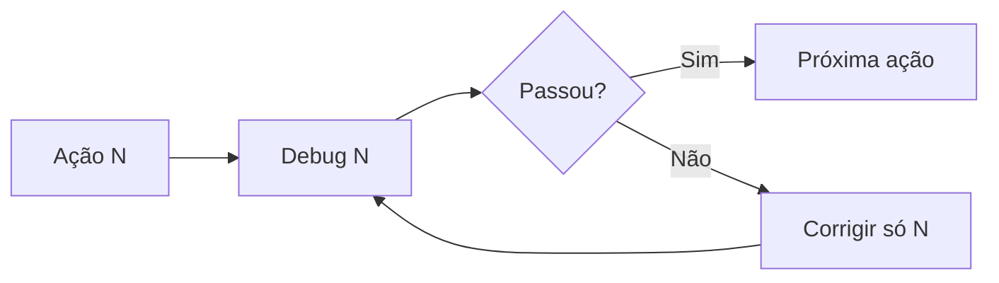

# Plano em fases cirúrgicas — debug após cada ação

Regra de ouro: **uma ação por vez** → **debug completo** → **só então** a próxima ação. Não acumular duas correções na mesma fase sem validar a primeira.

Documento operacional para desenvolvimento. Complementa [PLANO-EXECUCAO-REVISADO.md](./PLANO-EXECUCAO-REVISADO.md).

---

## Como usar este plano



| Símbolo | Significado |
|---------|-------------|
| 🔧 | Alteração de código |
| 📤 | Upload / configuração (consultoria) |
| ✅ | Checklist de debug (obrigatório) |
| 🚫 | Não avançar se falhar |

Registar resultado de cada debug em `REGISTRO-TESTES-PRODUCAO.md` (data + polígono + print).

---

## Macrofases (visão)

| Macro | Micro-ações | Objetivo |
|-------|-------------|----------|
| **M0** | M0.1 – M0.6 | Branding + templates base |
| **M1** | M1.1 – M1.14 | SIG utilizável + persistência |
| **M2** | M2.1 – M2.6 | Complemento IA |
| **M3** | M3.1 – M3.12 | Estudos RCA (piloto) |
| **M4** | M4.1 – M4.5 | Licenciamento |

**Total:** ~33 ações cirúrgicas.

---

# M0 — Base documental (sem depender de WFS)

## M0.1 — Branding: imagens carregadas

| | |
|---|---|
| **Ação** | 📤 Subir header, footer, watermark em Configurações → Branding (ou `public/branding/`). |
| **Debug** | ✅ Abrir Financeiro → DRE ou Curva ABC → exportar PDF. |
| | ✅ Confirmar: cabeçalho no topo, rodapé no fim, marca d’água atrás do texto em **todas** as páginas. |
| **Gate** | 🚫 M0.2 se PDF Financeiro sem branding. |

---

## M0.2 — Branding: documentar slots em falta

| | |
|---|---|
| **Ação** | Se o toast avisar imagem em falta, corrigir só o slot indicado. |
| **Debug** | ✅ Console sem `[pdf-branding]` crítico; toast sem aviso de slot vazio. |
| **Gate** | — |

---

## M0.3 — Template RCA carregado

| | |
|---|---|
| **Ação** | 📤 Upload `template.docx` em Configurações → Templates → RCA. |
| **Debug** | ✅ Ficheiro existe em `public/templates/rca/template.docx`. |
| | ✅ API `GET /api/templates/rca` (ou página templates) mostra ficheiro presente. |
| **Gate** | 🚫 M3.x sem este ficheiro. |

---

## M0.4 — Placeholders RCA conferidos

| | |
|---|---|
| **Ação** | 📤 Revisar Word: nomes exactos `{{...}}` vs `docs/PLACEHOLDERS-DOCX.md`. |
| **Debug** | ✅ Lista em doc ou planilha: cada placeholder do template tem origem de dados definida. |
| **Gate** | M3.5 (geração DOCX). |

---

## M0.5 — Termos de referência indexados (RCA)

| | |
|---|---|
| **Ação** | 📤 Indexar pasta TR (script ou Base Jurídica) para tipo RCA. |
| **Debug** | ✅ Assistente ou RAG devolve trecho de TR conhecido ao perguntar tema RCA. |
| **Gate** | M2.4 / M3.6 (blocos IA longos). |

---

## M0.6 — Aprovação formal M0

| | |
|---|---|
| **Ação** | Reunião 15 min: “branding + template RCA OK?” |
| **Debug** | ✅ Checklist M0 assinado em `PLANO-EXECUCAO-REVISADO.md`. |
| **Gate** | 🚫 **Toda a M1** sem M0.6. |

---

# M1 — Análise geoespacial (Passo 1–2)

## M1.1 — Inventário WFS (só documentação, sem código)

| | |
|---|---|
| **Ação** | Abrir GeoNetwork + Geosisemanet; para **um** polígono teste (ex. 850 ha), anotar `workspace:layer` real das camadas. **Não** é o utilizador que envia ficheiro por card — ver [O-QUE-PRECISA-PARA-ANALISE-FUNCIONAR.md](./O-QUE-PRECISA-PARA-ANALISE-FUNCIONAR.md). |
| **Entrada do utilizador (fixa para todos os testes)** | Perímetro: desenho no mapa **ou** SHP/KML **da propriedade** (não SHP de bioma/solos). |
| **Debug** | ✅ Tabela preenchida em `MVP-CAMADAS-IDE-SISEMA-MG.md` (coluna confirmada). |
| | ✅ Um `GetFeature` manual (browser/curl) devolve JSON, não 404. |
| **Gate** | M1.2 |

---

## M1.2 — Corrigir catálogo: só hidrografia

| | |
|---|---|
| **Ação** | 🔧 Actualizar `wave-a-catalog.ts` **apenas** `mg_hidrografia` (URL + typeName confirmados). |
| **Debug** | ✅ `npm run typecheck` |
| | ✅ Gerar relatório factual com polígono teste → card hidrografia **OK** ou **Parcial** (não 404). |
| | ✅ % ou km coerente vs Geosisemanet (tolerância ±5%). |
| **Gate** | M1.3 |

---

## M1.3 — Catálogo: bioma

| | |
|---|---|
| **Ação** | 🔧 Adicionar/corrigir só `mg_bioma`. |
| **Debug** | ✅ Hidrografia continua OK (regressão). |
| | ✅ Bioma OK ou Parcial com tabela. |
| **Gate** | M1.4 |

---

## M1.4 — Catálogo: solos

| | |
|---|---|
| **Ação** | 🔧 Corrigir só `mg_solos`. |
| **Debug** | ✅ 3 camadas Onda A OK no mesmo polígono. |
| **Gate** | M1.5 ou M1.6 |

---

## M1.5 — Catálogo: geologia (Onda B, uma camada)

| | |
|---|---|
| **Ação** | 🔧 Uma camada B de cada vez (geologia primeiro). |
| **Debug** | ✅ Camadas A ainda OK. |
| **Gate** | M1.5b, M1.5c… |

## M1.5b — geomorfologia | M1.5c — pedologia | M1.5d — vegetação | M1.5e — fauna

(Mesmo padrão: uma camada → debug → regressão nas anteriores.)

---

## M1.6 — Fallback SHP (se WFS continuar 404)

| | |
|---|---|
| **Ação** | 🔧 Cache local ou Storage + leitura GDAL para camada crítica (ex. solos). |
| **Debug** | ✅ Com WFS desligado simulado, camada cache retorna stats. |
| | ✅ Relatório indica fonte “cache” vs “WFS”. |
| **Gate** | Só se M1.2–M1.5 falharem |

---

## M1.7 — Persistência: gravar `geo_analyses`

| | |
|---|---|
| **Ação** | 🔧 Garantir `addDoc` com `wave`, `layers`, `createdBy`; tratar erro na UI. |
| **Debug** | ✅ Firestore Console: documento criado após gerar relatório. |
| | ✅ Campos `perimeter.areaHa`, `layers[]` não vazios. |
| | ✅ `npm run deploy:rules` se permission-denied. |
| **Gate** | M1.8 |

---

## M1.8 — Persistência: Etapa 2 lê análise

| | |
|---|---|
| **Ação** | 🔧 Listagem Etapa 2: filtro `wave` A ou ABC + `createdBy`. |
| **Debug** | ✅ Após M1.7, painel mostra análise (não “nenhuma factual salva”). |
| | ✅ `?geoAnalysisId=` na URL pré-selecciona. |
| **Gate** | M2.x |

---

## M1.9 — Vínculo `empreendimentoId` (opcional neste sprint)

| | |
|---|---|
| **Ação** | 🔧 Selector projeto/empreendimento na página; gravar no doc. |
| **Debug** | ✅ Documento tem `empreendimentoId`; listagem por empreendimento. |
| **Gate** | M3.1 |

---

## M1.10 — PDF factual branded (regressão visual)

| | |
|---|---|
| **Ação** | 🔧 Revisar `export-wave-a-pdf.ts` usa `finalizeBrandedPdfPages` se necessário. |
| **Debug** | ✅ PDF download: header/footer/watermark = Financeiro. |
| | ✅ Área 850 ha (ou teste) no texto. |
| **Gate** | M1.11 |

---

## M1.11 — Deploy regras + smoke produção SIG

| | |
|---|---|
| **Ação** | `npm run deploy:rules`; push se código; rollout. |
| **Debug** | ✅ Produção: ≥3 camadas OK no polígono teste. |
| | ✅ Actualizar `REGISTRO-TESTES-PRODUCAO.md`. |
| **Gate** | 🚫 M2 sem M1.11 |

---

## M1.12 — Mini-mapa PNG (uma camada piloto)

| | |
|---|---|
| **Ação** | 🔧 Gerar PNG simples (perímetro + camada) só bioma — **SVG actual**; evoluir para QGIS (ver [MAPAS-REFERENCIA-PIA-QGIS.md](./MAPAS-REFERENCIA-PIA-QGIS.md)). |
| **Debug** | ✅ PNG embutido ou anexo no PDF. |
| **Gate** | M1.13 expandir |

## M1.12b — Worker QGIS (mapas estilo PIA) — após M1.11

| | |
|---|---|
| **Ação** | 🔧 Cloud Run + templates `mapa_solos`, `mapa_hidro`, `mapa_ada` — ver [DISCUSSAO-2026-05-25.md](./DISCUSSAO-2026-05-25.md). |
| **Debug** | ✅ PNG com grade, escala, norte, legenda; legenda de figura com fonte e data. |
| **Gate** | Itens 12 #1–3, #11–12 dos 12 itens |

## M1.13 — Mini-mapas / figuras restantes | M1.14 — Aprovação M1

| M1.14 | Reunião: “SIG utilizável?” → assinar gate para M2. |

---

# M2 — Complemento IA (Etapa 2)

## M2.1 — Complemento: carregar JSON sem IA

| | |
|---|---|
| **Ação** | 🔧 Modo “pré-visualizar factual” (só mostra layers JSON). |
| **Debug** | ✅ Dados iguais aos cards Etapa 1. |
| **Gate** | M2.2 |

---

## M2.2 — Fluxo IA: uma secção (hidrografia)

| | |
|---|---|
| **Ação** | 🔧 Prompt só gera secção hidrografia a partir de stats. |
| **Debug** | ✅ Texto menciona valores do JSON; não inventa % absurdos. |
| | ✅ Chave IA em `.env` / App Hosting. |
| **Gate** | M2.3 |

---

## M2.3 — Fluxo IA: todas as secções

| | |
|---|---|
| **Ação** | 🔧 Secções completas + `geo_analysis_complements` save. |
| **Debug** | ✅ Firestore complemento criado. |
| **Gate** | M2.4 |

---

## M2.4 — Word complemento (.docx)

| | |
|---|---|
| **Ação** | 🔧 Export DOCX branded structure (secções). |
| **Debug** | ✅ Abre no Word; editável. |
| **Gate** | M2.5 |

---

## M2.5 — PDF complemento branded

| | |
|---|---|
| **Ação** | 🔧 PDF Etapa 2 com `pdf-branding-layout`. |
| **Debug** | ✅ Igual M0.1 visual. |
| **Gate** | M2.6 |

---

## M2.6 — Aprovação M2

| | |
|---|---|
| **Ação** | Técnico revisa um complemento real. |
| **Debug** | ✅ Registo em REGISTRO-TESTES. |
| **Gate** | 🚫 M3 sem M2.6 (recomendado) |

---

# M3 — Estudos técnicos (piloto RCA)

## M3.1 — RCA: selector cliente + fazenda

| | |
|---|---|
| **Ação** | 🔧 Dropdowns ligados a cadastro existente. |
| **Debug** | ✅ Seleccionar cliente preenche campos base do formulário. |
| **Gate** | M3.2 |

---

## M3.2 — RCA: um tipo SHP (ADA)

| | |
|---|---|
| **Ação** | 🔧 Upload + armazenar geometria ADA no empreendimento. |
| **Debug** | ✅ GeoJSON/SHP visível no mapa ou lista. |
| **Gate** | M3.3 (APP, RL, …) |

---

## M3.3 — SHP: APP, RL, cursos, barragens (um de cada vez)

| | |
|---|---|
| **Ação** | 🔧 Uma geometria temática por micro-ação. |
| **Debug** | ✅ ADA anterior intacta; nova camada aparece. |
| **Gate** | Próxima geometria |

---

## M3.4 — RCA: botão importar `geo_analyses`

| | |
|---|---|
| **Ação** | 🔧 Listar análises do `empreendimentoId`; preencher campos `GEO_*`. |
| **Debug** | ✅ Após M1.7, import preenche área e resumo. |
| **Gate** | M3.5 |

---

## M3.5 — RCA: gerar DOCX (placeholders simples)

| | |
|---|---|
| **Ação** | 🔧 Só placeholders cadastro (sem BLOCO_IA ainda). |
| **Debug** | ✅ DOCX RCA download; `{{EMPREENDIMENTO_NOME}}` substituído. |
| **Gate** | M3.6 |

---

## M3.6 — RCA: BLOCO_IA um bloco (meio físico)

| | |
|---|---|
| **Ação** | 🔧 Preencher `{{BLOCO_MEIO_FISICO}}` com IA + SIG. |
| **Debug** | ✅ Texto coerente com `geo_analyses.layers`. |
| **Gate** | M3.7 (demais blocos) |

---

## M3.7 — RCA: demais BLOCO_* (um por ação)

| | |
|---|---|
| **Ação** | Um BLOCO por debug: fauna, hidrografia, socioeconômico, etc. |
| **Debug** | ✅ DOCX anterior + novo bloco; sem apagar campos. |
| **Gate** | M3.8 |

---

## M3.8 — RCA: mapa localização PNG no DOCX

| | |
|---|---|
| **Ação** | 🔧 Inserir imagem mapa (worker ou estático piloto). |
| **Debug** | ✅ Imagem visível no Word. |
| **Gate** | M3.9 |

---

## M3.9 — RCA: status rascunho → em revisão → aprovado

| | |
|---|---|
| **Ação** | 🔧 Campo status no laudo; UI alterar status. |
| **Debug** | ✅ Só `aprovado` habilita PDF final oficial. |
| **Gate** | M3.10 |

---

## M3.10 — RCA: PDF final branded

| | |
|---|---|
| **Ação** | 🔧 Export PDF laudo RCA via `pdf-branding-layout`. |
| **Debug** | ✅ = Financeiro; conteúdo = versão aprovada. |
| **Gate** | M3.11 |

---

## M3.11 — Smoke: um RCA completo ponta a ponta

| | |
|---|---|
| **Ação** | Simulação real: cliente → fazenda → SIG → complemento → DOCX → revisão → PDF. |
| **Debug** | ✅ Checklist `ROTEIRO-REPLICAR-SAAS` critérios utilizável. |
| **Gate** | M3.12 / M4 |

---

## M3.12 — Replicar piloto para PIA (cópia do padrão RCA)

| | |
|---|---|
| **Ação** | Template PIA + mesmas micro-ações M3.5–M3.10 adaptadas. |
| **Debug** | ✅ Um PIA completo. |
| **Gate** | M4 |

---

# M4 — Licenciamento

## M4.1 — Listar PDFs aprovados no processo

| | |
|---|---|
| **Ação** | 🔧 Processo cliente: anexos RCA/PIA com status aprovado. |
| **Debug** | ✅ Só PDFs aprovados listados. |
| **Gate** | M4.2 |

---

## M4.2 — Inventário → PIA (dados estruturados)

| | |
|---|---|
| **Ação** | 🔧 Import parcelas/espécies do inventário no formulário PIA. |
| **Debug** | ✅ Campos PIA preenchidos sem redigitar. |
| **Gate** | M4.3 |

---

## M4.3 — PIA PDF aprovado → anexo licenciamento

| | |
|---|---|
| **Ação** | 🔧 Botão “Anexar ao processo”. |
| **Debug** | ✅ PDF visível no processo intervenção. |
| **Gate** | M4.4 |

---

## M4.4 — Mapas como anexos separados

| | |
|---|---|
| **Ação** | 🔧 Anexar PNGs SIG ao pacote do processo. |
| **Debug** | ✅ Download anexos completo. |
| **Gate** | M4.5 |

---

## M4.5 — Aprovação final linha de montagem

| | |
|---|---|
| **Ação** | Demo interna: inventário → PIA → licenciamento. |
| **Debug** | ✅ Documentar em REGISTRO + README “M4 concluída”. |

---

# Comandos de debug rápidos (dev)

| Momento | Comando / acção |
|---------|------------------|
| Após cada 🔧 | `npm run typecheck` |
| Antes de push | `npm run apphosting:check` (quando possível) |
| Regras Firestore | `npm run deploy:rules` |
| WFS manual | `curl` GetCapabilities / GetFeature (ver COLIGACAO-DADOS-PUBLICOS) |
| Produção | Rollout App Hosting + teste polígono fixo |

---

# Ordem estrita (não saltar)

```
M0.1 → M0.2 → M0.3 → M0.4 → M0.5 → M0.6
  → M1.1 → M1.2 → M1.3 → M1.4 → [M1.5*] → M1.6? → M1.7 → M1.8 → M1.9? → M1.10 → M1.11 → M1.12?
  → M2.1 → … → M2.6
  → M3.1 → … → M3.12
  → M4.1 → … → M4.5
```

\* M1.5b–e uma camada de cada vez.  
\? opcional no sprint mínimo.

---

# Sprint mínimo utilizável (se precisar cortar)

1. M0.1 + M0.3 + M0.6  
2. M1.1 → M1.4 → M1.7 → M1.8 → M1.10 → M1.11  
3. M2.2 → M2.5 → M2.6  
4. M3.1 → M3.4 → M3.5 → M3.10  

---

## Histórico

- Plano cirúrgico com debug gate por ação; ~33 micro-fases.
