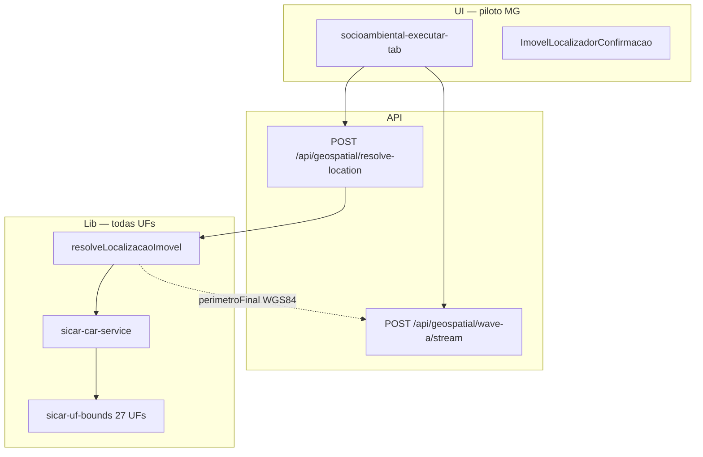

# Plano — Localizador de imóvel (CAR / GPS / coordenadas)

Documento de **planeamento e discussão** (junho/2026).  
**Versão 2** — reorganizado após decisões de produto (11/06/2026).

Complementa:

- [PLANO-FASES-CIRURGICAS.md](./PLANO-FASES-CIRURGICAS.md) — **M1 completa antes deste plano**
- [COLIGACAO-DADOS-PUBLICOS.md](./COLIGACAO-DADOS-PUBLICOS.md) — motor de coligação e SICAR
- [O-QUE-PRECISA-PARA-ANALISE-FUNCIONAR.md](./O-QUE-PRECISA-PARA-ANALISE-FUNCIONAR.md) — perímetro vs catálogo WFS
- [REGISTRO-TESTES-PRODUCAO.md](./REGISTRO-TESTES-PRODUCAO.md) — debug após cada micro-fase

---

## 0. Resumo executivo

| Tema | Decisão |
|------|---------|
| **Quando começa** | **Depois de M1.14** (SIG utilizável: camadas OK, persistência, PDF, smoke produção) |
| **Piloto comercial** | **Minas Gerais** — testes e mensagens orientadas a MG |
| **Arquitectura técnica** | **Nacional desde o dia 1** — todas as UFs com camada `sicar_imoveis_{uf}` no WFS |
| **UI piloto** | Pacote socioambiental (`/studies/analise-socioambiental`) |
| **Ordem interna** | L1 resolver → L2 GPS/coord → L3 card mobile → L4 rollout app |
| **0 CAR** | **Bloquear Executar** (D1 fechado) |
| **N CAR** | Pré-seleccionar maior interseção; **exigir Confirmar** (D2 fechado) |
| **Conecta Gov** | **Fase L5 / pós-MVP** (D7 fechado) |

---

## 1. Posicionamento no roadmap global

### 1.1 Sequência obrigatória


**Porquê M1 antes:** o localizador só faz sentido se o pacote socioambiental já gerar cards com % reais (hidrografia, bioma, SICAR, embargos…). Localizar imóvel sem motor SIG fiável produz extrato vazio ou “Indisponível” — mesma lição do teste 850 ha ([O-QUE-PRECISA-PARA-ANALISE-FUNCIONAR.md](./O-QUE-PRECISA-PARA-ANALISE-FUNCIONAR.md)).

### 1.2 Gate formal

| Gate | Condição | Documento |
|------|----------|-----------|
| **G0 → L1** | M1.14 assinado (“SIG utilizável?”) | `PLANO-FASES-CIRURGICAS.md` |
| **G1 → L2** | Testes T1, T3 passam (REF-01-A) | §8 deste plano |
| **G2 → L3** | T8 passa em celular real (REF-01-A ou REF-03) | §8 |
| **G3 → L4** | T13–T16 passam | §8 |
| **G4 → M2 pleno** | L3 + M1.8 (Etapa 2 lê análise) | ambos os planos |

### 1.3 Inserção no plano cirúrgico

Após **M1.14**, acrescentar macro **L** (Localizador):

| Macro | Micro-ações | Objetivo |
|-------|-------------|----------|
| **L1** | L1.1 – L1.6 | Resolver CAR → geometria |
| **L2** | L2.1 – L2.8 | GPS + coord no pacote socioambiental |
| **L3** | L3.1 – L3.6 | Card confirmação + mobile |
| **L4** | L4.1 – L4.5 | Unificar `/analise-ambiental`, licenciamento… |
| **L5** | futuro | Conecta Gov (APP/RL demonstrativo) |

🚫 **Não iniciar L1.1** enquanto M1.11 (smoke produção SIG) não passar.

---

## 2. Objetivo e política comercial

### 2.1 Objetivo funcional

Permitir localizar imóvel rural para consulta socioambiental via:

1. Número CAR  
2. Coordenadas (digitadas)  
3. GPS do celular  
4. Perímetro (mapa, GeoJSON, KML, SHP)

Se o utilizador **não souber o CAR**, coordenadas/GPS resolvem na base pública SICAR, carregam **geometria oficial** e executam o pacote (Apto/Inapto, PDF, IA opcional).

### 2.2 Política comercial: MG primeiro, Brasil pronto

| Camada | MG (piloto) | Demais UFs (desde L1) |
|--------|-------------|------------------------|
| **Marketing / TR** | “Extrato socioambiental MG”, preset `mg_padrao`, IDE-Sisema | Mensagem: “CAR nacional; camadas estaduais conforme catálogo” |
| **Testes QA** | REF-01-A/B (Coronel Fabriciano), campo em MG | REF-07 (UF não-MG) smoke opcional pós-L3 |
| **Suporte** | Prioridade consultoria MG | Outras UFs: CAR + camadas federais; sem prometer IDE estadual |
| **Código** | Nenhum `if (uf === 'mg')` no resolver | `resolveUfsForBbox` + `sicarTypeNameForUf` já cobrem 27 UFs |

**Princípio:** o **resolver e o WFS SICAR são federativos**; o **pacote de camadas** do extrato socioambiental continua centrado em MG até expansão explícita do catálogo.

### 2.3 Problema de negócio (inalterado)

| Cenário | Hoje | Após plano L |
|---------|------|--------------|
| Campo sem CAR | Bloqueado no pacote | GPS → CAR + extrato MG |
| CAR sem shapefile | CAR não vira polígono | CAR → geometria SICAR |
| Due diligence | Portal CAR + outras tools | AmbientaR end-to-end |

---

## 3. Decisões fechadas

| # | Questão | Decisão | Data |
|---|---------|---------|------|
| **D1** | 0 CAR: bloquear Executar? | **Sim** — sem checkbox de buffer no MVP | 2026-06-11 |
| **D2** | N CAR: pré-selecção? | **Sim** — maior área de interseção; utilizador **deve Confirmar** | 2026-06-11 |
| **D7** | Conecta Gov | **L5 / pós-MVP** — não bloqueia L1–L4 | 2026-06-11 |

### 3.1 Decisões ainda em aberto

| # | Questão | Proposta | Decisor |
|---|---------|----------|---------|
| D3 | API `/resolve-location` vs estender `/car` | Nova rota `/resolve-location` | Técnico |
| D4 | Cache consultas SICAR | 24 h por `codImovel` | Técnico |
| D5 | Título extrato auto | `Extrato — {municipio}/{uf}` | Produto |
| D6 | Link car.gov.br | Nova aba no card L3 | Produto |
| D8 | CRM visita campo | L4+, não L3 | Produto |

---

## 4. Estado actual no repositório

### 4.1 Ativos reutilizáveis

| Peça | Caminho |
|------|---------|
| SICAR por código / geometria | `src/lib/geospatial/sicar-car-service.ts` |
| UFs + typeName (27 estados) | `src/lib/geospatial/sicar-uf-bounds.ts` |
| Buffer coordenada ~80 m | `src/lib/geospatial/perimeter.ts` |
| API CAR | `POST /api/geospatial/car` |
| UI GPS (referência) | `src/app/(app)/analise-ambiental/page.tsx` |
| Pacote socioambiental (piloto UI) | `socioambiental-executar-tab.tsx` |

### 4.2 Lacunas (motivo do plano L)

1. `dataType: "car"` não resolve geometria em `parsePerimeterPolygon`.
2. Pacote socioambiental: só CAR + polígono; sem GPS/coord.
3. Sem resolver centralizado nem confirmação antes de Executar.
4. Geometria SICAR retornada não substitui buffer no Wave A.

---

## 5. Arquitectura alvo (federativa)

### 5.1 Diagrama



### 5.2 Resolver multi-UF (obrigatório em L1)

```
resolveUfsForBbox(bbox) → ["mg", "es", …]  // máx. 4 UFs
PARA cada uf:
  fetch sicar:sicar_imoveis_{uf}
dedupe + filterByPerimeter
```

- CAR com prefixo `MG-` → consulta directa `sicar_imoveis_mg` (já implementado).
- Coordenada em SP → `resolveUfsForBbox` inclui `sp`; **mesmo código**, sem branch MG-only.
- Pacote **camadas** MG: Wave A filtra `layerIds` do preset; imóvel em GO pode ser localizado mas extrato usa blocos federais + aviso “camadas MG não aplicáveis” (comportamento futuro; documentar na L2).

### 5.3 Contrato `LocalizacaoResolvida`

Ver tipos em §5 do plano v1 — mantidos. Campos novos sugeridos:

```typescript
ufsConsultadas: string[];       // ex. ["mg"]
camadasExtratoAplicaveis?: string[];  // ex. preset mg_padrao
avisoUf?: string;               // se imóvel fora de MG mas localizado
```

---

## 6. Fase L1 — Resolver CAR → geometria

**Gate entrada:** M1.14  
**Estimativa:** 3–5 dias úteis  
**UI:** mínima — pacote socioambiental usa resolver no modo CAR

### L1.1 – L1.6 (micro-fases)

| ID | Entrega |
|----|---------|
| L1.1 | `resolveLocalizacaoImovel()` + `sicarGeometryToPolygonFeature()` |
| L1.2 | Multi-UF no resolver (reutilizar `resolveUfsForBbox`; testar MG + 1 UF) |
| L1.3 | `POST /api/geospatial/resolve-location` |
| L1.4 | `runWaveAAnalysisFromResolved()` ou delegação em `runWaveAAnalysis` |
| L1.5 | `socioambiental-executar-tab`: modo CAR via resolver |
| L1.6 | REF-01-A/B em `REGISTRO-TESTES-PRODUCAO.md` |

### Algoritmo (resumo)

- **car** → WFS por `cod_imovel` → geometria → `perimetroFonte: sicar`
- **coordinates | gps** → buffer → `queryCarsInPerimeter` → 1 CAR → geometria; 0 → `nao_encontrado`; N → `ambiguo` + pré-selecção D2
- **polygon | kml | shp** → parse + enriquecimento CAR

### Ambiguidade (D2)

- Ordenar `imoveis` por área de interseção com ponto/polígono (desc).
- `imovelSelecionadoCod = imoveis[0].codImovel` como **sugestão**, não confirmação.
- Wave A **só** após confirmar (L2/L3).

---

## 7. Fase L2 — GPS + coordenadas (pacote socioambiental)

**Gate entrada:** G1 (T1, T3)  
**Estimativa:** 2–4 dias

| ID | Alteração |
|----|-----------|
| L2.1 | `InputMode`: car \| coordinates \| gps \| polygon |
| L2.2 | Campo coordenadas |
| L2.3 | Botão **Capturar coordenada actual** |
| L2.4 | **Localizar imóvel** → `/resolve-location` |
| L2.5 | **Executar** desabilitado até `status === "ok"` |
| L2.6 | Resumo textual CAR |
| L2.7 | `ambiguo` → lista; pré-seleccionado = maior interseção |
| L2.8 | `nao_encontrado` → **Executar bloqueado** (D1) |

### Mensagem comercial MG

Preset default `mg_padrao` mantido. Se resolver achar CAR fora de MG (L1.2):

> “Imóvel localizado em {UF}. Camadas do extrato referem-se a Minas Gerais; para análise em {UF}, use Análise Geoespacial completa ou aguarde expansão do catálogo.”

(Não bloqueia localização; pode bloquear Executar pacote MG — **decisão D9 pendente**.)

---

## 8. Fase L3 — Card confirmação + mobile

**Gate entrada:** G2 (T8 celular)  
**Estimativa:** 3–5 dias

Componente: `src/components/geospatial/imovel-localizador-confirmacao.tsx`

- Campos exactos: cabeçalho, SICAR, localização, perímetro, aviso APP/RL, acções (§8 plano v1).
- **0 CAR:** sem Confirmar; Executar bloqueado (D1).
- **N CAR:** mapa multi-polígono + cards tocáveis; pré-selecção visível (D2).
- **Mobile:** mapa → dados → botões full width; Confirmar sticky.

PDF: metadados `metodoLocalizacao`, `confiancaLocalizacao`, CAR, fonte SICAR.

---

## 9. Fase L4 — Rollout unificado

**Gate entrada:** G3  
**Ordem:** `/analise-ambiental` → licenciamento → georef → PEA

---

## 10. Fase L5 — Conecta Gov (pós-MVP)

**Gate:** L4 estável + credenciais Conecta Gov  
**Entrega:** APP/RL declaradas, link demonstrativo PDF  
**Fora do escopo L1–L4** (D7)

---

## 11. Plano de testes — registos reais

### 11.1 Imóveis de referência (consultoria)

Município IBGE **3170404** = **Coronel Fabriciano / MG**.

| ID | Tipo | Entrada | Uso |
|----|------|---------|-----|
| **REF-01-A** | CAR | `MG-3170404-3DBDB334242844B392639D3237B27E10` | T1 — geometria + área; baseline L1 |
| **REF-01-B** | CAR | `MG-3170404-CB2D550172B2405AAA6CF6479E2215B1` | T1 bis; par para teste **ambiguidade** (D2) |
| **REF-02** | Coord | Centróide de REF-01-A | T3 — mesmo CAR após L1.1 |
| **REF-02-ambig** | Coord | Ponto entre A e B (campo) | T10 — N CAR, pré-selecção, confirmar |
| **REF-03** | GPS | Celular no local de REF-01-A | T8 |
| **REF-04** | Coord | BH centro (~-19.92, -43.94) | 0 CAR ou ambíguo urbano |
| **REF-05** | Polígono | Desenho ~850 ha (histórico M1) | Regressão Wave A |
| **REF-06** | CAR | Código inválido | Erro claro |
| **REF-07** | CAR | 1 CAR SP/GO (smoke nacional pós-L1.2) | Resolver multi-UF |

### 11.2 Colunas do registo (preencher em cada debug)

| Campo | Exemplo |
|-------|---------|
| Data | 2026-06-__ |
| Fase | L1.1 |
| REF | REF-01-A |
| codImovel | MG-3170404-3DB… |
| areaHa obtida | ___ (comparar portal CAR) |
| status / confianca | ok / alta |
| perimetroFonte | sicar |
| Passou? | Sim/Não |

### 11.3 Critérios de aceite consolidados

| # | Fase | Teste |
|---|------|-------|
| T1 | L1 | REF-01-A: área ±1% vs SICAR; Wave A OK |
| T1b | L1 | REF-01-B: idem |
| T2 | L1 | REF-06: erro antes das camadas |
| T3 | L1 | REF-02 → mesmo polígono que REF-01-A |
| T4 | L1 | REF-04: `nao_encontrado`, Executar bloqueado |
| T5 | L1 | Polígono intersectando A+B: `ambiguo` |
| T7–T12 | L2 | GPS, lista N, Firestore (§7 plano v1) |
| T13–T16 | L3 | Mobile, PDF, componente reutilizável |
| T17 | L1.2 | REF-07 UF ≠ MG: resolver OK |

---

## 12. Cronograma revisado

| Ordem | Bloco | Duração indicativa | Marco |
|-------|-------|-------------------|--------|
| 1 | **M1.1 – M1.14** | (plano cirúrgico existente) | SIG utilizável MG |
| 2 | **L1.1 – L1.6** | 3–5 dias | CAR REF-01-A gera extrato com área real |
| 3 | **L2.1 – L2.8** | 2–4 dias | GPS no pacote socioambiental |
| 4 | **L3.1 – L3.6** | 3–5 dias | Card confirmação mobile |
| 5 | **L4** | 1–2 sem | Unificação app |
| 6 | **M2** | paralelo após L3+M1.8 | Complemento IA |
| 7 | **L5** | futuro | Conecta Gov |

**MVP localizador (L1–L3):** ~8–14 dias úteis **após** M1.14.

---

## 13. Riscos

| Risco | Mitigação |
|-------|-----------|
| M1 atrasada | L1 não começa; evita extrato bonito sem SIG |
| REF-01-A/B vizinhos → ambiguidade frequente | Caso de teste ideal para D2 |
| Imóvel fora MG com preset MG | Aviso `avisoUf`; D9 pendente |
| GPS rural impreciso | Confiança + confirmação L3 |
| WFS SICAR lento | Cache D4; retry BBOX |

---

## 14. Referências de código

| Tema | Caminho |
|------|---------|
| SICAR | `src/lib/geospatial/sicar-car-service.ts` |
| 27 UFs | `src/lib/geospatial/sicar-uf-bounds.ts` |
| Pacote socioambiental | `src/app/(app)/studies/analise-socioambiental/socioambiental-executar-tab.tsx` |
| Plano cirúrgico M1 | `docs/analise-ambiental-automatizada/PLANO-FASES-CIRURGICAS.md` |

---

## 15. Próxima discussão sugerida

1. **D9:** CAR localizado fora de MG — permite Executar pacote `mg_padrao` com aviso, ou bloqueia?
2. **D3/D4:** confirmar rota API e cache.
3. **M1:** em que micro-fase estão hoje (M1.2 hidrografia?) para estimar data de G0→L1.

---

## 16. Histórico

| Data | Alteração |
|------|-----------|
| 2026-06-11 | v1 — plano híbrido F1–F4 |
| 2026-06-11 | v2 — M1 antes; D1/D2/D7 fechados; REF-01-A/B reais; MG piloto + UF nacional; fases L1–L5 |
