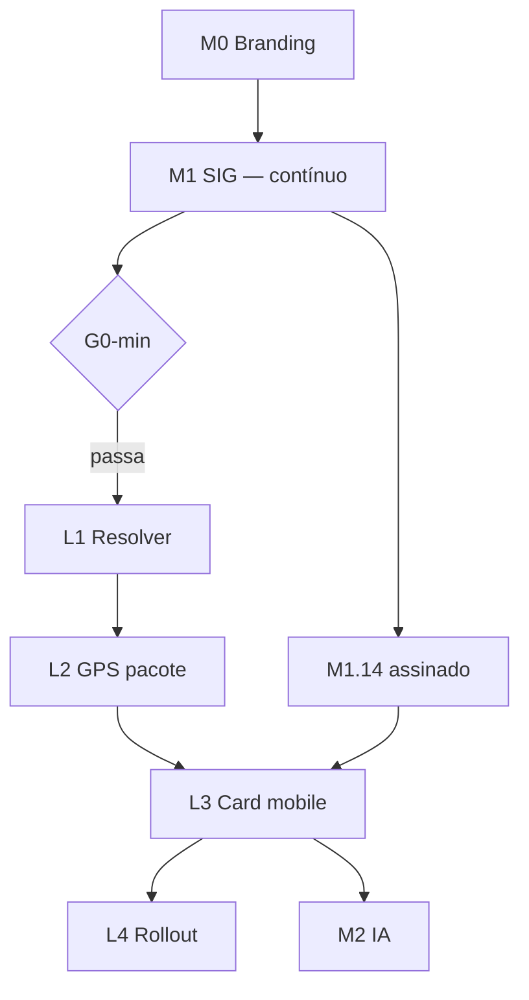
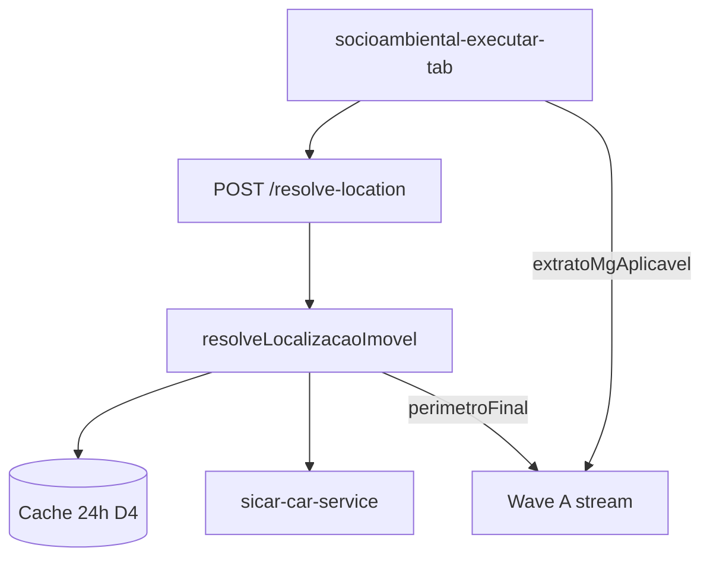

# Plano — Localizador de imóvel (CAR / GPS / coordenadas)

Documento de **planeamento** (junho/2026).  
**Versão 3** — decisões D1–D9 e gate mínimo L1 fechados (11/06/2026).

Complementa:

- [PLANO-FASES-CIRURGICAS.md](./PLANO-FASES-CIRURGICAS.md) — M1 em paralelo; gate mínimo antes de L1
- [COLIGACAO-DADOS-PUBLICOS.md](./COLIGACAO-DADOS-PUBLICOS.md) — motor de coligação e SICAR
- [O-QUE-PRECISA-PARA-ANALISE-FUNCIONAR.md](./O-QUE-PRECISA-PARA-ANALISE-FUNCIONAR.md) — perímetro vs catálogo WFS
- [REGISTRO-TESTES-PRODUCAO.md](./REGISTRO-TESTES-PRODUCAO.md) — debug após cada micro-fase

---

## 0. Resumo executivo

| Tema | Decisão |
|------|---------|
| **Gate mínimo L1** | **G0-min** (§1.2) — não exige M1.14 completo; exige REF-01-A + ≥1 camada federal OK |
| **M1.14** | Continua **em paralelo** com L1–L2; obrigatório antes de **L3** e promoção comercial plena |
| **Piloto comercial** | **Minas Gerais** — preset `mg_padrao`, testes Coronel Fabriciano |
| **Arquitectura** | **SICAR nacional (27 UFs)** desde L1; catálogo extrato MG no pacote |
| **UI piloto** | Pacote socioambiental (`/studies/analise-socioambiental`) |
| **Ordem interna** | L1 → L2 → L3 → L4 → L5 |
| **0 CAR** | Bloquear Executar (D1) |
| **N CAR** | Pré-selecção maior interseção + Confirmar (D2) |
| **CAR fora de MG** | Localizar OK; **Executar pacote MG bloqueado** (D9) |
| **API** | `POST /api/geospatial/resolve-location` (D3); `/car` delega |
| **Cache SICAR** | 24 h por `codImovel`, servidor (D4) |
| **Conecta Gov** | L5 pós-MVP (D7) |

---

## 1. Posicionamento no roadmap global

### 1.1 Sequência (com paralelismo)



**Ideia:** L1 corrige bug CAR→geometria (quick win) **sem** esperar 48 camadas perfeitas. M1.14 continua necessário antes de **L3** (card + PDF + confiança comercial) e **M2** pleno.

### 1.2 Gates formais

| Gate | Condição | Bloqueia |
|------|----------|----------|
| **G0-min → L1.1** | §1.3 checklist mínimo | Início do resolver |
| **G1 → L2** | T1 + T3 (REF-01-A, REF-02) | GPS no pacote |
| **G1b → L2** | M1.11 smoke passou **pelo menos uma vez** | — |
| **G2 → L3** | T8 celular + **M1.14 assinado** | Card confirmação |
| **G3 → L4** | T13–T16 | Rollout app |
| **G4 → M2 pleno** | L3 + M1.8 | Complemento IA |

### 1.3 Gate mínimo G0-min (início L1.1)

Todos obrigatórios:

| # | Critério | Como verificar |
|---|----------|----------------|
| G0.1 | **REF-01-A** consultável no portal CAR (área anotada manualmente) | Portal + registo testes |
| G0.2 | Pacote socioambiental executa Wave A com **polígono** (~850 ha ou desenho) | ≥1 card não-404 |
| G0.3 | Pelo menos **1 camada federal** OK no mesmo teste (SICAR imóveis **ou** embargos IBAMA) | UI ou `geo-probe` |
| G0.4 | `npm run geo:probe` — SICAR WFS 200 | Já ✅ em P0 |
| G0.5 | M1.11 smoke **não bloqueia** L1 se G0.1–G0.3 passam; **bloqueia L3** se nunca passou | Registo |

🚫 **Não iniciar L1.1** se G0.2 falhar (zero camadas úteis no pacote).

✅ **Pode iniciar L1.1** sem M1.14 se G0-min passar.

### 1.4 Inserção no plano cirúrgico

Macro **L** após gate G0-min (ver [PLANO-FASES-CIRURGICAS.md](./PLANO-FASES-CIRURGICAS.md)):

| Macro | Micro-ações | Objetivo |
|-------|-------------|----------|
| **L1** | L1.1 – L1.6 | Resolver CAR → geometria (nacional) |
| **L2** | L2.1 – L2.9 | GPS + coord; regra UF (D9) |
| **L3** | L3.1 – L3.6 | Card confirmação + mobile + D5/D6 |
| **L4** | L4.1 – L4.5 | Unificar app; CRM (D8) |
| **L5** | L5.x | Conecta Gov (D7) |

---

## 2. Objetivo e política comercial

### 2.1 Objetivo funcional

Localizar imóvel via CAR, coordenadas, GPS ou perímetro; resolver geometria SICAR; executar pacote socioambiental MG quando aplicável.

### 2.2 MG primeiro, Brasil pronto

| Camada | MG (piloto) | Outras UFs |
|--------|-------------|------------|
| Marketing | Extrato socioambiental MG | CAR nacional; expansão estadual futura |
| Testes | REF-01-A/B (Coronel Fabriciano) | REF-07 smoke resolver |
| **Executar pacote** | Imóvel **MG** | **Bloqueado** (D9) — ver §2.3 |
| Código resolver | — | 27 UFs via `sicar-uf-bounds` |

### 2.3 Regra D9 — CAR fora de MG no preset `mg_padrao`

**Decisão:** permitir **Localizar**; **bloquear Executar** do pacote MG.

| Acção | Comportamento |
|-------|---------------|
| Localizar imóvel | Funciona; card mostra CAR, UF, área |
| Executar (N camadas MG) | **Desabilitado** |
| Mensagem | “Imóvel em **{UF}**. Este pacote cobre **Minas Gerais**. Use [Análise Geoespacial (IA)](/analise-ambiental) para consulta multi-camada ou imóvel fora de MG.” |
| Link | `/analise-ambiental` em nova aba ou navegação interna |

**Implementação (L2.9):** comparar `imoveis[0].uf` (ou selecionado) com `"MG"`; flag `extratoMgAplicavel: boolean` no resolver.

**Futuro (pós-L4):** presets `sp_padrao`, `go_padrao`, etc.

---

## 3. Decisões fechadas

| # | Questão | Decisão | Data |
|---|---------|---------|------|
| **D1** | 0 CAR: bloquear Executar? | **Sim** — sem buffer no MVP | 2026-06-11 |
| **D2** | N CAR: pré-selecção? | **Sim** — maior interseção; **Confirmar** obrigatório | 2026-06-11 |
| **D3** | Rota API | **`POST /api/geospatial/resolve-location`**; `/car` delega (legado) | 2026-06-11 |
| **D4** | Cache SICAR | **24 h** por `codImovel`, **só servidor**; atributos + geometria simplificada | 2026-06-11 |
| **D5** | Título extrato | **`Extrato — {municipio}/{uf}`** quando CAR resolvido; editável | 2026-06-11 |
| **D6** | Link car.gov.br | **Sim** — nova aba no card L3 | 2026-06-11 |
| **D7** | Conecta Gov | **L5** pós-MVP | 2026-06-11 |
| **D8** | CRM visita campo | **L4+**, não L3 | 2026-06-11 |
| **D9** | CAR fora MG + preset MG | **Localizar sim; Executar pacote MG bloqueado** | 2026-06-11 |

### 3.1 Cache (D4) — detalhe

| Guardar | TTL | Não guardar |
|---------|-----|-------------|
| `codImovel`, atributos, geometria simplificada, `consultadoEmUtc` | 24 h | WFS raw completo |
| Chave | `sicar:car:{codImovel}` (memória ou Firestore opcional) | Dados Conecta Gov |

Implementar em **L1.3** ou **L2** (quando API existir).

---

## 4. Estado actual no repositório

### 4.1 Ativos

| Peça | Caminho |
|------|---------|
| SICAR | `src/lib/geospatial/sicar-car-service.ts` |
| 27 UFs | `src/lib/geospatial/sicar-uf-bounds.ts` |
| Buffer coord | `src/lib/geospatial/perimeter.ts` |
| API CAR | `POST /api/geospatial/car` |
| UI GPS ref. | `analise-ambiental/page.tsx` |
| Pacote piloto | `socioambiental-executar-tab.tsx` |

### 4.2 Lacunas

1. CAR não vira polígono em `parsePerimeterPolygon`.
2. Pacote sem GPS/coord.
3. Sem resolver centralizado / confirmação.
4. Geometria SICAR não alimenta Wave A automaticamente.

---

## 5. Arquitectura alvo

### 5.1 Diagrama



### 5.2 Contrato `LocalizacaoResolvida` (campos relevantes)

```typescript
type LocalizacaoResolvida = {
  status: "ok" | "nao_encontrado" | "ambiguo";
  metodoEntrada: "car" | "coordinates" | "gps" | "polygon" | "kml" | "shp";
  imoveis: ImovelSicarResumo[];
  imovelSelecionadoCod?: string;
  perimetroFinal: GeoJSON.Feature<GeoJSON.Polygon>;
  areaHa: number;
  perimetroFonte: "sicar" | "buffer_ponto" | "desenho" | "upload";
  confianca: "alta" | "media" | "baixa";
  ufsConsultadas: string[];
  /** false se imóvel UF ≠ MG e preset mg_padrao (D9) */
  extratoMgAplicavel: boolean;
  avisoUf?: string;
  // … demais campos §5 plano v2
};
```

---

## 6. Fase L1 — Resolver CAR → geometria

**Gate:** G0-min  
**Estimativa:** 3–5 dias  
**Paralelo:** M1.2+ camadas

| ID | Entrega |
|----|---------|
| L1.1 | `resolveLocalizacaoImovel()` + `sicarGeometryToPolygonFeature()` |
| L1.2 | Multi-UF; `extratoMgAplicavel` quando UF ≠ MG |
| L1.3 | `POST /api/geospatial/resolve-location` + cache D4 |
| L1.4 | `runWaveAAnalysisFromResolved()` |
| L1.5 | Pacote: modo CAR via resolver |
| L1.6 | REF-01-A/B no registo; T1–T3 |

### Algoritmo (resumo)

- **car** → WFS → geometria → `perimetroFonte: sicar`
- **coordinates | gps** → buffer → query CAR → geometria ou ambiguo/nao_encontrado
- **polygon | kml | shp** → parse + enriquecimento CAR
- **Sempre:** `extratoMgAplicavel = (ufImovel === "MG")` para preset actual

### Debug gate G1

🚫 L2 só após T1 + T3 (REF-01-A, REF-02).

---

## 7. Fase L2 — GPS + coordenadas

**Gate:** G1 + G1b  
**Estimativa:** 2–4 dias

| ID | Entrega |
|----|---------|
| L2.1 | InputMode: car \| coordinates \| gps \| polygon |
| L2.2 | Campo coordenadas |
| L2.3 | Botão GPS |
| L2.4 | Localizar → `/resolve-location` |
| L2.5 | Executar desabilitado até `status === "ok"` **e** `extratoMgAplicavel === true` |
| L2.6 | Resumo textual CAR |
| L2.7 | Ambiguo: lista + pré-selecção D2 |
| L2.8 | 0 CAR: Executar bloqueado (D1) |
| **L2.9** | **D9:** banner + link `/analise-ambiental` se UF ≠ MG |

### Título extrato (D5)

Após localizar com sucesso em MG: `setTituloExtrato(\`Extrato — ${municipio}/${uf}\`)`.

---

## 8. Fase L3 — Card confirmação + mobile

**Gate:** G2 (T8 + **M1.14**)  
**Estimativa:** 3–5 dias

| ID | Entrega |
|----|---------|
| L3.1 | `ImovelLocalizadorConfirmacao` |
| L3.2 | Estados 0 / 1 / N imóveis |
| L3.3 | Layout mobile (mapa → dados → sticky Confirmar) |
| L3.4 | Link car.gov.br nova aba (D6) |
| L3.5 | PDF metadados localização |
| L3.6 | Banner D9 no card (UF ≠ MG) |

---

## 9. Fase L4 — Rollout

**Gate:** G3  
Ordem: `/analise-ambiental` → licenciamento → georef → **CRM campo (D8)**

---

## 10. Fase L5 — Conecta Gov

**Gate:** L4 + credenciais (D7)

---

## 11. Plano de testes

### 11.1 Referências (Coronel Fabriciano / MG)

| ID | Entrada | Uso |
|----|---------|-----|
| **REF-01-A** | `MG-3170404-3DBDB334242844B392639D3237B27E10` | T1, G0-min |
| **REF-01-B** | `MG-3170404-CB2D550172B2405AAA6CF6479E2215B1` | T1b, ambiguidade |
| **REF-02** | Centróide A | T3 |
| **REF-02-ambig** | Entre A e B | T10, D2 |
| **REF-03** | GPS no local A | T8 |
| **REF-04** | BH ~(-19.92, -43.94) | T4 |
| **REF-05** | Polígono ~850 ha | Regressão M1 |
| **REF-06** | CAR inválido | T2 |
| **REF-07** | CAR SP ou GO | T17 resolver; **T18 D9** Executar bloqueado |

### 11.2 Critérios de aceite

| # | Fase | Teste |
|---|------|-------|
| T1 | L1 | REF-01-A: área ±1%; Wave A OK |
| T1b | L1 | REF-01-B: idem |
| T2 | L1 | REF-06: erro claro |
| T3 | L1 | REF-02 = polígono A |
| T4 | L1/L2 | REF-04: nao_encontrado; Executar off |
| T5 | L1 | Polígono A∩B: ambiguo |
| T7–T12 | L2 | GPS, Firestore, D5 título |
| **T18** | **L2** | **REF-07: Localizar OK; Executar MG bloqueado; link análise geoespacial** |
| T13–T16 | L3 | Mobile, PDF, D6 link |
| T17 | L1.2 | REF-07 resolver nacional OK |

---

## 12. Ordem de execução recomendada

| # | Acção | Quando |
|---|--------|--------|
| 1 | Verificar **G0-min** (polígono teste + 1 camada federal) | Antes L1.1 |
| 2 | Anotar área REF-01-A no portal CAR → registo | Antes L1.1 |
| 3 | **L1.1 – L1.3** resolver + API + cache | 3–5 d |
| 4 | **L1.4 – L1.6** Wave A + pacote CAR | +1–2 d |
| 5 | **M1** micro-fases restantes | **paralelo** |
| 6 | **L2** GPS + D9 | 2–4 d |
| 7 | **M1.14** assinar | Antes L3 |
| 8 | **L3** card mobile | 3–5 d |
| 9 | **L4** rollout | incremental |

**MVP localizador (L1–L2):** ~5–9 dias após G0-min.  
**MVP completo (L1–L3):** +3–5 dias após M1.14.

---

## 13. Cronograma

| Bloco | Dependência | Marco |
|-------|-------------|--------|
| G0-min | M1 parcial | OK para L1 |
| L1 | G0-min | REF-01-A extrato área real |
| M1.14 | M1 contínuo | Gate L3 |
| L2 | G1 | GPS pacote MG |
| L3 | G2 | Card mobile |
| L4 | G3 | App unificada |
| L5 | L4 | Conecta Gov |

---

## 14. Riscos

| Risco | Mitigação |
|-------|-----------|
| SIG fraco no G0-min | Não abrir L1 |
| A/B ambiguidade | Teste D2 REF-02-ambig |
| CAR outra UF | D9 + link análise geoespacial |
| WFS lento | D4 cache |
| M1 atrasada | L1–L2 avançam; L3 espera M1.14 |

---

## 15. Próximo passo (implementação)

1. Correr **G0-min** na UI (polígono 850 ha + pacote socioambiental).
2. Iniciar **L1.1** (`resolveLocalizacaoImovel`) — uma acção, debug, registo.
3. Não iniciar L3 até **M1.14** assinado.

---

## 16. Referências de código

| Tema | Caminho |
|------|---------|
| SICAR | `src/lib/geospatial/sicar-car-service.ts` |
| UFs | `src/lib/geospatial/sicar-uf-bounds.ts` |
| Pacote | `socioambiental-executar-tab.tsx` |
| Plano M1/L | `PLANO-FASES-CIRURGICAS.md` |

---

## 17. Histórico

| Data | Alteração |
|------|-----------|
| 2026-06-11 | v1 — plano híbrido F1–F4 |
| 2026-06-11 | v2 — M1; REF-01-A/B; fases L |
| 2026-06-11 | v3 — G0-min; D3–D6, D8, D9 fechados; D9 bloqueia Executar UF≠MG; L1 paralelo M1; ordem execução §12 |
