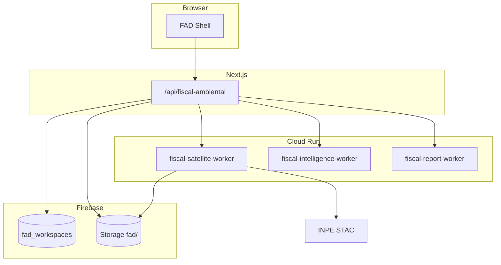
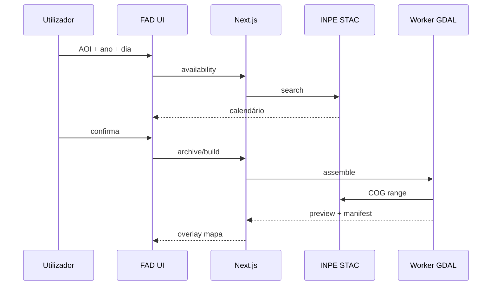

# Fiscal Ambiental Digital — Plano único consolidado

**Projeto:** AmbientaR / EcoGestão MG  
**Produto:** Fiscal Ambiental Digital (FAD)  
**Nome técnico:** `fiscal-ambiental-digital`  
**Rota UI:** `/ia/fiscal-ambiental-digital`  
**API:** `/api/fiscal-ambiental/*`  
**Worker:** `infra/fiscal-satellite-worker`  
**Versão:** 2.0 (documento único)  
**Data:** 2026-06-12  
**Estado:** Fase 0 em código · Fases 1–7 pendentes

> Este ficheiro substitui o pacote externo de 14 documentos e o plano CBERS para fins de implementação.  
> Detalhe técnico GDAL/STAC complementar: [`../CBERS-ARQUIVO-INPE-PLANO.md`](../CBERS-ARQUIVO-INPE-PLANO.md) (§4–11).

---

## Índice

1. [Sumário executivo](#1-sumário-executivo)
2. [Decisões de produto](#2-decisões-de-produto)
3. [Princípio arquitetural](#3-princípio-arquitetural)
4. [Correções AmbientaR (obrigatórias)](#4-correções-ambientar-obrigatórias)
5. [Arquitetura](#5-arquitetura)
6. [Modelo de dados](#6-modelo-de-dados)
7. [APIs e contratos](#7-apis-e-contratos)
8. [Workers e pipelines INPE/GDAL](#8-workers-e-pipelines-inpegdal)
9. [Interface, navegação e componentes](#9-interface-navegação-e-componentes)
10. [Permissões e segurança](#10-permissões-e-segurança)
11. [Fase 0 — Fundação técnica](#11-fase-0--fundação-técnica)
12. [Fase 1 — Biblioteca satelital e acervo INPE](#12-fase-1--biblioteca-satelital-e-acervo-inpe)
13. [Fase 2 — Linha do tempo e comparador](#13-fase-2--linha-do-tempo-e-comparador)
14. [Fase 3 — Inteligência ambiental](#14-fase-3--inteligência-ambiental)
15. [Fase 4 — Fiscalização preventiva](#15-fase-4--fiscalização-preventiva)
16. [Fase 5 — Relatórios inteligentes](#16-fase-5--relatórios-inteligentes)
17. [Fase 6 — Monitoramento contínuo](#17-fase-6--monitoramento-contínuo)
18. [Fase 7 — Auditoria ESG Enterprise](#18-fase-7--auditoria-esg-enterprise)
19. [Cronograma e ganhos](#19-cronograma-e-ganhos)
20. [Riscos, métricas e referências](#20-riscos-métricas-e-referências)
21. [Prompts Cursor (quando implementar)](#21-prompts-cursor-quando-implementar)

---

## 1. Sumário executivo

### 1.1 O que é

O **Fiscal Ambiental Digital** é um produto **standalone** (sem ligação inicial ao resto do SaaS) cujo núcleo é:

> Um **Acervo Histórico Ambiental Digital**, alimentado por imagens gratuitas **INPE/CBERS**, organizado por imóvel/área, com ferramentas progressivas de comparação, análise, fiscalização preventiva, relatórios e monitoramento.

**Não é IA primeiro.** É acervo satelital primeiro.

### 1.2 Como se lança

| Opção | Recomendação |
|-------|--------------|
| Módulo no AmbientaR | **Sim, agora** — mesmo Firebase/App Hosting, dados isolados |
| App separado | **Futuro** — extrair rotas/lib para segundo App Hosting |
| Ligação CRM/licenciamento/SIG | **Não no MVP** — campos opcionais `linkedProjectId` depois |

### 1.3 MVP real

O MVP **não** detecta desmatamento. O MVP permite que um **leigo**:

```text
Criar workspace (imóvel)
  → Definir área (CAR / desenho / SHP)
  → Escolher anos ou modo automático (2008 → atual)
  → Sistema monta imagens recortadas (INPE + GDAL)
  → Galeria + timeline + download GeoTIFF
```

### 1.4 Origem deste documento

Consolidação de:

- Pacote externo `fiscal-ambiental-digital-docs` (14 ficheiros: master, fases 0–7, API, Firestore, UI, workers, prompts)
- Avaliação técnica AmbientaR (jun/2026)
- Plano CBERS v3.1 aprovado ([`CBERS-ARQUIVO-INPE-PLANO.md`](../CBERS-ARQUIVO-INPE-PLANO.md))

---

## 2. Decisões de produto

### 2.1 Decisões fechadas

| # | Decisão |
|---|---------|
| 1 | Produto standalone com `fad_workspaces` (não depende de `clients/projects` CRM) |
| 2 | Merge com plano CBERS — um worker, uma API, um modelo |
| 3 | STAC INPE: `https://data.inpe.br/bdc/stac/v1/` |
| 4 | Imagens gratuitas; atribuição **CBERS/INPE** obrigatória |
| 5 | Cobertura **2008 → 2026** (HRC, PAN5M, CBERS-4A fusionado) |
| 6 | **Sem limite ha** na AOI; timeout worker **900 s** |
| 7 | **GeoTIFF**, **CAR** e **pré-aquecimento** no MVP (Fase 1) |
| 8 | UX leigo: calendário verde/amarelo/cinza; zero jargão STAC/GDAL |
| 9 | Navegação MVP: **4 abas** + resto “Em breve” |
| 10 | Evidência auxiliar — **não parecer vinculante** |
| 11 | Fase 4 SIG (PRODES/IDE) só com flag `FAD_ENABLE_SIG_CROSSCHECK` |

### 2.2 Unificação CBERS ↔ FAD

| Tema | CBERS (antigo) | FAD (unificado) |
|------|----------------|-----------------|
| Menu | Imagens de satélite (INPE) | **Fiscal Ambiental Digital** |
| Rota | `/ia/imagens-satelite` | `/ia/fiscal-ambiental-digital` |
| API | `/api/cbers/*` | `/api/fiscal-ambiental/*` |
| Worker | `cbers-mosaic-worker` | `fiscal-satellite-worker` |
| Firestore | `projects/.../cbers_archives` | `fad_workspaces/.../satellite_archives` |
| Env | `CBERS_MOSAIC_WORKER_URL` | `FISCAL_SATELLITE_WORKER_URL` |
| Cache calendário | `cbers_availability` | `fad_availability` |

### 2.3 Personas

| Persona | Necessidade |
|---------|-------------|
| Consultora leiga | Ver satélite da fazenda por ano sem SPRING |
| Cliente rural | Comprovar ocupação antiga (ex. 2008) |
| Advogado | Evidência visual + relatório para defesa |
| Técnico SIG | GeoTIFF, manifest, QGIS externo |
| Enterprise | Portfólio, ESG, monitoramento (fases 6–7) |

### 2.4 Feature flags

```env
FAD_ENABLED=true
FAD_STANDALONE_MODE=true
FAD_ENABLE_SIG_CROSSCHECK=false
FISCAL_SATELLITE_WORKER_URL=
WORKER_SHARED_SECRET=
```

```ts
export const FISCAL_AMBIENTAL_FLAGS = {
  ENABLE_ARCHIVE_BUILD: true,
  ENABLE_INPE_CBERS: true,
  ENABLE_TIMELINE: true,
  ENABLE_COMPARISON: false,      // Fase 2
  ENABLE_INTELLIGENCE: false,    // Fase 3
  ENABLE_FISCAL_CHECKS: false,   // Fase 4
  ENABLE_MONITORING: false,      // Fase 6
  ENABLE_ESG: false,             // Fase 7
} as const;
```

---

## 3. Princípio arquitetural

```text
Área do imóvel (AOI)
        ↓
Busca automática INPE/CBERS (STAC)
        ↓
Montagem do acervo (GDAL / Cloud Run)
        ↓
Arquivo permanente por workspace
        ↓
Linha do tempo ambiental
        ↓
Comparação temporal
        ↓
Detecção de mudanças
        ↓
Fiscalização preventiva
        ↓
Relatórios técnicos
        ↓
Monitoramento contínuo
        ↓
Auditoria ESG
```

### Fases macro

| Fase | Nome | Objetivo |
|------|------|----------|
| 0 | Fundação | Rotas, shell, workspaces, permissões, placeholders |
| 1 | Acervo INPE | **Núcleo MVP** — montar biblioteca satelital |
| 2 | Exploração temporal | Timeline, comparador, evidências visuais |
| 3 | Inteligência | Change detection sobre acervo |
| 4 | Fiscalização preventiva | Achados + cruzamentos (SIG opcional) |
| 5 | Relatórios | PDFs com ressalva |
| 6 | Monitoramento | Regras e execuções periódicas |
| 7 | ESG Enterprise | Scores e dashboard executivo |

### Princípio anti-SPRING

| No SPRING / SIG clássico | No FAD |
|--------------------------|--------|
| Importar cena local | COG via STAC (`/vsicurl/`) |
| Escolher bandas R,G,B | Motor automático por sensor/data |
| Contraste manual | Stretch percentil 2–98 |
| Fusão PAN+MS manual | GDAL pansharpen no worker |
| Recorte manual | `gdalwarp` com AOI |

---

## 4. Correções AmbientaR (obrigatórias)

Estas correções aplicam-se a **todo** o pacote original de 14 documentos.

### 4.1 Firestore — não usar `clients/.../projects/...`

O AmbientaR usa `projects/{projectId}` ao nível raiz, sem subárvore `clients/`. Para standalone:

```text
fad_workspaces/{workspaceId}
fad_availability/{geohash6}_{year}
fad_build_jobs/{jobId}                    # opcional top-level
```

Subcoleções sob cada workspace — ver [§6](#6-modelo-de-dados).

### 4.2 Wizard — não exigir CRM no MVP

**Original (errado para standalone):** Cliente → Empreendimento → Projeto → Processo.

**Corrigido (MVP):**

```text
Workspace (nome)
  → Área (CAR / desenho / SHP / coords)
  → Período
  → Processar
  → Biblioteca
```

Ligação futura: `linkedClientId`, `linkedProjectId` opcionais.

### 4.3 Navegação — 4 abas no MVP

| Activo no MVP | “Em breve” |
|---------------|------------|
| Início (dashboard + workspaces) | Inteligência Ambiental |
| Montar acervo | Fiscalização Preventiva |
| Biblioteca | Monitoramento Automático |
| Linha do tempo / Comparar | Relatórios, ESG, Config avançadas |

Menu IA: **um** item → Fiscal Ambiental Digital.

### 4.4 Roles — mapear para o repo

Substituir `cliente_gestao` por roles reais: `client`, `cliente_autonomo`, `admin`, `technical`, `gestor`, `supervisor`, `advogado`.

### 4.5 Fase 4 — não duplicar Onda A

`analise-ambiental` já tem PRODES, MapBiomas, IDE-Sisema (~48 camadas). Para standalone:

- **v1:** achados só de change detection + evidências FAD
- **v2:** cruzamento SIG via `run-wave-a-analysis` com flag explícita

### 4.6 Reutilizar sem acoplar UX

| Peça existente | Uso |
|----------------|-----|
| `infra/geo-export-worker` | Padrão Cloud Run |
| `geospatial/perimeter.ts`, `resolve-localizacao-imovel` | Parse AOI / CAR |
| `components/maps/leaflet-map-shell` | Mapa |
| `study-maps/stac-sentinel.ts` | Modelo cliente STAC → INPE |

**Não usar no MVP:** `geo_analyses`, socioambiental UI, licenciamento.

---

## 5. Arquitetura



### Sequência — clique no dia (Fase 1)



---

## 6. Modelo de dados

### 6.1 Árvore Firestore

```text
fad_workspaces/{workspaceId}
  satellite_archives/{archiveId}
  satellite_archives/{archiveId}/mosaics/{mosaicId}
  environmental_timeline/{eventId}
  evidence_items/{evidenceId}
  change_analyses/{analysisId}
  fiscal_findings/{findingId}
  monitoring_rules/{ruleId}
  monitoring_runs/{runId}
  smart_reports/{reportId}
  esg_snapshots/{snapshotId}
```

### 6.2 FadWorkspace

```ts
export type FadWorkspaceStatus = 'draft' | 'ready' | 'archived';

export type FadWorkspace = {
  id: string;
  name: string;
  ownerId: string;
  status: FadWorkspaceStatus;
  aoi?: GeoJSON.Polygon | GeoJSON.MultiPolygon;
  aoiSource?: 'car' | 'drawn' | 'shp' | 'kml' | 'coords';
  carCode?: string;
  bbox?: [number, number, number, number];
  areaHa?: number;
  archiveSummary?: {
    mosaicCount: number;
    yearMin?: number;
    yearMax?: number;
    lastBuiltAt?: string;
  };
  linkedClientId?: string;
  linkedProjectId?: string;
  createdAt: string;
  createdBy: string;
  updatedAt?: string;
  updatedBy?: string;
};
```

### 6.3 SatelliteArchive

```ts
export type SatelliteArchiveStatus =
  | 'draft' | 'queued' | 'building' | 'ready' | 'failed' | 'archived';

export type SatelliteSource =
  | 'INPE_CB2B_HRC' | 'INPE_CB4_PAN5M' | 'INPE_CB4_PAN10M'
  | 'INPE_CB4A_WPM' | 'INPE_CB4A_WPM_FUSED' | 'INPE_MUX'
  | 'MANUAL_GEOTIFF' | 'MANUAL_IMAGE';

export type SatelliteArchive = {
  id: string;
  workspaceId: string;
  name: string;
  status: SatelliteArchiveStatus;
  aoi: GeoJSON.Polygon | GeoJSON.MultiPolygon;
  aoiSource: 'car' | 'drawn' | 'shp' | 'kml' | 'coords';
  periodStartYear: number;
  periodEndYear: number;
  requestedYears: number[];
  mode: 'automatic_best_per_year' | 'specific_years' | 'specific_dates' | 'full_history';
  totalMosaics: number;
  totalScenes: number;
  totalStorageBytes?: number;
  attribution: 'CBERS/INPE';
  createdAt: string;
  updatedAt: string;
  createdBy: string;
};
```

### 6.4 SatelliteMosaic

```ts
export type SatelliteMosaic = {
  id: string;
  archiveId: string;
  workspaceId: string;
  year: number;
  requestedDate?: string;
  sceneDate: string;
  source: SatelliteSource;
  stacCollection: string;
  stacItemIds: string[];
  resolutionM: number;
  cloudCover?: number;
  quality: 'good' | 'fair' | 'poor';
  pipeline: 'hrc_gray' | 'hrc_ccd_fused' | 'pan5_pan10_fused' | 'wpm_fused' | 'wpm_raw_fused' | 'mux_fallback';
  storage: {
    previewPath: string;
    geotiffPath: string;
    thumbnailPath?: string;
    manifestPath: string;
    bytes: number;
  };
  bounds: [number, number, number, number];
  status: 'ready' | 'failed';
  createdAt: string;
};
```

### 6.5 Outras entidades (resumo)

| Entidade | Uso | Fase |
|----------|-----|------|
| `EnvironmentalTimelineEvent` | Eventos cronológicos | 2 |
| `EvidenceItem` | Comparações, capturas, anexos | 2+ |
| `ChangeAnalysis` | Detecção de mudanças | 3 |
| `FiscalFinding` | Achados preventivos | 4 |
| `MonitoringRule` / `MonitoringRun` | Vigilância periódica | 6 |
| `SmartReport` | PDFs gerados | 5 |
| `EsgSnapshot` | Scores enterprise | 7 |

### 6.6 Storage

```text
fad/{workspaceId}/archives/{archiveId}/
  manifest.json
  mosaics/{mosaicId}/
    preview.webp
    mosaic_rgb.tif
    thumbnail.jpg
    manifest.json
    source-items.json
  compare/                         # Fase 2+
  timelapse/                       # Fase 2+
  analyses/{analysisId}/           # Fase 3+
  evidences/{evidenceId}/          # Fase 2+
  reports/{reportId}/              # Fase 5+
  monitoring/{runId}/              # Fase 6+
```

### 6.7 Cache (3 níveis)

| Nível | Chave | TTL |
|-------|-------|-----|
| L1 Preview | `hash(aoi)+date` | permanente/workspace |
| L2 Calendário | `fad_availability/{geohash6}_{year}` | 7 dias |
| L3 Cena | `stacItemId` | 90 dias (opcional) |

### 6.8 Auditoria

```ts
type AuditInfo = {
  createdAt: string;
  createdBy: string;
  updatedAt?: string;
  updatedBy?: string;
  deletedAt?: string;
  deletedBy?: string;
};
```

---

## 7. APIs e contratos

**Prefixo:** `/api/fiscal-ambiental`

### 7.1 Workspaces

| Método | Rota |
|--------|------|
| GET | `/workspace` |
| POST | `/workspace` |
| GET | `/workspace/[id]` |
| PATCH | `/workspace/[id]` |
| DELETE | `/workspace/[id]` |

### 7.2 Arquivo satelital

| Método | Rota |
|--------|------|
| GET | `/archive?workspaceId=` |
| POST | `/archive` |
| POST | `/archive/build` |
| GET | `/archive/status/[jobId]` |
| GET | `/archive/[archiveId]` |
| PATCH | `/archive/[archiveId]` |
| DELETE | `/archive/[archiveId]` |
| GET | `/archive/[archiveId]/download` |

### 7.3 INPE

| Método | Rota |
|--------|------|
| POST | `/inpe/availability` |
| POST | `/inpe/search` |
| POST | `/inpe/assemble` |
| POST | `/preheat` |

### 7.4 Timeline, compare, evidence

| Método | Rota |
|--------|------|
| GET/POST/PATCH/DELETE | `/timeline`, `/timeline/[eventId]` |
| POST | `/compare/create-session` |
| POST | `/compare/timelapse` |
| GET/POST/PATCH/DELETE | `/evidence`, `/evidence/[evidenceId]` |

### 7.5 Inteligência, fiscalização, monitoramento, relatórios, ESG

| Grupo | Rotas principais |
|-------|------------------|
| Inteligência | `POST /intelligence/detect-changes`, `GET /intelligence/analysis/[id]` |
| Fiscalização | `POST /fiscalizacao/run-checks`, `GET /fiscalizacao/findings` |
| Monitoramento | `POST /monitoring/rules`, `POST /monitoring/run` |
| Relatórios | `POST /reports/generate`, `GET /reports/[id]/download` |
| ESG | `POST /esg/snapshot`, `GET /esg/dashboard` |

### 7.6 Tipos de pedido/resposta (Fase 1)

```ts
type CreateSatelliteArchiveRequest = {
  workspaceId: string;
  name: string;
  aoi: GeoJSON.Polygon | GeoJSON.MultiPolygon;
  aoiSource: 'car' | 'drawn' | 'shp' | 'kml' | 'coords';
  periodStartYear: number;
  periodEndYear: number;
  mode: 'automatic_best_per_year' | 'specific_years' | 'specific_dates' | 'full_history';
  requestedYears?: number[];
  requestedDates?: string[];
  includeGeoTiff: boolean;
  includePreview: boolean;
  preheatRecent: boolean;
};

type ArchiveBuildStatusResponse = {
  jobId: string;
  archiveId: string;
  status: 'queued' | 'searching' | 'processing' | 'ready' | 'failed';
  progress: number;
  currentStep: string;
  processedYears: number[];
  failedYears: Array<{ year: number; reason: string }>;
  readyMosaics: Array<{ year: number; mosaicId: string; previewUrl: string }>;
};
```

### 7.7 Respostas padrão

```ts
export type ApiErrorResponse = {
  ok: false;
  error: { code: string; message: string; details?: unknown };
};

export type ApiSuccessResponse<T> = { ok: true; data: T };
```

### 7.8 Mensagens de progresso

| % | Mensagem |
|---|----------|
| 10 | A procurar imagem no INPE… |
| 30 | Imagem encontrada · a obter bandas… |
| 50 | A melhorar resolução (fusão automática)… |
| 70 | A recortar na sua propriedade… |
| 90 | A preparar visualização… |
| 100 | Pronto |

---

## 8. Workers e pipelines INPE/GDAL

### 8.1 fiscal-satellite-worker

```text
infra/fiscal-satellite-worker/
  Dockerfile, app.py, requirements.txt
  src/ stac_client.py, cbers_resolver.py, mosaic_builder.py,
       pansharpen.py, clipper.py, preview.py, storage_client.py, manifest.py
```

| Endpoint | Função |
|----------|--------|
| `GET /health` | Readiness |
| `POST /v1/inpe/availability` | Calendário agregado |
| `POST /v1/inpe/search` | Cenas candidatas |
| `POST /v1/archive/build` | Lote por anos |
| `POST /v1/mosaic/assemble` | Um dia |

**Env:** `WORKER_SHARED_SECRET`, `FIREBASE_STORAGE_BUCKET`, `INPE_STAC_URL`  
**Região:** `southamerica-east1` · **RAM:** 4–8 GiB · **Timeout:** 900 s

### 8.2 Resolver de coleções por ano

```ts
export function resolvePreferredCollections(year: number): string[] {
  if (year >= 2023) return ['CB4A-WPM-PCA-FUSED-1', 'CB4A-WPM-L4-DN-1', 'CB4-PAN5M-L4-DN-1'];
  if (year >= 2019) return ['CB4A-WPM-L4-DN-1', 'CB4-PAN5M-L4-DN-1', 'CB4-PAN10M-L4-DN-1'];
  if (year >= 2014) return ['CB4-PAN5M-L4-DN-1', 'CB4-PAN10M-L4-DN-1', 'CB4-MUX-L4-SR-1'];
  if (year >= 2008 && year <= 2010) return ['CB2B-HRC-L2-DN-1', 'CB2B-CCD-L2-DN-1'];
  return [];
}
```

### 8.3 Pipelines GDAL

| Pipeline | Entrada | Saída |
|----------|---------|-------|
| HRC+CCD | CB2B-HRC + CB2B-CCD ±7d | RGB ~2,5 m |
| PAN5M+PAN10M | Mesmo id cena | RGB 5 m |
| 4A fusionado | `CB4A-WPM-PCA-FUSED-1` tci | RGB ~2 m |
| MUX fallback | Sem RGB | Cinza + aviso UI |

Saídas: `preview.webp` (≤2048px), `mosaic_rgb.tif` (COG), `thumb_calendar.jpg`

### 8.4 fiscal-intelligence-worker (Fase 3)

Alinhar rasters → índices → diff → limiar → poligonizar → ha → preview.

### 8.5 fiscal-report-worker (Fase 5)

HTML → PDF; templates: acervo, mudanças, fiscalização, monitoramento, ESG.

### 8.6 Pré-aquecimento (MVP)

Ao abrir workspace com AOI: montar melhor dia **verde** dos últimos 24 meses em background; chip “A carregar vista recente…”.

---

## 9. Interface, navegação e componentes

### 9.1 Rotas Next.js (completas — implementar por fase)

```text
src/app/(app)/ia/fiscal-ambiental-digital/
  layout.tsx, page.tsx → redirect dashboard
  dashboard/page.tsx
  montar-acervo/page.tsx
  biblioteca/page.tsx, biblioteca/[archiveId]/page.tsx
  linha-do-tempo/page.tsx, comparador/page.tsx
  evidencias/page.tsx
  inteligencia/page.tsx (+ subrotas)
  fiscalizacao/page.tsx
  relatorios/page.tsx
  monitoramento/page.tsx
  esg/page.tsx
  configuracoes/page.tsx
```

### 9.2 Estrutura lib e componentes

```text
src/lib/fiscal-ambiental/
  types.ts, constants.ts, permissions.ts, routes.ts
  firestore-paths.ts, storage-paths.ts, validators.ts
  workspace-service.ts, archive-service.ts, inpe-service.ts
  timeline-service.ts, evidence-service.ts, worker-client.ts

src/components/fiscal-ambiental/
  FiscalAmbientalShell, FiscalWorkspaceSelector, FiscalAoiEditor
  BuildArchiveWizard (+ steps), SatelliteArchiveGallery
  SatelliteCalendar, SatelliteMapViewer, SatelliteTimeline
  CompareSlider, EvidenceCard, ChangeAnalysisCard, ...
```

### 9.3 Wireframe MVP

```text
┌──────────────────────────────────────────────────────────────┐
│ Fiscal Ambiental Digital · Workspace: Fazenda Exemplo         │
│ ● Vista recente pronta                                        │
├───────────────────┬──────────────────────────────────────────┤
│ [Usar imóvel CAR] │              MAPA Leaflet                │
│ [Desenhar área]   │   AOI + overlay satélite                 │
│ [Carregar SHP]    │  Fonte: CBERS/INPE · data · resolução    │
│ Ano + Calendário  │  [⬇ GeoTIFF]  ▸ Detalhes                 │
└───────────────────┴──────────────────────────────────────────┘
```

### 9.4 Dashboard (cards)

Acervos criados · Imagens arquivadas · Última imagem · Achados abertos (futuro) · Monitoramentos · Relatórios

### 9.5 Convenção de nomenclatura

| Público | Técnico |
|---------|---------|
| Fiscal Ambiental Digital | `fiscal-ambiental-digital` |
| FAD | prefixo código |
| Acervo satelital | `satelliteArchive` |
| Workspace | `fad_workspace` |

---

## 10. Permissões e segurança

```ts
export const FISCAL_AMBIENTAL_ROLES = {
  view: ['admin', 'technical', 'gestor', 'supervisor', 'advogado', 'client', 'cliente_autonomo'],
  buildArchive: ['admin', 'technical', 'gestor', 'supervisor'],
  downloadGeoTiff: ['admin', 'technical', 'gestor', 'supervisor'],
  runIntelligence: ['admin', 'technical', 'gestor'],
  runFiscalChecks: ['admin', 'technical', 'gestor', 'advogado'],
  generateReports: ['admin', 'technical', 'gestor', 'advogado'],
  configureMonitoring: ['admin', 'technical', 'gestor'],
  deleteArchive: ['admin'],
};
```

**Standalone:** owner do workspace + admin têm CRUD.  
**GeoTIFF:** URL assinada temporária.  
**Manifest:** só em “Detalhes” (accordion).  
**Índices Firestore sugeridos:** `workspaceId+status+createdAt`, `archiveId+year+quality`, `severity+status` em findings.

---

## 11. Fase 0 — Fundação técnica

**Duração:** ~1 sprint · **Sem processamento INPE**

### Objetivo

Base estrutural: rotas, shell, workspaces, tipos, permissões, placeholders.

### Entregas

- Menu IA com entrada única FAD
- Rotas e `FiscalAmbientalShell` com 4 abas activas
- CRUD `fad_workspaces` (API + UI)
- Editor AOI (desenho + upload)
- `src/lib/fiscal-ambiental/*` base
- Regras Firestore + flags env
- Placeholders fases 2–7 (“Em breve”)

### Critérios de aceite

- [ ] Utilizador cria workspace e define AOI
- [ ] Dashboard com CTA “Montar acervo”
- [ ] Build/lint/typecheck passam
- [ ] Sem worker INPE real

### Ficheiros a criar (quando implementar)

`src/app/(app)/ia/fiscal-ambiental-digital/**`, `src/components/fiscal-ambiental/**`, `src/lib/fiscal-ambiental/**`, `src/app/api/fiscal-ambiental/workspace/**`, alterar `navigation-config.ts`, `firestore.rules`

---

## 12. Fase 1 — Biblioteca satelital e acervo INPE

**Duração:** 2–3 sprints · **Fase mais importante**

### Objetivo

Montar acervo permanente INPE/CBERS: preview WebP + GeoTIFF + galeria.

### Wizard (corrigido)

| Etapa | Conteúdo |
|-------|----------|
| 1 | Workspace + nome |
| 2 | Área: CAR, desenho, SHP/KML, coords |
| 3 | Período: automático (2008→atual, 1/ano) ou manual |
| 4 | Confirmar fontes (automático) |
| 5 | Processar (progresso %) |
| 6 | Resultado: galeria, mapa, GeoTIFF, timeline inicial |

### Modos de montagem

`automatic_best_per_year` · `specific_years` · `specific_dates` · `full_history`

### Componentes UI

`BuildArchiveWizard`, `ArchiveAoiStep`, `ArchivePeriodStep`, `SatelliteArchiveGallery`, `SatelliteMosaicViewer`, `SatelliteDownloadButton`, `InpeAvailabilityTimeline`

### Critérios de aceite

- [ ] Acervo para AOI com ≥1 imagem/ano disponível
- [ ] Preview no mapa + download GeoTIFF
- [ ] Cache L1 — reabertura instantânea
- [ ] CAR importa geometria
- [ ] Pré-aquecimento da vista recente
- [ ] Atribuição CBERS/INPE visível
- [ ] UI sem jargão técnico

---

## 13. Fase 2 — Linha do tempo e comparador

**Duração:** ~1 sprint

### Objetivo

Explorar acervo cronologicamente; comparar duas datas **sem** novo processamento pesado.

### Funcionalidades

- Timeline com eventos (`satellite_mosaic_created`, notas manuais, etc.)
- Comparador: lado a lado, **slider**, timelapse (previews)
- Salvar comparação em `evidence_items`
- APIs: `/compare/create-session`, `/compare/timelapse`

### Critérios de aceite

- [ ] Ordem cronológica visual
- [ ] Slider funcional no mapa
- [ ] Comparação → evidência
- [ ] Sem IA obrigatória

---

## 14. Fase 3 — Inteligência ambiental

**Duração:** 1–2 sprints

### Objetivo

Análise automática sobre mosaicos já arquivados.

### Tipos de análise

| v1 (MVP inteligência) | Futuro |
|-----------------------|--------|
| Perda de vegetação | Estradas, barramentos |
| Ganho / regeneração | Mineração, queimadas |
| Solo exposto | Água (NDWI) |

### Modelo `ChangeAnalysis`

Polígonos GeoJSON, ha, `change_mask.tif`, preview, confidence, aviso “análise auxiliar”.

### UI leiga

Usar: “Possível perda de vegetação” — evitar: “NDVI delta polygonize”.

### Critérios de aceite

- [ ] Duas imagens → polígonos + ha no mapa
- [ ] Salvar como evidência
- [ ] Aviso não vinculante

---

## 15. Fase 4 — Fiscalização preventiva

**Duração:** 1–2 sprints (após Fase 3)

### Objetivo

Achados preventivos a partir do acervo e análises.

### v1 Standalone

Achados de change detection + notas + evidências FAD. Sem PRODES/IDE automático.

### v2 Integração SIG (`FAD_ENABLE_SIG_CROSSCHECK=true`)

Cruzamentos: CAR, APP, RL, PRODES, MapBiomas, IDE-Sisema, embargos — via motor existente `run-wave-a-analysis`.

### Modelo `FiscalFinding`

Tipos: `app_intervention`, `vegetation_loss`, `prodes_overlap`, etc.  
Severidade: low → critical. Status: open → dismissed.  
**Linguagem:** “Possível intervenção”, “Indício visual” — nunca “Infração confirmada”.

### Semáforo UI

Verde · Amarelo · Laranja · Vermelho · Roxo (crítico)

---

## 16. Fase 5 — Relatórios inteligentes

**Duração:** 1–2 sprints

### Tipos

Acervo · Evolução ambiental · Comparação · Mudanças · Ocupação consolidada · Fiscalização · APP/RL · Monitoramento · Evidências · ESG

### Estrutura PDF

Capa → Identificação → Metodologia → Mapas → Timeline → Análises → Achados → Tabelas → Conclusão auxiliar → **Ressalva** → Anexos

### Ressalva padrão

```text
Este relatório possui caráter técnico auxiliar e não substitui vistoria em campo,
parecer profissional habilitado, manifestação de órgão ambiental competente ou
classificação oficial de bases públicas como PRODES, MapBiomas, SICAR ou IDE-Sisema.
```

---

## 17. Fase 6 — Monitoramento contínuo

**Duração:** 1–2 sprints (Enterprise)

### Fluxo

Scheduler → nova imagem INPE → mosaico → comparar → inteligência → fiscalização → alerta → `monitoring_run`

### Frequências

Mensal · Bimestral · Trimestral · Semestral · Anual · Manual

### v1

Execução **manual** de regras; scheduler automático em etapa posterior.

---

## 18. Fase 7 — Auditoria ESG Enterprise

**Duração:** 2+ sprints

### Indicadores

Cobertura vegetal · Área preservada/antropizada · Risco APP/RL · Alertas PRODES · Achados abertos · Scores ambiental/conformidade/risco

### `EsgSnapshot`

Scores 0–100 com explicação transparente (não caixa-preta).

---

## 19. Cronograma e ganhos

### Cronograma macro

| Fase | Sprints | Entrega de valor |
|------|---------|------------------|
| 0 | 1 | Workspace + AOI |
| 1 | 2–3 | **Acervo INPE (MVP)** |
| 2 | 1 | Comparador |
| 3 | 1–2 | Mudanças |
| 4–7 | 4–6 | Enterprise |

**Até produto útil (Fases 0–2):** 4–5 sprints.

### Ganhos — utilizador

- Acesso leigo ao INPE sem SPRING
- Acervo permanente custo R$ 0 em imagens
- Evidência DN 130, defesas, RCA
- Comparador e relatórios credíveis

### Ganhos — negócio

- Produto vendável isolado (spin-off)
- Diferencial INPE + UX MG
- Tier Enterprise/ESG
- Infra Firebase/Cloud Run reutilizada

---

## 20. Riscos, métricas e referências

### Riscos

| Risco | Mitigação |
|-------|-----------|
| STAC INPE lento | Cache L2/L3, retry |
| AOI grande | Multi-cena, 900s timeout |
| Lacuna 2010–2014 | Mensagem UI; PAN/MUX |
| Scope creep 12 menus | 4 abas MVP |
| Duplicação SIG | Flag + Fase 4 v2 |

### Métricas

| Métrica | Meta MVP |
|---------|----------|
| 1ª imagem | < 2 min |
| Revisita (cache) | < 5 s |
| Falha jobs | < 10% |

### Referências no repo

| Documento | Path |
|-----------|------|
| **Este plano** | `docs/fiscal-ambiental-digital/PLANO-UNICO.md` |
| CBERS técnico | `docs/CBERS-ARQUIVO-INPE-PLANO.md` |
| SIG paralelo | `docs/analise-ambiental-automatizada/` |
| Worker padrão | `infra/geo-export-worker/` |
| AGENTS.md | raiz |

---

## 21. Prompts Cursor (quando implementar)

> **Não executar agora** — usar quando iniciar codificação.

### Prompt 1 — Ler plano

```text
Leia docs/fiscal-ambiental-digital/PLANO-UNICO.md.
Implemente FAD como standalone (fad_workspaces). Unifique CBERS na Fase 1.
Gere checklist de ficheiros antes de codar.
```

### Prompt 2 — Fase 0

```text
Implemente somente Fase 0 do PLANO-UNICO.md: rotas, shell, workspaces, AOI, regras, menu, flags.
Sem INPE. lint + typecheck + apphosting:check.
```

### Prompt 3 — Worker

```text
Crie infra/fiscal-satellite-worker (padrão geo-export-worker): health, availability, assemble.
Pipelines CBERS §8 do PLANO-UNICO.
```

### Prompt 4 — Fase 1

```text
Wizard montar acervo, APIs archive/build/status/preheat/download, biblioteca, GeoTIFF, CAR.
```

### Prompts 5–7

Fase 2 comparador · Fase 3 inteligência · Fase 4 fiscalização (v1 standalone).

### Checklist pré-deploy

- [ ] `npm run apphosting:check`
- [ ] `npm run deploy:rules`
- [ ] Cloud Run `southamerica-east1`
- [ ] `FISCAL_SATELLITE_WORKER_URL` + `FAD_ENABLED`

---

## Histórico de versões

| Versão | Data | Alteração |
|--------|------|-----------|
| 1.0 | 2026-06-12 | `PLANO-CONSOLIDADO-IMPLANTACAO.md` — avaliação inicial |
| 2.0 | 2026-06-12 | **`PLANO-UNICO.md`** — fusão dos 14 docs externos + CBERS + correções AmbientaR |

---

*Documento único de referência. Implementação em código inicia apenas após aprovação explícita da Fase 0.*
