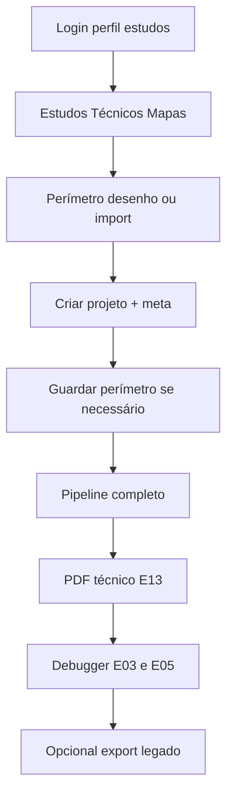

# MCA — Guia de testes (v1 + fundação v2)

Roteiro para validar o Motor Cartográfico Automatizado. Inclui **v1 (E01–E15)** e **fundação v2** (Layout JSON, invalidação, revisão humana, scale/topology).

**Plano executivo:** [`PLANO-EXECUTIVO.md`](PLANO-EXECUTIVO.md) · **Índice:** [`INDEX.md`](INDEX.md)  
Referências: [`ETAPAS.md`](ETAPAS.md), [`REFERENCIA-PIMENTA.md`](REFERENCIA-PIMENTA.md), [`ARCHITECTURE.md`](ARCHITECTURE.md).

---

## Fluxo feliz (visão geral)



---

## Pré-requisitos

| Item | Verificação |
|------|-------------|
| App local | `npm run dev` → http://localhost:9002 |
| Perfil | `admin`, `technical`, `gestor`, `supervisor`, `diretor_fauna` ou `advogado` (`canStudyMapsRole`) |
| Firebase Auth | Utilizador válido no projeto `studio-316805764-e4d13` |
| Regras Firestore | `npm run deploy:rules` (obrigatório em **produção** ou se `permission-denied`) |
| Firebase Admin (API servidor) | `.env.local`: `GOOGLE_APPLICATION_CREDENTIALS` ou `FIREBASE_SERVICE_ACCOUNT_KEY` — sem isto, pipeline/PDF podem devolver **500** |
| Health MCA | `curl http://localhost:9002/api/mca/health` → `status: ok`, `agents` ≥ 40, `behaviorRegistry` ≥ 4 |
| CLI etapas | `npm run mca:verify-etapa -- 01` e `-- 03` → PASS |
| CLI v2 | `npm run mca:verify-registry` e `npm run mca:verify-all-etapas` → PASS |

---

## Roteiro UI (7 passos)

### 1. Login e navegação

1. Abrir http://localhost:9002 e autenticar.
2. Menu **Estudos Técnicos** → **Mapas**.
3. Confirmar título **MCA — Motor Cartográfico** e linha de estado (ex. `MCA OK · N agentes`).

**Gate:** página carrega sem erro de consola crítico.

---

### 2. Perímetro

1. No mapa (esquerda): desenhar polígono **ou** importar KML/GeoJSON.
2. Opcional: usar perímetro de teste tipo **Palmeiras** (~1.748 ha) para comparar com gold futuro.

**Gate:** polígono visível no mapa; importação mostra toast de sucesso.

---

### 3. Criar projeto

1. Aba **Projeto**.
2. Preencher: Título, Propriedade, Proprietário, Matrículas (ex. `37.666, 37.667`), CAR, Área total (ha).
3. Clicar **Criar**.
4. Se já tinha perímetro antes de criar: seleccionar projeto na lista → **Guardar perímetro**.

**Gate:** projeto aparece na lista; ao seleccionar, perímetro repõe-se no mapa.

**Erro frequente:** `permission-denied` → correr `npm run deploy:rules` e voltar a login.

---

### 4. Pipeline completo

1. Aba **Pipeline**.
2. Com projeto seleccionado → **Pipeline completo (E01–E15)**.
3. Aguardar (pode demorar 1–2 min).
4. Ver lista de agentes com status `pass` / `skipped` / `fail`.
5. Ver toast com **nota final** (score agregado).

**Nota:** **E01** é só documentação (`verify-etapa 01`); o botão «Pipeline completo» executa agentes **E05–E15** via registry. Geometrias uso/APP/RL/hidro podem estar **vazias (stubs)** — esperado em v1.

**Gate:** toast de conclusão; `lastJobId` no projeto; tabela uso pode estar vazia ou mínima.

---

### 5. PDF técnico (E13)

1. Na mesma aba → **PDF técnico (E13)**.
2. Deve descarregar `mca-{projectId}.pdf`.

**Gate v1:** PDF abre; contém título «Uso e Ocupação do Solo», quadro informações, tabelas se pipeline gerou dados.

**Limitação v1:** não é réplica pixel-a-pixel dos PDFs Pimenta (sem grade QGIS, inset, satélite embutido).

---

### 6. Debugger por etapa

1. Aba **Debugger**.
2. Com projeto activo → ícone **Bug** na linha **E05** → toast deve indicar **PASS** (perímetro válido + CRS).
3. **E03** → **PASS** (DAG) mesmo sem projeto.
4. Outras etapas: mensagem manual ou parcial até v2.

**Gate:** E03 e E05 PASS com projeto válido.

---

### 7. Exportação legada (opcional)

1. Aba **Projeto** → expandir **Exportação rápida (legado)**.
2. **Exportar** (ZIP/DXF/GPKG) — requer `GEO_EXPORT_WORKER_URL` + `WORKER_SHARED_SECRET`.
3. Comparar com fluxo antigo se necessário.

**Gate:** não regressão do SaaS; MCA e study-maps coexistem.

---

# Comandos CLI

```bash
# Todas as etapas E01–E15 (debugger offline + actualiza *-pass.md)
npm run mca:verify-all-etapas

# Subconjunto ficheiros E01–E05
npm run mca:verify-all

# Etapa individual
npm run mca:verify-etapa -- 03
npm run mca:verify-etapa -- 10   # corre verify-all-etapas

# Health (browser ou curl)
curl -s http://localhost:9002/api/mca/health | jq
```

### Debugger API (com token Firebase)

```http
GET /api/mca/debug/etapa/5?projectId={id}
Authorization: Bearer {idToken}

POST /api/mca/debug/agent
{ "agentId": "MCA_Uso_Pivo", "projectId": "{id}" }
```

---

## Matriz etapa × teste × gate v1

| Etapa | Como testar | Gate v1 |
|-------|-------------|---------|
| E01 | `verify-etapa 01` + docs | PASS doc |
| E02 | `/api/mca/health` | 200 + agents |
| E03 | `verify-etapa 03` + Debugger | DAG PASS |
| E04 | Criar/listar projeto UI | CRUD OK |
| E05 | Perímetro + Debugger E05 | PASS |
| E06 | DWG path no projeto (futuro upload) | Manual |
| E07–E11 | Pipeline + tabelas parciais | Runs pass |
| E12 | `layoutMeta` + **Layout JSON v2** | 8+ fragmentos + contrato v2 |
| E13 | Download PDF | PDF válido |
| E14 | Agentes IA skipped/stub | Sem crash |
| E15 | Score no toast + legado export | Nota exibida |

---

## Limitações v1 (esperadas)

| Área | v1 | v2+ |
|------|-----|-----|
| Geometrias uso/APP/RL/hidro | Stubs / vazias | DWG + IA + topologia |
| PDF | Cartucho + tabelas jsPDF | Layout JSON + QGIS |
| DWG 2010 | Meta stub | Worker ODA |
| Debugger automático | E03, E05 | Todas etapas + gold diff |
| Score | Indicativo | 5 eixos + benchmark |
| Firestore layers | GeoJSON | PostGIS `layerRef` |
| Revisão humana | Fila `mca_reviews` (aba **Revisão**) | Gate PDF legal (428) |

---

## Checklist «v1 testável» (release QA manual)

- [ ] Login e rota `/studies/mapas` OK
- [ ] Criar projeto + perímetro
- [ ] Pipeline completo sem 500
- [ ] PDF descarrega
- [ ] Debugger E03 + E05 PASS
- [ ] Legado export (se worker configurado)
- [ ] `npm run deploy:rules` em ambiente alvo
- [ ] `npm run typecheck` sem erros

---

## Template de reporte de erro

Copiar e preencher quando algo falhar:

```text
1. Passo: (ex. Pipeline passo 4)
2. Ambiente: dev local | App Hosting | outro
3. Role: technical | admin | ...
4. deploy:rules feito? sim/não
5. Firebase Admin configurado? sim/não
6. projectId: 
7. Mensagem exacta: 
8. Esperado vs obtido: 
```

### Erros frequentes

| Sintoma | Causa provável | Acção |
|---------|----------------|--------|
| `permission-denied` Firestore | Regras não publicadas | `npm run deploy:rules` |
| 401 nas APIs MCA | Sessão expirada | Re-login |
| 500 pipeline/PDF | Sem Firebase Admin | `.env.local` service account |
| E05 FAIL | Sem perímetro válido | Desenhar/importar + Guardar |
| Export legado 503 | Worker geo não configurado | `GEO_EXPORT_WORKER_URL` |
| Lista projetos vazia | Primeiro uso | Criar projeto |
| Tabelas vazias após pipeline | Stubs v1 | Esperado; ver limitações |

---

## Roteiro v2 (fundação cartográfica)

### CLI

```bash
npm run mca:verify-registry      # Behavior Registry YAML + invalidação + knowledge
npm run mca:verify-all-etapas    # E01–E15 + layout JSON v2 + review gate + scale/topo
npm run deploy:rules             # inclui mca_reviews (read-only cliente)
```

### UI — revisão e export

1. **Fluxo completo Catingueiro** ou pipeline manual até E15.
2. Aba **Revisão** — confirmar itens `AMB_APP`, `AMB_RL_GLEBA`, `FUND_LIMITE` (se layers existirem).
3. **PDF técnico** sem aprovação → toast «Revisão pendente» (HTTP 428).
4. **Aprovar** ou **Promover** cada item → **PDF técnico** descarrega.
5. **PDF preview** — contorna gate (rascunho).
6. **Import layers demo** → botão **Re-run downstream** se `invalidatedLayerKeys` aparecer.
7. **Layout JSON (E12 v2)** — download via API; verificar `semanticLayers`, `spatialLayers.topologyStatus`.

### Gate v2

| Check | Esperado |
|-------|----------|
| `HYD_CORREGO` muda | invalida `AMB_APP`, `AMB_RL_GLEBA` |
| Health | `version: 2`, `behaviorRegistry: 4` |
| Layout JSON | `version: 2`, 15 layers Catingueiro offline |
| Score | 5 eixos no toast/pipeline (geom, topo, amb, vis, sem) |

---

## Evolução dos testes (v2–v5)

| Versão | Testes adicionais |
|--------|-------------------|
| v2 | Layout JSON snapshot; invalidation graph; review queue; scale/topo; verify-registry |
| v3 | PostGIS integration; QGIS PDF diff vs gold |
| v4 | CI benchmark Catingueiro; score 5 eixos |
| v5 | E2E multi-tenant; carga tiling |

---

## Mapas ouro (futuro benchmark)

Colocar PDFs/DWG de referência em `docs/mca/gold/`:

- `gold_palmeiras/`
- `gold_mangabeiras/`
- `gold_catingueiro/`

Com `manifest.json` (áreas, contagens, checklist visual). Testes v4 compararão SSIM/checklist contra estes manifests.
